# Highway Toll Plaza Analytics — Batch & Streaming Data Pipelines

A comprehensive data engineering solution built to analyze highway traffic data from toll plazas using **Apache Airflow** for scheduled batch processing and **Apache Kafka** with **MySQL** for real-time event streaming.

---

## 📌 Executive Summary

Modern highway transportation management requires processing both historical traffic patterns and real-time vehicle movement. This project implements a dual-architecture data processing engine:
1. **Batch ETL Pipeline (Apache Airflow)**: Orchestrates scheduled extraction, cleaning, field parsing, consolidation, and case-transformation across heterogeneous data formats (CSV, TSV, and Fixed-Width logs).
2. **Streaming ETL Pipeline (Apache Kafka & MySQL)**: Ingests real-time vehicle passing events published to a Kafka topic (`toll`), transforms timestamps dynamically, and streams records into a relational MySQL database table (`livetolldata`).

---

## 🏗️ Architecture & Pipeline Flow

```mermaid
graph TD
    classDef batch fill:#e3f2fd,stroke:#1565c0,color:#0d47a1;
    classDef kafka fill:#fff3e0,stroke:#ef6c00,color:#e65100;
    classDef proc fill:#fce4ec,stroke:#c2185b,color:#880e4f;
    classDef load fill:#e8f5e9,stroke:#2e7d32,color:#1b5e20;

    subgraph BATCH["Component 1: Airflow Batch Pipeline"]
        SRC["tolldata.tgz<br/>(CSV, TSV, Fixed-Width)"] --> UNZIP["unzip_data<br/>(BashOperator)"]
        UNZIP --> EXT1["extract_data_from_csv"]
        UNZIP --> EXT2["extract_data_from_tsv"]
        UNZIP --> EXT3["extract_data_from_fixed_width"]
        EXT1 --> CONS["consolidate_data<br/>paste command"]
        EXT2 --> CONS
        EXT3 --> CONS
        CONS --> TRF["transform_data<br/>tr uppercase"]
        TRF --> STG["transformed_data.csv"]
    end

    subgraph STREAM["Component 2: Kafka Streaming Pipeline"]
        PROD["🚗 toll_traffic_generator.py<br/>(Event Producer)"] -->|"publishes events"| TOPIC[("📦 Kafka Topic: toll<br/>KRaft Mode 3.7.0")]
        TOPIC -->|"consumes messages"| CONS2["⚡ streaming_data_reader.py<br/>(Event Consumer)"]
        CONS2 -->|"INSERT INTO"| MYSQL[("🗄️ MySQL Database: tolldata<br/>Table: livetolldata")]
    end

    class SRC,UNZIP,EXT1,EXT2,EXT3,CONS,TRF,STG batch;
    class PROD,CONS2 proc;
    class TOPIC kafka;
    class MYSQL load;
```



---

## 📁 Repository Directory Structure

```text
c8_etl_data_pipelines_with_shell_airflow_and_kafka_final_project/
├── README.md                            # Main project documentation & execution guide
├── airflow_batch_etl/                   # Batch ETL pipeline (Apache Airflow)
│   ├── dags/
│   │   └── ETL_toll_data.py             # Airflow DAG definition using BashOperators
│   ├── data/
│   │   ├── tolldata.tgz                 # Compressed source archive
│   │   ├── raw/                         # Extracted raw files (CSV, TSV, Fixed-Width)
│   │   └── staging/                     # Intermediate & final transformed datasets
│   └── docs/                            # Enriched Airflow lab documentation
│       └── c8_m5_lab_etl_bashoperator.md
├── kafka_streaming_etl/                 # Streaming ETL pipeline (Kafka & MySQL)
│   ├── producer/
│   │   └── toll_traffic_generator.py   # Traffic simulator event producer
│   ├── consumer/
│   │   └── streaming_data_reader.py    # Kafka message consumer & MySQL connector
│   ├── database/
│   │   ├── schema.sql                   # Database & table creation SQL DDL
│   │   └── sample_livetolldata_dump.csv # Exported sample snapshot of ingested stream data
│   └── docs/
│       ├── c8_m5_lab_etl_streaming_kafka.md
│       └── wsl_kafka_commands_guide.md  # Step-by-step WSL setup & operations guide
└── docs/                                # Course & project reference docs
    ├── c8_m5_final_project_overview.md
    └── c8_m5_final_submission_guidelines.md
```

---

## ⚡ Quick Start & Reproduction Guide

### Prerequisites
- Linux / WSL2 (Ubuntu 22.04 / 24.04 LTS)
- Python 3.10+
- Apache Kafka 3.7.0 (KRaft mode)
- MySQL Server 8.0+
- Apache Airflow 2.x

---

### 1️⃣ Airflow Batch Pipeline Setup

1. Copy the DAG script into your Airflow DAGs directory:
   ```bash
   cp airflow_batch_etl/dags/ETL_toll_data.py ~/airflow/dags/
   ```
2. Unpack the dataset into your Airflow destination directory:
   ```bash
   mkdir -p /home/project/airflow/dags/finalassignment/destination
   cp airflow_batch_etl/data/tolldata.tgz /home/project/airflow/dags/finalassignment/destination/
   ```
3. Trigger the DAG in Airflow CLI or Web UI:
   ```bash
   airflow dags trigger ETL_toll_data
   ```

---

### 2️⃣ Kafka & MySQL Streaming Setup

1. **Start MySQL & Initialize Database**:
   ```bash
   sudo service mysql start
   mysql -u root -p'Ah22059038!@#' < kafka_streaming_etl/database/schema.sql
   ```

2. **Start Kafka Broker (KRaft Mode)**:
   ```bash
   cd ~/kafka_2.12-3.7.0
   bin/kafka-server-start.sh config/kraft/server.properties &
   ```

3. **Create the `toll` Topic**:
   ```bash
   bin/kafka-topics.sh --create --topic toll --bootstrap-server localhost:9092
   ```

4. **Run the Producer & Consumer**:
   - In Terminal 1 (Producer):
     ```bash
     python3 kafka_streaming_etl/producer/toll_traffic_generator.py
     ```
   - In Terminal 2 (Consumer):
     ```bash
     python3 kafka_streaming_etl/consumer/streaming_data_reader.py
     ```

5. **Verify Ingested Data**:
   ```bash
   mysql -u root -p'Ah22059038!@#' -e "USE tolldata; SELECT * FROM livetolldata ORDER BY timestamp DESC LIMIT 10;"
   ```

---

## 📜 Verification & Lab Completion Evidence

- **Airflow Output**: Validated consolidated and uppercase transformed records in `airflow_batch_etl/data/staging/transformed_data.csv`.
- **Kafka Stream Ingestion**: Real-time events successfully published to topic `toll` and stored in MySQL table `livetolldata`. Sample exported dump available in `kafka_streaming_etl/database/sample_livetolldata_dump.csv`.

---

## 🛠️ Authors & Course Reference
- **Author**: Ahmed (Data Engineering Student)
- **Course**: ETL and Data Pipelines with Shell, Airflow and Kafka (IBM Data Engineering Professional Certificate)
