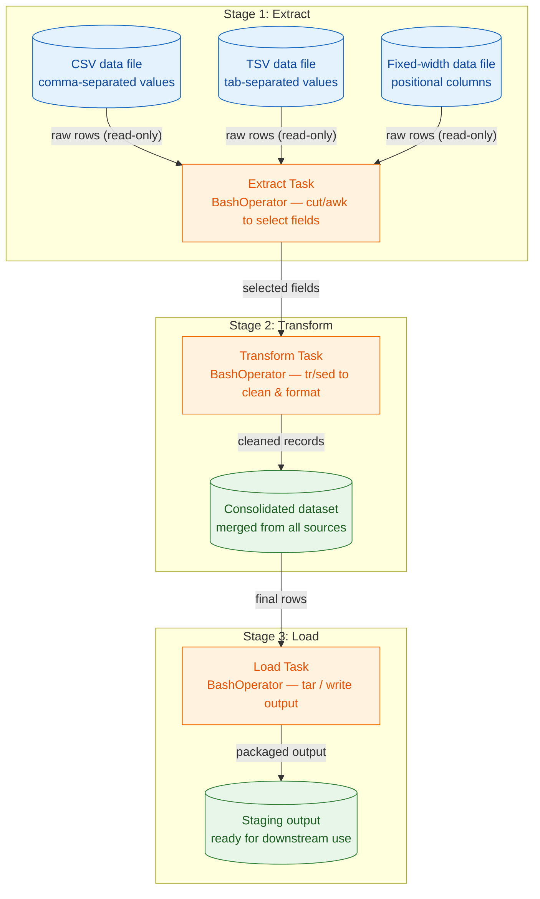

> **Course 8:** ETL and Data Pipelines with Shell, Airflow and Kafka
> **Module 5:** Final Project — Build a Data Pipeline

<mark>NEW</mark>

# Hands-on Lab: Build ETL Data Pipelines with BashOperator using Apache Airflow

## Overview

Practice App Item

Hands-on Lab: Build ETL Data Pipelines with BashOperator using Apache Airflow

In this lab, you will use the skills you have learned to build an ETL pipeline with BashOperator using Apache Airflow.

<mark style="background-color: rgba(200, 230, 201, 0.4);">This lab is the Module 5 capstone hands-on activity for Course 8, and it applies the concepts covered in Module 3 (Building Data Pipelines using Airflow) and Module 2 (ETL & Data Pipelines: Tools and Techniques) to a real-world scenario. You will use Apache Airflow to orchestrate a complete Extract, Transform, Load (ETL) workflow, where each pipeline stage is implemented as a Bash task rather than a Python callable.</mark>

[ENRICHED: defined "ETL pipeline" — ETL stands for Extract, Transform, Load, the process of pulling data out of one or more source systems (extract), cleaning/reshaping it into analytics-ready form (transform), and writing it into a destination system such as a data warehouse or data mart (load). In this course ETL is contrasted with ELT (Extract, Load, Transform), where transformation happens inside the destination — ETL processes apply to data warehouses and data marts, while ELT processes apply to data lakes. [Source: https://www.coursera.org/learn/etl-and-data-pipelines-shell-airflow-kafka]]

[ENRICHED: defined "Apache Airflow" — Apache Airflow is an open-source platform for developing, scheduling, and monitoring batch-oriented workflows. Workflows are written in Python as DAGs, and Airflow's web-based UI lets you visualize, manage, and debug them; it can run from a single process on a laptop up to a distributed system handling massive workloads. [Source: https://airflow.apache.org/docs/apache-airflow/stable/]]

[ENRICHED: defined "BashOperator" — BashOperator is an Airflow operator that executes a Bash shell command, a set of commands, or a reference to a `.sh`/`.bash` script via its `bash_command` argument. Airflow evaluates the shell's exit code: a non-zero exit code fails the task and a zero exit code marks it successful; exiting with code `99` (configurable via `skip_on_exit_code`) instead leaves the task in a `skipped` state. The `@task.bash` TaskFlow decorator is the recommended modern alternative to the classic BashOperator. [Source: https://airflow.apache.org/docs/apache-airflow/stable/howto/operator/bash.html]]

## What the ETL Pipeline Does

<mark style="background-color: rgba(200, 230, 201, 0.4);">In this lab the ETL pipeline moves data through three stages. During the **Extract** stage, data is read from multiple source files — including CSV (comma-separated values), TSV (tab-separated values), and fixed-width formatted files. During the **Transform** stage, the extracted fields are cleaned, selected, and merged into a single consolidated dataset. During the **Load** stage, the consolidated result is written to a staging output so it is ready for downstream use.</mark>

<mark style="background-color: rgba(200, 230, 201, 0.4);">The pipeline stages are orchestrated as an Airflow DAG — a Directed Acyclic Graph. A DAG collects tasks and their dependencies to define both the order of execution and how often the workflow runs (its schedule). Each task in this lab is a BashOperator, so the whole ETL flow is expressed as shell commands running on a schedule. [Source: https://airflow.apache.org/docs/apache-airflow/stable/core-concepts/dags.html]</mark>

### Pipeline Flow Diagram



> If the Mermaid diagram above does not render, here is the ASCII equivalent:

```
                     ┌──────────────────────────────────────────────┐
                     │          STAGE 1 — EXTRACT                   │
                     │                                              │
   [("CSV data file")] ── raw rows ─┐                               │
   [("TSV data file")] ── raw rows ─┼──► [ Extract Task             │
   [("Fixed-width file")]──raw rows─┘      (BashOperator:           │
                                          cut/awk select fields) ]  │
                     └───────────────────────┬──────────────────────┘
                                             │ selected fields
                                             ▼
                     ┌──────────────────────────────────────────────┐
                     │          STAGE 2 — TRANSFORM                 │
                     │                                              │
                     [ Transform Task (BashOperator:                │
                       tr/sed clean & format) ]                     │
                     [ ("Consolidated dataset") ]                   │
                     └───────────────────────┬──────────────────────┘
                                             │ final rows
                                             ▼
                     ┌──────────────────────────────────────────────┐
                     │          STAGE 3 — LOAD                      │
                     │                                              │
                     [ Load Task (BashOperator: tar / write out) ]  │
                     [ ("Staging output") ]                         │
                     └──────────────────────────────────────────────┘
```

<mark style="background-color: rgba(200, 230, 201, 0.4);">Key insight: every stage runs as an independent BashOperator task inside a single Airflow DAG. If any task fails (non-zero exit code), Airflow stops the run and the downstream tasks never execute — the DAG structure encodes the pipeline's failure handling for you.</mark>

## Running the Lab in Skills Network Labs

Skills Network Labs (SN Labs) is a virtual lab environment used in this course. Upon clicking the "Launch App" button below, your Username and Email will be passed to SN Labs and will be used in strict accordance with IBM Skills Network Privacy policy, such as for communicating important information to enhance your learning experience.

[ENRICHED: defined "Skills Network Labs (SN Labs)" — SN Labs is IBM's browser-based virtual lab environment that provides hands-on practice tools — including Kubernetes, Machine Learning, and Cloud IDE environments — directly in the browser without requiring learners to install software locally. The lab tooling runs on the open-source stack (e.g., JupyterLab, Apache Theia). [Source: https://skills.network/lab-tools]]

In case you need to download the lab instructions click HERE to open in a new tab.

<mark style="background-color: rgba(200, 230, 201, 0.4);">The "HERE" link opens the downloadable lab instruction document in a separate browser tab so you can follow the step-by-step instructions while working inside the SN Labs environment.</mark>

## Third-Party App Notice

This course uses a third-party app, Hands-on Lab: Build ETL Data Pipelines with BashOperator using Apache Airflow, to enhance your learning experience. The app will reference basic information like your name, email, and Coursera ID.

[ENRICHED: ecosystem — the "Launch App" hand-off works via the LTI (Learning Tools Interoperability) standard, which is how SN Labs courses are embedded into Coursera. In the SN Labs LTI launch configuration, the platform requests the learner's username and email and sends them as parameters to the lab environment so the learner can be authenticated and provisioned a workspace. [Source: https://author.skills.network/docs/labs/adding-labs-to-courses/add-a-lab-to-a-skills-network-course]]

## Coursera Honor Code

Coursera Honor Code

I agree to use this app responsibly.

[ENRICHED: defined "Coursera Honor Code" — Coursera's Honor Code sets the standards that keep learning on the platform honest: learners must not use unauthorized materials (including generative AI tools where not expressly permitted) on any graded work, must not share solutions to quizzes, exams, or projects, and must not misrepresent their authorship of submitted work. Violations are determined by Coursera and its partners and can result in sanctions such as no refunds for corrective actions. [Source: https://www.coursera.support/s/article/learner-000001214?language=en_US]]

<mark style="background-color: rgba(200, 230, 201, 0.4);">Checking "I agree to use this app responsibly" confirms you will complete the lab's work yourself, in line with the Honor Code's rules on authorized work and not sharing solutions.</mark>

## Source Materials

The complete step-by-step lab instructions are stored in a PDF that accompanies this course:

```
lab pdf file:updates\providers\ibm\etl_and_data_pipelines_with_shell_airflow_and_kafka\Build ETL Data Pipelines with BashOperator using Apache Airflow.pdf
```

<mark style="background-color: rgba(200, 230, 201, 0.4);">Keep this PDF open while working in the lab — it contains the exact commands, file names, and verification steps you need to complete the ETL pipeline.</mark>

## Enrichment: BashOperator vs PythonOperator

<mark style="background-color: rgba(200, 230, 201, 0.4);">This lab implements the ETL pipeline with **BashOperator**. The course also covers sibling labs and techniques that use **PythonOperator** instead, and it is worth understanding the tradeoff. [Source: https://stackoverflow.com/questions/47534414/apache-airflow-best-practice-pythonoperators-or-bashoperators]</mark>

| Dimension | BashOperator | PythonOperator |
|---|---|---|
| What it executes | A Bash command, command set, or `.sh`/`.bash` script | An arbitrary Python callable |
| Language coupling | Language-agnostic — can invoke any shell tool (`cut`, `tr`, `awk`, `sed`, `tar`) | Python only |
| Environment control | Can call a script with a specific Python environment/packages | Runs in the Airflow worker's Python env (unless using virtualenv/external operators) |
| Task independence | Tasks are more independent and can be launched manually outside Airflow | Logic lives inside the DAG repo |
| Error handling | Failure signaled via exit code (non-zero = failed) | Exceptions and return values, easier to catch and inspect |
| Testability | Harder to unit-test a Bash template script | Python callables are easily unit-tested |
| Task-to-task data passing | Harder to manage | Can push/pull XComs and access Airflow DB sessions |

<mark style="background-color: rgba(200, 230, 201, 0.4);">Choose **BashOperator** when your transformation is a classic shell/CLI operation (this lab's `cut`/`tr`/`tar`-style file processing) or when you need to run non-Python tooling. Choose **PythonOperator** when the logic is Python-native, needs to be unit-tested, or must exchange rich data between tasks. Airflow's official guidance additionally recommends the `@task.bash` TaskFlow decorator over the classic BashOperator, and the `@task` decorator over the classic PythonOperator, for new DAGs. [Source: https://airflow.apache.org/docs/apache-airflow/stable/howto/operator/bash.html]</mark>

## Enrichment: A BashOperator ETL DAG in Miniature

<mark style="background-color: rgba(200, 230, 201, 0.4);">The pattern you will build in this lab follows the classic three-task DAG below (simplified for illustration — the real lab uses the exact data files and commands from the PDF):</mark>

[ENRICHED: example — a minimal three-task BashOperator DAG that extracts, transforms, and loads data. Each stage is one BashOperator wired together with the `>>` dependency operator.]

```python
from datetime import datetime
from airflow import DAG
from airflow.operators.bash import BashOperator

with DAG(
    dag_id="etl_web_server_etl",
    start_date=datetime(2023, 1, 1),
    schedule_interval="@daily",
    catchup=False,
) as dag:
    extract = BashOperator(
        task_id="extract",
        bash_command="cut -d',' -f1-4 web-server-access-log.txt > extracted.txt",
    )
    transform = BashOperator(
        task_id="transform",
        bash_command="tr '[:lower:]' '[:upper:]' < extracted.txt > transformed.txt",
    )
    load = BashOperator(
        task_id="load",
        bash_command="tar -czvf web-server-access-log.tar.gz transformed.txt",
    )
    extract >> transform >> load
```

**Line-by-line breakdown:**

- Line 1: `from datetime import datetime` — imports Python's `datetime` class so the DAG can receive a `start_date` timestamp.
- Line 2: `from airflow import DAG` — imports the `DAG` class used to declare the workflow container.
- Line 3: `from airflow.operators.bash import BashOperator` — imports the `BashOperator` class that will run each shell command.
- Line 4: `with DAG(` — opens a `with` block; everything indented inside belongs to this DAG instance.
- Line 5: `dag_id="etl_web_server_etl",` — assigns the DAG a unique identifier shown in the Airflow UI.
- Line 6: `start_date=datetime(2023, 1, 1),` — sets when the DAG's schedule begins.
- Line 7: `schedule_interval="@daily",` — tells Airflow to run the workflow once per day.
- Line 8: `catchup=False,` — prevents Airflow from backfilling every missed daily run since the start date.
- Line 9: `) as dag:` — closes the DAG constructor and binds the object to the name `dag`.
- Line 10: `extract = BashOperator(` — creates the first task, named after its ETL role.
- Line 11: `task_id="extract",` — the task's unique name inside the DAG.
- Line 12: `bash_command="cut -d',' -f1-4 web-server-access-log.txt > extracted.txt",` — the shell command that extracts columns 1-4 (comma-delimited) from the log file into a working file.
- Line 13: `)` — closes the `extract` operator definition.
- Lines 14-16: `transform = BashOperator(...)` — the second task; `tr '[:lower:]' '[:upper:]'` converts the extracted text to uppercase.
- Lines 17-19: `load = BashOperator(...)` — the third task; `tar -czvf` compresses the transformed file into a `.tar.gz` archive.
- Line 20: `extract >> transform >> load` — the dependency chain: extract runs first, then transform, then load. Airflow only starts a task after all its upstream tasks succeed.

<mark style="background-color: rgba(200, 230, 201, 0.4);">Big picture: this DAG shows the exact ETL shape this lab asks you to build — a schedule-driven workflow where three dependent BashOperator tasks carry data from raw source files, through a cleaning/formatting step, into a packaged output — except the real lab uses your lab's own data files and commands from the instruction PDF.</mark>

## Key Takeaways

<mark style="background-color: rgba(200, 230, 201, 0.4);">After completing this lab you should be able to: explain how a BashOperator task wraps a shell command into an Airflow task; describe the Extract → Transform → Load stages of the ETL pipeline as DAG tasks; reason about the tradeoff between BashOperator and PythonOperator; and read a DAG definition to see how task dependencies and schedules are declared in code.</mark>

## Enrichment Log

| # | Location | Type | Summary | Confidence | Source |
|---|---|---|---|---|---|
| 1 | Overview | Definition | Defined "ETL pipeline" (Extract, Transform, Load vs ELT) | HIGH | https://www.coursera.org/learn/etl-and-data-pipelines-shell-airflow-kafka |
| 2 | Overview | Definition | Defined "Apache Airflow" as batch workflow orchestration platform | HIGH | https://airflow.apache.org/docs/apache-airflow/stable/ |
| 3 | Overview | Definition | Defined "BashOperator" including `bash_command` and exit-code semantics | HIGH | https://airflow.apache.org/docs/apache-airflow/stable/howto/operator/bash.html |
| 4 | What the ETL Pipeline Does | Ecosystem | Explained the CSV/TSV/fixed-width extract → transform → load flow | HIGH | https://airflow.apache.org/docs/apache-airflow/stable/core-concepts/dags.html |
| 5 | What the ETL Pipeline Does | Diagrams | Added Mermaid pipeline diagram (3 stages, subgraphs, labeled arrows) with ASCII fallback | HIGH | UNCERTAIN |
| 6 | Running the Lab in SN Labs | Definition | Defined "Skills Network Labs (SN Labs)" | HIGH | https://skills.network/lab-tools |
| 7 | Running the Lab in SN Labs | Clarification | Explained the "HERE" link opens downloadable lab instructions in a new tab | HIGH | UNCERTAIN |
| 8 | Third-Party App Notice | Ecosystem | Explained LTI launch hand-off of username/email to SN Labs | HIGH | https://author.skills.network/docs/labs/adding-labs-to-courses/add-a-lab-to-a-skills-network-course |
| 9 | Coursera Honor Code | Definition | Defined "Coursera Honor Code" and its sanctions | HIGH | https://www.coursera.support/s/article/learner-000001214?language=en_US |
| 10 | Coursera Honor Code | Clarification | Explained the "I agree to use this app responsibly" confirmation | HIGH | https://www.coursera.support/s/article/learner-000001214?language=en_US |
| 11 | BashOperator vs PythonOperator | Alternative & tradeoff | Comparison table and selection criteria between BashOperator and PythonOperator | HIGH | https://stackoverflow.com/questions/47534414/apache-airflow-best-practice-pythonoperators-or-bashoperators |
| 12 | Enrichment: A BashOperator ETL DAG in Miniature | Example | Added minimal 3-task DAG with line-by-line code breakdown | HIGH | https://airflow.apache.org/docs/apache-airflow/stable/howto/operator/bash.html |
| 13 | Key Takeaways | Gap filling | Summarized learning objectives of the lab | HIGH | UNCERTAIN |

<!-- EXTRACTION_CHECKLIST: 11 source sentences extracted, 11 sentences in output -->
