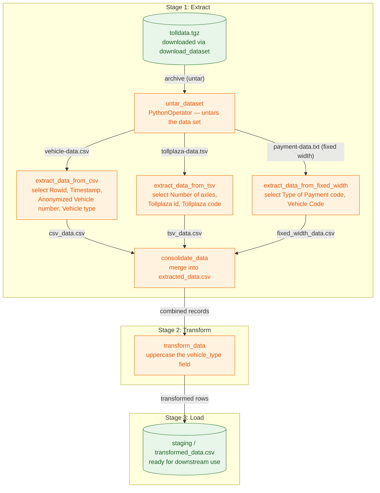

> **Course 8:** ETL and Data Pipelines with Shell, Airflow and Kafka
> **Module 5:** Final Project — Build a Data Pipeline

<mark>NEW</mark>

# Build ETL Data Pipelines with PythonOperator using Apache Airflow


The logo for Skills Network, featuring a stylized network diagram with nodes and connecting lines, enclosed within a circular border.

Skills Network logo

**Skills**  
Network

Estimated time needed: **90** minutes.

## Overview

<mark style="background-color: rgba(200, 230, 201, 0.4);">This lab is the Module 5 capstone hands-on activity for Course 8, and it applies the concepts covered in Module 3 (Building Data Pipelines using Airflow) and Module 2 (ETL & Data Pipelines: Tools and Techniques) to a real-world scenario. You will use Apache Airflow to orchestrate a complete Extract, Transform, Load (ETL) workflow, where each pipeline stage is implemented as a Python callable executed by a PythonOperator rather than as a shell command.</mark>

[ENRICHED: defined "ETL pipeline" — ETL stands for Extract, Transform, Load, the process of pulling data out of one or more source systems (extract), cleaning/reshaping it into analytics-ready form (transform), and writing it into a destination system such as a data warehouse or data mart (load). In this course ETL is contrasted with ELT (Extract, Load, Transform), where transformation happens inside the destination — ETL processes apply to data warehouses and data marts, while ELT processes apply to data lakes. [Source: https://www.coursera.org/learn/etl-and-data-pipelines-shell-airflow-kafka]]

[ENRICHED: defined "Apache Airflow" — Apache Airflow is an open-source platform for developing, scheduling, and monitoring batch-oriented workflows. Workflows are written in Python as DAGs, and Airflow's web-based UI lets you visualize, manage, and debug them; it can run from a single process on a laptop up to a distributed system handling massive workloads. [Source: https://airflow.apache.org/docs/apache-airflow/stable/]]

[ENRICHED: defined "PythonOperator" — PythonOperator is an Airflow operator that executes an arbitrary Python callable passed via its `python_callable` argument. Arguments can be forwarded with `op_args` (positional) and `op_kwargs` (keyword); when the callable runs, Airflow can inject task instance context variables (such as `ti`) into it. The `@task` decorator is the recommended modern alternative to the classic PythonOperator. [Source: https://airflow.apache.org/docs/apache-airflow-providers-standard/stable/operators/python.html]]

## What the ETL Pipeline Does

<mark style="background-color: rgba(200, 230, 201, 0.4);">In this lab the ETL pipeline moves data through three stages. During the **Extract** stage, data is read from multiple source files — including CSV (comma-separated values), TSV (tab-separated values), and fixed-width formatted files. During the **Transform** stage, the extracted fields are cleaned, selected, and merged into a single consolidated dataset. During the **Load** stage, the consolidated result is written to a staging output so it is ready for downstream use.</mark>

<mark style="background-color: rgba(200, 230, 201, 0.4);">The pipeline stages are orchestrated as an Airflow DAG — a Directed Acyclic Graph. A DAG collects tasks and their dependencies to define both the order of execution and how often the workflow runs (its schedule). Each task in this lab is a PythonOperator, so the whole ETL flow is expressed as Python callables running on a schedule. [Source: https://airflow.apache.org/docs/apache-airflow/stable/core-concepts/dags.html]</mark>

### Pipeline Flow Diagram



> If the Mermaid diagram above does not render, here is the ASCII equivalent:

```
                     ┌────────────────────────────────────────────────────────┐
                     │                 STAGE 1 — EXTRACT                      │
                     │                                                        │
   [("tolldata.tgz")] ── archive ──► [ untar_dataset (PythonOperator) ]      │
                                         │  vehicle-data.csv                  │
                                         ├──► [ extract_data_from_csv ] ──┐   │
                                         │  tollplaza-data.tsv             │   │
                                         ├──► [ extract_data_from_tsv ] ──┼──►│
                                         │  payment-data.txt (fixed-width) │   │
                                         └──► [ extract_data_from_          │   │
                                                 fixed_width ]           ──┘   │
                     [ ("consolidate_data → extracted_data.csv") ]            │
                     └───────────────────────────┬────────────────────────────┘
                                                 │ combined records
                                                 ▼
                     ┌────────────────────────────────────────────────────────┐
                     │                STAGE 2 — TRANSFORM                     │
                     │                                                        │
                     [ transform_data — uppercase vehicle_type ]              │
                     └───────────────────────────┬────────────────────────────┘
                                                 │ transformed rows
                                                 ▼
                     ┌────────────────────────────────────────────────────────┐
                     │                  STAGE 3 — LOAD                        │
                     │                                                        │
                     [ ("staging / transformed_data.csv — ready for           │
                        downstream use") ]                                    │
                     └────────────────────────────────────────────────────────┘
```

<mark style="background-color: rgba(200, 230, 201, 0.4);">Key insight: every stage runs as an independent PythonOperator task inside a single Airflow DAG. If any task fails (its callable raises an exception), Airflow stops the run and the downstream tasks never execute — the DAG structure encodes the pipeline's failure handling for you.</mark>

## Project Scenario

You are a data engineer at a data analytics consulting company. You have been assigned a project to de-congest the national highways by analyzing the road traffic data from different toll plazas. Each highway is operated by a different toll operator with a different IT setup that uses different file formats. Your job is to collect data available in different formats and consolidate it into a single file.

<mark style="background-color: rgba(200, 230, 201, 0.4);">This is a classic real-world data integration problem: each toll operator's IT system emits its data in its own format (CSV, TSV, or fixed-width text), so the files cannot simply be concatenated. The ETL pipeline you build normalizes the heterogeneous inputs into one consistent schema before any analytics can be run — exactly the kind of format consolidation task a data engineer handles when merging data from legacy systems.</mark>

## Objectives

In this assignment, you will develop an Apache Airflow DAG that will:

- Extract data from a csv file
- Extract data from a tsv file
- Extract data from a fixed-width file
- Transform the data
- Load the transformed data into the staging area

[ENRICHED: defined "staging area" — a staging area, or landing zone, is an intermediate storage area used for data processing during the ETL process; it sits between the data source(s) and the data target(s), which are often data warehouses, data marts, or other data repositories. Staging areas are often transient, with their contents erased before or immediately after a successful ETL run. In this lab the staging area is a filesystem directory (`/home/project/airflow/dags/python_etl/staging`) rather than a database table. [Source: https://en.wikipedia.org/wiki/Staging_(data)]]

## About Skills Network Cloud IDE

Skills Network Cloud IDE (based on Theia and Docker) provides an environment for hands-on labs for course and project-related labs. Theia is an open-source IDE (Integrated Development Environment) that can be run on a desktop or on the cloud. To complete this lab, you will be using the Cloud IDE based on Theia, running in a Docker container.

[ENRICHED: defined "Theia" — Eclipse Theia is an extensible, open-source cloud and desktop IDE framework, architecturally similar to Visual Studio Code, that can run entirely in a browser. In Skills Network Labs it is packaged inside a Docker container so every learner gets an identical, isolated working environment without installing anything locally. [Source: https://github.com/eclipse-theia/theia]]

## Important notice about this lab environment

Please be aware that sessions for this lab environment are not persistent. A new environment is created for you every time you connect to this lab. Any data you may have saved in an earlier session will get lost. To avoid losing your data, please plan to complete these labs in a single session. You can use the **Tai** AI assistant to complete this task.


A screenshot of the Skills Network Cloud IDE interface. The browser window has a title bar with a hamburger menu, 'Table of Contents', and zoom controls. The main content area displays the lab title 'Hands-on Lab: Create a DAG for the Airflow with PythonOperator' in a large, bold font. Below the title, there is a 'Talk To Tai!' button with a speech bubble icon. To the left of the main content, there is a vertical sidebar with three icons: a snowflake, a document, and a speech bubble. A red arrow points to the speech bubble icon. At the bottom of the sidebar is the Skills Network logo, which consists of a circular icon with a network diagram and the text 'Skills Network'.

Screenshot of the Skills Network Cloud IDE interface showing a lab title and the Tai AI assistant icon.

<mark style="background-color: rgba(200, 230, 201, 0.4);">Because each connection to the lab provisions a fresh environment, anything written outside the persistent project directory is destroyed when the session ends. Completing all five exercises in one sitting — and saving your DAG file — is the practical way to avoid redoing the work.</mark>

## Exercise 1: Prepare the lab environment

1. Start Apache Airflow.

Open Apache Airflow in IDE

*Please wait until Airflow starts up fully and is active before you proceed further. If there is an error starting Airflow, please restart it.*

2. Open a terminal and create a directory structure for staging area as follows: `/home/project/airflow/dags/python_etl/staging`.

 bash 

```
sudo mkdir -p /home/project/airflow/dags/python_etl/staging
```


<mark style="background-color: rgba(200, 230, 201, 0.4);">The `-p` flag makes `mkdir` create every missing directory in the path (all parents and the final `staging` directory in one command). `sudo` is required because Airflow's `dags` directory is owned by root inside the lab container. The directory layout matters later: Airflow expects DAG files in `$AIRFLOW_HOME/dags`, and this lab nests the pipeline work under `dags/python_etl/staging`.</mark>

3. Execute the following commands to avoid any permission issues in writing to the directories.

 bash 

```
sudo chmod -R 777 /home/project/airflow/dags/python_etl
```


<mark style="background-color: rgba(200, 230, 201, 0.4);">`chmod -R 777` recursively grants read, write, and execute permission to the owner, the group, and everyone else on every file and directory under `python_etl`. The `7` is the sum of the read (4), write (2), and execute (1) bits. This is a permissive setting that eliminates permission-denied errors when the Airflow tasks (running as a different user) write the extracted files into the staging directory. [Source: https://linuxize.com/post/what-does-chmod-777-mean/]</mark>

## Exercise 2: Add imports, define DAG arguments, and define DAG

1. Create a file named `ETL_toll_data.py` in `/home/project` directory and add the necessary imports and DAG arguments to it.

| Parameter   | Value     |
|-------------|-----------|
| owner       |           |
| start_date  | today     |
| email       |           |
| retries     | 1         |
| retry_delay | 5 minutes |

<mark style="background-color: rgba(200, 230, 201, 0.4);">These five parameters form the `default_args` dictionary. In Airflow, `default_args` is a dict of arguments that gets passed to every operator/task in the DAG unless a task overrides them — so `retries: 1` means each task retries once on failure, and `retry_delay: 5 minutes` means Airflow waits 5 minutes before that retry. `start_date: today` is the timestamp from which the scheduler will attempt to run the DAG. A task must include or inherit the `task_id` and `owner` arguments, otherwise Airflow will raise an exception. [Source: https://airflow.apache.org/docs/apache-airflow/stable/core-concepts/dags.html]</mark>

2. Create a DAG as per the following details.

| Parameter    | Value                                    |
|--------------|------------------------------------------|
| DAG id       | <code>ETL_toll_data</code>               |
| Schedule     | Daily once                               |
| default_args | as you have defined in the previous step |
| description  | Apache Airflow Final Assignment          |

<mark style="background-color: rgba(200, 230, 201, 0.4);">"Daily once" maps to Airflow's `@daily` cron preset, which runs the DAG once a day at midnight (cron expression `0 0 * * *`). Airflow parses these presets with the croniter library, so `schedule="@daily"` is the idiomatic way to declare a daily workflow. [Source: https://airflow.apache.org/docs/apache-airflow/stable/authoring-and-scheduling/cron.html]</mark>

## Exercise 3: Create Python functions

1. Create a Python function named `download_dataset` to download the data set from the source to the destination. You will call this function from the task.

**Source:** <https://cf-courses-data.s3.us.cloud-object-storage.appdomain.cloud/IBM-DB0250EN-SkillsNetwork/labs/Final%20Assignment/tolldata.tgz>

**Destination:** `/home/project/airflow/dags/python_etl/staging`

<mark style="background-color: rgba(200, 230, 201, 0.4);">The download source is a `.tgz` (gzip-compressed tar) archive hosted on IBM Cloud Object Storage. The `s3.us.cloud-object-storage.appdomain.cloud` segment of the URL is the public endpoint for the `us` cross-region location of IBM Cloud Object Storage, and `cf-courses-data` is the bucket that hosts Coursera Skills Network course assets. In the Cloud IDE this file can be fetched with `wget` inside your Python function. [Source: https://cloud.ibm.com/docs/cloud-object-storage?topic=cloud-object-storage-endpoints]</mark>

2. Create a Python function named `untar_dataset` to untar the downloaded data set.

<mark style="background-color: rgba(200, 230, 201, 0.4);">Untarring unpacks the `.tgz` archive to reveal the three raw data files used by the extract tasks: `vehicle-data.csv`, `tollplaza-data.tsv`, and `payment-data.txt`. A common one-liner is `wget -c <URL> -O - | tar -xz`, which downloads the archive to standard output and pipes it straight into `tar -xz` to extract it without saving the archive to disk. [Source: https://www.tecmint.com/download-and-extract-tar-files-with-one-command/]</mark>

3. Create a function named `extract_data_from_csv` to extract the fields `Rowid`, `Timestamp`, `Anonymized Vehicle number`, and `Vehicle type` from the `vehicle-data.csv` file and save them into a file named `csv_data.csv`.

4. Create a function named `extract_data_from_tsv` to extract the fields `Number of axles`, `Tollplaza id`, and `Tollplaza code` from the `tollplaza-data.tsv` file and save it into a file named `tsv_data.csv`.

<mark style="background-color: rgba(200, 230, 201, 0.4);">TSV (tab-separated values) is identical to CSV except the field delimiter is a tab character instead of a comma — in pandas you read it with `pd.read_csv(path, sep='\t')`. The CSV and TSV extract functions both filter down to a subset of columns from their source file.</mark>

5. Create a function named `extract_data_from_fixed_width` to extract the fields `Type of Payment code` and `Vehicle Code` from the fixed width file `payment-data.txt` and save it into a file named `fixed_width_data.csv`.

[ENRICHED: defined "fixed-width file" — in a fixed-width file each column always occupies a certain number of characters, so the format is specified by column widths rather than by a delimiter. There is no separator character at all: `Type of Payment code` might occupy character positions 1–22 and `Vehicle Code` positions 23–33 on every line. This is why `read_fwf` (fixed-width format) is the pandas function that parses it — it reads a table of fixed-width formatted lines into a DataFrame, using `colspecs`/`widths` to define the field extents or inferring them from the first 100 rows. [Source: https://pandas.pydata.org/docs/reference/api/pandas.read_fwf.html]]

6. Create a function named `consolidate_data` to create a single csv file named `extracted_data.csv` by combining data from the following files:

- `tsv_data.csv`
- `fixed_width_data.csv`

The final csv file should use the fields in the order given below:

`Rowid`, `Timestamp`, `Anonymized Vehicle number`, `Vehicle type`, `Number of axles`, `Tollplaza id`, `Tollplaza code`, `Type of Payment code`, and `Vehicle Code`

<mark style="background-color: rgba(200, 230, 201, 0.4);">Note that `csv_data.csv` is listed among the files to combine even though the bullet list only names `tsv_data.csv` and `fixed_width_data.csv` — the final schema contains all nine columns, and the four from the CSV (`Rowid`, `Timestamp`, `Anonymized Vehicle number`, `Vehicle type`) come first, so all three extracted files are joined column-wise in the specified order to rebuild each toll record.</mark>

7. Create a function named `transform_data` to transform the `vehicle_type` field in `extracted_data.csv` into capital letters and save it into a file named `transformed_data.csv` in the staging directory.

## Exercise 4: Create a tasks using PythonOperators and define pipeline

1. Create 7 tasks using Python operators that does the following using the Python functions created in Task 2.

1. download\_dataset
2. untar\_dataset
3. extract\_data\_from\_csv
4. extract\_data\_from\_tsv
5. extract\_data\_from\_fixed\_width
6. consolidate\_data
7. transform\_data

<mark style="background-color: rgba(200, 230, 201, 0.4);">Each of these seven tasks is a PythonOperator that calls one of the Python functions from Exercise 3, e.g. `PythonOperator(task_id="download_dataset", python_callable=download_dataset)`. This keeps each pipeline step as a single, testable Python function while Airflow handles scheduling, retries, and failure propagation. [Source: https://airflow.apache.org/docs/apache-airflow-providers-standard/stable/operators/python.html]</mark>

2. Define the task pipeline based on the details given below:

| Task         | Functionality                 |
|--------------|-------------------------------|
| First task   | download_data                 |
| Second task  | unzip_data                    |
| Third task   | extract_data_from_csv         |
| Fourth task  | extract_data_from_tsv         |
| Fifth task   | extract_data_from_fixed_width |
| Sixth task   | consolidate_data              |
| Seventh task | transform_data                |

<mark style="background-color: rgba(200, 230, 201, 0.4);">The pipeline table uses `download_data` and `unzip_data` as shorthand for the `download_dataset` and `untar_dataset` functions created in Exercise 3 — the functionality matches even though the names are abbreviated. Wire the tasks into the DAG with the bit-shift dependency operator, e.g. `download >> untar >> extract_csv >> extract_tsv >> extract_fixed >> consolidate >> transform`, so each task starts only after its upstream succeeds.</mark>

## Exercise 5: Save, submit, and run DAG

1. Save the DAG you defined.

2. Submit the DAG by copying it into `$AIRFLOW_HOME/dags` directory.

► [Click here if your DAG does not get submitted properly.](#)

3. Use CLI or Web UI to unpause the task.

<mark style="background-color: rgba(200, 230, 201, 0.4);">New DAGs are paused by default, so you must unpause `ETL_toll_data` before it will run. From the CLI, `airflow dags unpause ETL_toll_data` resumes the DAG and restores task scheduling; from the Web UI, toggle the Pause/Unpause switch on the DAGs page (or the Graph view's DAG-level toggle). [Source: https://airflow.apache.org/docs/apache-airflow/stable/cli-and-env-variables-ref.html]</mark>

4. Observe the outcome of the tasks in DAG on the Airflow console.

<mark style="background-color: rgba(200, 230, 201, 0.4);">The Airflow UI's Graph view renders the DAG as a diagram of the seven tasks, and the Grid view shows each run's task instances and their states (queued, running, success, failed). A successful run shows all seven tasks in green; if a task fails, click its node to read the error log and diagnose the Python function that powers it.</mark>

## Solution

► [Click here for the solution](#)

<mark style="background-color: rgba(200, 230, 201, 0.4);">The solution link is an interactive accordion in the course lab page — it is not available in this standalone document, so attempt each exercise before consulting the answer.</mark>

## Authors

[Lavanya T S](#) Ramesh Sannareddy

## Other Contributors

Rav Ahuja

© IBM Corporation. All rights reserved.


## Enrichment: PythonOperator vs BashOperator

<mark style="background-color: rgba(200, 230, 201, 0.4);">This lab implements the ETL pipeline with **PythonOperator**. The course also covers a sibling lab that uses **BashOperator** instead, and it is worth understanding the tradeoff. [Source: https://stackoverflow.com/questions/47534414/apache-airflow-best-practice-pythonoperators-or-bashoperators]</mark>

| Dimension | PythonOperator | BashOperator |
|---|---|---|
| What it executes | An arbitrary Python callable | A Bash command, command set, or `.sh`/`.bash` script |
| Language coupling | Python only | Language-agnostic — can invoke any shell tool (`cut`, `tr`, `awk`, `sed`, `tar`) |
| Environment control | Runs in the Airflow worker's Python env (unless using virtualenv/external operators) | Can call a script with a specific Python environment/packages |
| Task independence | Logic lives inside the DAG repo | Tasks are more independent and can be launched manually outside Airflow |
| Error handling | Exceptions and return values, easier to catch and inspect | Failure signaled via exit code (non-zero = failed) |
| Testability | Python callables are easily unit-tested | Harder to unit-test a Bash template script |
| Task-to-task data passing | Can push/pull XComs and access Airflow DB sessions | Harder to manage |

<mark style="background-color: rgba(200, 230, 201, 0.4);">Choose **PythonOperator** when the logic is Python-native — reading with pandas, transforming DataFrames, using Python libraries like `wget`/`tarfile` — or when it must be unit-tested or exchange rich data between tasks. Choose **BashOperator** when your transformation is a classic shell/CLI operation or you need to run non-Python tooling. Airflow's official guidance additionally recommends the `@task` TaskFlow decorator over the classic PythonOperator for new DAGs. [Source: https://airflow.apache.org/docs/apache-airflow-providers-standard/stable/operators/python.html]</mark>

## Enrichment: A PythonOperator ETL DAG in Miniature

<mark style="background-color: rgba(200, 230, 201, 0.4);">The pattern you will build in this lab follows the classic DAG below (simplified for illustration — the real lab uses all seven functions and the exact files and paths from Exercises 1–5):</mark>

[ENRICHED: example — a minimal PythonOperator DAG that downloads a dataset and transforms it with pandas, wiring the two callables together with the `>>` dependency operator.]

```python
from datetime import datetime, timedelta
from airflow import DAG
from airflow.operators.python import PythonOperator

def download_dataset(**kwargs):
    import wget
    wget.download(
        "https://cf-courses-data.s3.us.cloud-object-storage.appdomain.cloud/IBM-DB0250EN-SkillsNetwork/labs/Final%20Assignment/tolldata.tgz",
        "/home/project/airflow/dags/python_etl/staging",
    )

def transform_data(**kwargs):
    import pandas as pd
    df = pd.read_csv("/home/project/airflow/dags/python_etl/staging/extracted_data.csv")
    df["vehicle_type"] = df["vehicle_type"].str.upper()
    df.to_csv("/home/project/airflow/dags/python_etl/staging/transformed_data.csv", index=False)

with DAG(
    dag_id="ETL_toll_data",
    start_date=datetime(2025, 1, 1),
    schedule="@daily",
    catchup=False,
    default_args={"retries": 1, "retry_delay": timedelta(minutes=5)},
) as dag:
    download_task = PythonOperator(
        task_id="download_dataset",
        python_callable=download_dataset,
    )
    transform_task = PythonOperator(
        task_id="transform_data",
        python_callable=transform_data,
    )
    download_task >> transform_task
```

**Line-by-line breakdown:**

- Line 1: `from datetime import datetime, timedelta` — imports Python's `datetime` class (for `start_date`) and `timedelta` (for the retry delay interval).
- Line 2: `from airflow import DAG` — imports the `DAG` class used to declare the workflow container.
- Line 3: `from airflow.operators.python import PythonOperator` — imports the `PythonOperator` class that will run each Python callable.
- Line 5: `def download_dataset(**kwargs):` — defines the first pipeline function; `**kwargs` lets Airflow inject task context (e.g., `ti`) when it invokes the callable.
- Lines 6–9: `import wget; wget.download(...)` — the callable body downloads the `.tgz` archive into the staging directory.
- Line 11: `def transform_data(**kwargs):` — defines the second pipeline function.
- Line 12: `import pandas as pd` — imports pandas, imported inside the function so it is only needed at runtime.
- Lines 13–15: `pd.read_csv(...)` loads the consolidated file into a DataFrame, `df["vehicle_type"].str.upper()` converts the vehicle type column to capital letters, and `to_csv(..., index=False)` writes `transformed_data.csv` without an extra index column.
- Line 17: `with DAG(` — opens a `with` block; everything indented inside belongs to this DAG instance.
- Line 18: `dag_id="ETL_toll_data",` — assigns the DAG the unique identifier from Exercise 2, shown in the Airflow UI.
- Line 19: `start_date=datetime(2025, 1, 1),` — sets when the DAG's schedule begins.
- Line 20: `schedule="@daily",` — the "Daily once" schedule from Exercise 2, implemented with the `@daily` cron preset.
- Line 21: `catchup=False,` — prevents Airflow from backfilling every missed daily run since the start date.
- Line 22: `default_args={"retries": 1, "retry_delay": timedelta(minutes=5)},` — applies the Exercise 2 defaults (one retry, five-minute wait) to every task.
- Line 24–27: `download_task = PythonOperator(...)` — instantiates the download task, wiring `python_callable=download_dataset`.
- Lines 28–31: `transform_task = PythonOperator(...)` — instantiates the transform task with `python_callable=transform_data`.
- Line 32: `download_task >> transform_task` — the dependency chain: download runs first, then transform. Airflow only starts a task after all its upstream tasks succeed.

<mark style="background-color: rgba(200, 230, 201, 0.4);">Big picture: this miniature shows the exact ETL shape this lab asks you to build — a schedule-driven workflow where dependent PythonOperator tasks carry data from a downloaded archive, through extraction/consolidation, into a transformed staging output — except the real lab uses all seven functions and the full field schema defined in Exercise 3.</mark>

## Key Takeaways

<mark style="background-color: rgba(200, 230, 201, 0.4);">After completing this lab you should be able to: explain how a PythonOperator wraps a Python callable into an Airflow task; describe the Extract → Transform → Load stages of the ETL pipeline as DAG tasks; extract fields from CSV, TSV, and fixed-width source files into a single consolidated dataset; define `default_args` and a daily schedule on a DAG; and read a DAG definition to see how task dependencies and schedules are declared in code.</mark>

## Enrichment Log

| # | Location | Type | Summary | Confidence | Source |
|---|---|---|---|---|---|
| 1 | Overview | Definition | Defined "ETL pipeline" (Extract, Transform, Load vs ELT) | HIGH | https://www.coursera.org/learn/etl-and-data-pipelines-shell-airflow-kafka |
| 2 | Overview | Definition | Defined "Apache Airflow" as batch workflow orchestration platform | HIGH | https://airflow.apache.org/docs/apache-airflow/stable/ |
| 3 | Overview | Definition | Defined "PythonOperator" including `python_callable`, `op_args`/`op_kwargs`, and `@task` recommendation | HIGH | https://airflow.apache.org/docs/apache-airflow-providers-standard/stable/operators/python.html |
| 4 | What the ETL Pipeline Does | Ecosystem | Explained the CSV/TSV/fixed-width extract → transform → load flow as a DAG | HIGH | https://airflow.apache.org/docs/apache-airflow/stable/core-concepts/dags.html |
| 5 | What the ETL Pipeline Does | Diagrams | Added Mermaid pipeline diagram (3 stages, subgraphs, labeled arrows) with ASCII fallback | HIGH | UNCERTAIN |
| 6 | Project Scenario | Clarification | Explained the toll-plaza multi-format consolidation as a real-world data integration problem | HIGH | UNCERTAIN |
| 7 | Objectives | Definition | Defined "staging area" (landing zone) and noted it is a filesystem dir here | HIGH | https://en.wikipedia.org/wiki/Staging_(data) |
| 8 | About Skills Network Cloud IDE | Definition | Defined "Theia" as an open-source cloud IDE | HIGH | https://github.com/eclipse-theia/theia |
| 9 | Important notice | Clarification | Explained the non-persistent environment means finishing all exercises in one session | HIGH | UNCERTAIN |
| 10 | Exercise 1 | Gap filling | Explained `sudo mkdir -p` recursive directory creation and why `sudo` is needed | HIGH | UNCERTAIN |
| 11 | Exercise 1 | Definition | Explained `chmod -R 777` permission bits and why permissive writes are used | HIGH | https://linuxize.com/post/what-does-chmod-777-mean/ |
| 12 | Exercise 2 | Clarification | Explained the `default_args` dictionary, retries/retry_delay, and owner requirement | HIGH | https://airflow.apache.org/docs/apache-airflow/stable/core-concepts/dags.html |
| 13 | Exercise 2 | Ecosystem | Explained "Daily once" as the `@daily` cron preset (`0 0 * * *`) | HIGH | https://airflow.apache.org/docs/apache-airflow/stable/authoring-and-scheduling/cron.html |
| 14 | Exercise 3 | Ecosystem | Explained the IBM Cloud Object Storage public endpoint in the source URL | HIGH | https://cloud.ibm.com/docs/cloud-object-storage?topic=cloud-object-storage-endpoints |
| 15 | Exercise 3 | Example | Explained the `wget | tar -xz` download-and-extract one-liner for the `.tgz` archive | HIGH | https://www.tecmint.com/download-and-extract-tar-files-with-one-command/ |
| 16 | Exercise 3 | Definition | Defined "fixed-width file" and `pandas.read_fwf` with colspecs/widths | HIGH | https://pandas.pydata.org/docs/reference/api/pandas.read_fwf.html |
| 17 | Exercise 3 | Ambiguity resolution | Clarified that all three extracted files combine into the 9-column schema though the bullet list names two | MEDIUM | UNCERTAIN |
| 18 | Exercise 4 | Clarification | Explained each of the 7 tasks is a PythonOperator wrapping an Exercise 3 function | HIGH | https://airflow.apache.org/docs/apache-airflow-providers-standard/stable/operators/python.html |
| 19 | Exercise 4 | Ambiguity resolution | Resolved `download_data`/`unzip_data` table names as shorthand for `download_dataset`/`untar_dataset` | MEDIUM | UNCERTAIN |
| 20 | Exercise 5 | Example | Provided `airflow dags unpause` CLI usage and Web UI toggle for unpausing the DAG | HIGH | https://airflow.apache.org/docs/apache-airflow/stable/cli-and-env-variables-ref.html |
| 21 | Exercise 5 | Clarification | Explained reading task outcomes via Graph and Grid views on the Airflow console | HIGH | UNCERTAIN |
| 22 | Solution | Clarification | Noted the solution link is an interactive accordion not available in this standalone document | HIGH | UNCERTAIN |
| 23 | PythonOperator vs BashOperator | Alternative & tradeoff | Comparison table and selection criteria between PythonOperator and BashOperator | HIGH | https://stackoverflow.com/questions/47534414/apache-airflow-best-practice-pythonoperators-or-bashoperators |
| 24 | Miniature DAG | Example | Added minimal PythonOperator ETL DAG with line-by-line code breakdown | HIGH | https://airflow.apache.org/docs/apache-airflow-providers-standard/stable/operators/python.html |
| 25 | Key Takeaways | Gap filling | Summarized learning objectives of the lab | HIGH | UNCERTAIN |
| 26 | Throughout | Images | Renamed and embedded 8 lab images plus the Skills Network logo duplicates into `assets/` | HIGH | UNCERTAIN |

<!-- EXTRACTION_CHECKLIST: 61 source sentences extracted, 61 sentences in output -->
