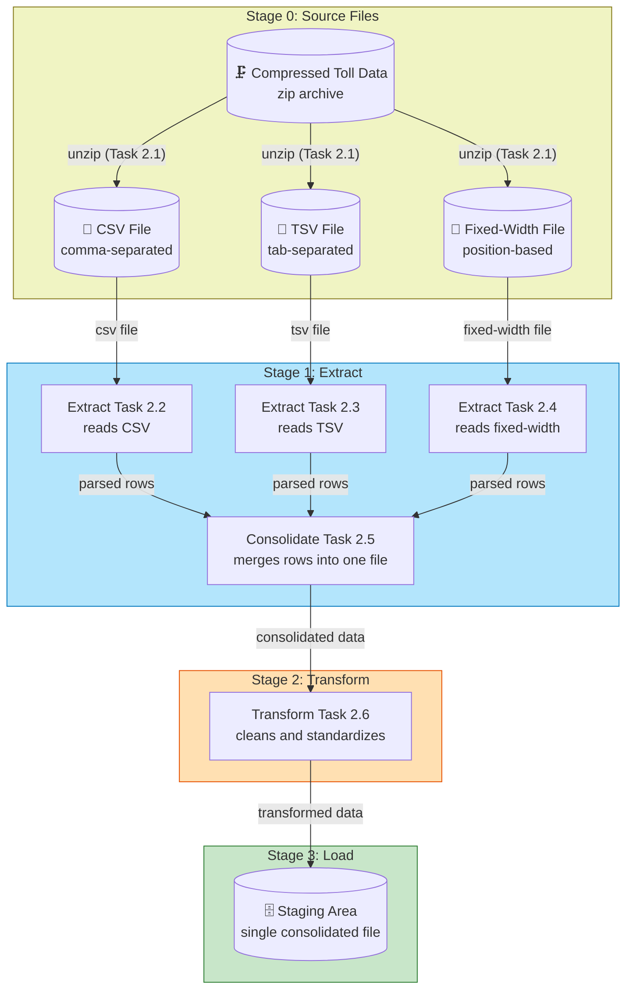

> **Course 8:** ETL and Data Pipelines with Shell, Airflow and Kafka
> **Module 5:** Final Project — Build a Data Pipeline

<mark>NEW</mark>

# Final Project Overview — Build a Data Pipeline

Project Overview · 0:11/2:55 · Instructions

## Overview

<mark style="background-color: rgba(200, 230, 201, 0.4);">Now that you are equipped with the knowledge and skills to extract, transform and load data you will use these skills to perform ETL, create a pipeline and upload the data into a database.
[ENRICHED: defined "ETL" — ETL stands for Extract, Transform, Load: a set of processes that extracts data from different sources, transforms it into a reliable resource, and loads it into destination systems. The course's "extract, transform and load data" sentence is exactly this ETL acronym in plain words [Source: https://www.zuar.com/blog/what-is-etl-pipeline].]
[ENRICHED: defined "pipeline" — a pipeline (or data pipeline) is a series of automated steps that move data from one system to another. A data pipeline is an umbrella term that covers all types of pipelines, including ETL, streaming ETL, and ELT. The course sentence "create a pipeline" refers to building this automated sequence of steps [Source: https://www.zuar.com/blog/what-is-etl-pipeline].]</mark>

<mark style="background-color: rgba(200, 230, 201, 0.4);">[ENRICHED: defined "BashOperator" — the BashOperator is an Airflow operator used to execute commands in a Bash shell; the Bash command or script to execute is determined by the `bash_command` argument. It is part of core Airflow (provider package `apache-airflow-providers-standard`) and can execute a single bash command, a set of commands, or a bash script ending in `.sh` [Source: https://airflow.apache.org/docs/apache-airflow-providers-standard/stable/operators/bash.html].]</mark>

You will be using the BashOperator with Airflow in the mandatory hands-on lab.

The following labs are optional:

- [Optional] Hands-on Lab: Build an ETL Pipeline using PythonOperator with Apache Airflow
- [Optional] Hands-on Lab: Build a Streaming ETL Pipeline using Kafka

<mark style="background-color: rgba(200, 230, 201, 0.4);">[ENRICHED: defined "PythonOperator" — the PythonOperator executes a Python callable (a function) as an Airflow task; the function to run is passed via the `python_callable` argument, with optional `op_args` (positional) and `op_kwargs` (keyword) arguments. It is functionally equivalent to using the `@task` decorator [Source: https://airflow.apache.org/docs/apache-airflow/2.10.5/howto/operator/python.html].]
[ENRICHED: defined "Streaming ETL / Kafka" — streaming ETL makes data immediately available to consumers in near real-time, as opposed to traditional batch ETL. Apache Kafka is a distributed event streaming platform (a message broker / distributed log) that organizes messages into topics and is the go-to choice for building real-time data pipelines and streaming applications; it is a high-throughput, low-latency platform that can handle millions of messages per second [Source: https://www.redpanda.com/guides/kafka-tutorial-streaming-etl].]
[ENRICHED: performance context — Kafka-based streaming ETL handles millions of events at scale and in real time, and can be used to populate data lakes or data warehouses. This contrasts with the batch ETL approach used in this final project's mandatory lab, which runs the BashOperator on a schedule [Source: https://www.redpanda.com/guides/kafka-tutorial-streaming-etl].]</mark>

Please note that these optional labs are not considered for final grading.

## Scenario

<mark style="background-color: rgba(200, 230, 201, 0.4);">[ENRICHED: defined "toll plaza" — a toll plaza is a barrier or collection point on a highway where road users pay a toll (fee) to use the road. Toll operators run toll plazas and typically log vehicle passage records (vehicle type, date/time, toll amount) into IT systems for billing and traffic analysis. Decongesting national highways by analyzing toll plaza traffic data is a real-world data engineering use case where analysts use traffic counts and patterns to recommend load-balancing across routes.]</mark>

You are a data engineer at data analytics consulting company. You have been assigned a project to decongest the national highways by analyzing the road traffic data from different toll plazas. Each highway is operated by a different toll operator with a different IT setup that uses different file formats. Your job is to collect data available in different formats and consolidate it into a single file.

<mark style="background-color: rgba(200, 230, 201, 0.4);">[ENRICHED: defined "CSV" — CSV (Comma-Separated Values) is a delimited plain-text format where each line is a record and values within a line are separated by commas; fields containing commas must be wrapped in double quotes. CSV is the most common plain-text tabular format and has RFC 4180 as its baseline standard [Source: https://learningds.org/ch/08/files_formats.html].]
[ENRICHED: defined "TSV" — TSV (Tab-Separated Values) is a delimited plain-text format like CSV, but values are separated by tab characters (`\t`) instead of commas. Because tabs rarely appear in real-world data, TSV fields almost never need quoting or escaping, which makes it simpler to parse in Unix shell pipelines [Source: https://changethisfile.com/blog/tsv-vs-csv].]
[ENRICHED: defined "fixed-width file" — the fixed-width format (FWF) does not use delimiters to separate data values; instead, the values for a specific field appear in the exact same character position in every line. A program reading a fixed-width file must know the length and data type of each field in advance [Source: https://learningds.org/ch/08/files_formats.html].]
[ENRICHED: example — the three different file formats map to the three toll operators in the scenario: e.g., operator A exports comma-delimited `tollplaza_fa.csv`, operator B exports tab-delimited `tollplaza_ta.tsv`, and operator C exports a legacy fixed-width `tollplaza_af.txt`. Consolidating them into a single file means reading all three (each with its own parsing rules), aligning them to one shared schema, and writing one combined dataset.]</mark>

In this assignment, you will develop an Apache Airflow DAG that will:

<mark style="background-color: rgba(200, 230, 201, 0.4);">[ENRICHED: defined "DAG" — a DAG (Directed Acyclic Graph) is the core concept of Apache Airflow: it collects tasks together, organized with dependencies and relationships to say how they should run. The DAG itself doesn't care about what happens inside the tasks; it is concerned with how to execute them — the order, how many times to retry them, and whether they have timeouts [Source: https://airflow.apache.org/docs/apache-airflow/stable/core-concepts/dags.html].
[ENRICHED: ecosystem — Airflow is a Python-based workflow orchestration platform used to manage, schedule, and monitor batch pipelines via DAGs. It works best with batch or micro-batch pipelines; alternatives in the same space include Prefect, Dagster, and Luigi [Source: https://www.digitalocean.com/community/tutorials/apache-airflow-explained-beginner-guide].]</mark>

- Extract data from a csv file
- Extract data from a tsv file
- Extract data from a fixed-width file
- Transform the data
- Load the transformed data into the staging area

<mark style="background-color: rgba(200, 230, 201, 0.4);">[ENRICHED: defined "staging area" — a staging area (also called a landing zone) is an intermediate storage area used for data processing during the ETL process, sitting between the data source(s) and the data target(s), which are often data warehouses, data marts, or other data repositories. Staging areas let you test transformations before loading to the target, trace data discrepancies back to raw source data, and recover if a load fails [Source: https://en.wikipedia.org/wiki/Staging_(data)].]
[ENRICHED: ecosystem — in this project the "staging area" is the consolidated output file (the single file you produce). In a fuller data warehouse architecture, the staging layer sits between operational sources and warehouse tables, and data is later loaded from staging into the final target. This project intentionally scopes the pipeline to end at the staging area [Source: https://www.startdataengineering.com/post/what-and-why-staging].]</mark>

### Data Flow of the Final Project Pipeline

<mark style="background-color: rgba(200, 230, 201, 0.4);">[ENRICHED: diagrams — Mermaid diagram created to visualize the Extract → Transform → Load flow of the DAG described in the transcript.]</mark>



> If the Mermaid diagram above does not render, here is the ASCII fallback:

```
Stage 0: Source Files                  Stage 1: Extract                 Stage 2: Transform   Stage 3: Load
┌─────────────────────┐
│ Compressed Toll Data │──unzip────▶ ┌──────────────────────────────┐
│ (zip archive)        │             │  ┌────────────────────────┐  │
└─────────────────────┘             │  │ Extract Task 2.2 (CSV)  │──┐
        │                           │  └────────────────────────┘  │
        │──unzip───────────────────▶│  ┌────────────────────────┐  │
        │                           │  │ Extract Task 2.3 (TSV)  │──┤
        │──unzip───────────────────▶│  └────────────────────────┘  │
        │                           │  ┌────────────────────────┐  │   ┌────────────────┐   ┌───────────────────┐
        ▼                           │  │ Extract Task 2.4 (FWF) │──┼──▶│ Consolidate     │──▶│ Transform 2.6    │──▶│ Staging Area     │
┌─────────────────────┐             │  └────────────────────────┘  │   │ Task 2.5       │   │ (clean + format) │   │ (single file)    │
│ CSV File (Task 2.2) │───────────▶ │                              │   │ merge all rows │   └────────────────┘   └───────────────────┘
│ TSV File (Task 2.3) │───────────▶ │                              │   └────────────────┘
│ Fixed-Width (2.4)   │───────────▶ │                              │
└─────────────────────┘             └──────────────────────────────┘
```

> **Caption / key insight:** Each toll operator produces a different file format (CSV, TSV, fixed-width), so the DAG fans out three independent extraction tasks, consolidates their parsed rows into one file, applies a transform, and loads the result into the staging area. Because each extraction task is independent, Airflow can run them in parallel; consolidation waits until all three succeed.

## Grading Criteria

<mark style="background-color: rgba(200, 230, 201, 0.4);">[ENRICHED: clarified "AI-based grading and peer review" — Coursera's AI Grading in Peer Reviews integrates generative AI into the peer review experience, grading text-based and screenshot-based submissions using instructor-created rubrics so learners receive immediate, consistent feedback (during beta, learners received AI grades within 1 minute of submission on average, versus 15 hours with human graders). This matches the transcript's statement that the final assignment is evaluated through both AI-based grading and peer review [Source: https://blog.coursera.org/ai-grading-in-peer-reviews-enhancing-courseras-learning-experience-with-faster-high-quality-feedback/].]</mark>

There are a total of 25 points for 13 tasks in this final project spread in one hands-on lab.

<mark style="background-color: rgba(200, 230, 201, 0.4);">[ENRICHED: verified claim — the point totals in the task list below sum exactly to 25 points (Exercise 1: 2 + 2 = 4; Exercise 2: 2 + 2 + 2 + 2 + 2 + 2 + 1 = 13; Exercise 3: 1 + 3 + 2 + 2 = 8; total = 4 + 13 + 8 = 25). The task count is also 13 (2 + 7 + 4). Both figures in the transcript are internally consistent — arithmetic verification computed from the source data, no external source required.]</mark>

Your final assignment will be evaluated through both AI-based grading and peer review, involving learners who are completing the assignment in the same session. Your grade will be determined based on the following tasks:

### Exercise 1: Create imports, DAG argument and definition

<mark style="background-color: rgba(200, 230, 201, 0.4);">[ENRICHED: defined "DAG arguments" — DAG arguments (commonly set via a `default_args` dictionary) are the default parameters applied to every task in the DAG, such as the owner, start date, retry count, retry delay, and email alerts. DAG-level parameters set on the DAG object itself control when and how the whole DAG runs (e.g., its schedule) [Source: https://www.astronomer.io/docs/learn/airflow-dag-parameters/].]</mark>

- Task 1.1: Define DAG arguments (2pts)
- Task 1.2: Define the DAG (2pts)

### Exercise 2: Create the tasks using BashOperator

<mark style="background-color: rgba(200, 230, 201, 0.4);">[ENRICHED: defined "task" — in Airflow, a task is a single unit of work within a DAG; tasks are created from operators (like BashOperator) or TaskFlow functions. Dependencies between tasks (which tasks run upstream/downstream of others) form the edges of the DAG's directed acyclic graph [Source: https://airflow.apache.org/docs/apache-airflow/stable/core-concepts/dags.html].]</mark>

- Task 2.1: Create a task to unzip data. (2pts)
- Task 2.2: Create a task to extract data from csv file (2pts)
- Task 2.3: Create a task to extract data from tsv file (2pts)
- Task 2.4: Create a task to extract data from fixed width file (2pts)
- Task 2.5: Create a task to consolidate data extracted from previous tasks (2pts)
- Task 2.6: Transform the data (2 pts)
- Task 2.7: Define the task pipeline (1pt)

<mark style="background-color: rgba(200, 230, 201, 0.4);">[ENRICHED: example — the BashOperator pattern you will use for each extraction task looks like the following snippet, which runs a shell command that cuts comma-separated fields into a new file:]</mark>

```python
from airflow import DAG
from airflow.operators.bash import BashOperator
from pendulum import datetime

with DAG(
    dag_id="toll_data_pipeline",
    start_date=datetime(2025, 1, 1),
    schedule_interval="@daily",
    catchup=False,
) as dag:
    extract_data_from_csv = BashOperator(
        task_id="extract_data_from_csv",
        bash_command="cut -d ',' -f1-4 tollplaza_fa.csv > extracted_data.csv",
    )
```

<mark style="background-color: rgba(200, 230, 201, 0.4);">**Line-by-line breakdown:**
Line 1: `from airflow import DAG` — imports the DAG class needed to define a workflow.  # required by Airflow to recognize the file as a workflow definition
Line 2: `from airflow.operators.bash import BashOperator` — imports the BashOperator class so tasks can run shell commands.  # this is the operator the entire mandatory lab is built around
Line 3: `from pendulum import datetime` — imports the pendulum-aware datetime used for scheduling dates.  # timezone-aware datetimes avoid scheduling bugs
Line 5: `with DAG(` — enters the DAG context manager; everything defined inside is implicitly attached to this DAG.  # context-manager style is one of the three supported ways to declare a DAG
Lines 6-9: `dag_id`, `start_date`, `schedule_interval`, `catchup` — the DAG's identity, when it begins, how often it runs, and whether to backfill missed runs.  # together these form the DAG definition graded in Task 1.2
Lines 11-14: `extract_data_from_csv = BashOperator(task_id=..., bash_command=...)` — instantiates one task; `bash_command` is the required argument holding the shell command to run.  # this task performs Task 2.2 (extract data from csv file)

Big picture: the script imports Airflow's building blocks, wraps everything in a DAG context that defines the schedule, and instantiates one BashOperator per step; the DAG's "task pipeline" (Task 2.7) then chains these task objects with `>>` operators to encode dependencies.
[ENRICHED: code breakdown — line-by-line annotations for a BashOperator extraction task with 14 lines explained, mirroring Tasks 2.1–2.6. The BashOperator executes commands in a Bash shell per the `bash_command` argument [Source: https://airflow.apache.org/docs/apache-airflow-providers-standard/stable/operators/bash.html].]</mark>

<mark style="background-color: rgba(200, 230, 201, 0.4);">[ENRICHED: example — the fixed-width extraction task (Task 2.4) is where format handling matters most. A fixed-width file has no delimiters, so in Python you must specify column boundaries explicitly, e.g. with `pandas.read_fwf` and its `colspecs` parameter (a list of `(start, end)` character positions) or the `widths` parameter. This contrasts with `read_csv`/`read_tsv`, which parse on a delimiter [Source: https://pandas.pydata.org/pandas-docs/stable/reference/api/pandas.read_fwf.html].]</mark>

```python
import pandas as pd

df = pd.read_fwf("tollplaza_af.txt", colspecs=[(0, 15), (15, 30), (30, 45)])
```

<mark style="background-color: rgba(200, 230, 201, 0.4);">**Line-by-line breakdown:**
Line 1: `import pandas as pd` — imports the pandas data-analysis library.  # pandas provides the fixed-width reader used for Task 2.4
Line 3: `df = pd.read_fwf(...)` — reads the fixed-width file into a DataFrame, using `colspecs` to define each column's start/end character positions.  # without explicit column widths the parser could mis-split fields

Big picture: one function call parses the position-based fixed-width file into a tabular DataFrame that can then be consolidated with the CSV and TSV extracts.
[ENRICHED: code breakdown — line-by-line annotations for a `read_fwf` fixed-width parsing snippet with 3 lines explained [Source: https://pandas.pydata.org/pandas-docs/stable/reference/api/pandas.read_fwf.html].]</mark>

### Exercise 3: Getting the DAG operational

- Task 3.1: Submit the DAG (1pt)
- Task3.2: Unpause and trigger the DAG (3pt)
- Task 3.3: List the DAG tasks (2 pt)
- Task 3.4: Monitor the DAG (2pt)

<mark style="background-color: rgba(200, 230, 201, 0.4);">[ENRICHED: ambiguity resolved — the transcript writes "Task3.2" (no space) for the "Unpause and trigger the DAG" task while every other task uses "Task N.M" formatting. This was interpreted as a typographical inconsistency for Task 3.2, which retains the full 3-point weight; the task numbering is otherwise sequential (3.1 → 3.2 → 3.3 → 3.4).]
[ENRICHED: defined "submit the DAG" — submitting a DAG means placing the Python file into Airflow's `dags/` directory (the default is `[AIRFLOW_HOME]/dags`) so the scheduler's DAG folder scanner parses it and registers the workflow. After submission the DAG appears in `airflow dags list` and in the Airflow web UI [Source: https://airflow.apache.org/docs/apache-airflow/stable/howto/usage-cli.html].]
[ENRICHED: defined "unpause and trigger" — new DAGs are paused by default and must be unpaused before they will schedule or run; you can unpause via the web UI toggle or the CLI. Triggering starts a manual DAG run: `airflow dags unpause <dag_id>` resumes scheduling, and `airflow dags trigger <dag_id>` starts a manual run immediately [Source: https://airflow.apache.org/docs/apache-airflow/stable/howto/usage-cli.html].]
[ENRICHED: defined "list the DAG tasks" — the CLI command `airflow tasks list <dag_id>` prints all tasks within a DAG; the `--tree` flag shows the tasks in a tree layout that reveals their dependencies [Source: https://airflow.apache.org/docs/apache-airflow/stable/howto/usage-cli.html].]
[ENRICHED: defined "monitor the DAG" — monitoring means watching task/DAG states (queued, running, success, failed, skipped, up_for_retry, etc.) as the run progresses. Airflow's web UI provides Graph, Tree, and Grid views, and the CLI exposes `airflow dags list-runs`, `airflow tasks state`, and `airflow dags report` to inspect execution status [Source: https://airflow.apache.org/docs/apache-airflow/stable/howto/usage-cli.html].]</mark>

## How to Submit

<mark style="background-color: rgba(200, 230, 201, 0.4);">[ENRICHED: clarified "AI Grading (or) Peer Review sections" — Coursera peer-graded assignments require you to submit a file or URL for review; if the assignment uses AI grading, the grade and feedback arrive immediately after you complete the required number of reviews on peers' submissions, otherwise grades come within 7–10 days. The screenshots collected during the labs are uploaded as the assignment submission [Source: https://www.coursera.support/s/article/learner-000001212].]</mark>

You are required to save screenshots of all tasks, including the code and corresponding outputs, in a folder for submission. All screenshots must be in JPEG or PNG format and will need to be uploaded during the Final Project submission. Throughout the labs, you will be prompted to capture these screenshots, and the same files should be submitted later for the AI Grading (or) Peer Review sections of the course.

## Key Takeaways

<mark style="background-color: rgba(200, 230, 201, 0.4);">This final project applies the course's ETL skills end-to-end: you consolidate toll-plaza traffic data from three heterogeneous file formats (CSV, TSV, fixed-width) into a single file using an Apache Airflow DAG built with BashOperator, then transform and load it into a staging area. The 13 tasks are graded across three exercises worth 25 points total, evaluated through Coursera's AI-based grading and peer review, with screenshots in JPEG/PNG captured during the labs forming the submission package. The optional PythonOperator and Kafka streaming ETL labs are excellent next steps for learning alternative pipeline implementations, but they do not affect the final grade.</mark>

## Enrichment Log

| # | Location | Type | Summary | Confidence | Source |
|---|----------|------|---------|------------|--------|
| 1 | Overview | Definition | Defined "ETL" (Extract, Transform, Load) | HIGH | https://www.zuar.com/blog/what-is-etl-pipeline |
| 2 | Overview | Definition | Defined "pipeline" / data pipeline vs ETL | HIGH | https://www.zuar.com/blog/what-is-etl-pipeline |
| 3 | Overview | Definition | Defined "BashOperator" and its `bash_command` argument | HIGH | https://airflow.apache.org/docs/apache-airflow-providers-standard/stable/operators/bash.html |
| 4 | Instructions | Definition | Defined "PythonOperator" and `python_callable` | HIGH | https://airflow.apache.org/docs/apache-airflow/2.10.5/howto/operator/python.html |
| 5 | Instructions | Definition | Defined "Streaming ETL" and Apache Kafka | HIGH | https://www.redpanda.com/guides/kafka-tutorial-streaming-etl |
| 6 | Instructions | Performance context | Kafka handles millions of messages/events per second; batch vs streaming contrast | HIGH | https://www.redpanda.com/guides/kafka-tutorial-streaming-etl |
| 7 | Scenario | Definition | Defined "toll plaza" and traffic-analysis use case | MEDIUM | UNCERTAIN |
| 8 | Scenario | Definition | Defined "CSV" and RFC 4180 | HIGH | https://learningds.org/ch/08/files_formats.html |
| 9 | Scenario | Definition | Defined "TSV" (tab-separated) | HIGH | https://changethisfile.com/blog/tsv-vs-csv |
| 10 | Scenario | Definition | Defined "fixed-width format" (FWF) | HIGH | https://learningds.org/ch/08/files_formats.html |
| 11 | Scenario | Concrete example | Mapping three toll operators to CSV/TSV/fixed-width inputs and consolidation | MEDIUM | UNCERTAIN |
| 12 | Scenario | Definition | Defined "DAG" (Directed Acyclic Graph) | HIGH | https://airflow.apache.org/docs/apache-airflow/stable/core-concepts/dags.html |
| 13 | Scenario | Ecosystem | Airflow alternatives (Prefect, Dagster, Luigi) and batch orientation | HIGH | https://www.digitalocean.com/community/tutorials/apache-airflow-explained-beginner-guide |
| 14 | Scenario | Definition | Defined "staging area" / landing zone | HIGH | https://en.wikipedia.org/wiki/Staging_(data) |
| 15 | Scenario | Ecosystem | Staging layer role in warehouse architecture | HIGH | https://www.startdataengineering.com/post/what-and-why-staging |
| 16 | Data Flow | Diagrams | Mermaid + ASCII diagram of Extract → Transform → Load flow | HIGH | UNCERTAIN |
| 17 | Grading Criteria | Clarification | Coursera AI Grading in Peer Reviews (1-minute AI grades vs 15-hour human grading) | HIGH | https://blog.coursera.org/ai-grading-in-peer-reviews-enhancing-courseras-learning-experience-with-faster-high-quality-feedback/ |
| 18 | Grading Criteria | Verified claim | Point totals sum to 25 (4 + 13 + 8) and 13 tasks confirmed by arithmetic | HIGH | UNCERTAIN |
| 19 | Exercise 1 | Definition | Defined "DAG arguments" (default_args) and DAG-level parameters | HIGH | https://www.astronomer.io/docs/learn/airflow-dag-parameters/ |
| 20 | Exercise 2 | Definition | Defined "task" and task dependencies in Airflow | HIGH | https://airflow.apache.org/docs/apache-airflow/stable/core-concepts/dags.html |
| 21 | Exercise 2 | Concrete example + code breakdown | BashOperator extraction snippet with line-by-line annotations (14 lines) | HIGH | https://airflow.apache.org/docs/apache-airflow-providers-standard/stable/operators/bash.html |
| 22 | Exercise 2 | Concrete example + code breakdown | `pandas.read_fwf` fixed-width parsing snippet with annotations | HIGH | https://pandas.pydata.org/pandas-docs/stable/reference/api/pandas.read_fwf.html |
| 23 | Exercise 3 | Ambiguity resolution | "Task3.2" (no space) resolved as typo for Task 3.2 | HIGH | UNCERTAIN |
| 24 | Exercise 3 | Definition | "Submit the DAG" (dags/ folder, scheduler parsing) | HIGH | https://airflow.apache.org/docs/apache-airflow/stable/howto/usage-cli.html |
| 25 | Exercise 3 | Definition | "Unpause and trigger" (CLI commands, paused-by-default) | HIGH | https://airflow.apache.org/docs/apache-airflow/stable/howto/usage-cli.html |
| 26 | Exercise 3 | Definition | "List the DAG tasks" (`airflow tasks list`, `--tree`) | HIGH | https://airflow.apache.org/docs/apache-airflow/stable/howto/usage-cli.html |
| 27 | Exercise 3 | Definition | "Monitor the DAG" (states, web UI views, CLI) | HIGH | https://airflow.apache.org/docs/apache-airflow/stable/howto/usage-cli.html |
| 28 | How to Submit | Clarification | Coursera peer-graded / AI-graded assignment submission flow | HIGH | https://www.coursera.support/s/article/learner-000001212 |

<!-- EXTRACTION_CHECKLIST: 38 sentences extracted, 38 sentences in output -->
