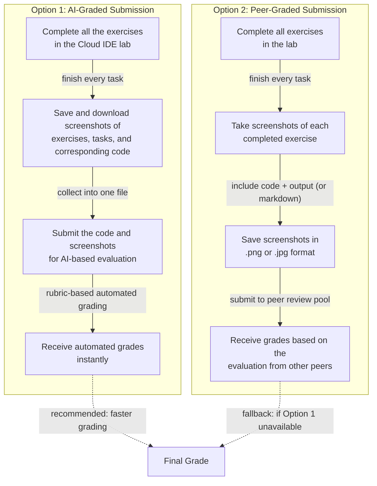

> **Course 8:** ETL and Data Pipelines with Shell, Airflow and Kafka
> **Module 5:** Final Project — Build a Data Pipeline

<mark>NEW</mark>

# Final Submission Guidelines and Deliverables

*Reading: Final Submission Guidelines and Deliverables*

**Estimated Time:** 2 minutes

## Overview

You have completed a series of labs applying key data engineering concepts through hands-on work in Cloud IDE labs.

<mark style="background-color: rgba(200, 230, 201, 0.4);">[ENRICHED: defined "Cloud IDE" — a fully online, browser-based integrated development environment (IDE) that supports many popular programming languages, letting you code, develop, and learn in one location without installing software locally [Source: https://skills.network/lab-tools/cloud-ide]. In this course, the Cloud IDE provides a VS Code-like editor alongside the course instructions, so every lab runs entirely in your web browser [Source: https://author.skills.network/docs/labs/tools/cloud-ide/overview].]</mark>

Each lab guided you through specific tasks such as executing code and exploring the core elements of the ETL and Data Pipelines with Shell, Airflow and Kafka.

The final assignment integrates all the skills you have learned.

In this exercise, you will apply them by building and managing DAGs in Apache Airflow.

<mark style="background-color: rgba(200, 230, 201, 0.4);">[ENRICHED: defined "DAG" — in Apache Airflow, a DAG (Directed Acyclic Graph) is a Python file that defines a collection of tasks together with the dependencies and order in which they must run, as well as how often to run the Dag. The term comes from the mathematical concept of a "directed acyclic graph," and Airflow uses it to structure any workflow as a graph where each node is a task and edges express dependencies that must never form a cycle [Source: https://airflow.apache.org/docs/apache-airflow/stable/core-concepts/dags.html]. "Building and managing DAGs" is the central skill of this final project — the DAG you author is the automation that schedules, sequences, and retries each ETL step.]</mark>

## How Can You Submit the Deliverables

You can submit your project deliverables in one of the following ways:

### Option 1: AI-Graded Submission and Evaluation

- Complete all the exercises in the Cloud IDE lab.
- After completing the lab, save and download screenshots of your exercises, tasks, and corresponding code as a file.
- Submit the code and screenshots for AI-based evaluation.
- Once submitted, you will receive automated grades instantly.

<mark style="background-color: rgba(200, 230, 201, 0.4);">[ENRICHED: performance context — Coursera's AI grader reviews submissions against the assignment rubric and the course's instructor-created content. In Coursera's pilot data, learners received AI grades within 1 minute of submission on average, compared to 15 hours with human graders (roughly 900x faster), and the feedback received was an average of 45x more than in human-graded assignments [Source: https://blog.coursera.org/ai-grading-in-peer-reviews-enhancing-courseras-learning-experience-with-faster-high-quality-feedback/]. This is the "automated grades instantly" behavior this option promises.]</mark>

### Option 2: Peer-Graded Submission and Evaluation

- Complete all exercises in the lab.
- Take screenshots of each completed exercise as instructed throughout this assignment.
- Each screenshot should include your code and output (or markdown, as specified).
- Screenshots can be saved in .png or .jpg format.

In this option, you will receive your grades based on the evaluation from other peers.

<mark style="background-color: rgba(200, 230, 201, 0.4);">[ENRICHED: ecosystem — peer-graded assignments are assessments where other learners review and grade your submission; to get a grade you must receive a certain number of peer reviews AND review a certain number of your peers' submissions. If an assignment is not AI graded, you typically get a grade within 7–10 days as long as you have received at least one review from your peers, and Coursera calculates the final grade from the median grade of each part [Source: https://www.coursera.support/s/article/learner-000001434]. The .png and .jpg formats named here match the image file types Coursera peer-review submissions accept (e.g., .jpeg, .jpg, .png, .gif) [Source: https://archive.ph/AZHSW].]</mark>

### Choosing Between the Submission Options

We recommend using Option 1 for faster grading. However, if you experience difficulties with this method or cannot access it, you may choose Option 2 instead.

<mark style="background-color: rgba(200, 230, 201, 0.4);">[ENRICHED: alternative & tradeoff — Option 1 (AI-graded) is the recommended default because grading is near-instant and feedback is generated automatically against the rubric, removing the wait for other learners. Option 2 (peer-graded) is the fallback when the AI method is unavailable or causes difficulty; its tradeoff is a longer grading cycle (typically 7–10 days for non-AI grading) and a grade computed from peer reviews rather than an automated grader [Source: https://www.coursera.support/s/article/learner-000001434]. Both options require the same core work — completing the lab and capturing screenshots of code plus output — so the only real difference is how the submission is evaluated.]</mark>

The two flows below summarize each option step by step:



> If the Mermaid diagram above does not render, here is the ASCII equivalent:

```
OPTION 1: AI-GRADED SUBMISSION
  [Complete all exercises in the Cloud IDE lab]
        |  finish every task
        v
  [Save and download screenshots of exercises, tasks, and code]
        |  collect into one file
        v
  [Submit the code and screenshots for AI-based evaluation]
        |  rubric-based automated grading
        v
  [Receive automated grades instantly]
        |  recommended: faster grading
        v
     [FINAL GRADE]

OPTION 2: PEER-GRADED SUBMISSION
  [Complete all exercises in the lab]
        |  finish every task
        v
  [Take screenshots of each completed exercise]
        |  include code + output (or markdown)
        v
  [Save screenshots in .png or .jpg format]
        |  submit to peer review pool
        v
  [Receive grades based on the evaluation from other peers]
        |  fallback: if Option 1 unavailable
        v
     [FINAL GRADE]
```

<mark style="background-color: rgba(200, 230, 201, 0.4);">[ENRICHED: diagrams — Mermaid diagram created showing the sequential steps of both submission options (AI-graded and peer-graded) and how they converge on the final grade. Both options share the same completion work; they diverge only at the evaluation step.]</mark>

## What Counts Toward Final Grading

Note:

Only the following lab is considered for Final Grading:

- **Hands-on Lab: Build ETL Data Pipelines with BashOperator using Apache Airflow**

The below labs are optional and are not considered for final grading:

- [Optional] Hands-on Lab: Build an ETL Pipeline using PythonOperator with Apache Airflow
- [Optional] Hands-on Lab: Build a Streaming ETL Pipeline using Kafka

<mark style="background-color: rgba(200, 230, 201, 0.4);">[ENRICHED: defined "BashOperator" — an Airflow operator that executes a bash command; it is one of the most popular core operators and is how you run shell scripts as tasks inside a DAG [Source: https://airflow.apache.org/docs/apache-airflow/stable/core-concepts/operators.html]. The required lab uses it to build ETL data pipelines, meaning each extraction/transformation/load step is implemented as a bash command invoked by an Airflow task.]</mark>

<mark style="background-color: rgba(200, 230, 201, 0.4);">[ENRICHED: defined "PythonOperator" — an Airflow operator that calls an arbitrary Python function, allowing transformation logic written in Python rather than shell commands to run as a DAG task [Source: https://airflow.apache.org/docs/apache-airflow/stable/core-concepts/operators.html]. The optional ETL lab uses it as an alternative implementation of the same pipeline concept covered by the required BashOperator lab.]</mark>

<mark style="background-color: rgba(200, 230, 201, 0.4);">[ENRICHED: defined "streaming ETL pipeline using Kafka" — a set of software services that ingests events, transforms them, and loads them into destination storage continuously, using Apache Kafka as the event backbone rather than waiting for a scheduled batch window. A streaming ETL pipeline enables streaming events between arbitrary sources and sinks and applies changes to the data while it is in flight [Source: https://docs.confluent.io/platform/current/ksqldb/tutorials/etl.html]. Although this lab is optional, it extends the batch ETL skills of the required lab into the real-time streaming paradigm.]</mark>

<mark style="background-color: rgba(200, 230, 201, 0.4);">[ENRICHED: ambiguity resolved — the phrase "The below labs are optional and are not considered for final grading" was interpreted as referring to the two labs listed immediately after it in the bullet list ([Optional] Hands-on Lab with PythonOperator, and [Optional] Hands-on Lab with Kafka). The required/optional split means only the BashOperator lab produces a grade, so you can complete the other two for practice without affecting your final project score.]</mark>

## License

The content of this lab is licensed under Apache 2.0

<mark style="background-color: rgba(200, 230, 201, 0.4);">[ENRICHED: defined "Apache 2.0" — the Apache License, Version 2.0 (SPDX identifier: Apache-2.0) is a permissive open-source license approved by the Apache Software Foundation in 2004. It grants a perpetual, worldwide, non-exclusive, no-charge, royalty-free, irrevocable copyright license to reproduce, prepare derivative works of, display, sublicense, and distribute the work — including commercial use — provided you include a copy of the license, retain copyright and attribution notices, and disclose any significant changes you make [Source: https://www.apache.org/licenses/LICENSE-2.0.html]. This means you are free to reuse, modify, and redistribute the lab content, even in commercial projects, as long as you preserve the required notices.]</mark>

## Key Takeaways

- [ENRICHED: summary — the final project is graded on a single required lab (Build ETL Data Pipelines with BashOperator using Apache Airflow); the PythonOperator and Kafka streaming labs are optional practice. You choose between AI-graded (instant, recommended) and peer-graded (7–10 days, fallback) evaluation, and in both cases the deliverable is the completed Cloud IDE lab plus screenshots of your code and output.]

## Enrichment Log

| # | Location | Type | Summary | Confidence | Source |
|---|---|---|---|---|---|
| 1 | Overview | Definition | Defined "Cloud IDE" as a browser-based integrated development environment | HIGH | https://skills.network/lab-tools/cloud-ide |
| 2 | Overview | Definition | Defined "DAG" (Directed Acyclic Graph) in Apache Airflow | HIGH | https://airflow.apache.org/docs/apache-airflow/stable/core-concepts/dags.html |
| 3 | Overview | Ecosystem | Connected the Cloud IDE lab experience to Skills Network/Coursera in-browser lab environments | HIGH | https://author.skills.network/docs/labs/tools/cloud-ide/overview |
| 4 | Option 1 | Performance context | AI grading delivers grades within ~1 minute on average, ~900x faster than human grading | HIGH | https://blog.coursera.org/ai-grading-in-peer-reviews-enhancing-courseras-learning-experience-with-faster-high-quality-feedback/ |
| 5 | Option 2 | Ecosystem | Peer-graded assignments require reviewing peers and receiving reviews; 7–10 day turnaround; median-based final grade | HIGH | https://www.coursera.support/s/article/learner-000001434 |
| 6 | Option 2 | Claim verification | Verified .png/.jpg are accepted image file types for Coursera peer-review submissions | HIGH | https://archive.ph/AZHSW |
| 7 | Choosing Between the Options | Alternative & tradeoff | Compared AI-graded vs peer-graded evaluation tradeoffs | HIGH | https://www.coursera.support/s/article/learner-000001434 |
| 8 | Choosing Between the Options | Diagram | Mermaid diagram of both submission flows with ASCII fallback | HIGH | https://blog.coursera.org/ai-grading-in-peer-reviews-enhancing-courseras-learning-experience-with-faster-high-quality-feedback/ |
| 9 | What Counts Toward Final Grading | Definition | Defined "BashOperator" (executes a bash command) | HIGH | https://airflow.apache.org/docs/apache-airflow/stable/core-concepts/operators.html |
| 10 | What Counts Toward Final Grading | Definition | Defined "PythonOperator" (calls an arbitrary Python function) | HIGH | https://airflow.apache.org/docs/apache-airflow/stable/core-concepts/operators.html |
| 11 | What Counts Toward Final Grading | Definition | Defined streaming ETL pipeline using Kafka | HIGH | https://docs.confluent.io/platform/current/ksqldb/tutorials/etl.html |
| 12 | What Counts Toward Final Grading | Ambiguity resolution | Resolved "The below labs" to the two listed optional labs | HIGH | https://airflow.apache.org/docs/apache-airflow/stable/core-concepts/operators.html |
| 13 | License | Definition | Explained Apache 2.0 as a permissive open-source license (SPDX: Apache-2.0) | HIGH | https://www.apache.org/licenses/LICENSE-2.0.html |
| 14 | Key Takeaways | Summary | Consolidated the required-vs-optional lab split and the two submission options | HIGH | https://www.coursera.support/s/article/learner-000001434 |

<!-- EXTRACTION_CHECKLIST: 28 sentences extracted, 28 sentences in output -->
