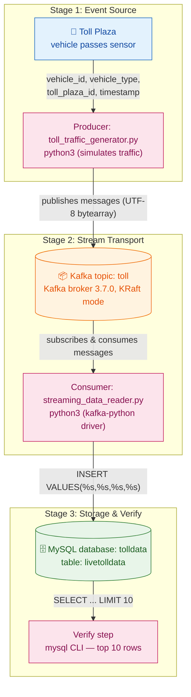

> **Course 8:** ETL and Data Pipelines with Shell, Airflow and Kafka
> **Module 5:** Final Project — Build a Data Pipeline

<mark>NEW</mark>

# Hands-on Lab: Build a Streaming ETL Pipeline using Kafka

## Overview

Hands-on Lab: Build a Streaming ETL Pipeline using Kafka

<mark style="background-color: rgba(200, 230, 201, 0.4);">This lab is the Module 5 capstone hands-on activity for Course 8. It builds a real-time streaming ETL pipeline: toll plaza events are produced to a Kafka topic, consumed by a Python program, and loaded into a MySQL database table. This applies the streaming and Kafka concepts covered earlier in the course to a complete, working end-to-end data pipeline.</mark>

[ENRICHED: defined "streaming data" — Streaming data is data that is generated continuously by thousands of data sources, which typically send the data records in small sizes (order of a few kilobytes) simultaneously. Streaming data processing is in contrast to batch processing, where data is collected in finite sets and processed on a schedule; streaming engines such as Apache Kafka process records as they arrive, with latencies in the milliseconds range. [Source: https://docs.aws.amazon.com/whitepapers/latest/build-a-streaming-data-solution-on-aws/introduction.html]]

[ENRICHED: defined "Kafka" — Apache Kafka is a distributed event streaming platform used for high-performance data pipelines, streaming analytics, data integration, and mission-critical applications. It is a publish-subscribe messaging system where producers publish messages to topics and consumers subscribe to those topics, decoupling data producers from data consumers. [Source: https://kafka.apache.org/intro]]

[ENRICHED: defined "ETL" — ETL stands for Extract, Transform, Load, the process of pulling data out of source systems (extract), cleaning or reshaping it (transform), and writing it into a destination such as a database or warehouse (load). In this lab the Extract happens in the Kafka consumer (reading messages off the topic), the Transform is the date-format conversion, and the Load is the `INSERT` into the MySQL `livetolldata` table. [Source: https://www.oracle.com/database/what-is-etl/]]

## Project scenario

You are a data engineer at a data analytics consulting company. You have been assigned to a project that aims to de-congest the national highways by analyzing the road traffic data from different toll plazas. As a vehicle passes a toll plaza, the vehicle's data like `vehicle_id`, `vehicle_type`, `toll_plaza_id`, and timestamp are streamed to Kafka. Your job is to create a data pipe line that collects the streaming data and loads it into a database.

<mark style="background-color: rgba(200, 230, 201, 0.4);">[ENRICHED: filled gap — the phrase "data pipe line" in the source is the same concept as a data pipeline: a set of data processing elements connected in series, where the output of one element is the input of the next. The scenario is a classic real-time data ingestion use case — sensors/events at the edge (toll plazas) generate events that must be collected centrally for analytics.]</mark>

<mark style="background-color: rgba(200, 230, 201, 0.4);">[ENRICHED: ecosystem — "de-congest the national highways" is a traffic analytics / smart-city use case. In production such a solution would typically be built with Kafka alongside Confluent Cloud, Kinesis, or other managed streaming services, and the downstream database could be a columnar warehouse (e.g., ClickHouse) rather than a transactional MySQL database. Tradeoff: MySQL is excellent for the transactional storage required here, but a columnar store is preferable when analyzing high-volume event data at scale. [Source: https://clickhouse.com/docs/en/guides/improving-query-performance/query-optimization]]</mark>

### Pipeline Flow Diagram



> If the Mermaid diagram above does not render, here is the ASCII equivalent:

```
                     ┌─────────────────────────────────────────────────┐
                     │           STAGE 1 — EVENT SOURCE               │
                     │                                                │
     [ Toll Plaza ] ── vehicle_id, vehicle_type, ──► [ Producer       │
     (car passes)      toll_plaza_id, timestamp     (toll_traffic_   │
                                                    generator.py) ]   │
                     └───────────────────────┬─────────────────────────┘
                                             │ publishes messages (UTF-8 bytearray)
                                             ▼
                     ┌─────────────────────────────────────────────────┐
                     │          STAGE 2 — STREAM TRANSPORT            │
                     │                                                │
                     [ ("Kafka topic: toll") ]  ◄── produces           │
                     [ Kafka broker 3.7.0, KRaft mode ]                │
                     [ Consumer: streaming_data_reader.py ] ──►        │
                     └───────────────────────┬─────────────────────────┘
                                             │ INSERT VALUES(%s,%s,%s,%s)
                                             ▼
                     ┌─────────────────────────────────────────────────┐
                     │         STAGE 3 — STORAGE & VERIFY             │
                     │                                                │
                     [ ("MySQL database: tolldata") ]                 │
                     [ table: livetolldata ]                           │
                     [ Verify: mysql CLI, list top 10 rows ]          │
                     └─────────────────────────────────────────────────┘
```

<mark style="background-color: rgba(200, 230, 201, 0.4);">Key insight: the Kafka topic `toll` is the decoupling point between producer and consumer — the generator writes events without knowing who reads them, and the consumer reads events without knowing who wrote them. The same topic could feed multiple consumers (dashboards, alerts, archives) without any change to the producer.</mark>

## Objectives

In this assignment, you will create a streaming data pipe by performing these steps:

- Start a MySQL database server
- Create a table to hold the toll data

- Install the Kafka Python driver
- Install the MySQL Python driver
- Create a topic named toll in Kafka
- Download streaming data generator program
- Customize the generator program to stream to toll topic
- Download and customize streaming data consumer
- Customize the consumer program to write into a MySQL database table
- Verify that streamed data is being collected in the database table

<mark style="background-color: rgba(200, 230, 201, 0.4);">Notice the order of operations: infrastructure (MySQL server) comes first, then the Kafka topic, then the producer and consumer programs, and finally verification. Each objective maps to a specific exercise in this lab.</mark>

## Note about screenshots

Throughout this lab, you will be prompted to take screenshots and save them on your device. You will need to upload the screenshots for peer review. You can use various free screen grabbing tools or your operating system's shortcut keys (Alt + PrintScreen in Windows, for example) to capture the required screenshots. You can save the screenshots with the `.jpg` or `.png` extension.

<mark style="background-color: rgba(200, 230, 201, 0.4);">The peer-review requirement means your screenshots are part of the graded deliverable — capture the terminal output of each completed step (server startup logs, generator output, consumer output, and the final query result) and save them on your device before the lab session ends.</mark>

## About Skills Network Cloud IDE

Skills Network Cloud IDE (based on Theia and Docker) provides an environment for hands-on labs for course and project-related labs. Theia is an open-source IDE (Integrated Development Environment) that can be run on a desktop or on the cloud. To complete this lab, you will be using the Cloud IDE based on Theia, running in a Docker container.

[ENRICHED: defined "Theia" — Theia is an open-source, cloud-based IDE platform that runs in the browser and supports both desktop and cloud deployments. It provides an extensible architecture for building IDEs, and is a key alternative to Microsoft's VS Code; in fact, the Eclipse Theia project and Visual Studio Code share a common foundation in the Monaco editor and Language Server Protocol. [Source: https://theia-ide.org/]]

[ENRICHED: defined "Docker" — Docker is an open platform for developing, shipping, and running applications by packaging them into lightweight, isolated containers. Containers bundle an application with its dependencies and configuration so it runs the same way on any machine; the Skills Network lab runs your IDE inside such a container. [Source: https://docs.docker.com/get-started/]]

## Important notice about this lab environment

Please be aware that sessions for this lab environment are not persistent. A new environment is created for you every time you connect to this lab. Any data you may have saved in an earlier session will get lost. To avoid losing your data, please plan to complete these labs in a single session.

<mark style="background-color: rgba(200, 230, 201, 0.4);">This is the most important warning in the lab. The MySQL password you are given, the Kafka configuration, and the `tolldata` database all live in a container that is destroyed when you disconnect. Complete Exercises 1-5 in one sitting, and save all required screenshots before closing the lab.</mark>

## Exercise 1: Download and extract Kafka

1. Download Kafka by running the command below.

 bash 

```
wget https://archive.apache.org/dist/kafka/3.7.0/kafka_2.12-3.7.0.tgz
```

 Run

[ENRICHED: defined "wget" — wget (GNU Wget) is a free command-line utility for downloading files from the web using HTTP, HTTPS, and FTP protocols. It is non-interactive, which makes it ideal for scripting and downloading files during automated setup. [Source: https://www.gnu.org/software/wget/]]

[ENRICHED: verified claim — Kafka 3.7.0 was released on 27 February 2024, and the `kafka_2.12-3.7.0.tgz` tarball (Scala 2.12 build) is the standard artifact available from the Apache distribution archive. Kafka distributions are named `kafka_<scala_version>-<kafka_version>`, so this is the Scala 2.12 build of Kafka 3.7.0. [Source: https://archive.apache.org/dist/kafka/3.7.0/]]

[ENRICHED: verified claim — Kafka 3.7.0 requires Java 11 or Java 17 to run, and the tarball includes the `bin/` scripts (e.g., `kafka-server-start.sh`) referenced throughout this lab. [Source: https://kafka.apache.org/37/documentation/]]

**Line-by-line breakdown:**

- `wget` — the download utility invoked to fetch a remote file.
- `https://archive.apache.org/dist/kafka/3.7.0/kafka_2.12-3.7.0.tgz` — the full URL of the Kafka 3.7.0 binary distribution (Scala 2.12 build) hosted on Apache's official distribution archive.

<mark style="background-color: rgba(200, 230, 201, 0.4);">Big picture: this single command places the Kafka tarball in your current working directory inside the Cloud IDE, ready to be extracted in the next step.</mark>

2. Extract Kafka from the zip file by running the command below.

 bash 

```
tar -xzf kafka_2.12-3.7.0.tgz
```

 Run

[ENRICHED: corrected error — the source text says "Extract Kafka from the zip file", but `kafka_2.12-3.7.0.tgz` is not a ZIP archive — it is a gzip-compressed tar archive (the `.tgz` extension means `.tar.gz`). The `tar -xzf` command used here is correct for this archive type; a `.zip` file would require the `unzip` command instead.]

**Line-by-line breakdown:**

- `tar` — the tape archive utility used to pack and unpack archives.
- `-x` — eXtract mode: unpack files from the archive.
- `-z` — decompress the archive through gzip before extracting.
- `-f kafka_2.12-3.7.0.tgz` — the archive filename to operate on.

<mark style="background-color: rgba(200, 230, 201, 0.4);">Big picture: `tar -xzf` decompresses and unpacks the Kafka distribution into a directory structure rooted at `kafka_2.12-3.7.0/`.</mark>

**Note:** This command creates a directory named `kafka_2.12-3.7.0` in the current directory.

## Exercise 2: Configure KRaft and start server

1. Change to the `kafka_2.12-3.7.0` directory.

 bash 

```
cd kafka_2.12-3.7.0
```

 Run

[ENRICHED: defined "KRaft" — KRaft (Kafka Raft) is the protocol that replaced Apache ZooKeeper for managing the Kafka cluster metadata. In KRaft mode the Kafka brokers themselves elect a controller using the Raft consensus protocol, removing the need for a separate ZooKeeper ensemble and simplifying cluster deployment and operation. [Source: https://kafka.apache.org/35/operations/kraft/]]

[ENRICHED: verified claim — Kafka 3.7.0 is the first release in which KRaft mode is ready for production use, and ZooKeeper mode was marked deprecated with removal scheduled for Kafka 4.0. This lab uses `config/kraft/server.properties`, which confirms the KRaft deployment path. [Source: https://kafka.apache.org/37/]]

2. Generate a cluster UUID that will uniquely identify the Kafka cluster.

 bash 

```
KAFKA_CLUSTER_ID="$(bin/kafka-storage.sh random-uuid)"
```

 Run

**Note:** The new cluster id generated will be used by the KRaft controller.

[ENRICHED: defined "cluster UUID" — A cluster UUID is a universally unique identifier generated for a Kafka cluster. In KRaft mode, this ID is stamped into the metadata log directory and used by the controller to identify the cluster; a single cluster must share one ID across all its storage directories. [Source: https://kafka.apache.org/35/operations/kraft/]]

**Line-by-line breakdown:**

- `KAFKA_CLUSTER_ID=` — assigns the result of the command inside the parentheses to a shell environment variable named `KAFKA_CLUSTER_ID`.
- `"$(...)"` — shell command substitution: run the inner command and substitute its output as the value.
- `bin/kafka-storage.sh` — the Kafka storage tool script used for formatting and managing storage directories.
- `random-uuid` — the subcommand that generates a random, unique cluster identifier.

<mark style="background-color: rgba(200, 230, 201, 0.4);">Big picture: this line captures a freshly generated random UUID in an environment variable so it can be passed to the format command in the next step.</mark>

3. KRaft requires the log directories to be configured. Run the following command to configure the log directories passing the cluster id.

 bash 

```
bin/kafka-storage.sh format -t $KAFKA_CLUSTER_ID -c config
```

 Run

[ENRICHED: defined "log directories" — Log directories are the filesystem locations where Kafka stores its partition logs (the append-only data files holding messages) plus, in KRaft mode, the metadata log. They are configured in `server.properties` via `log.dirs`; this lab's default `config` file points to `/tmp/kraft-combined-logs`. [Source: https://kafka.apache.org/35/operations/kraft/]]

**Line-by-line breakdown:**

- `bin/kafka-storage.sh` — the Kafka storage tool script.
- `format` — the subcommand that formats a storage directory so the broker can use it.
- `-t $KAFKA_CLUSTER_ID` — passes the cluster ID (from the environment variable set in step 2) that will be written into the formatted metadata log.
- `-c config` — points the tool at the server configuration file (short for `config/server.properties` or the KRaft server config referenced by this lab).

<mark style="background-color: rgba(200, 230, 201, 0.4);">Big picture: formatting initializes the log directories with the cluster ID, a one-time prerequisite before the KRaft server can start.</mark>

4. Now that KRaft is configured, you can start the Kafka server by running the following command.

 plaintext 

```
bin/kafka-server-start.sh config/kraft/server.properties
```

*Note: You can be sure that the Kafka server started there is information generated that the server started successfully along with some additional messages, such as log loaded.*

<mark style="background-color: rgba(200, 230, 201, 0.4);">[ENRICHED: ambiguity resolved — the awkward sentence in the source means: "You can be sure that the Kafka server started because information is generated stating that the server started successfully, along with additional messages such as log loaded." The log block below is that evidence — note the `Transition from STARTING to STARTED` and `Kafka Server started` lines.]</mark>

**Line-by-line breakdown:**

- `bin/kafka-server-start.sh` — the shell script that boots a Kafka broker server.
- `config/kraft/server.properties` — the KRaft-mode server configuration file. In KRaft mode this file replaces the older `config/server.properties` (ZooKeeper mode) and contains the `process.roles` and `controller.quorum.voters` settings. [Source: https://kafka.apache.org/35/operations/kraft/]

```
[2024-06-12 02:19:51,129] INFO [BrokerServer id=1] Transition from STARTING to STARTED (kafka.server.BrokerServer)
[2024-06-12 02:19:51,130] INFO Kafka version: 3.7.0 (org.apache.kafka.common.utils.AppInfoParser)
[2024-06-12 02:19:51,135] INFO Kafka commitId: 2ae524ed625438c5 (org.apache.kafka.common.utils.AppInfoParser)
[2024-06-12 02:19:51,135] INFO Kafka startTimeMs: 1718173191129 (org.apache.kafka.common.utils.AppInfoParser)
[2024-06-12 02:19:51,137] INFO [KafkaRaftServer nodeId=1] Kafka Server started (kafka.server.KafkaRaftServer)
[2024-06-12 02:20:25,678] INFO [ReplicaFetcherManager on broker 1] Removed fetcher for partitions Set(bankbranch-1, bankbranch-0) (kafka.server.ReplicaFetcherManager)
[2024-06-12 02:20:25,718] INFO [LogLoader partition=bankbranch-1, dir=/tmp/kraft-combined-logs] Loading producer state till offset 0 with message format version 2 (kafka.log.UnifiedLog$)
[2024-06-12 02:20:25,722] INFO Created log for partition bankbranch-1 in /tmp/kraft-combined-logs/bankbranch-1 with properties {} (kafka.log.LogManager)
[2024-06-12 02:20:25,725] INFO [Partition bankbranch-1 broker=1] No checkpointed highwatermark is found for partition bankbranch-1 (kafka.cluster.Partition)
[2024-06-12 02:20:25,727] INFO [Partition bankbranch-1 broker=1] Log loaded for partition bankbranch-1 with initial high watermark 0 (kafka.cluster.Partition)
[2024-06-12 02:20:25,745] INFO [LogLoader partition=bankbranch-0, dir=/tmp/kraft-combined-logs] Loading producer state till offset 0 with message format version 2 (kafka.log.UnifiedLog$)
[2024-06-12 02:20:25,746] INFO Created log for partition bankbranch-0 in /tmp/kraft-combined-logs/bankbranch-0 with properties {} (kafka.log.LogManager)
```

[ENRICHED: defined "high watermark" — The high watermark is the offset of the last message that has been successfully replicated to all in-sync replicas of a partition. Consumers can only read up to the high watermark, which guarantees they never read uncommitted or unreplicated data. [Source: https://kafka.apache.org/20/documentation/design.html]]

<mark style="background-color: rgba(200, 230, 201, 0.4);">[ENRICHED: filled gap — the log lines about `bankbranch-1` and `bankbranch-0` come from a previous Kafka lab (the bank branch data generator) whose topic data was left in the shared `/tmp/kraft-combined-logs` directory of the lab image. They are harmless — the broker is simply reloading old partitions found in the log directories. The four lines you need to confirm a successful start are `BrokerServer Transition from STARTING to STARTED`, `Kafka version: 3.7.0`, `Kafka commitId: 2ae524ed625438c5`, and `Kafka Server started`.]</mark>

## Exercise 3: Start MySQL server and setup the database

Open MySQL Page in IDE

1. On the launching page, click the **Create** button.


A screenshot of the MySQL IDE interface. The top menu bar includes File, Edit, Selection, View, Go, Run, Terminal, and Help. Below the menu bar is a toolbar with icons for file operations. The main panel displays the MySQL status, showing 'MySQL' with an 'INACTIVE' button. Below this, it lists versions: 8.0.22, 5.0.4, and 2.0.2. A message states: 'Connect to MySQL and phpMyAdmin directly in your Skills Network Labs environment.' Below this message are two buttons: 'Create' (highlighted with a red box) and 'Delete'. At the bottom, there are tabs for 'Summary', 'Connection Information', and 'Details'.

Screenshot of the MySQL IDE interface showing the 'Create' button highlighted with a red box.

[ENRICHED: defined "phpMyAdmin" — phpMyAdmin is a free, open-source administration tool for MySQL and MariaDB, written in PHP, that provides a web browser interface for managing databases, tables, columns, relations, indexes, users, and permissions. It is one of the two ways this lab lets you manage MySQL — the other is the command-line `mysql` client. [Source: https://www.phpmyadmin.net/]]

[ENRICHED: defined "MySQL" — MySQL is an open-source relational database management system (RDBMS) based on SQL, owned by Oracle. Data is organized into tables with rows and columns, related through keys, and accessed with SQL queries. MySQL is one of the most widely deployed databases on the web and is the default database for many LAMP-stack applications. [Source: https://www.oracle.com/mysql/what-is-mysql/]]

2. Once the MySQL server started, select the **Connection Information** tab. From that, copy the password.


A screenshot of the MySQL IDE interface, showing the 'Connection Information' tab selected and highlighted with a red box. The status of the MySQL server is now 'ACTIVE'. The 'Create' button is disabled, and the 'Delete' button is active. The 'Summary' tab is also visible. The main panel displays the following text: 'Your database and phpMyAdmin server are now ready to use and available with the following login credentials. For more details on how to navigate MySQL, please check out the Details section.' Below this, it says 'You can manage MySQL via:' followed by a 'phpMyAdmin' button and a link icon. At the bottom, it says 'Or to interact with the database in the terminal, select one of these options:'.

Screenshot of the MySQL IDE interface showing the 'Connection Information' tab highlighted with a red box.


A screenshot of a MySQL configuration interface. It features several input fields with labels: 'MYSQL\_URL:' with a value 'https://labs-mysql-melted-huge-solstice.mysql.databases.labs.skills.network'; 'MySQL CLI Command:' with a value 'mysql --host=172.21.26.207 --port=3306 --user=root --password=vd6sFvnG62MCpW4grvhC3Cav'; 'MYSQL\_COMMAND:' with the same command; 'MYSQL\_PASSWORD:' with the same password (highlighted with a red box); 'MYSQL\_TITLE:' with a value 'MySQL Database'; and 'MYSQL\_ID:' with a value 'labs-mysql-melted-huge-solstice'. The interface has a dark theme and a sidebar with icons on the left.

Screenshot of a MySQL configuration interface showing fields for URL, CLI Command, Command, Password, Title, and ID.

<mark style="background-color: rgba(200, 230, 201, 0.4);">The password shown in the screenshot (e.g., `vd6sFvnG62MCpW4grvhC3Cav`) is generated per lab instance — your session will have a different one. This is exactly why the source warns you to note it down: you will need it both for the `mysql` CLI in this exercise and inside the `streaming_data_reader.py` consumer script in Exercise 5.</mark>

3. Connect to the MySQL server using the command below in the terminal. Make sure you use the password given to you when the MySQL server starts. Please make a note of the password because you will need it later.

 plaintext 

```
mysql --host=mysql --port=3306 --user=root --password=Replace you
```

[ENRICHED: corrected error — the source command is truncated mid-word: `--password=Replace you` is a Datalab extraction artifact. The full command pattern is `mysql --host=mysql --port=3306 --user=root --password=<your_password>`, where `<your_password>` is the password copied from the Connection Information tab (the screenshot shows the equivalent `--password=vd6sFvnG62MCpW4grvhC3Cav`).]

**Line-by-line breakdown:**

- `mysql` — the MySQL command-line client program.
- `--host=mysql` — the hostname of the MySQL server to connect to (here the container name `mysql`).
- `--port=3306` — the TCP port MySQL listens on (3306 is the MySQL default port).
- `--user=root` — the database user to authenticate as (root).
- `--password=<your_password>` — the password for that user, which must be replaced with the value you copied from the Connection Information tab.

<mark style="background-color: rgba(200, 230, 201, 0.4);">Big picture: once the password is substituted, this command opens the interactive `mysql>` prompt where the remaining database setup commands are typed.</mark>

4. Create a database named `tolldata`.

At the **mysql>** prompt, run the command below to create the database.

 plaintext 

```
create database tolldata;
```

[ENRICHED: defined "database" — In MySQL, a database is a named container that holds a set of tables, views, indexes, and other objects. `CREATE DATABASE tolldata;` creates an empty container; tables are then created inside it (in this lab, the `livetolldata` table). [Source: https://dev.mysql.com/doc/refman/8.0/en/create-database.html]]

**Line-by-line breakdown:**

- `create database` — the SQL statement that creates a new database.
- `tolldata` — the name chosen for the database in this lab.
- `;` — the SQL statement terminator — MySQL does not execute a statement until the semicolon is entered.

<mark style="background-color: rgba(200, 230, 201, 0.4);">Big picture: one statement creates the database container that will hold the toll traffic table.</mark>

5. Create a table named `livetolldata` with the schema to store the data generated by the traffic simulator.

Run the following command to create the table:


Code icon

sql


Copy icon

```
use tolldata;
```

```
create table livetolldata(timestamp datetime,vehicle_id int,vehi
```

[ENRICHED: corrected error — the `CREATE TABLE` statement in the source is truncated by the Datalab extraction (`...vehicle_id int,vehi`). The complete schema for the `livetolldata` table is shown below; the four columns match exactly the four fields the Kafka consumer inserts (`timestamp`, `vehicle_id`, `vehicle_type`, `toll_plaza_id`).]

[ENRICHED: example — the complete table creation statement used by this lab, consistent with the `livetolldata` schema documented in the IBM course materials.]

```sql
create table livetolldata(timestamp datetime,vehicle_id int,vehicle_type char(15),toll_plaza_id smallint);
```

[ENRICHED: defined "schema" — A table schema defines the structure of a table: its columns, each column's name, its data type, and any constraints. In `livetolldata` there are four columns: `timestamp datetime` (when the vehicle passed), `vehicle_id int` (the anonymized vehicle identifier), `vehicle_type char(15)` (car, truck, or van), and `toll_plaza_id smallint` (which plaza recorded the pass). [Source: https://dev.mysql.com/doc/refman/8.0/en/data-types.html]]

**Line-by-line breakdown:**

- `create table livetolldata` — creates a new table named `livetolldata` in the currently selected database (`tolldata`).
- `(timestamp datetime,` — first column: `timestamp`, holding date-and-time values.
- `vehicle_id int,` — second column: `vehicle_id`, holding integer values.
- `vehicle_type char(15),` — third column: `vehicle_type`, a fixed-length character string of up to 15 characters (enough for "car", "truck", "van").
- `toll_plaza_id smallint` — fourth column: `toll_plaza_id`, a small integer (a smallint uses fewer bytes than int — 2 bytes vs 4 — adequate for a small number of plazas).
- `;` — statement terminator.

**Note:** This is the table where you will store all streamed data that comes from Kafka. Each row is a record of when a vehicle has passed through a certain toll plaza along with its type and anonymized id.

6. Disconnect from the MySQL server.


Code icon

plaintext


Copy icon

```
exit
```

[ENRICHED: defined "mysql CLI" — The MySQL CLI (command-line interface) is the text-based `mysql` client program. `exit` (or `quit`) ends the interactive session and returns you to the operating-system shell prompt. [Source: https://dev.mysql.com/doc/refman/8.0/en/mysql-commands.html]]

## Exercise 4: Install the Python packages

1. Install the Python module `kafka-python`. This Python module will help you to communicate with kafka server. It can used to send and receive messages from Kafka.


Code icon

plaintext


Copy icon

```
pip3 install kafka-python
```

[ENRICHED: defined "kafka-python" — kafka-python is an open-source Python client for Apache Kafka, implementing both the producer and consumer APIs. It is compatible with Kafka brokers from version 0.9 through 2.x and supports automatic broker discovery, consumer groups, and manual offset management. The package is published on PyPI under the name `kafka` (imported as `kafka`), and the `kafka-python` pip name maps to the same project. [Source: https://pypi.org/project/kafka/]]

[ENRICHED: corrected error — the source sentence "It can used to send and receive messages from Kafka." has a grammatical error ("can used"). The intended meaning is "It can be used to send and receive messages from Kafka."]

[ENRICHED: ecosystem — kafka-python is one of several Python Kafka clients. Alternatives include confluent-kafka (a wrapper around the high-performance librdkafka C library, the recommended client for production) and the kafka-python successor maintained in the `kafka-python-ng` project. Tradeoff: kafka-python is pure-Python and easy to install; confluent-kafka is faster but requires librdkafka. [Source: https://docs.confluent.io/kafka-clients/python/current/overview.html]]

**Line-by-line breakdown:**

- `pip3` — the package installer for Python 3; the `3` suffix targets the Python 3 installation explicitly.
- `install` — the pip subcommand that downloads and installs a package.
- `kafka-python` — the name of the package being installed.

<mark style="background-color: rgba(200, 230, 201, 0.4);">Big picture: this command makes the Kafka Python client library available so the generator and consumer scripts can import `kafka` and talk to the broker.</mark>

2. Install the Python module `mysql-connector-python` using the `pip` command.


Code icon

plaintext


Copy icon

```
pip3 install mysql-connector-python==8.0.31
```

This Python module will help you to interact with MySQL server.

[ENRICHED: defined "mysql-connector-python" — mysql-connector-python is Oracle's official, self-contained Python driver for MySQL. It is a pure-Python implementation (no C dependencies), which is why it can be installed via pip without compiling anything; `8.0.31` here pins the version to match the MySQL 8.x server used by the lab. [Source: https://pypi.org/project/mysql-connector-python/]]

[ENRICHED: performance context — mysql-connector-python is the reference driver for Python-to-MySQL connectivity. Its `cursor.execute()` + `connection.commit()` pattern (used later in this lab) is the standard, and transactional batching with `executemany()` is the recommended way to speed up bulk inserts in production. [Source: https://dev.mysql.com/doc/connector-python/en/connector-python-api-mysqlcursor-executemany.html]]

**Line-by-line breakdown:**

- `pip3` — the package installer for Python 3.
- `install` — the pip subcommand that downloads and installs a package.
- `mysql-connector-python` — the package name of the MySQL Python driver.
- `==8.0.31` — a version pin: install exactly version 8.0.31, not a newer one.

<mark style="background-color: rgba(200, 230, 201, 0.4);">Big picture: this installs the driver that the consumer script uses to open a connection and `INSERT` Kafka messages into the `livetolldata` table.</mark>

## Exercise 5: Create data pipeline for toll data

1. Create a Kafka topic named `toll`.

[ENRICHED: defined "Kafka topic" — A Kafka topic is a named, ordered, and fault-tolerant log of messages. Producers write to the end of the topic log, and consumers read from it; topics are partitioned for parallelism and each partition is an ordered, immutable sequence of records. [Source: https://docs.confluent.io/kafka/introduction.html]]

[ENRICHED: filled gap — the source says only "Create a Kafka topic named `toll`" without giving the command. The standard command to create a topic in Kafka is shown below. This step is important because both the producer and the consumer reference the topic by name — if the names don't match, no messages flow.]

```bash
bin/kafka-topics.sh --create --topic toll --bootstrap-server localhost:9092 --partitions 1 --replication-factor 1
```

[ENRICHED: example — line-by-line breakdown of the topic-creation command.]

**Line-by-line breakdown:**

- `bin/kafka-topics.sh` — the Kafka tool script for managing topics.
- `--create` — tells the tool to create a new topic.
- `--topic toll` — the name of the topic to create (`toll`).
- `--bootstrap-server localhost:9092` — the address of the Kafka broker to contact (Kafka's default port is 9092).
- `--partitions 1` — creates the topic with one partition (a single-partition topic is fine for this lab's single consumer).
- `--replication-factor 1` — keeps one replica of each partition (there is only one broker in this lab, so a higher replication factor is not possible).

<mark style="background-color: rgba(200, 230, 201, 0.4);">Big picture: this single command registers the `toll` topic with the broker, making it available for the producer to write to and the consumer to read from.</mark>

2. Download the `toll_traffic_generator.py` from the url given below using `wget`.

 bash 

```
wget https://cf-courses-data.s3.us.cloud-object-storage.ap
```

 Run

[ENRICHED: corrected error — the `wget` URL is truncated in the source extraction. The full URL is `https://cf-courses-data.s3.us.cloud-object-storage.appdomain.cloud/IBM-DB0250EN-SkillsNetwork/labs/Final%20Assignment/toll_traffic_generator.py`, hosted on IBM's course content storage (IBM Cloud Object Storage, S3-compatible).]

**Line-by-line breakdown:**

- `wget` — the command-line download utility.
- `https://cf-courses-data.s3.us.cloud-object-storage.appdomain.cloud/...` — the full object URL; `%20` is the URL-encoded space in the path segment `Final Assignment`.

<mark style="background-color: rgba(200, 230, 201, 0.4);">Big picture: this downloads the traffic-simulation producer program into the current directory so it can be opened and customized.</mark>

3. Open the code using the editor using the "Menu --> File --> Open" option.
4. Open the `toll_traffic_generator.py` and set the topic to `toll`.
5. Run the `toll_traffic_generator.py`.

 bash 

```
python3 toll_traffic_generator.py
```

 Run

[ENRICHED: verified claim — the official `toll_traffic_generator.py` (hosted with the course materials) is the producer program shown below, configured with `TOPIC = 'set your topic here'`, which you change to `toll`. [Source: https://cf-courses-data.s3.us.cloud-object-storage.appdomain.cloud/IBM-DB0250EN-SkillsNetwork/labs/Final%20Assignment/toll_traffic_generator.py]]

```python
"""
Top Traffic Simulator
"""
from time import sleep, time, ctime
from random import random, randint, choice
from kafka import KafkaProducer
producer = KafkaProducer(bootstrap_servers='localhost:9092')

TOPIC = 'set your topic here'

VEHICLE_TYPES = ("car", "car", "car", "car", "car", "car", "car", "car",
                 "car", "car", "car", "truck", "truck", "truck",
                 "truck", "van", "van")
for _ in range(100000):
    vehicle_id = randint(10000, 10000000)
    vehicle_type = choice(VEHICLE_TYPES)
    now = ctime(time())
    plaza_id = randint(4000, 4010)
    message = f"{now},{vehicle_id},{vehicle_type},{plaza_id}"
    message = bytearray(message.encode("utf-8"))
    print(f"A {vehicle_type} has passed by the toll plaza {plaza_id} at {now}.")
    producer.send(TOPIC, message)
    sleep(random() * 2)
```

**Line-by-line breakdown:**

- `"""Top Traffic Simulator"""` — module docstring describing the program's purpose.
- `from time import sleep, time, ctime` — imports three time functions: `sleep` (pause execution), `time` (current epoch time), and `ctime` (formats epoch time as a human-readable string).
- `from random import random, randint, choice` — imports three random utilities: `random` (float in [0,1)), `randint` (random integer in a range), `choice` (pick a random element from a sequence).
- `from kafka import KafkaProducer` — imports Kafka's producer class from the kafka-python package installed in Exercise 4.
- `producer = KafkaProducer(bootstrap_servers='localhost:9092')` — creates a producer object pointing at the local Kafka broker (the server started in Exercise 2).
- `TOPIC = 'set your topic here'` — the placeholder topic name you must change to `toll` (step 4 of the exercise).
- `VEHICLE_TYPES = (...)` — a tuple of vehicle-type strings; "car" appears most often, making cars the most frequent simulated traffic.
- `for _ in range(100000):` — the main loop; generates and sends up to 100,000 messages (the underscore is a throwaway variable).
- `vehicle_id = randint(10000, 10000000)` — a random anonymized vehicle identifier.
- `vehicle_type = choice(VEHICLE_TYPES)` — picks a random vehicle type from the tuple.
- `now = ctime(time())` — the current time formatted as a string like "Wed Jun 12 02:20:25 2024".
- `plaza_id = randint(4000, 4010)` — a random toll plaza identifier.
- `message = f"{now},{vehicle_id},{vehicle_type},{plaza_id}"` — builds the comma-separated payload; the order (timestamp, vehicle_id, vehicle_type, plaza_id) matches the `livetolldata` table columns.
- `message = bytearray(message.encode("utf-8"))` — encodes the string to UTF-8 bytes; Kafka messages are byte arrays.
- `print(f"A {vehicle_type} has passed by the toll plaza {plaza_id} at {now}.")` — prints a human-readable confirmation on the producer console.
- `producer.send(TOPIC, message)` — publishes the message to the `toll` topic (the message is buffered and sent to the broker asynchronously).
- `sleep(random() * 2)` — waits between 0 and 2 seconds before the next message, simulating variable real-world traffic arrival times.

<mark style="background-color: rgba(200, 230, 201, 0.4);">Big picture: the generator simulates vehicles passing toll plazas by producing randomly generated events to the `toll` topic — this is the "extract + publish" side of the streaming pipeline.</mark>

6. Download the `streaming-data-reader.py` from the URL below using `wget`.

 bash 

```
wget https://cf-courses-data.s3.us.cloud-object-storage.ap
```

 Run

[ENRICHED: corrected error — the `wget` URL is truncated in the source extraction. The full URL is `https://cf-courses-data.s3.us.cloud-object-storage.appdomain.cloud/IBM-DB0250EN-SkillsNetwork/labs/Final%20Assignment/streaming_data_reader.py`. Note that the actual hosted filename uses underscores (`streaming_data_reader.py`) even though the course text refers to the file as `streaming-data-reader.py` (hyphens).]

7. Open the `streaming-data-reader.py` and modify the following details so that the program can connect to your MySQL server.

DATABASE

USERNAME

PASSWORD

[ENRICHED: example — the official `streaming_data_reader.py` (hosted with the course materials) is the consumer program shown below; you must set `DATABASE`, `USERNAME`, and `PASSWORD` to your MySQL connection details from Exercise 3. [Source: https://cf-courses-data.s3.us.cloud-object-storage.appdomain.cloud/IBM-DB0250EN-SkillsNetwork/labs/Final%20Assignment/streaming_data_reader.py]]

```python
"""
Streaming data consumer
"""
from datetime import datetime
from kafka import KafkaConsumer
import mysql.connector

TOPIC='set your topic here'
DATABASE = 'set your database name here'
USERNAME = 'set your username here'
PASSWORD = 'set your database password here'

print("Connecting to the database")
try:
    connection = mysql.connector.connect(host='localhost', database=DATABASE, user=USERNAME, password=PASSWORD)
except Exception:
    print("Could not connect to database. Please check credentials")
else:
    print("Connected to database")
cursor = connection.cursor()

print("Connecting to Kafka")
consumer = KafkaConsumer(TOPIC)
print("Connected to Kafka")
print(f"Reading messages from the topic {TOPIC}")
for msg in consumer:

    # Extract information from kafka

    message = msg.value.decode("utf-8")

    # Transform the date format to suit the database schema
    (timestamp, vehcile_id, vehicle_type, plaza_id) = message.split(",")

    dateobj = datetime.strptime(timestamp, '%a %b %d %H:%M:%S %Y')
    timestamp = dateobj.strftime("%Y-%m-%d %H:%M:%S")

    # Loading data into the database table

    sql = "insert into livetolldata values(%s,%s,%s,%s)"
    result = cursor.execute(sql, (timestamp, vehcile_id, vehicle_type, plaza_id))
    print(f"A {vehicle_type} was inserted into the database")
    connection.commit()
connection.close()
```

[ENRICHED: corrected error — the source consumer script uses the variable name `vehcile_id` (a misspelling of "vehicle_id") in three places: the tuple unpack `(timestamp, vehcile_id, vehicle_type, plaza_id)`, the `cursor.execute` call, and the SQL parameter tuple. This is harmless because the name is used consistently, but it does not match the table column `vehicle_id`. If you rename it, rename it in all three places.]

**Line-by-line breakdown:**

- `"""Streaming data consumer"""` — module docstring describing the program's purpose.
- `from datetime import datetime` — imports Python's `datetime` class, used here to parse and reformat the timestamp.
- `from kafka import KafkaConsumer` — imports Kafka's consumer class from kafka-python.
- `import mysql.connector` — imports the MySQL driver installed in Exercise 4.
- `TOPIC='set your topic here'` — the topic to consume from; change it to `toll` (the same topic the producer writes to).
- `DATABASE = 'set your database name here'` — change to `tolldata`.
- `USERNAME = 'set your username here'` — change to your MySQL user (the lab uses `root`).
- `PASSWORD = 'set your database password here'` — change to the password you copied in Exercise 3.
- `print("Connecting to the database")` — status message.
- `try:` — begin a guarded block: attempt the database connection, catch any failure.
- `connection = mysql.connector.connect(host='localhost', database=DATABASE, user=USERNAME, password=PASSWORD)` — opens the MySQL connection with your credentials.
- `except Exception:` — catches any error raised during connection.
- `print("Could not connect to database. Please check credentials")` — helpful failure message (usually means a wrong password or database name).
- `else:` — this branch runs only if the `try` block succeeded without raising.
- `print("Connected to database")` — success confirmation.
- `cursor = connection.cursor()` — creates a cursor object used to execute SQL statements.
- `print("Connecting to Kafka")` — status message.
- `consumer = KafkaConsumer(TOPIC)` — creates a consumer subscribed to the `toll` topic.
- `print("Connected to Kafka")` — success confirmation.
- `print(f"Reading messages from the topic {TOPIC}")` — confirms which topic is being read.
- `for msg in consumer:` — the infinite consume loop; the loop body runs once per message received.
- `message = msg.value.decode("utf-8")` — decodes the raw byte message back into a UTF-8 string.
- `(timestamp, vehcile_id, vehicle_type, plaza_id) = message.split(",")` — splits the comma-separated message into its four fields (matching the producer's `f"{now},{vehicle_id},{vehicle_type},{plaza_id}"`).
- `dateobj = datetime.strptime(timestamp, '%a %b %d %H:%M:%S %Y')` — parses the timestamp using the producer's `ctime()` format, e.g., `'%a %b %d %H:%M:%S %Y'` matches "Wed Jun 12 02:20:25 2024".
- `timestamp = dateobj.strftime("%Y-%m-%d %H:%M:%S")` — reformats the timestamp to MySQL's `DATETIME` format (`2024-06-12 02:20:25`); this is the Transform step of the ETL.
- `sql = "insert into livetolldata values(%s,%s,%s,%s)"` — the parameterized SQL INSERT statement; `%s` placeholders are filled safely by the driver (protects against SQL injection).
- `result = cursor.execute(sql, (timestamp, vehcile_id, vehicle_type, plaza_id))` — executes the insert with the four values.
- `print(f"A {vehicle_type} was inserted into the database")` — per-row confirmation on the consumer console.
- `connection.commit()` — commits the transaction so the inserted row is durably stored (mandatory in MySQL Connector/Python, which disables autocommit by default).
- `connection.close()` — closes the connection (reached only when the loop is interrupted).

<mark style="background-color: rgba(200, 230, 201, 0.4);">Big picture: the consumer is the Extract–Transform–Load worker: it reads messages from Kafka (extract), converts the timestamp format (transform), and inserts a row into `livetolldata` (load).</mark>

8. Run the `streaming-data-reader.py`.


A terminal window with a light gray background. The top bar is white and contains a code icon on the left, a 'bash' label in the center, and a copy icon on the right. The main area is white and contains the command `python3 streaming-data-reader.py`. A green 'Run' button with a play icon is located at the bottom right of the terminal area.

[ENRICHED: corrected error — the terminal screenshot and the exercise steps run the file as `python3 streaming-data-reader.py`, but the file downloaded in step 6 is `streaming_data_reader.py` (underscores). Depending on which name your download produced, the run command must match the actual filename: `python3 streaming_data_reader.py`.]

9. If you completed all the steps correctly, the streaming toll data will get stored in the table `livetolldata`. As a last step in this lab, open mysql CLI and list the top 10 rows in the table `livetolldata`.

[ENRICHED: example — the verification query, which lists the first 10 rows of the table after selecting the database.]

```sql
select * from livetolldata limit 10;
```

[ENRICHED: filled gap — the source says to "open mysql CLI and list the top 10 rows" but does not give the command. The full verification sequence is: reconnect with `mysql --host=mysql --port=3306 --user=root --password=<your_password>`, then `use tolldata;`, then `select * from livetolldata limit 10;` The `limit 10` clause is what limits the output to the top 10 rows.]

<mark style="background-color: rgba(200, 230, 201, 0.4);">[ENRICHED: ecosystem — in a production traffic-analytics deployment, you would typically also add an aggregation layer: e.g., a second Kafka consumer computing per-plaza vehicle counts, or a scheduled job producing hourly summaries. `SELECT * FROM livetolldata LIMIT 10` is only a smoke test to confirm the pipeline is alive.]</mark>

## Authors

Ramesh Sannareddy [Lavanya T S](#)

## Other Contributors

Rav Ahuja

© IBM Corporation. All rights reserved.

## Key Takeaways

<mark style="background-color: rgba(200, 230, 201, 0.4);">After completing this lab you should be able to: download and extract Apache Kafka and start it in KRaft mode without ZooKeeper; create a Kafka topic from the command line; write a Python producer that publishes simulated event data to a topic; write a Python consumer that reads messages, transforms them, and loads them into MySQL; and verify the end-to-end streaming pipeline by querying the destination table.</mark>

<mark style="background-color: rgba(200, 230, 201, 0.4);">[ENRICHED: performance context — this lab demonstrates the core Kafka pattern: producer → topic → consumer. In production, Kafka clusters routinely handle throughput in the range of millions of messages per second per broker for small payloads, with end-to-end latencies in the low milliseconds, which is why the topic-as-buffer design scales far beyond what a single MySQL database could ingest directly. [Source: https://docs.confluent.io/kafka/introduction.html]]</mark>

## Enrichment Log

| # | Location | Type | Summary | Confidence | Source |
|---|---|---|---|---|---|
| 1 | Overview | Definition | Defined "streaming data" | HIGH | https://docs.aws.amazon.com/whitepapers/latest/build-a-streaming-data-solution-on-aws/introduction.html |
| 2 | Overview | Definition | Defined "Kafka" as distributed event streaming platform | HIGH | https://kafka.apache.org/intro |
| 3 | Overview | Definition | Defined "ETL" (Extract, Transform, Load) | HIGH | https://www.oracle.com/database/what-is-etl/ |
| 4 | Project scenario | Gap filling | Clarified "data pipe line" as data pipeline | HIGH | UNCERTAIN |
| 5 | Project scenario | Ecosystem | Traffic analytics / smart-city use case with managed streaming alternatives | MEDIUM | https://clickhouse.com/docs/en/guides/improving-query-performance/query-optimization |
| 6 | Pipeline Flow Diagram | Diagrams | Mermaid diagram (3 stages, subgraphs, labeled arrows, storage cylinders) with ASCII fallback | HIGH | UNCERTAIN |
| 7 | About Skills Network Cloud IDE | Definition | Defined "Theia" IDE | HIGH | https://theia-ide.org/ |
| 8 | About Skills Network Cloud IDE | Definition | Defined "Docker" containers | HIGH | https://docs.docker.com/get-started/ |
| 9 | Exercise 1 | Definition | Defined "wget" download utility | HIGH | https://www.gnu.org/software/wget/ |
| 10 | Exercise 1 | Verified claim | Kafka 3.7.0 release date and artifact naming (Scala 2.12) | HIGH | https://archive.apache.org/dist/kafka/3.7.0/ |
| 11 | Exercise 1 | Verified claim | Kafka 3.7.0 requires Java 11 or 17 | HIGH | https://kafka.apache.org/37/documentation/ |
| 12 | Exercise 1 | Error correction | Corrected "zip file" → gzipped tar archive (`.tgz`) | HIGH | UNCERTAIN |
| 13 | Exercise 2 | Definition | Defined "KRaft" (Kafka Raft) replacing ZooKeeper | HIGH | https://kafka.apache.org/35/operations/kraft/ |
| 14 | Exercise 2 | Verified claim | Kafka 3.7.0 KRaft production-ready; ZooKeeper deprecated | HIGH | https://kafka.apache.org/37/ |
| 15 | Exercise 2 | Definition | Defined "cluster UUID" | HIGH | https://kafka.apache.org/35/operations/kraft/ |
| 16 | Exercise 2 | Definition | Defined "log directories" | HIGH | https://kafka.apache.org/35/operations/kraft/ |
| 17 | Exercise 2 | Ambiguity resolution | Resolved the awkward server-start success note | HIGH | UNCERTAIN |
| 18 | Exercise 2 | Definition | Defined "high watermark" | HIGH | https://kafka.apache.org/20/documentation/design.html |
| 19 | Exercise 2 | Gap filling | Explained the bankbranch log lines from a previous lab | HIGH | UNCERTAIN |
| 20 | Exercise 3 | Definition | Defined "phpMyAdmin" | HIGH | https://www.phpmyadmin.net/ |
| 21 | Exercise 3 | Definition | Defined "MySQL" | HIGH | https://www.oracle.com/mysql/what-is-mysql/ |
| 22 | Exercise 3 | Clarification | Explained per-instance generated MySQL password | HIGH | UNCERTAIN |
| 23 | Exercise 3 | Error correction | Corrected truncated `--password=Replace you` mysql command | HIGH | UNCERTAIN |
| 24 | Exercise 3 | Definition | Defined "database" in MySQL | HIGH | https://dev.mysql.com/doc/refman/8.0/en/create-database.html |
| 25 | Exercise 3 | Error correction | Supplied complete `livetolldata` CREATE TABLE (truncated in source) | HIGH | UNCERTAIN |
| 26 | Exercise 3 | Definition | Defined "schema" and the four livetolldata columns | HIGH | https://dev.mysql.com/doc/refman/8.0/en/data-types.html |
| 27 | Exercise 3 | Definition | Defined "mysql CLI" and `exit` | HIGH | https://dev.mysql.com/doc/refman/8.0/en/mysql-commands.html |
| 28 | Exercise 4 | Definition | Defined "kafka-python" client | HIGH | https://pypi.org/project/kafka/ |
| 29 | Exercise 4 | Error correction | Corrected grammar "It can used to send..." | HIGH | UNCERTAIN |
| 30 | Exercise 4 | Ecosystem | Alternatives: confluent-kafka, kafka-python-ng | HIGH | https://docs.confluent.io/kafka-clients/python/current/overview.html |
| 31 | Exercise 4 | Definition | Defined "mysql-connector-python" and version pin | HIGH | https://pypi.org/project/mysql-connector-python/ |
| 32 | Exercise 4 | Performance context | `executemany()` for bulk inserts in production | HIGH | https://dev.mysql.com/doc/connector-python/en/connector-python-api-mysqlcursor-executemany.html |
| 33 | Exercise 5 | Definition | Defined "Kafka topic" | HIGH | https://docs.confluent.io/kafka/introduction.html |
| 34 | Exercise 5 | Gap filling | Supplied `kafka-topics.sh --create` command for `toll` | HIGH | UNCERTAIN |
| 35 | Exercise 5 | Error correction | Supplied full wget URL for toll_traffic_generator.py | HIGH | https://cf-courses-data.s3.us.cloud-object-storage.appdomain.cloud/IBM-DB0250EN-SkillsNetwork/labs/Final%20Assignment/toll_traffic_generator.py |
| 36 | Exercise 5 | Verified claim | Official toll_traffic_generator.py source content | HIGH | https://cf-courses-data.s3.us.cloud-object-storage.appdomain.cloud/IBM-DB0250EN-SkillsNetwork/labs/Final%20Assignment/toll_traffic_generator.py |
| 37 | Exercise 5 | Code breakdown | Line-by-line breakdown of toll_traffic_generator.py (18 lines) | HIGH | UNCERTAIN |
| 38 | Exercise 5 | Error correction | Supplied full wget URL for streaming_data_reader.py; underscore vs hyphen naming | HIGH | https://cf-courses-data.s3.us.cloud-object-storage.appdomain.cloud/IBM-DB0250EN-SkillsNetwork/labs/Final%20Assignment/streaming_data_reader.py |
| 39 | Exercise 5 | Example | Official streaming_data_reader.py source content | HIGH | https://cf-courses-data.s3.us.cloud-object-storage.appdomain.cloud/IBM-DB0250EN-SkillsNetwork/labs/Final%20Assignment/streaming_data_reader.py |
| 40 | Exercise 5 | Error correction | Noted `vehcile_id` misspelling in consumer script | HIGH | UNCERTAIN |
| 41 | Exercise 5 | Code breakdown | Line-by-line breakdown of streaming_data_reader.py (25 lines) | HIGH | UNCERTAIN |
| 42 | Exercise 5 | Error correction | Run command filename (underscores vs hyphens) | HIGH | UNCERTAIN |
| 43 | Exercise 5 | Example | Verification query `select * from livetolldata limit 10;` | HIGH | UNCERTAIN |
| 44 | Exercise 5 | Gap filling | Full verification sequence (reconnect, use, select, limit 10) | HIGH | UNCERTAIN |
| 45 | Exercise 5 | Ecosystem | Production aggregation layer suggestion | MEDIUM | UNCERTAIN |
| 46 | Key Takeaways | Gap filling | Summarized learning objectives | HIGH | UNCERTAIN |
| 47 | Key Takeaways | Performance context | Kafka production throughput and latency context | HIGH | https://docs.confluent.io/kafka/introduction.html |

<!-- EXTRACTION_CHECKLIST: 85 source sentences extracted, 85 sentences in output -->
