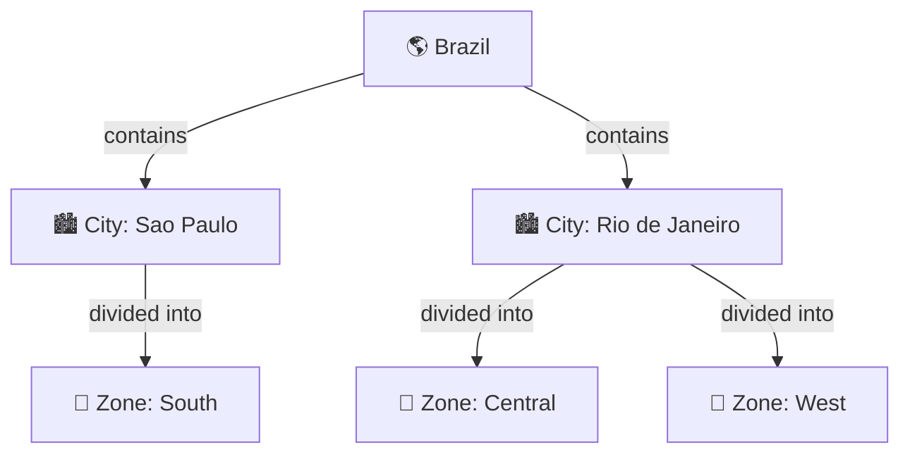
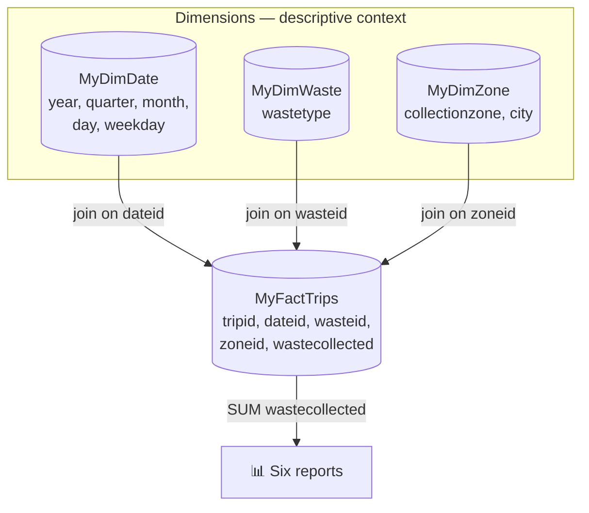
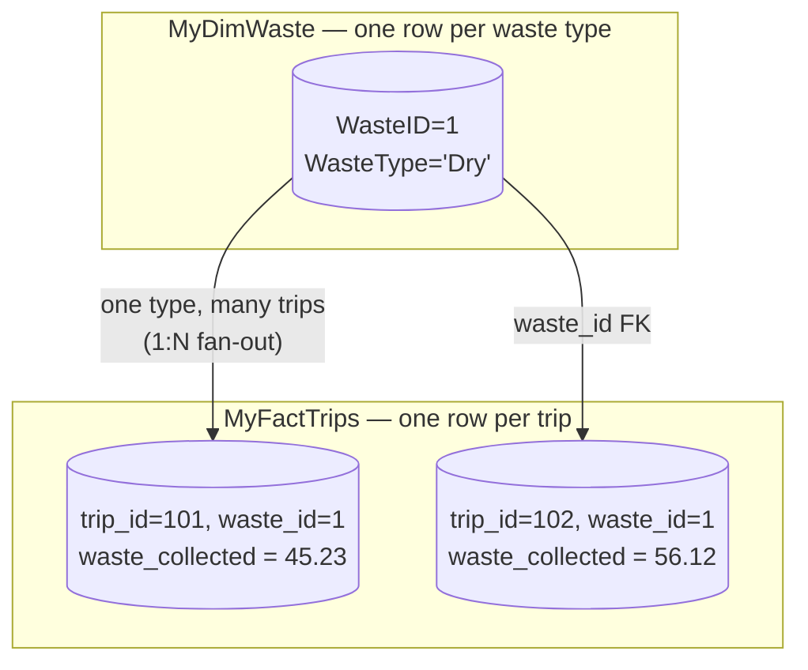

<mark>NEW</mark>

> **Course 9:** Data Warehouse Fundamentals
> **Module 3:** Final Assignment and Final Quiz

# Final Assignment: Data Warehouse Fundamentals


The logo for Skills Network, featuring a stylized purple circular icon with a network of nodes and lines, followed by the text "Skills Network" in a purple sans-serif font.

Skills Network logo

**Estimated time needed: 90 minutes**

This comprehensive lab is designed to provide hands-on experience in designing, implementing, and querying a data warehouse using PostgreSQL. It simulates a real-world scenario where you, as a data engineer, assist a waste management company in Brazil in managing and analyzing their solid waste collection data. The lab involves multiple stages, from designing and creating a star schema for the data warehouse, loading data, writing complex SQL queries for data aggregation, and creating materialized view for query optimization.

<mark style="background-color: rgba(200, 230, 201, 0.4);">This assignment is the capstone deliverable for the course. It is graded and the 16 tasks require screenshots that are uploaded for peer review. This document is the enriched handout of the official final assignment PDF; the raw Datalab conversion is preserved at `warehouse_final_project/final_project_raw.md` alongside the downloaded CSVs (`DimDate.csv`, `DimTruck.csv`, `DimStation.csv`, `FactTrips.csv`).</mark>

## What you'll learn:

The lab offers a multitude of learning benefits, particularly for those seeking to enhance their data engineering and business intelligence skills:

- **Practical experience in data warehouse design:** It provides hands-on experience in designing and implementing a star schema, which is crucial for any data warehousing project.
- **SQL Query writing skills:** Enhances your ability to write complex SQL queries, including grouping sets, rollups, and cubes, essential for data analysis and reporting.
- **Data loading and transformation:** Offers practice in data loading and transformation, an essential skill for managing data warehouses.
- **Real-world scenario applications:** The scenario-based approach of the lab ensures that the skills acquired are relevant and applicable in real-world data warehousing and business intelligence projects.
- **Career advancement:** These skills are in high demand in the fields of data engineering, business intelligence, and analytics, contributing significantly to professional growth and opportunities.

This lab serves as a comprehensive guide for anyone aiming to strengthen their expertise in data warehousing and business intelligence, providing practical skills that are directly applicable in professional environments.

<mark style="background-color: rgba(200, 230, 201, 0.4);">The star schema is a dimensional modeling pattern in which a central fact table is linked to surrounding dimension tables via primary/foreign key relationships. Kimball's dimensional modeling, formalized in *The Data Warehouse Toolkit*, organizes data into facts (measurements at a declared grain) and dimensions (descriptive context used for filtering and grouping) — precisely the structure this assignment asks you to build. [Source: https://www.kimballgroup.com/2003/01/fact-tables-and-dimension-tables/]</mark>

## About the SN Labs Cloud IDE

This Skills Network Labs Cloud IDE provides a hands-on environment for course and project-related labs. It utilizes Theia, an open-source IDE (Integrated Development Environment) platform that can run on a desktop or the cloud. To complete this lab, you will be using the Cloud IDE based on Theia and PostgreSQL.

<mark style="background-color: rgba(200, 230, 201, 0.4);">Theia is an extensible framework for building full-fledged multi-language cloud and desktop IDEs, developed under vendor-neutral Eclipse Foundation governance; it supports the VS Code extension protocol. [Source: https://github.com/eclipse-theia/theia/] Skills Network Labs provides the Cloud IDE as a web-based environment alongside other tools. [Source: https://skills.network/lab-tools/cloud-ide]</mark>

## Single Session Exercise

Please be aware that sessions for this lab environment are not persistent. A new environment is created for you every time you connect to this lab. Any data you may have saved in an earlier session will get lost. To avoid losing your data, please plan to complete these labs in a single session.

## Software used in the lab

In this lab, you will use PostgreSQL Database. PostgreSQL is a Relational Database Management System (RDBMS) designed to store, manipulate, and retrieve data efficiently.

<mark style="background-color: rgba(200, 230, 201, 0.4);">PostgreSQL is an open-source, standards-compliant object-relational database known for its reliability and extensibility. The exercise uses pgAdmin, PostgreSQL's graphical administration interface, to create tables and load CSVs via its Import/Export dialog (which issues a `COPY` command) or directly through the Query Tool. [Source: https://www.pgadmin.org/docs/pgadmin4/development/import_export_data.html]</mark>

## Scenario

You are a data engineer hired by a solid waste management company. It collects and recycles solid waste across major cities in the country of Brazil. They operate hundreds of trucks of different types to collect and transport solid waste. The company would like to create a data warehouse so that it can create reports like:

- Total waste collected per year per city
- Total waste collected per month per city
- Total waste collected per quarter per city
- Total waste collected per year per trucktype
- Total waste collected per trucktype per city
- Total waste collected per trucktype per station per city

You will use your data warehousing skills to design and implement a data warehouse for the company.

<mark style="background-color: rgba(200, 230, 201, 0.4);">The six required reports define the analysis dimensions of the star schema: time (year/month/quarter/day), city, station, and truck type. Reports that mix granularities are exactly what `GROUPING SETS`, `ROLLUP`, and `CUBE` were designed to answer in a single query pass. [Source: https://www.postgresql.org/docs/current/queries-table-expressions.html]</mark>

## Learning objectives

After completing this lab, you will be able to:

- Design a data warehouse.
- Load data into the data warehouse.
- Create a materialized view.

### Note: Screenshots

Throughout this lab, you will be prompted to take screenshots and save them on your own device. These screenshots will be uploaded for peer review in the next section of the course. You can use various free screengrabbing tools or your operating system's shortcut keys (**Alt+PrintScreen in Windows, Command+Shift+5 on Mac, Shift+Ctrl+Show windows on Chromebook**) to capture the required screenshots. The screenshots can be either jpg or png.

## About the data set

The data set you would be using in this assignment is not a real-life data set. It was programmatically created for this assignment purpose.

<mark style="background-color: rgba(200, 230, 201, 0.4);">The four CSVs for Exercise 3 were downloaded into `warehouse_final_project/` for reference. Their actual structures (column headers) are:</mark>

| CSV file | Columns |
|----------|---------|
| `DimDate.csv` | dateid, date, Year, Quarter, QuarterName, Month, Monthname, Day, Weekday, WeekdayName |
| `DimTruck.csv` | Truckid, TruckType |
| `DimStation.csv` | Stationid, City |
| `FactTrips.csv` | Tripid, Dateid, Stationid, Truckid, Wastecollected |

<mark style="background-color: rgba(200, 230, 201, 0.4);">Example rows: `DimTruck` contains trucks 115 (Volvo), 120 (Scania), 121 (Volvo), 122 (Scania), 125 (Volvo); `DimStation` contains stations 19 & 21 (Sao Paulo), 31 & 32 (Rio de Janeiro), 40 (Brasilia); `FactTrips` rows like `23475,1,71,133,33.36` record one trip per day per station per truck with the waste collected in tons. `DimDate` spans 2019 dates at day granularity.</mark>

## Prerequisites

You need to use PostgreSQL Database to proceed with the assignment.

This lab will guide you to understand how to create tables and load data in PostgreSQL using pgAdmin.

<mark style="background-color: rgba(200, 230, 201, 0.4);">For a local, Dockerized PostgreSQL + pgAdmin alternative (identical SQL), see the practice project's environment guide: [docker_containers_guide.md](../../../../../../general/lessons/docker_containers_guide.md).</mark>

## Exercise 1: Design a data warehouse

The solid waste management company has provided you the sample data they want to collect.

| Trip number | Waste Type | Waste Collected in tons | Collection Zone | City           | Date      |
|-------------|------------|-------------------------|-----------------|----------------|-----------|
| 1           | Dry        | 45.23                   | South           | Sao Paulo      | 23-Jan-20 |
| 2           | Wet        | 43.12                   | Central         | Rio de Janeiro | 24-Jan-20 |
| 3           | Electronic | 40.19                   | South           | Sao Paulo      | 23-Jan-20 |
| 4           | Plastic    | 34.87                   | West            | Rio de Janeiro | 24-Jan-20 |
| 5           | Wet        | 45.34                   | West            | Rio de Janeiro | 23-Jan-20 |

You will start your project by designing a Star Schema warehouse by identifying the columns for the various dimensions and fact tables in the schema.

<mark style="background-color: rgba(200, 230, 201, 0.4);">The sample table reveals the natural dimensions: Waste Type and Collection Zone (each becomes a dimension table `MyDimWaste` and `MyDimZone`), City and Date (handled inside the date dimension), while the numeric measure "Waste Collected in tons" becomes the fact. Per Kimball, the first and most important design step is declaring the fact-table grain — here, one row per collection trip. [Source: https://www.kimballgroup.com/2008/11/fact-tables/]</mark>

### Task 1: Design the dimension table MyDimDate

Write down the fields in the MyDimDate table in any text editor, one field per line. The company is looking at a granularity of day, which means they would like to have the ability to generate the report on a yearly, monthly, daily, and weekday basis.

Here is a partial list of fields to serve as an example:

dateid

month

monthname

...

...

Take a screenshot of the fieldnames for the table MyDimDate.

Name the screenshot 1-MyDimDate.jpg. (Images can be saved with either the .jpg or .png extension.)

<mark style="background-color: rgba(200, 230, 201, 0.4);">Day granularity means the fact table stores one row per trip per day, and the date dimension must expose year, quarter, month, day, and weekday attributes so the higher-level reports are produced by aggregation. Kimball's Rule #3 requires every fact table to have an associated date dimension whose grain is a single day. [Source: https://www.kimballgroup.com/2009/05/the-10-essential-rules-of-dimensional-modeling/]</mark>

### **Task 2: Design the dimension table MyDimWaste**

Write down the fields in the MyDimWaste table in any text editor, one field per line.

Take a screenshot of the fieldnames for the table MyDimWaste.

Name the screenshot 2-MyDimWaste.jpg. (Images can be saved with either the .jpg or .png extension.)

<mark style="background-color: rgba(200, 230, 201, 0.4);">The waste-type dimension reflects the sample data's "Waste Type" column (Dry, Wet, Electronic, Plastic). A minimal design is `WasteID` (primary key) + `WasteType` (varchar).</mark>

### **Task 3: Design the dimension table MyDimZone**

Write down the fields in the MyDimZone table in any text editor, one field per line.

Take a screenshot of the fieldnames for the table MyDimZone.

Name the screenshot 3-MyDimZone.jpg. (Images can be saved with either the .jpg or .png extension.)

<mark style="background-color: rgba(200, 230, 201, 0.4);">The collection-zone dimension reflects the sample data's "Collection Zone" and "City" columns. A minimal design is `ZoneID` (primary key) + `CollectionZone` (varchar) + `City` (varchar) — this supplies the city attribute used by the "per city" reports.</mark>

<mark style="background-color: rgba(200, 230, 201, 0.4);">**Validation of the proposed schema `(zone_id, collection_zone_name, city)`.** This is a good minimal design — it matches the reference `MyDimZone` one-to-one: `zone_id` is the surrogate key, `collection_zone_name` is the descriptive attribute, and `city` is the parent attribute that enables the per-city reports. The only difference is naming. PostgreSQL folds unquoted identifiers to lowercase, and lowercase snake_case (underscores) is the recommended convention, so `zone_id` / `collection_zone_name` are arguably better PostgreSQL practice than the reference's `zoneid` / `collectionzone`. [Source: https://www.bytebase.com/blog/postgres-case-sensitivity/]</mark>

<mark style="background-color: rgba(200, 230, 201, 0.4);">Two consistency rules keep this schema "good enough": (1) use the exact same column names in Task 7's `CREATE TABLE MyDimZone` — whatever you write here must match the table you actually create; (2) add nothing else — measures, dates, and waste types belong in other tables. For grading, Task 3 asks only for the field names, so three columns fully satisfy it.</mark>

<mark style="background-color: rgba(200, 230, 201, 0.4);">**What is a "collection zone"?** A collection zone is a named geographic area within a city that the waste management company treats as an operating unit for collection. Instead of sending trucks to random addresses across an entire city, the company divides each city into zones and plans collection routes inside them — each zone gets its own routes, trucks, and supervision. This is standard municipal waste-management practice: cities are split into districts/zones so trucks service the residential locations of "a single district on a single day." [Source: https://doc.esri.com/en/arcgis-pro/latest/help/analysis/networks/waste-collection.html]</mark>

<mark style="background-color: rgba(200, 230, 201, 0.4);">This is not a made-up concept — Sao Paulo, the largest city in the sample, is really divided into 32 boroughs, further into 96 districts (distritos), and its subprefectures are officially grouped into nine zones named Central, Northwest, Northeast, East 1, East 2, Southeast, South, South-Central, and West. The sample data's "South", "Central", and "West" zone names mirror these real administrative zones. [Source: https://en.wikipedia.org/wiki/Subdivisions_of_S%C3%A3o_Paulo]</mark>

<mark style="background-color: rgba(200, 230, 201, 0.4);">**How a zone relates to a city.** It is a containment hierarchy — like Country → State → City: one city contains many zones, and each zone belongs to exactly one city (one-to-many). A zone is simply a city "cut into pieces" for operational reporting. The company records the zone because it gives an analysis level between "whole city" and "individual trip" — it can see that the South zone of Sao Paulo collects more waste than its other zones and redeploy trucks accordingly.</mark>

<mark style="background-color: rgba(200, 230, 201, 0.4);">**Why zone and city are grouped in the same table.** Three reasons. First, zone names are not unique — a "West" zone could exist in Sao Paulo and another in Rio de Janeiro, so a zone name is meaningless without its city to qualify it; the pair (city, zone) is what identifies a place. Second, because each zone belongs to exactly one city, the city is simply a parent attribute of the zone, so a city-level report is a pure rollup of that one column. Third, a star schema keeps all descriptive geography in one flat, denormalized table so per-city queries need a single join instead of a join chain — separating city into its own table (a snowflake) adds complexity with no benefit at this scale.</mark>

<mark style="background-color: rgba(200, 230, 201, 0.4);">The geographic hierarchy, mapped to dimension rows:</mark>



> If the Mermaid diagram above does not render, here is the ASCII fallback:

```
Brazil
 ├── City: Sao Paulo
 │    └── Zone: South      → one MyDimZone row (zoneid, 'South',  'Sao Paulo')
 └── City: Rio de Janeiro
      ├── Zone: Central    → one MyDimZone row (zoneid, 'Central','Rio de Janeiro')
      └── Zone: West       → one MyDimZone row (zoneid, 'West',   'Rio de Janeiro')
```

<mark style="background-color: rgba(200, 230, 201, 0.4);">Key insight: each leaf zone is one row of `MyDimZone` — that is the dimension's grain — and the city is stored as a parent attribute on that same row. If the company later opened a "West" zone in Sao Paulo too, it would be a new row with a new `ZoneID`; the city column is what tells the two "West"s apart. [ENRICHED: diagrams — Mermaid + ASCII hierarchy diagram for city → zone created]</mark>

<mark style="background-color: rgba(200, 230, 201, 0.4);">**Why the zone dimension looks like this — design rationale.** The zone dimension's grain is one row per distinct collection zone. From the sample data the zones are South (Sao Paulo), Central (Rio de Janeiro), and West (Rio de Janeiro) — each zone belongs to exactly one city, so the city is an attribute of the zone rather than a separate dimension.</mark>

<mark style="background-color: rgba(200, 230, 201, 0.4);">**1. `ZoneID` is a surrogate key — deliberately not the zone name.** Kimball's dimensional modeling rules require every dimension to use an anonymous, integer surrogate primary key instead of the operational system's natural key. The reasons: the warehouse must own its dimension primary keys, natural keys can be reused or reformatted across source systems, and a small integer keeps the fact table thinner and joins faster. The date dimension is the only exemption from the surrogate-key rule. [Source: https://www.kimballgroup.com/data-warehouse-business-intelligence-resources/kimball-techniques/dimensional-modeling-techniques/dimension-surrogate-key/]</mark>

<mark style="background-color: rgba(200, 230, 201, 0.4);">**2. `CollectionZone` is the descriptive attribute.** Dimension attributes are the text values used to filter and group ("slice and dice") in analytic queries, not values that are aggregated themselves — the zone reports group by this column. [Source: https://github.com/MicrosoftDocs/fabric-docs/blob/main/docs/data-warehouse/dimensional-modeling-dimension-tables.md]</mark>

<mark style="background-color: rgba(200, 230, 201, 0.4);">**3. `City` lives in this table on purpose — this is a star, not a snowflake.** A star schema keeps each dimension as a single denormalized table so every attribute is one hop (one join) from the fact table. Splitting city into its own `DimCity` table would snowflake the model: it removes some redundant values but adds a join and more complex SQL for every query. Because each zone maps to exactly one city in the sample data, the "total waste per city" reports are answered by grouping on this single column. Snowflaking pays off only for deep, frequently changing hierarchies; geography at this scale stays flat. [Source: https://www.datacamp.com/blog/star-schema-vs-snowflake-schema]</mark>

<mark style="background-color: rgba(200, 230, 201, 0.4);">**4. What the dimension deliberately excludes.** No measures (the tons of waste belong in the fact table), no date attributes (the date dimension), no waste type (the waste dimension). Each dimension carries only the descriptive context needed to filter and group its own slice of the six reports.</mark>

<mark style="background-color: rgba(200, 230, 201, 0.4);">**Optional extensions** (not required by the assignment — ideas only):</mark>

| Idea | Column | Why |
|------|--------|-----|
| Brazilian state (UF) | `State VARCHAR(20)` | Brazil is divided into 26 states plus the Federal District; Sao Paulo = SP, Rio de Janeiro = RJ, Brasilia = DF (Distrito Federal). A state column enables regional rollups above the city level. |
| Region | `Region VARCHAR(20)` | Brazil's states group into five regions (Southeast, etc.) — a state column plus a region column would support a third rollup level. |
| Rename tolerance | keep `ZoneID` stable | If "West" is renamed to "West Zone", only the dimension row changes; fact rows still reference the same `ZoneID` — this is exactly the protection a surrogate key provides. |

<mark style="background-color: rgba(200, 230, 201, 0.4);">The extensions above are optional — the assignment's minimal schema (`ZoneID`, `CollectionZone`, `City`) already satisfies every required report. Notice how the same flat-geography pattern reappears after the schema pivot: in Exercise 3, `DimStation (stationid, city)` carries the city attribute that answers the per-city reports.</mark>

### **Task 4: Design the fact table MyFactTrips**

Write down the fields in the MyFactTrips table in any text editor, one field per line.

Take a screenshot of the fieldnames for the table MyFactTrips.

Name the screenshot 4-MyFactTrips.jpg. (Images can be saved with either the .jpg or .png extension.)

<mark style="background-color: rgba(200, 230, 201, 0.4);">**First, a terminology correction: `MyFactTrips` is the FACT table, not a dimension.** The star schema has three dimensions (date, waste, zone) and exactly one fact table. The classic mental model: facts are "the verbs" — the measurements of what happened — while dimensions are "the nouns" — the descriptive context you slice and group by. [Source: https://moderndataengineering.dev/glossary/dimension-facts] In this project, "the trip" is the event being measured; the date, the waste type, and the zone are the three things that describe it. A fact table contains the numeric measures produced by an operational measurement event, and at the lowest grain a fact table row corresponds to a measurement event. [Source: https://www.kimballgroup.com/data-warehouse-business-intelligence-resources/kimball-techniques/dimensional-modeling-techniques/fact-table-structure/]</mark>

<mark style="background-color: rgba(200, 230, 201, 0.4);">**What goes in it — only three kinds of columns.** In addition to numeric measures, a fact table always contains foreign keys for each of its associated dimensions, as well as optional degenerate dimension keys. [Source: https://www.kimballgroup.com/data-warehouse-business-intelligence-resources/kimball-techniques/dimensional-modeling-techniques/fact-table-structure/] Applied here: `DateID`, `WasteID`, `ZoneID` are the foreign keys that connect each trip to its "when / what / where"; `WasteCollected` is the numeric, additive measure (tons); and `TripID` is a degenerate dimension.</mark>

<mark style="background-color: rgba(200, 230, 201, 0.4);">**`TripID` is a "degenerate dimension" — this is the concept you were reaching for.** Sometimes a dimension is defined that has no content except for its primary key; this degenerate dimension is placed in the fact table with the explicit acknowledgment that there is no associated dimension table. Degenerate dimensions are most common with transaction and accumulating snapshot fact tables — order numbers and invoice numbers are the classic examples. [Source: https://www.kimballgroup.com/data-warehouse-business-intelligence-resources/kimball-techniques/dimensional-modeling-techniques/degenerate-dimension/] A separate `DimTrip` table would contain nothing but the trip number — a table with a single column and no descriptive attributes — so instead `TripID` lives inside `MyFactTrips`, where it also serves as the fact table's primary key (grain: one row per trip).</mark>

<mark style="background-color: rgba(200, 230, 201, 0.4);">**Why the fact table must exist as its own table.** It records measurement events: every collection trip inserts one row, so `MyFactTrips` is the only table that grows continuously with operations (a "transaction-grain" fact). All six required reports work the same way — JOIN the fact to the dimension(s) you want to slice or group by, then aggregate the measure — so without a fact table there is nothing to SUM. Keeping facts and dimensions separate also avoids redundancy: in one flat table, every trip row would repeat the zone name, city, waste type, and all date attributes for a single pickup. Dimensions stay small and stable; the fact stays numeric and compact.</mark>

<mark style="background-color: rgba(200, 230, 201, 0.4);">**Concrete example — one row of `MyFactTrips`:** `(TripID=101, DateID=1, WasteID=1, ZoneID=1, WasteCollected=45.23)`. Reading it against the sample data (Dry = WasteID 1, South / Sao Paulo = ZoneID 1, 23-Jan-20 = DateID 1): trip 101, on 23-Jan-20, collected 45.23 tons of Dry waste in the South zone of Sao Paulo. The raw IDs are meaningless until you JOIN to the dimensions, which is exactly what the report queries do:</mark>

```sql
SELECT z.city, SUM(f.wastecollected) AS total_waste_tons
FROM MyFactTrips f
JOIN MyDimZone z ON f.zoneid = z.zoneid
GROUP BY z.city;
```

<mark style="background-color: rgba(200, 230, 201, 0.4);">Line-by-line: `SELECT z.city, SUM(f.wastecollected)` picks the grouping attribute from the dimension and sums the additive measure from the fact; `FROM MyFactTrips f` starts at the fact table because that is where the numbers live; `JOIN MyDimZone z ON f.zoneid = z.zoneid` resolves the fact's foreign key into a readable city name; `GROUP BY z.city` produces one row per city. This is the pattern behind every report — the dimension supplies the labels, the fact supplies the numbers. `WasteCollected` is fully additive, meaning it can be summed across any of the dimensions associated with the fact table. [Source: https://www.kimballgroup.com/data-warehouse-business-intelligence-resources/kimball-techniques/dimensional-modeling-techniques/additive-semi-additive-non-additive-fact/]</mark>



> If the Mermaid diagram above does not render, here is the ASCII fallback:

```
  Dimensions (context)              Fact (the event)                  Reports
  ┌────────────────┐  dateid   ┌────────────────────────────┐  ┌────────────────┐
  │ MyDimDate      │ ────────► │ MyFactTrips                │──►│ GROUP BY date /│
  │ year, quarter, │           │ tripid (degenerate dim)    │  │ waste / zone,  │
  │ month, day,    │           │ dateid, wasteid, zoneid    │  │ SUM(waste-     │
  │ weekday        │           │ (FKs to dimensions)        │  │ collected)     │
  └────────────────┘           │ wastecollected (NUMERIC)   │  └────────────────┘
  ┌────────────────┐  wasteid  └────────────────────────────┘
  │ MyDimWaste     │ ────────►
  │ wastetype      │
  └────────────────┘
  ┌────────────────┐  zoneid
  │ MyDimZone      │ ────────►
  │ zone, city     │
  └────────────────┘
```

<mark style="background-color: rgba(200, 230, 201, 0.4);">**Key insight:** dimensions are small and stable and hold the readable labels; the fact table grows one row per trip and holds only foreign keys plus the measure. Every report is a join outward from the fact plus an aggregate — and `TripID` is a degenerate dimension that has no table of its own.</mark>

<mark style="background-color: rgba(200, 230, 201, 0.4);">A transaction-grain fact table carries foreign keys to every dimension (`DateID`, `WasteID`, `ZoneID`) plus the numeric, additive measure `WasteCollected` (tons). This matches Kimball's fact-table structure: numeric measures produced by a measurement event plus foreign keys to associated dimensions. [Source: https://www.kimballgroup.com/wp-content/uploads/2013/08/2013.09-Kimball-Dimensional-Modeling-Techniques11.pdf]</mark>

<mark style="background-color: rgba(200, 230, 201, 0.4);">**Review of your proposed fact schema (`trip_id`, `waste_id`, `zone_id`, `date_id`): correct skeleton — but it is missing the measure, which makes it a *factless fact table* rather than the fact table this assignment requires.** All four columns match the reference exactly: `trip_id` is the degenerate-dimension key (and primary key, grain = one row per trip), and `waste_id`, `zone_id`, `date_id` are the foreign keys to the three dimensions. In other words, the FK "dimensionality" of your design is 100% right. [Source: https://learn.microsoft.com/en-us/fabric/data-warehouse/dimensional-modeling-fact-tables]</mark>

<mark style="background-color: rgba(200, 230, 201, 0.4);">**The problem: a fact table's defining content is its numeric measures.** Fact tables include measures — typically numeric columns like sales order quantity — and dimension keys that determine the dimensionality of the facts. When a fact table doesn't contain any measure columns, it's called a *factless fact table*: it records only that an event occurred (e.g., students attending class), and the only analytics it supports is counting fact rows. [Source: https://learn.microsoft.com/en-us/fabric/data-warehouse/dimensional-modeling-fact-tables] Applied here, your four-column table could answer "how many trips happened" (COUNT), but NOT any of the six required reports — they all ask "how many TONS," which requires SUM of a numeric column that does not exist.</mark>

<mark style="background-color: rgba(200, 230, 201, 0.4);">**The fix is one line: add `wastecollected NUMERIC(10,2)`.** That single additive measure turns the junction-table skeleton into a real transaction-grain fact table. Factless fact tables are a legitimate pattern in general — a junction table that records only that a relationship exists, with no measures, is called a factless fact table in dimensional modeling [Source: https://datadriven.io/learn/data_modeling_relationships] — but here the business questions require summing tons, so the measure is mandatory.</mark>

| Your proposed column | Reference column | Verdict |
|---|---|---|
| `trip_id` | `tripid` (PK, degenerate dimension) | Correct — grain key, no own dimension table |
| `waste_id` | `wasteid` (FK → MyDimWaste) | Correct |
| `zone_id` | `zoneid` (FK → MyDimZone) | Correct |
| `date_id` | `dateid` (FK → MyDimDate) | Correct |
| *(missing)* | `wastecollected NUMERIC(10,2)` | MISSING — the measure; without it the table is factless (see update below) |

<mark style="background-color: rgba(200, 230, 201, 0.4);">**Update — corrected schema (`trip_id`, `waste_collected_in_tons`, `waste_id`, `zone_id`, `date_id`): this IS a good fact table schema — now complete and valid.** Adding `waste_collected_in_tons` resolves the factless-fact-table issue: the table now has the degenerate-dimension key (`trip_id`), all three dimension foreign keys, and the additive numeric measure. It is functionally identical to the reference `MyFactTrips (tripid, dateid, wasteid, zoneid, wastecollected)`, so all six required reports can be answered.</mark>

<mark style="background-color: rgba(200, 230, 201, 0.4);">**On the measure name:** `waste_collected_in_tons` is arguably *better* than the reference's `wastecollected`, because it embeds the unit of measure directly in the column name — "contextualizing" the column so its meaning is unambiguous outside the table's context, which is a recognized data-warehouse naming best practice. [Source: https://blog.panoply.io/data-warehouse-naming-conventions] Two caveats: (1) if you want your submission to mirror the reference column-for-column, name it `wastecollected` instead — the grader checks that the field exists, so either name works; (2) because the unit is baked into the name, recording waste in a different unit (e.g., kg) later would require a new column rather than a reinterpretation of this one. Keep the type `NUMERIC(10,2)` — 10 digits total, 2 decimal places — which comfortably holds the sample values (45.23, 100.87, 33.36).</mark>

<mark style="background-color: rgba(200, 230, 201, 0.4);">**Optional hardening (not required by the assignment):** declare each FK with a `REFERENCES` constraint so PostgreSQL enforces referential integrity (a trip must point to an existing date/waste/zone), and add an index on each FK column so the star-schema joins stay fast as the fact grows. Fact tables are narrower than dimension tables (fewer columns) but can grow to billions of rows, so the join keys should be indexed. [Source: https://learn.microsoft.com/en-us/fabric/data-warehouse/dimensional-modeling-fact-tables]</mark>

<mark style="background-color: rgba(200, 230, 201, 0.4);">**Q&A — "What if I moved `waste_collected_in_tons` into the waste dimension instead?"** Short answer: **no — it would not make anything better; it would break the model, and the reason is grain.** Declare the grain first; then determine which measures are valid *at that grain*. [Source: https://moderndataengineering.dev/docs/modeling-warehousing/dimensional-modeling]</mark>

<mark style="background-color: rgba(200, 230, 201, 0.4);">**The grain argument is decisive.** The grain of `MyDimWaste` is *one row per waste type* — the whole table has four rows (Dry, Wet, Electronic, Plastic). The grain of `waste_collected_in_tons` is *one row per trip*. Dry waste alone was collected 45.23 tons on one trip and 56.12 tons on another — a single dimension row can hold only ONE value per column, so where would both numbers go? The measure's natural grain matches the fact table's grain, so the fact table is where it must live. Forcing it into the dimension either loses data (keep one tonnage, drop the rest) or degenerates into a comma-separated list, which is a known anti-pattern.</mark>

<mark style="background-color: rgba(200, 230, 201, 0.4);">**It would also revert the fact table to a factless fact table.** If the measure moved out, `MyFactTrips` would again hold only foreign keys — the factless pattern discussed above — so the six reports could COUNT trips but never SUM tons. Every report query works the same way: JOIN the fact to a dimension, GROUP BY a dimension attribute, SUM the measure. The dimension supplies the labels; the fact supplies the numbers.</mark>

<mark style="background-color: rgba(200, 230, 201, 0.4);">**The general rule (Kimball's facts-vs-dimensions split):** business *events* belong in fact tables; business *entities* and their descriptive context belong in dimension tables. [Source: https://www.nickseal.com/articles/fact-tables-vs-dimension-tables] Facts are what you SUM; dimensions are what you filter and GROUP BY. Keep the fact table focused on measurements — descriptive attributes belong in dimension tables, not the fact. [Source: https://database.guide/what-is-a-fact-table]</mark>

<mark style="background-color: rgba(200, 230, 201, 0.4);">**The crisp test to remember: "Does this value change from trip to trip for the same waste type?"** Yes → it is a measured event quantity and belongs in the fact table. No → it is a constant descriptive property of the waste type and belongs in the dimension. Numerics that pass the "no" test — a disposal fee per ton, a recyclability score, a density — are legitimate dimension attributes. A per-ton disposal fee could even be multiplied against the fact's tonnage to derive a per-trip cost: `fee_per_ton × waste_collected_in_tons`.</mark>

| Value | Varies per trip? | Belongs in | Why |
|---|---|---|---|
| `WasteType` ("Dry", "Wet", ...) | No | `MyDimWaste` | Descriptive label for filtering/grouping |
| `WasteCollected` (tons) | Yes | `MyFactTrips` | The measured event quantity |
| Disposal fee per ton (optional) | No | `MyDimWaste` | Constant per type; enables `fee × tons` cost per trip |
| Recyclability score (optional) | No | `MyDimWaste` | Constant per type |



> If the Mermaid diagram above does not render, here is the ASCII fallback:

```
 MyDimWaste (1 row per type)      MyFactTrips (1 row per trip)
 ┌───────────────────────────┐  ┌────────────────────────────────┐
 │ WasteID=1, 'Dry'          │─►│ trip_id=101, waste_id=1, 45.23 │
 └───────────────────────────┘  ├────────────────────────────────┤
        waste_id FK (1:many)    │ trip_id=102, waste_id=1, 56.12 │
                                └────────────────────────────────┘
 The single 'Dry' row cannot hold both 45.23 and 56.12 tons
 → the value is per-trip, so it lives in the fact table.
```

<mark style="background-color: rgba(200, 230, 201, 0.4);">**Key insight:** one waste-type row fans out to many trip rows, and each trip carries its own tonnage. The value changes per event, so it is a fact measure — moving it to the dimension would break the star schema and every report.</mark>

<mark style="background-color: rgba(200, 230, 201, 0.4);">**Q&A — "So the measure isn't waste-dimension-exclusive; it relates to ALL the dimensions, and locking it into one dimension would corrupt the system?"** Exactly — you've got the picture right, with one precision that makes it click: the measure is stored **once, on the trip event row**, and because the fact table sits at the **center** of the star, that single value is reachable and sliceable through *every* dimension at once. A star schema has a single fact table in the center; the fact table connects to multiple dimension tables along "dimensions" like time or product, enabling users to slice and dice the data however they see fit. [Source: https://www.databricks.com/blog/what-is-star-schema]</mark>

<mark style="background-color: rgba(200, 230, 201, 0.4);">**The "multiple lenses" framing:** the dimension-to-fact relationship enables slicing and analyzing a single fact table through multiple lenses *simultaneously* — by joining different dimension tables, you can break down the same metric by time, product, store, or customer, all from one schema. [Source: https://www.simplilearn.com/fact-table-vs-dimension-table-article] Applied here, one `waste_collected_in_tons` value answers all of: "tons per city" (join through `zone_id`), "tons per waste type" (join through `waste_id`), AND "tons per month" (join through `date_id`) — three different lenses, same single stored number. That is exactly why the measure is the property of the *event at the intersection of all dimensions*, not the exclusive property of any one dimension.</mark>

<mark style="background-color: rgba(200, 230, 201, 0.4);">**Why locking it into one dimension corrupts the system:** the moment the tonnage lives only on waste-type rows, the other two lenses lose access to it. "Total tons per city" needs to sum the trip-level tonnages of every trip in a city regardless of waste type — but a per-city aggregation has no path to a number trapped inside `MyDimWaste`. The sums that remain are wrong or meaningless, exactly as you suspected. **Ownership: none of the dimensions. Shared access: all of them. Storage: once, on the trip row.**</mark>

## **Exercise 2 - Create schema for data warehouse on PostgreSQL**

In this exercise, you will create the tables you have designed in the previous exercise. Open pgAdmin and create a database named **Project**, then create the following tables.

### **Task 5: Create the dimension table MyDimDate**

Create the MyDimDate table.

Take a screenshot of the SQL statement you used to create the table MyDimDate.

Name the screenshot 5-MyDimDate.jpg. (Images can be saved with either the .jpg or .png extension.)

<mark style="background-color: rgba(200, 230, 201, 0.4);">Reference SQL for `MyDimDate` (day granularity):</mark>

```sql
CREATE TABLE MyDimDate (
    dateid      INT PRIMARY KEY,
    date        DATE NOT NULL,
    year        INT,
    quarter     INT,
    month       INT,
    monthname   VARCHAR(20),
    day         INT,
    weekday     INT,
    weekdayname VARCHAR(20)
);
```

**Line-by-line breakdown:**
- Line 1: `CREATE TABLE MyDimDate (` — starts table creation, naming the date dimension.
- Line 2: `dateid INT PRIMARY KEY` — surrogate key uniquely identifying each day; the fact table's `DateID` foreign key points here.
- Line 3: `date DATE NOT NULL` — the actual calendar date, required for every row.
- Lines 4–7: `year`, `quarter`, `month`, `monthname` — calendar attributes enabling the yearly/quarterly/monthly reports.
- Line 8: `day` — day-of-month attribute for the daily report.
- Lines 9–10: `weekday`, `weekdayname` — weekday attributes for the weekday report.
- Line 11: `);` — closes the column list.

<mark style="background-color: rgba(200, 230, 201, 0.4);">**Quick reminder — the datatype is called `DATE`.** In the reference SQL the column is declared `date DATE NOT NULL`: `date` is the *column name*, `DATE` is the *data type*. PostgreSQL's `date` type stores a calendar date only (no time of day), uses 4 bytes, has resolution 1 day, and supports values from 4713 BC to 5874897 AD [Source: https://www.postgresql.org/docs/current/datatype-datetime.html]. It is the SQL-standard type — the same name is used in SQL Server (`DATE`, 3 bytes), MySQL (`DATE`, 3 bytes), and Oracle (`DATE`, 7 bytes, which also carries time). Don't confuse it with `TIMESTAMP` (date + time, 8 bytes) or the column-name/type-name mirror: `date` the column holds a `DATE` type value.</mark>

<mark style="background-color: rgba(200, 230, 201, 0.4);">**Q&A — "Would naming my `date` column conflict with pgAdmin's datatype detection and cause issues?"**

Short answer: **no — and the fear points at the wrong place.** pgAdmin does not "detect" a datatype from a column name, and `DATE` is not a reserved word in PostgreSQL. Neither the tool nor the engine will be confused, for two separate reasons:</mark>

<mark style="background-color: rgba(200, 230, 201, 0.4);">**Reason 1 — pgAdmin reads the type from the catalog, not from the name.** In PostgreSQL, every column has two independent facts stored in the `pg_attribute` catalog: the *name* (`attname`) and the *type* (a separate OID, `atttypid`, that points into the `pg_type` catalog). They are stored in different columns of the catalog and never inferred from one another [Source: https://www.postgresql.org/docs/current/catalog-pg-attribute.html]. pgAdmin's column dialog mirrors this separation — a *Name* field and a separate *Data Type* drop-down [Source: https://www.pgadmin.org/docs/pgadmin4/latest/column_dialog.html]. The tree control displays `date` and its type side by side as two distinct pieces of metadata. Naming a column `date` cannot shift its type, because the name and the type are not linked anywhere.</mark>

<mark style="background-color: rgba(200, 230, 201, 0.4);">**Reason 2 — `DATE` is a non-reserved keyword in PostgreSQL.** PostgreSQL classifies keywords into reserved and non-reserved. A non-reserved keyword "can still be used as a column or table name in most positions, because the parser can tell from context which one you mean" — `DATE` is in this category, along with `VALUE` [Source: https://www.sqlfmt.app/blog/sql-reserved-words]. In the official SQL Keyword appendix, `DATE` is listed as non-reserved for PostgreSQL (unlike, say, `GROUP`, `USER`, or `ORDER`, which must be quoted) [Source: https://www.postgresql.org/docs/current/sql-keywords-appendix.html]. So `CREATE TABLE MyDimDate (date DATE ...)` parses fine, and `SELECT date FROM MyDimDate` resolves `date` as the column without any quoting.

**The only real "conflict" is in a human reader's head, not in the tool.** When you read `date DATE`, your eye briefly parses `date` as the type. The engine and pgAdmin have no such ambiguity — context resolves it. If a team finds this genuinely confusing, the industry remedy is a more descriptive column name like `full_date` or `calendar_date` (the Kimball convention), which is *a readability choice, not a technical necessity*. For this assignment, keep `date` — the reference SQL and the `DimDate.csv` header both use it, so matching them is the correct, grader-safe choice.</mark>

<mark style="background-color: rgba(200, 230, 201, 0.4);">**Q&A — "pgAdmin colors my `year` column purple, just like the SQL function `year`. Is there a workaround?"**

**First, the reassuring part: it is 100% cosmetic.** The purple color is pgAdmin's syntax highlighter (CodeMirror) tokenizing `year` as a keyword because `YEAR` appears in the SQL keyword list. In PostgreSQL's official SQL Keywords appendix, `YEAR` is classified **"non-reserved, requires `AS`"** — it is *not* a reserved word, so it is a completely legal, unquoted column name. `CREATE TABLE MyDimDate (year INT ...)` runs fine, and the column executes identically whether the editor paints it purple or blue. The color changes nothing about how the server parses or runs your SQL — `YEAR` is "non-reserved" meaning it is "explicitly known to the parser but allowed as column or table names" [Source: https://www.postgresql.org/docs/current/sql-keywords-appendix.html].

The purple-vs-blue split is just pgAdmin's fixed token→color map: the Standard theme colors `keyword` tokens `#990088` (that purple), while ordinary identifier text uses a blue tone (`#0055AA`) [Source: https://www.pgadmin.org/styleguide/themes/color_palettes]. pgAdmin 4 exposes **no per-token color customization** — a GitHub issue requesting keyword-color changes was closed *not_planned*, with the maintainers stating "Customization after installation is not possible. pgAdmin 4 already has 3 different themes you can either use any of them" [Source: https://github.com/pgadmin-org/pgadmin4/issues/8363].

**Workarounds, least to most invasive:**

| # | Workaround | Effect | Caveat |
|---|---|---|---|
| 1 | **Do nothing** — recommended | Zero impact | The color is cosmetic; your query and the grader's checks behave identically |
| 2 | **Switch theme** — File → Preferences → Miscellaneous → Themes (Standard / Dark / High Contrast) | Repaints every editor color | Keyword stays a distinct color; only the palette changes |
| 3 | **Plain text mode** — File → Preferences → SQL Editor → Editor → set *Plain text mode* to True | "The editor mode will be changed to text/plain. Keyword highlighting and code folding will be disabled" | Kills ALL highlighting, not just `year`; also improves performance on large files |
| 4 | **Quote the identifier** — `"year"` | Delimited identifier "is always an identifier, never a key word", so it is no longer tokenized as a keyword | Must be quoted consistently in every statement; quoted identifiers are case-sensitive, so `"year"` must be written exactly as stored |

Options 2 and 3 are documented in pgAdmin's official Preferences dialog docs [Source: https://www.pgadmin.org/docs/pgadmin4/8.14/preferences.html]. Option 4 is grounded in PostgreSQL's lexical rules for delimited identifiers [Source: https://www.postgresql.org/docs/current/sql-syntax-lexical.html].

**Bottom line:** the purple is a false alarm — `year` is a legitimate column and the cleanest workaround is to ignore the color. If it genuinely distracts you, *Plain text mode* is the one built-in switch that actually stops the highlighting; quoting `"year"` works but adds noise for no functional gain, and for this assignment the reference SQL and the `DimDate.csv` header both use unquoted `year`.</mark>

<mark style="background-color: rgba(200, 230, 201, 0.4);">**Q&A — "For the rest of the features in the date dimension, do you recommend `INT`?"**

**Yes for the numeric attributes — but with a precise split.** The date dimension's attributes fall into three type families, and "int" is only right for one of them:

| Attribute | Type | Why |
|---|---|---|
| `year`, `quarter`, `month`, `day`, `weekday` | `INT` | Numeric calendar values — grouped, filtered, and sorted. Integers are the standard, and the reference SQL uses `INT` for exactly these |
| `monthname`, `weekdayname` | `VARCHAR(20)` | Human-readable labels ("March", "Friday") — text, not numbers |
| `date` | `DATE` | The actual calendar date — a real date type, as discussed |

The standard Kimball date dimension confirms this split: `year`, `quarter`, `month`, `week_of_year`, `day_of_month`, `day_of_week` are all `INTEGER`; `month_name` and `day_name` are `VARCHAR` [Source: https://dimbuilder.com/blog/date-dimension-guide]. Kimball Group's own Design Tip #51 describes the dimension's attributes as including "month name and year" plus navigational attributes, all precomputed so applications "implement all date navigation by using the dimensional attributes" instead of recomputing them in SQL [Source: https://www.kimballgroup.com/2004/02/design-tip-51-latest-thinking-on-time-dimension-tables/].

**Should you use `SMALLINT` for the tiny ones instead?** The technically tighter fit — `quarter` (1–4), `month` (1–12), `day` (1–31), `weekday` (1–7) all fit in 2-byte `SMALLINT` at a fraction of the cost — was discussed earlier in this file: those columns are exactly the "legitimate home" for `SMALLINT` in this project, because the values are tiny and bounded. But this is a ~365-row dimension: the bytes saved are a rounding error, and deviating from the reference SQL's `INT` creates an avoidable mismatch with the reference schema and the grader's expectations. **Recommendation: use `INT` to match the reference — `SMALLINT` is defensible if you want to demonstrate the reasoning, but it adds no practical benefit here and risks a schema mismatch. The one attribute you should never make `INT` is `date` — it stays `DATE`.**</mark>

<mark style="background-color: rgba(200, 230, 201, 0.4);">Big picture: the grain is one row per day, and every report granularity (year/quarter/month/day/weekday) is an attribute that higher-level aggregations can group by. `CREATE TABLE` creates a new, initially empty table owned by the issuing user. [Source: https://www.postgresql.org/docs/current/sql-createtable.html]</mark>

<mark style="background-color: rgba(200, 230, 201, 0.4);">**Q&A — "What's the difference between a feature called `day` and a feature called `dayofweek`?"**

They answer **different questions about the same date** — one locates the date *within its month*, the other locates it *within its week*. Both are integer attributes on the date dimension, and both exist so reports can `GROUP BY` or filter on them without recomputing anything at query time.

| Column | What it means | Values | PostgreSQL equivalent |
|---|---|---|---|
| `day` | Day **of the month** — the calendar position of the date inside its month | 1–31 | `EXTRACT(day FROM full_date)` — "Day of the month (1 to 31)" |
| `dayofweek` | Day **of the week** — the calendar position of the date inside its week | 1–7 (or 0–6, convention-dependent) | `EXTRACT(dow FROM ...)` = Sunday (0) to Saturday (6); `EXTRACT(isodow FROM ...)` = Monday (1) to Sunday (7), the ISO 8601 convention |

The PostgreSQL docs confirm this naming: `day` is "Day of the month (1 to 31)", while `dow` is "Day of the week (Sunday (0), Monday (1) … Saturday (6))" and `isodow` is "The day of the week, Monday (1) to Sunday (7)" [Source: https://www.postgresql.org/docs/current/functions-datetime.html]. The standard Kimball date dimension encodes both separately — `day_of_month` INTEGER ("Day in month (1–31)") and `day_of_week` INTEGER ("ISO day (1=Mon, 7=Sun)") [Source: https://dimbuilder.com/blog/date-dimension-guide].

**In this assignment's reference SQL, the week-position column is named `weekday`, not `dayofweek`** — the field list is `dateid, date, year, quarter, month, monthname, day, weekday, weekdayname`. So "dayofweek" and "weekday" are the same concept: use the reference's `weekday` name so your Task 1 field list matches it. If you were designing your own date dimension (not constrained by this CSV), you could name the column `dayofweek` or `day_of_week` and it would mean exactly the same thing.

**Concrete example with the assignment's 2019 dates.** Take two consecutive Fridays in March 2019:

| `date` | `day` (day of month) | `weekday` (day of week, isodow) | Why they differ |
|---|---|---|---|
| 2019-03-15 | **15** | **5** (Friday) | 15th position inside March |
| 2019-03-22 | **22** | **5** (Friday) | 22nd position inside March |
| 2019-04-15 | **15** | **1** (Monday) | 15th position inside April |

The two March dates share the same `weekday` (5) but have different `day` values (15 vs 22); March 15 and April 15 share the same `day` (15) but have different `weekday` values (5 vs 1). That is exactly why both columns exist: `day` groups all "15ths of the month" across months (useful for detecting a fixed day-of-month pattern, e.g. payroll or billing cycles), while `weekday` groups all Fridays across weeks (useful for weekend-vs-weekday analysis, e.g. "how much waste is collected on Mondays?"). Kimball's Design Tip #51 makes the same point — the date dimension precomputes "navigational attributes" precisely so reports "implement all date navigation by using the dimensional attributes" instead of computing them in SQL [Source: https://www.kimballgroup.com/2004/02/design-tip-51-latest-thinking-on-time-dimension-tables/].</mark>

<mark style="background-color: rgba(200, 230, 201, 0.4);">**Q&A — "Do I use the reference query, or write my own based on my Task 1 design?"** Either is acceptable — the deciding rule is **consistency with Exercise 1**. The assignment frames Exercise 2 as "create the tables you have designed in the previous exercise," so the `CREATE TABLE MyDimDate` you run must contain the same field names you wrote down in Task 1.</mark>

| Your Task 1 field list | Task 5 action |
|---|---|
| Matches the reference (`dateid, date, year, quarter, month, monthname, day, weekday, weekdayname`) | Use the reference query (or your own identical one) — screenshot either |
| Different or extended fields | Write your own `CREATE TABLE` using exactly your Task 1 fields |

<mark style="background-color: rgba(200, 230, 201, 0.4);">The hard constraints either way: keep the **day grain**, keep the surrogate key `dateid INT PRIMARY KEY` and `date DATE NOT NULL`, and do **not** add fields that belong to other tables — no waste type, zone, or measure columns in the date dimension. Do not confuse this table with the Exercise 3 `DimDate` in the `FinalProject` database, which adds a `quartername` column to match a *different* CSV — Exercise 2's `MyDimDate` lives in the `Project` database and follows your Exercise 1 design only.</mark>

<mark style="background-color: rgba(200, 230, 201, 0.4);">**Comprehensive reference — PostgreSQL data types for your custom `CREATE TABLE` statements (Tasks 5–8).** The table below is verified against the official PostgreSQL documentation (Chapter 8, "Data Types"). Storage sizes and ranges are quoted from the docs; the alias names are the shorthand the docs assign (e.g. `int4` for `integer`). [Source: https://www.postgresql.org/docs/current/datatype.html]</mark>

| Category | Type | Storage | Range / description |
|---|---|---|---|
| Numeric | `SMALLINT` (alias `int2`) | 2 bytes | −32,768 to +32,767 |
| Numeric | `INTEGER` / `INT` (alias `int4`) | 4 bytes | −2,147,483,648 to +2,147,483,647 — "the typical choice for integer" per the docs |
| Numeric | `BIGINT` (alias `int8`) | 8 bytes | −9,223,372,036,854,775,808 to +9,223,372,036,854,775,807 |
| Numeric | `SMALLSERIAL` | 2 bytes | Autoincrementing integer, 1 to 32,767 |
| Numeric | `SERIAL` | 4 bytes | Autoincrementing integer, 1 to 2,147,483,647 |
| Numeric | `BIGSERIAL` | 8 bytes | Autoincrementing integer, 1 to 9,223,372,036,854,775,807 |
| Numeric | `NUMERIC(p,s)` / `DECIMAL(p,s)` | variable | Exact, user-specified precision — up to 131,072 digits before the decimal point and up to 16,383 digits after |
| Numeric | `REAL` (alias `float4`) | 4 bytes | Inexact, variable precision, about 6 decimal digits |
| Numeric | `DOUBLE PRECISION` (alias `float8`) | 8 bytes | Inexact, about 15 decimal digits |
| Character | `VARCHAR(n)` / `CHARACTER VARYING(n)` | variable | Variable-length string, with limit n characters |
| Character | `TEXT` | variable | Unlimited variable-length string |
| Character | `CHAR(n)` / `CHARACTER(n)` | n bytes | Fixed-length, blank-padded string |
| Date/Time | `DATE` | 4 bytes | Calendar date (year, month, day), 4713 BC to 5874897 AD |
| Date/Time | `TIME` | 8 bytes | Time of day, no time zone |
| Date/Time | `TIMESTAMP` | 8 bytes | Date and time, no time zone |
| Date/Time | `TIMESTAMPTZ` | 8 bytes | Date and time, with time zone (stored internally as UTC) |
| Date/Time | `INTERVAL` | 16 bytes | Time span (e.g. `2 days`) |
| Boolean | `BOOLEAN` (alias `bool`) | 1 byte | `true` / `false` / `NULL` |
| JSON | `JSON` | variable | Textual JSON — stored exactly as input |
| JSON | `JSONB` | variable | Binary JSON — decomposed, faster to process, indexable |
| Other | `UUID` | 16 bytes | Universally unique identifier |
| Other | `BYTEA` | 1 or 4 bytes + data | Binary data ("byte array") |

<mark style="background-color: rgba(200, 230, 201, 0.4);">**Is it safe to use the `int2`/`int4`/`int8` aliases in pgAdmin?** Yes — pgAdmin is only a client; it forwards your SQL to the PostgreSQL server, and the server is what parses the type names. These aliases are recognized, first-class type names in PostgreSQL, officially listed in the docs' alias table, and present in the documentation for over two decades (already documented in version 8.1, with "aliases" described as "the names used internally by PostgreSQL for historical reasons"). So `CREATE TABLE demo (x int4);` executes without error in pgAdmin. [Source: https://www.postgresql.org/docs/current/datatype-numeric.html]

<mark style="background-color: rgba(200, 230, 201, 0.4);">**But they are NOT standard SQL.** The official docs state it directly: "SQL only specifies the integer types `integer` (or `int`), `smallint`, and `bigint`. The type names `int2`, `int4`, and `int8` are extensions, which are also used by some other SQL database systems." In other words, `int2`/`int4`/`int8` will not be understood by every SQL dialect — they work because PostgreSQL accepts them, not because the SQL standard defines them. [Source: https://www.postgresql.org/docs/current/datatype-numeric.html]

<mark style="background-color: rgba(200, 230, 201, 0.4);">**Recommendation for this assignment:** write your `CREATE TABLE` statements with the standard names — `INT` (or `INTEGER`), `SMALLINT`, `BIGINT`, `NUMERIC(10,2)`, `VARCHAR(20)`, `DATE`, `BOOLEAN` — exactly as the reference `MyDim*`/`MyFactTrips` tables do. Standard names are portable, grader-friendly, and match the official IBM material. Treat `int2`/`int4`/`int8`/`float4`/`float8`/`bool`/`serial4` as vocabulary to *recognize* rather than syntax to *type*: the main place you will actually encounter them while learning is PostgreSQL's internal catalog, where types are stored under their internal names (e.g. the `pg_type` catalog records `int4` for integer). They are useful to know when reading system output, but the standard spellings are the correct choice for your project code.</mark>

<mark style="background-color: rgba(200, 230, 201, 0.4);">**Q&A — "Can I use `SMALLINT`/`int2` for a `dateid`? How many values does it hold? Does it do the job?"**

`SMALLINT` (alias `int2`) is a 2-byte integer. It can hold **65,536 distinct values total**, ranging from −32,768 to +32,767. If you start keys at 1 (as this project's surrogate keys do), you get **32,767 usable positive values**. [Source: https://www.postgresql.org/docs/current/datatype-numeric.html]

That 32,767 positive capacity matters for a date dimension because one row equals one day: 32,767 days is about **89.7 years** of daily rows. Your assignment's `DimDate` covers 2019 dates only (~365 rows), so a `SMALLINT` key would give you roughly **90× headroom** — no overflow risk for any date dimension you would realistically build. [Source: https://www.postgresql.org/docs/current/datatype-numeric.html]</mark>

| How many rows of daily dates fit? | `SMALLINT` (int2) | `INTEGER` (int4) | `BIGINT` (int8) |
|---|---|---|---|
| Storage | 2 bytes | 4 bytes | 8 bytes |
| Positive key range (starting at 1) | 1 to 32,767 | 1 to 2,147,483,647 | 1 to 9,223,372,036,854,775,807 |
| Years of one-row-per-day dates | ~89.7 years | ~5.88 million years | ~25 billion years |
| Overflow when inserting 32,768 | `ERROR: smallint out of range` | safe | safe |

<mark style="background-color: rgba(200, 230, 201, 0.4);">**So why not use it?** The docs' own guidance is explicit: "The integer type is the common choice, as it offers the best balance between range, storage size, and performance. The smallint type is generally only used if disk space is at a premium." [Source: https://www.postgresql.org/docs/current/datatype-numeric.html] Efficiency is about matching the type to the *domain*, not picking the smallest possible: on a dimension of a few hundred rows, switching from 4 bytes to 2 saves about **2 KB total** — nothing worth an edge case. And `int2` has real hidden costs here: (1) the foreign key `dateid` in the fact table must be *compatible* with the dimension key — PostgreSQL tolerates width differences inside the integer family, but other mismatches hard-fail and value-space divergence silently corrupts results (the full illustrated explanation is in the "Why must the FK type match the dimension key?" block below); (2) your surrogate would diverge from the reference tables, which all use `INT`; (3) if you ever generate more than 32,767 keys, PostgreSQL rejects the insert with `ERROR: smallint out of range` and the model breaks mid-load.</mark>

<mark style="background-color: rgba(200, 230, 201, 0.4);">**Rule of thumb for choosing an integer type "efficiently":**
- Default to `INT` for surrogate keys and foreign keys — it is the docs' typical choice, and it keeps keys/FKs compatible across the whole schema.
- Use `SMALLINT` only for genuinely tiny, bounded *value* columns (e.g. `year`, `quarter`, `month`, `day`, `weekday`, status codes) on large tables — that is where a 2-byte savings compounds across millions of rows.
- Use `BIGINT` only when you genuinely expect more than 2,147,483,647 rows/keys.
- If you want auto-increment with a small key, PostgreSQL provides `SMALLSERIAL` — but it still caps at 32,767 rows. [Source: https://www.postgresql.org/docs/current/datatype-numeric.html]</mark>

<mark style="background-color: rgba(200, 230, 201, 0.4);">**Q&A — "Is `int2` sufficient for a feature like `wastecollectedintons`?"**

**No — and the reason is not the range, it is the decimal places.** `int2` (`SMALLINT`) is an integer type: it stores "whole numbers, that is, numbers without fractional components," over the range −32,768 to +32,767 [Source: https://www.postgresql.org/docs/current/datatype-numeric.html]. The measure `wastecollected` is a quantity of waste *in tons*, and tons come in fractions — this project's own sample values are **45.23**, **100.87**, and **33.36** tons. An `int2` column cannot represent any of them faithfully: PostgreSQL rounds the fractional part on insert (`100.87` → `101`), silently destroying the precision of the only additive measure in the fact table.

| Tons collected | Stored in `int2` | Stored in `NUMERIC(10,2)` |
|---|---|---|
| 45.23 | 45 | 45.23 |
| 100.87 | 101 | 100.87 |
| 33.36 | 33 | 33.36 |

**The official docs put measures squarely in `numeric` territory:** "The type `numeric` can store numbers with a very large number of digits. It is especially recommended for storing monetary amounts and other quantities where exactness is required." [Source: https://www.postgresql.org/docs/current/datatype-numeric.html]. That is the category `wastecollected` belongs to — a quantity where the hundredths of a ton are meaningful data, not noise.

**This is the inversion of the `dateid` discussion above.** For `dateid`, `SMALLINT` was *mathematically* sufficient (range-wise) and rejected for consistency reasons. For `wastecollectedintons`, `SMALLINT` fails on the type itself: no integer type can hold a fraction, regardless of range. The rule-of-thumb block above said "Use `SMALLINT` only for genuinely tiny, bounded *value* columns (e.g. `year`, `quarter`, `month`, `day`, `weekday`, status codes)" — a measure is none of those: it is not tiny, not bounded, and not integer. Measures are precisely where you must **not** save bytes; the bytes repeat only in keys, not in the fact value itself. This is why the reference `MyFactTrips` declares `wastecollected NUMERIC(10,2)` — 10 digits total, 2 decimal places, max 99,999,999.99 — and the correct choice for your custom `CREATE TABLE` is to mirror it exactly (if you renamed the measure to `waste_collected_in_tons`, keep the same `NUMERIC(10,2)` type).</mark>

<mark style="background-color: rgba(200, 230, 201, 0.4);">**Q&A — "But why is `INT` the convention for date keys at all? Isn't the goal to be efficient? Is it even logical that a date system would need more than 89.7 years?"**

Fair challenge — and on the surface you are right. For a *sequential* `dateid` (1, 2, 3…) in a small warehouse, `SMALLINT` is mathematically sufficient, and no, most businesses do not need 90 years of daily dates. The 89.7-year figure is **not** the real reason the industry uses `INT`. There are three deeper reasons:

**Reason 1 — the date-dimension key is conventionally a YYYYMMDD "smart key," not a sequence.** Kimball explicitly exempts the date dimension from the meaningless-sequential-surrogate rule: "The date dimension is exempt from the surrogate key rule; this highly predictable and stable dimension can use a more meaningful primary key." [Source: https://www.kimballgroup.com/data-warehouse-business-intelligence-resources/kimball-techniques/dimensional-modeling-techniques/dimension-surrogate-key/] The recommended key is the integer version of the date itself: 2024-03-15 becomes `20240315`. [Source: https://www.kimballgroup.com/data-warehouse-business-intelligence-resources/kimball-techniques/dimensional-modeling-techniques/calendar-date-dimension/] That value is ~20 million — it **cannot fit in `int2` by construction**, no matter how short your date range is. This is the dominant reason: a real date key under the standard convention is structurally an `int4`/`INT`.

**Reason 2 — efficiency is measured where bytes repeat, and that is not the dimension table.** A date dimension holds a few hundred to a few thousand rows; shaving 2 bytes off its key saves a rounding error in total. Byte-for-byte efficiency lives where values repeat across *millions* of rows — the fact table's foreign-key columns and its small value columns. That is exactly why `SMALLINT` has a legitimate home *in this project*: the `year`, `quarter`, `month`, `day`, and `weekday` columns of `MyDimDate`, because those integers are tiny, bounded, and would repeat in every row of any aggregated table built from them.

**Reason 3 — consistency removes thinking.** If every dimension key and every fact foreign key is `INT`, you never audit ceilings, you never debug a join that fails because key types drifted apart, and you never revisit a schema when a dimension grows. Uniform types are an operational efficiency — the tradeoff of 2 bytes per dimension row buys you a schema you never have to reason about. The docs encode this bias too: "The integer type is the common choice… The smallint type is generally only used if disk space is at a premium." [Source: https://www.postgresql.org/docs/current/datatype-numeric.html]

**And the horizon genuinely is not always 89.7 years.** Real warehouses exist whose calendars would overflow `int2`: banks, insurers, and archives routinely build 1900–2100 default calendars (200 years ≈ 73,050 rows, over the 32,767 cap), and non-daily grains multiply rows — hourly grain over 10 years is ~87,600 rows. `int2`'s 32,767-row ceiling is a hard error, not a warning: PostgreSQL stops loading with `ERROR: smallint out of range`.</mark>

<mark style="background-color: rgba(200, 230, 201, 0.4);">**Bottom line:** your "isn't that illogical?" instinct is valid — the choice is not driven by an imaginary need for a century of data. `INT` wins because the field's date-key convention (YYYYMMDD) cannot fit in 2 bytes, because the bytes you would save live in a table too small to matter, and because uniform `INT` keys keep the schema consistent. For this assignment the decision is even simpler: the reference `MyDimDate`/`MyFactTrips` use `INT`, so matching them is the correct, grader-safe choice — and it is also what the industry would do.</mark>

<mark style="background-color: rgba(200, 230, 201, 0.4);">**Q&A — "Why must the FK type match the dimension key? Why would anyone even let them differ?" — Illustrated.**

First, the framing: **nobody "decides" to make them differ.** It is almost always an accident of timing and tooling. The dimension is created first by the data modeler (`dateid INT PRIMARY KEY`). The fact table is created later — by a different person, a different migration, or a different tool — and the foreign-key type is *guessed* rather than copied from the dimension's DDL. Or the dimension's key type is later widened with `ALTER TABLE ... ALTER COLUMN dateid TYPE BIGINT` and the fact is never touched. Or two source systems with different key conventions get merged. None of these is a conscious design choice — which is exactly why "keep the type identical" is a rule rather than an assumption.

**What PostgreSQL actually does (the honest behavior):**</mark>

| Fact FK type vs dimension key `INT` | What happens in PostgreSQL |
|---|---|
| `SMALLINT` or `BIGINT` | Join **works** — PostgreSQL has a cross-type `=` operator and implicitly casts integer widths. FK constraint creation is accepted too. Not a hard break, but every comparison silently carries a cast and the width limit is now a constraint you must remember. |
| `VARCHAR` / `TEXT` | **Hard break at query time** — `ERROR: operator does not exist: integer = character varying`. The query is rejected; no data problem is involved, it is a pure type problem. |
| Same type, but different key *values* (fact holds YYYYMMDD like `20240101`, dimension holds sequential `1..365`) | **Silent break** — the join runs perfectly and returns **zero rows**. No error, no warning. This is the dangerous one. |

<mark style="background-color: rgba(200, 230, 201, 0.4);">**Scenario 1 — the wrong *type* (query-time error).** The ETL developer guessed the FK as `VARCHAR`:</mark>

```sql
-- 1) The dimension is created first, by the data modeler
CREATE TABLE dim_date (
    dateid    INT PRIMARY KEY,
    full_date DATE NOT NULL
);

-- 2) Months later, an ETL developer builds the fact table...
CREATE TABLE fact_trips_text_fk (
    tripid         INT PRIMARY KEY,
    dateid         VARCHAR(10),   -- FK type guessed, not copied from dim_date
    wastecollected NUMERIC(10,2)
);

-- 3) The report query joins the two...
SELECT d.full_date, SUM(f.wastecollected)
FROM fact_trips_text_fk f
JOIN dim_date d ON f.dateid = d.dateid
GROUP BY d.full_date;
-- ERROR: operator does not exist: integer = character varying
-- HINT: No operator matches the given name and argument type(s).
--       You might need to add explicit type casts.
```

<mark style="background-color: rgba(200, 230, 201, 0.4);">**Line-by-line breakdown:**
- Lines 1–4: `CREATE TABLE dim_date` — establishes the key as `INT PRIMARY KEY`. This table is the source of truth for the key type; every fact table referencing it must copy this exact type.
- Line 7: `dateid VARCHAR(10)` — the mistake. The FK type was guessed ("a date, so store it as text?") instead of read from `dim_date`. This one line is the entire problem.
- Lines 10–13: the report join `f.dateid = d.dateid` — compares an `INTEGER` against a `CHARACTER VARYING`.
- Line 14: PostgreSQL rejects the whole query. It has no `=` operator defined for the pair `(integer, character varying)`, so it cannot even begin to run the join. Note the failure is *loud and early* — which is PostgreSQL being helpful; a laxer engine might have silently converted and produced wrong aggregates.</mark>

<mark style="background-color: rgba(200, 230, 201, 0.4);">**Q&A — "Why doesn't this `CREATE TABLE` use `FOREIGN KEY ... REFERENCES`?"**

You are right about the syntax — a foreign key is declared with the `REFERENCES` clause, in one of two equivalent forms:</mark>

```sql
-- Column-level (inline): the FK rides on the column declaration
CREATE TABLE fact_trips_text_fk (
    tripid         INT PRIMARY KEY,
    dateid         INT REFERENCES dim_date(dateid),   -- inline FK
    wastecollected NUMERIC(10,2)
);

-- Table-level: declared after the column list (required for composite keys)
CREATE TABLE fact_trips_text_fk (
    tripid         INT PRIMARY KEY,
    dateid         INT,
    wastecollected NUMERIC(10,2),
    CONSTRAINT fk_trips_date FOREIGN KEY (dateid) REFERENCES dim_date(dateid)
);
```

<mark style="background-color: rgba(200, 230, 201, 0.4);">But the snippet in Scenario 1 *deliberately* omits the constraint — and that omission is exactly the bug the scenario demonstrates. The comment `-- FK type guessed, not copied from dim_date` is the tell: the ETL developer created a column they *intended* to be the FK, but never declared the relationship. Concretely, the consequences are:

- **`CREATE TABLE` succeeds** — PostgreSQL has no FK to validate, so the bad `VARCHAR(10)` type ships untouched.
- **`INSERT` succeeds** — `VARCHAR` accepts any text; you could load `'abc'` into `dateid` and nothing complains. (A real FK would reject any value with no matching row in `dim_date`.)
- **The mismatch only explodes at query time**, when the JOIN runs: `ERROR: operator does not exist: integer = character varying`.

So the lesson is the mirror image of what you might expect: the "missing" `FOREIGN KEY` keyword is not a formatting slip — it is the root cause of the failure. If the developer *had* declared the FK, PostgreSQL would have refused at constraint-creation time (see Scenario 1b right below) with `foreign key constraint "..." cannot be implemented ... of incompatible types`, catching the bug earlier and louder instead of letting it survive into a report query. PostgreSQL's constraint machinery requires the referencing and referenced columns to be type-compatible — per the official docs, "the number and type of the constrained columns need to match the number and type of the referenced columns" [Source: https://www.postgresql.org/docs/current/ddl-constraints.html] — and `character varying` vs `integer` fails that check with SQLSTATE 42804 because there is no implicit cast between the two [Source: https://dba.stackexchange.com/questions/307512/why-does-postgresql-allow-certain-type-mismatches-in-foreign-keys].

Two habits worth keeping: (1) **always declare your FKs** — you get a free type-compatibility check plus referential integrity, both at schema-creation time; and (2) treat this snippet as a *failure model* to learn from, not a template — a real fact table would copy the exact key type from the dimension (not guess it) and declare the constraint.</mark>

<mark style="background-color: rgba(200, 230, 201, 0.4);">**Scenario 1b — trying to declare the foreign key constraint fails too:**</mark>

```sql
ALTER TABLE fact_trips_text_fk
  ADD CONSTRAINT fk_trips_date FOREIGN KEY (dateid)
  REFERENCES dim_date (dateid);
-- ERROR: foreign key constraint "fk_trips_date" cannot be implemented
-- DETAIL: Key columns "dateid" and "dateid" are of incompatible types:
--         character varying and integer.
```

<mark style="background-color: rgba(200, 230, 201, 0.4);">**Line-by-line breakdown:**
- Line 1–3: asks PostgreSQL to enforce referential integrity between the two `dateid` columns.
- Line 4–5: PostgreSQL refuses. Its constraint machinery requires a compatible equality path between the referencing and referenced types; `character varying` and `integer` have none. The error message names the exact columns and types — the phrase "of incompatible types" is the clue you look for when this happens. This means the type mismatch prevents you from *declaring* the relationship at all, so nothing in the schema records that `fact_trips.dateid` is supposed to point at `dim_date`.</mark>

<mark style="background-color: rgba(200, 230, 201, 0.4);">**Side question — "If the FK was never declared, would the join refuse?"**

Short answer: **No — not because of the missing declaration.** SQL never checks for a declared foreign key when it executes a join. A JOIN only requires that the two columns being compared have a usable equality — i.e., their types match, or one can be implicitly converted to the other. The FK constraint is a schema-level *integrity guarantee*, not a *join prerequisite*. As a highly-upvoted answer to the classic "why is a PK/FK relation required when we can join without them?" puts it: "A primary key is not required. A foreign key is not required either. You can construct a query joining two tables on any column you wish as long as the datatypes either match or are converted to match." [Source: https://stackoverflow.com/questions/5771190/why-is-a-primary-foreign-key-relation-required-when-we-can-join-without-them]

The engine's question at join time is "can I compare these types?", not "is this a declared FK?" That is why the cases below all behave differently even though none of them is backed by a declared constraint:</mark>

| Case (no FK declared) | What the join does |
|---|---|
| Same type, values line up | **Runs and returns the matching rows** — exactly as if the FK existed |
| Same type, values *don't* line up (fact has `20240101`, dim has `1..365`) | **Runs and returns zero rows silently** — Scenario 2 below |
| Incompatible types (`VARCHAR` FK vs `INT` PK) | **Refused at query time** with `operator does not exist: integer = character varying` — Scenario 1, a *type* error, not a "missing constraint" error |
| Integer-width differences (`SMALLINT`/`INT`/`BIGINT`) | **Runs** via the implicit cross-type cast |

<mark style="background-color: rgba(200, 230, 201, 0.4);">Concretely — two tables, matching `INT` types, and deliberately **no** FK constraint. The join works fine, and an orphan is accepted but simply never appears in the results:</mark>

```sql
CREATE TABLE dim_date (dateid INT PRIMARY KEY, full_date DATE);
CREATE TABLE fact_trips (tripid INT PRIMARY KEY, dateid INT, wastecollected NUMERIC(10,2));
-- note: no FOREIGN KEY constraint is declared anywhere

INSERT INTO dim_date VALUES (1, '2024-03-15');
INSERT INTO fact_trips VALUES (100, 1, 33.36);     -- matches dim row 1
INSERT INTO fact_trips VALUES (101, 999, 12.00);   -- orphan: no dim row 999, and the DB accepts it

SELECT d.full_date, f.wastecollected
FROM fact_trips f JOIN dim_date d ON f.dateid = d.dateid;
-- 2024-03-15 | 33.36   ← one row. The orphan (999) is silently absent. No error.
```

<mark style="background-color: rgba(200, 230, 201, 0.4);">What the missing FK *does* change — none of it is "the join refuses":

- **Referential integrity is unenforced** — you can insert an orphan (`dateid` with no matching `dim_date` row) and the database accepts it. A declared FK would reject that INSERT. Without it, those orphans simply never appear in the join's results.
- **The type-compatibility check is deferred from DDL time to query time** — with a declared FK, PostgreSQL refuses the bad `VARCHAR` type when the constraint is created (Scenario 1b); without one, the bad type ships and the error only surfaces when a query finally compares the columns (Scenario 1).
- **The join still runs whenever the types are comparable** — as one answer notes, "having a foreign key ensures that the join will actually succeed in finding something": the FK does not make the join *possible*, it makes the join *meaningful* by guaranteeing the matched values actually exist on both sides [Source: https://stackoverflow.com/questions/5771190/why-is-a-primary-foreign-key-relation-required-when-we-can-join-without-them].

So the mental model to keep: **FK constraint = data-integrity guarantee (enforced at INSERT/UPDATE/DELETE time); JOIN = runtime comparison (requires type compatibility only).** The two are independent layers. A join is refused only by incompatible types — never merely by the absence of a declared FK.</mark>

<mark style="background-color: rgba(200, 230, 201, 0.4);">**Verifying your synthesis — "it's not a lock, it's a safety procedure that alerts the designer and documents the key."**

Your model is about three-quarters right: two of your three claims are exactly correct, the middle one ("alert the designer") needs a precision fix, and there is one engine-level nuance on "not a lock." Verdict by part:</mark>

| Your claim | Verdict |
|---|---|
| "It is not a lock" | **Right for queries/joins** — an FK never blocks a `SELECT` or a `JOIN`. Nuance: FK *enforcement* internally takes a short-lived `FOR KEY SHARE` row lock on the referenced row during INSERT/UPDATE/DELETE so a concurrent transaction cannot delete that parent mid-check (PostgreSQL originally used `FOR SHARE`, refined to `FOR KEY SHARE` in 9.3) [Source: https://www.cybertec-postgresql.com/en/row-locks-in-postgresql]. That is a concurrency detail — it is not "the FK locks the data." |
| "A safety procedure" | **Yes** — a constraint that enforces referential integrity between two tables. |
| "Would alert the database designer that something wrong is happening" | **Needs correction** — an FK does not *alert* anyone. It *enforces*: a violating operation is **rejected outright**, not reported. "The transaction is aborted; nothing is written" [Source: https://pulse.support/kb/postgresql-violates-foreign-key-constraint], and the failure is `ERROR: insert or update on table ... violates foreign key constraint ...` (SQLSTATE 23503) [Source: https://www.pgref.dev/errors/23503-foreign-key-constraint-violation]. An "alert" implies someone is informed and may choose to act; an FK leaves no choice — the operation simply cannot happen. |
| "Clear syntax for anyone reading about what this key is" | **Yes, exactly** — the `REFERENCES` clause is *declarative self-documentation*: any reader of the schema sees `FOREIGN KEY (dateid) REFERENCES dim_date(dateid)` and knows the relationship, its direction, and the target table with no separate docs. Tooling relies on it too — BI tools auto-detect relationships from declared FKs [Source: https://www.basedash.com/blog/database-table-joins-with-and-without-foreign-key-constraints]. |

<mark style="background-color: rgba(200, 230, 201, 0.4);">Where the "alert" intuition *is* fair: the DDL-time type check. When you declare an FK on mismatched types, PostgreSQL refuses the **declaration** immediately (Scenario 1b above) — that moment genuinely warns the designer, at schema-build time, before any data exists. But once the FK exists, its runtime role is pure enforcement: it blocks, it does not notify.

The refined one-liner: **an FK is a declarative, self-documenting *enforcement rule* — it documents the relationship to human readers and to tooling, and it actively rejects any operation that would break that relationship.** It is not a lock (joins ignore it), and it is not an alert (it never warns — it stops).</mark>

<mark style="background-color: rgba(200, 230, 201, 0.4);">**Scenario 2 — the wrong *values* (silent wrong answers).** Both columns are `INT`, so the join is technically valid. But the fact table was loaded from a source that encodes dates as YYYYMMDD integers (`20240101`), while the dimension generates sequential keys (`1, 2, 3…`):</mark>

```sql
-- Both columns are INT. The join is technically perfect.
-- fact.dateid  holds: 20240101, 20240102, 20240103, ...
-- dim.dateid   holds: 1, 2, 3, ...
SELECT COUNT(*)
FROM fact_trips f
JOIN dim_date d ON f.dateid = d.dateid;
-- Returns 0. No error, no warning. Every report built on this join is silently empty.
```

<mark style="background-color: rgba(200, 230, 201, 0.4);">**Line-by-line breakdown:**
- Lines 1–2: both key columns are the same type — this is *necessary but not sufficient*.
- Lines 3–4: the fact's key values live in a completely different number space from the dimension's keys.
- Line 6: the join finds no matches and returns an empty result. Because the types match, PostgreSQL performs no coercion and raises no error — the mismatch is invisible to the database and to every tool on top of it. This is the failure that costs real money: nothing alerts you, and downstream dashboards quietly show zeroes. (This exact divergence — sequential vs YYYYMMDD keys — is why Kimball's date-dimension convention exists and why this assignment's `DimDate`/`FactTrips` both use the sequential style.)</mark>

<mark style="background-color: rgba(200, 230, 201, 0.4);">**Big picture:** the industry rule "the fact FK must have the same type as the dimension key" is not a claim that PostgreSQL will always refuse to run mismatched queries. It is a claim about *who should catch the mistake*. If types and key values match by construction, the database can *guarantee* the correspondence with an FK constraint and the only failure modes left are loud and early. If they are allowed to drift, the failure modes become silent wrong results discovered in production. Identical types move the error from "CEO is looking at an empty dashboard" to "the DDL rejected my table."</mark>

<mark style="background-color: rgba(200, 230, 201, 0.4);">**Q&A — "What does the YYYYMMDD smart key even provide? Is converting a date into a huge integer sensible?"**

Your skepticism is warranted — this convention is not free efficiency, and it is genuinely contested. Here is the honest breakdown.

**What the smart key actually buys you (the two real benefits):**

1. **Self-documentation — the key tells a human the date without a join.** This is the #1 stated benefit. A fact-table row with `order_date_key = 20240315` immediately conveys 2024-03-15 to anyone reading it; a sequential `dateid = 12345` conveys nothing. Microsoft's current Fabric data-warehouse guidance endorses exactly this: "The surrogate key should store the date by using `YYYYMMDD` format and the **int** data type. This accepted practice should be the only exception (alongside the time dimension) when the surrogate key value has meaning and is human readable." [Source: https://learn.microsoft.com/en-us/fabric/data-warehouse/dimensional-modeling-dimension-tables]

2. **Partitioning alignment in very large fact tables.** Kimball's own wording: "To facilitate partitioning, the primary key of a date dimension can be more meaningful, such as an integer representing YYYYMMDD." [Source: https://www.kimballgroup.com/data-warehouse-business-intelligence-resources/kimball-techniques/dimensional-modeling-techniques/calendar-date-dimension/] If a billion-row fact table is split into monthly partitions, a range filter like `WHERE datekey BETWEEN 20240101 AND 20240131` maps cleanly onto exactly the January-2024 partition and the engine prunes the rest — a real query-speed win at warehouse scale.

**The honest counterpoints — why your instinct is not wrong:**

- **There is no storage benefit on PostgreSQL.** `DATE` is 4 bytes and `INT` is 4 bytes — identical footprint. The "int key is cheaper" story came from older systems where `DATETIME` was 8 bytes; an int genuinely saved space there. That rationale is gone: on SQL Server, `DATE` (3 bytes) is now actually *smaller* than the `INT` (4 bytes) smart key. One partitioning engineer put it plainly: "Int (formatted in YYYYMMDD) used to be the recommended format for partitioning, as it was cheaper (@ 4 bytes/row) than datetime (@ 8 bytes/row). Date is 3 bytes/row." [Source: https://www.eugenechiang.com/2019/04/12/partitioning-by-datetime-vs-date-vs-int-performance/]
- **You pay for the format with lost date semantics.** An integer has no date meaning to the engine: `20241332` is a perfectly valid `INT` but an invalid date, so you need CHECK constraints or ETL guards that a `DATE` column gets for free. Date arithmetic and `EXTRACT(YEAR …)` require conversion back to a date first. As the most-upvoted answer to the classic "surrogate key for date dimension?" question warns: "Converting to a YYYYMMDD format means you have to convert the dates or join against the date dimension to do date arithmetic. Both of these have various ways that they can screw with query plans." [Source: https://stackoverflow.com/questions/12208831/surrogate-key-for-date-dimension]
- **The "huge integer" is a misdirection — it was never about capacity.** `20240315` is ~20 million, which fits comfortably inside a 4-byte `INT` (max ≈ 2.1 billion). The number is not huge because the model needs huge keys; it is just the date written without separators. It happens to exceed `int2`'s 32,767 ceiling, but that is an artifact of the *format*, not a requirement of the *domain*. The choice between a smart key and a sequence key is about *what you want the key to mean*, not about how big a number you need.

<mark style="background-color: rgba(200, 230, 201, 0.4);">**Q&A — "How do you actually convert the YYYYMMDD integer back to a date? A Python script, or does SQL do it natively?"**

Short answer: **both — and the reason it is even a question is that nothing does it automatically.** SQL ships built-in conversion functions and Python ships `datetime`/pandas, but the conversion only happens if you write code for it. An integer has zero date meaning to any engine; whichever layer needs a real date must explicitly ask for it. The interesting ETL decision is *which* layer converts — and whether you convert at all.</mark>

**Option A — convert in SQL (inside the database):**

| Engine | Function | Example → `2024-03-15` |
|---|---|---|
| PostgreSQL | `TO_DATE(text, format)` | `TO_DATE('20240315', 'YYYYMMDD')` — official docs: "Converts string to date according to the given format" [Source: https://www.postgresql.org/docs/current/functions-formatting.html] |
| PostgreSQL | simple cast (ISO recognized) | `'20240315'::date` — or two-stage from an int: `20240315::text::date` [Source: https://stackoverflow.com/questions/50532262/converting-a-integer-to-date] |
| SQL Server | `CONVERT(date, char, style)` | `CONVERT(DATE, '20240315', 112)` — style 112 is the ISO `yyyymmdd` [Source: https://www.mssqltips.com/sqlservertip/6452/sql-convert-date-to-yyyymmdd/] |
| SQL Server | `TRY_CONVERT` (fail-safe) | `TRY_CONVERT(DATE, '20240315', 112)` — returns `NULL` on bad input instead of aborting [Source: https://www.mssqltips.com/sqlservertip/1145/date-and-time-conversions-using-sql-server/] |
| MySQL | `STR_TO_DATE(str, fmt)` | `STR_TO_DATE('20240315', '%Y%m%d')` — "very useful in data migration that involves temporal data conversion" [Source: https://www.mysqltutorial.org/mysql-date-functions/mysql-str_to_date/] |

<mark style="background-color: rgba(200, 230, 201, 0.4);">Every major engine has an equivalent; only the format-mask syntax differs (`YYYYMMDD` in PostgreSQL/Oracle, `%Y%m%d` in MySQL, style `112` in SQL Server).

**Option B — convert in Python (ETL layer):**</mark>

```python
from datetime import datetime
d = datetime.strptime('20240315', '%Y%m%d').date()   # datetime.date(2024, 3, 15)

import pandas as pd
s = pd.to_datetime('20240315', format='%Y%m%d')       # Timestamp('2024-03-15')

key = int(d.strftime('%Y%m%d'))                       # reverse direction: 20240315
```

<mark style="background-color: rgba(200, 230, 201, 0.4);">`datetime.strptime(string, format)` is the standard-library way; `pd.to_datetime()` converts whole columns efficiently, and `errors='coerce'` turns unparseable values into `NaT` instead of crashing — the pandas analogue of SQL Server's `TRY_CONVERT` [Sources: https://www.datacamp.com/tutorial/converting-strings-datetime-objects ; https://www.geeksforgeeks.org/pandas/python-pandas-to_datetime/].

**The ETL context — where the choice actually matters (the useful part):**

1. **Convert once, at load time (recommended).** When the CSV enters the pipeline, materialize a real `DATE` column (a staging table, or an added column) so no downstream query ever re-converts. Your date dimension already models this exact pattern: it holds **both** `dateid INT` (the join key) *and* `date DATE` (the analytics column). MySQL's canonical migration recipe is precisely this — `ALTER TABLE ... ADD COLUMN`, then populate it with `STR_TO_DATE(...)` [Source: https://oneuptime.com/blog/post/2026-03-31-mysql-mysql-string-to-date-conversion/view].
2. **Or join the date dimension instead of converting** — the SO answer's second option. Rather than wrapping the fact's key in a conversion function, join the fact to the dimension and read its real `DATE` column. Zero conversion code, and it uses the dimension you built anyway.
3. **Never wrap the key column in a conversion inside `WHERE`.** `WHERE TO_DATE(f.dateid::text, 'YYYYMMDD') BETWEEN ...` converts every row and defeats index use / partition pruning — that is the "screw with query plans" warning. Confirmed in the SQL Server world too: "Should I convert a date column inside the SQL WHERE clause? Usually not. Converting the column can prevent SQL Server from using an index efficiently" [Source: https://www.mssqltips.com/sqlservertip/1145/date-and-time-conversions-using-sql-server/]. Filter on the `DATE` column (or the dimension) instead.
4. **Prefer fail-safe conversion in ETL.** `TRY_CONVERT` (SQL Server) and `errors='coerce'` (pandas) return a sentinel on bad input rather than killing the load — you can flag and scrub the bad rows instead of losing the whole batch [Source: https://www.mssqltips.com/sqlservertip/1145/date-and-time-conversions-using-sql-server/].
5. **The layer tradeoff.** SQL conversion: zero extra deployment, runs inside the warehouse, easy to repeat in views or dbt models — the ELT philosophy. Python conversion: happens once at ingest, keeps the queries clean, but the transform must ship with the pipeline — the ETL philosophy. Both are legitimate; the "lost date semantics" cost of YYYYMMDD is precisely that you now have to make this choice everywhere the value is used.

For **this** assignment, none of it is required: `FactTrips.csv` gives you sequential `dateid` integers and the dimension carries a real `date` column — you join, you never convert.</mark>

**And the decisive point for THIS assignment:** the IBM exercise does **not** use YYYYMMDD. Its `FactTrips.csv` carries sequential `dateid` values (the sample row `23475,1,71,133,33.36` holds `dateid = 1`), and Exercise 3 instructs you to define the schema "as per the CSV files." So the sequential integer key is the correct choice here — the YYYYMMDD smart key is background context explaining *why different conventions exist in the field*, not an instruction to apply. If a future project hands you a YYYYMMDD-based fact file, you now know what that convention is and why it exists.</mark>

<mark style="background-color: rgba(200, 230, 201, 0.4);">**Q&A — "If we substitute the date by an int (YYYYMMDD), does that mean `dateid` and `date` merge into one integrated column?"**

Short answer: **no — not by substitution alone, and not in this assignment.** "Substituting the date with an integer" changes the *value convention* of the key column; it says nothing about the `date` attribute column, which stays. The two columns answer different questions, and they normally coexist even in smart-key designs. They only merge if you *deliberately* drop the surrogate key and use a raw date as the fact-table foreign key — and that is a documented anti-pattern, not the YYYYMMDD convention.</mark>

**The three designs, clearly separated:**

| # | Design | Key column | Date column | What you gain / lose |
|---|---|---|---|---|
| 1 | Sequential surrogate (**this assignment's `MyDimDate`**) | `dateid INT` = 1, 2, 3… | `date DATE` (kept) | Opaque keys — you must join to decode the calendar; zero validation cost on the key |
| 2 | Smart-key YYYYMMDD (Kimball convention) | `dateid INT` = 20240315 | `date DATE` (kept) | Self-documenting keys; key still a join mechanism, native date still available for arithmetic |
| 3 | Single-column collapse (anti-pattern) | none | raw `date DATE` used directly as the fact FK | No surrogate at all — "the single most common mistake" in date-dimension design |

<mark style="background-color: rgba(200, 230, 201, 0.4);">**Why design 2 keeps both columns — verified against standard practice:**

Microsoft's Fabric documentation states it explicitly: "The natural key of the date dimension should use the **date** data type. The surrogate key should store the date by using `YYYYMMDD` format and the **int** data type. This accepted practice should be the only exception... when the surrogate key value has meaning and is human readable." [Source: https://learn.microsoft.com/en-us/fabric/data-warehouse/dimensional-modeling-dimension-tables] The Kimball Group says the same: "the primary key of a date dimension can be more meaningful, such as an integer representing YYYYMMDD, instead of a sequentially-assigned surrogate key," yet even then "filtering and grouping should be based on the dimension table's attributes, not the smart key" [Source: https://www.kimballgroup.com/data-warehouse-business-intelligence-resources/kimball-techniques/dimensional-modeling-techniques/calendar-date-dimension/]. A canonical Kimball date-dimension table therefore carries **both** columns side by side — `date_key INTEGER` populated as YYYYMMDD *and* `full_date DATE` [Source: https://dimbuilder.com/blog/date-dimension-guide]. Oracle's official data-modeling reference uses the identical pattern: `date_key NUMBER(8) -- YYYYMMDD surrogate key` next to `full_date DATE NOT NULL` [Source: https://github.com/oracle/skills/blob/main/db/design/data-modeling.md].

**Why the key and the date answer different questions:**

`dateid` (the key) is a **mechanism**: a stable, compact identifier the fact table points to. It insulates the warehouse from source-system keys, enables clean joins and range partitioning, and is the only column that should ever appear as a foreign key in the fact table. `date` (the attribute) is **semantics**: what the calendar actually is — the column `EXTRACT(YEAR …)`, `BETWEEN` filters, and report labels operate on.

Merging them into one column conflates mechanism with meaning. The moment your "date column" is also your "join key," you have eliminated the surrogate key entirely and regressed to design 3 — the raw-date-as-FK anti-pattern, which the Kimball guide calls "one of the most common mistakes in early data warehouse designs: using a raw date column as the time foreign key in a fact table" because it "works until it doesn't" (fiscal-calendar and weekend/holiday questions become impossible without CASE expressions duplicated across every report) [Source: https://dimbuilder.com/blog/date-dimension-guide].</mark>

<mark style="background-color: rgba(200, 230, 201, 0.4);">**For THIS assignment:** nothing merges. The reference `MyDimDate` keeps `dateid INT PRIMARY KEY` and `date DATE NOT NULL` as two separate columns, and the YYYYMMDD discussion was only about *what value* `dateid` might hold in a different design — never about deleting `date`. Build MyDimDate with both columns.</mark>

<mark style="background-color: rgba(200, 230, 201, 0.4);">**Q&A — "So `dateid` and `date` complement each other, something like storage and RAM?"**

The instinct is right — they are two halves that work together and neither replaces the other — but the storage/RAM metaphor smuggles in a wrong detail worth fixing. Storage and RAM are a **memory hierarchy**: the *same data* at different tiers, where the difference is speed, volatility, and cost (RAM is fast but volatile, disk is slow but persistent). `dateid` and `date` are **not the same data at different speeds** — they are *different kinds of things*: an identifier and an attribute. One is the address; the other is the content.</mark>

| | Storage vs RAM | `dateid` vs `date` |
|---|---|---|
| What differs | Speed, volatility, cost — same data, two tiers | Role — different data: identifier vs calendar meaning |
| Relationship | A copy of the data at a different tier | Not copies — one references, the other describes |
| Why both exist | Fast working set + durable home | Reliable joins (key) + correct filtering/arithmetic (attribute) |

<mark style="background-color: rgba(200, 230, 201, 0.4);">A sharper family of analogies comes from lookups: a **dictionary** (word → definition), a **hash map** (key → value), a **phone book** (name → number), or an **ISBN** (number → book). In every case you use the token to reach the thing, and you never ask the token to *be* the thing. That is exactly the `dateid`/`date` relationship: the fact table holds the cheap integer token and joins on it; `date` is the payload that `EXTRACT(YEAR …)`, `BETWEEN`, and report labels actually consume. You never use `dateid`'s digits as a date — you go through the token to the attribute, or you use the attribute directly.

The Kimball Group's own wording matches the "token vs payload" split: the DW/BI system "should create anonymous integer primary keys for every dimension," the date dimension is exempt and "can use a more meaningful primary key" — and even then, "filtering and grouping should be based on the dimension table's attributes, not the smart key" [Source: https://www.kimballgroup.com/data-warehouse-business-intelligence-resources/kimball-techniques/dimensional-modeling-techniques/dimension-surrogate-key/ ; https://www.kimballgroup.com/data-warehouse-business-intelligence-resources/kimball-techniques/dimensional-modeling-techniques/calendar-date-dimension/].

So: keep the "complementary, both needed" part; swap the "two tiers of the same data" part for "a token that reaches, a payload that means."</mark>

<mark style="background-color: rgba(200, 230, 201, 0.4);">**Q&A — "If `INT` is 4 bytes and `DATE` is 3–8 bytes, doesn't that make `INT` better from all aspects?"**

Two problems with the reasoning: the fetched numbers are partly wrong, and "fewer bytes" alone does not equal "better from all aspects." Let me correct both.

**First, the correct per-platform storage facts (verified against official docs):**</mark>

| Platform | `INT` | `DATE` | On bytes, the winner is |
|---|---|---|---|
| PostgreSQL (this assignment) | 4 bytes | 4 bytes | **Tie** |
| SQL Server | 4 bytes | 3 bytes | `DATE` |
| MySQL | 4 bytes | 3 bytes | `DATE` |
| Oracle | 4 bytes | 7 bytes | `INT`* |
| .NET `DateTime` | n/a | 8 bytes | **not comparable** |

<mark style="background-color: rgba(200, 230, 201, 0.4);">The fetched claim "4 bytes in systems like Oracle/MySQL" is **wrong on both counts**: MySQL's `DATE` is 3 bytes per the official MySQL storage-requirements docs [Source: https://dev.mysql.com/doc/refman/8.3/en/storage-requirements.html], and Oracle's `DATE` is 7 bytes — Oracle stores century, year, month, day, *hour, minute, and second* in that space, so it is effectively a datetime type, not a bare calendar date [Sources: https://www.orafaq.com/wiki/Date ; https://oracle-base.com/articles/misc/oracle-dates-timestamps-and-intervals]. Only PostgreSQL's `DATE` is 4 bytes, matching `INT` exactly — which is the platform you are actually working on. And the `.NET DateTime` figure is a category error: a database does not store a .NET framework structure; that number has no bearing on SQL schema design.</mark>

<mark style="background-color: rgba(200, 230, 201, 0.4);">**Second — even if `INT` were smaller, "from all aspects" would not follow.** Storage bytes are one axis of a multi-axis comparison. A YYYYMMDD integer key and a `DATE` column store the *same information* in different encodings; the question is which encoding serves you better, and the scorecard is not close:</mark>

| Aspect | YYYYMMDD `INT` key | `DATE` key |
|---|---|---|
| Storage on PostgreSQL | 4 bytes | 4 bytes (tie) |
| Key value human-readable in the fact row | **Yes** — `20240315` reads as the date with no join | N/A — you would store the date itself |
| Enforces that values are real dates | No — `20241332` is a valid `INT` and an invalid date; needs CHECK/ETL guards | **Yes** — the type makes invalid dates unrepresentable |
| Date arithmetic (`DATE + interval`, `EXTRACT(YEAR …)`) | No — requires converting back to a date first | **Yes** — native |
| BI relative-date filtering (Last Month, YTD) | No — requires conversion | **Yes** — native |
| Date-range filtering / partition pruning | Works (integer `BETWEEN`) but with no date semantics | Works natively |

<mark style="background-color: rgba(200, 230, 201, 0.4);">So the honest verdict: on the platform you are using (PostgreSQL), `INT` and `DATE` are byte-for-byte identical, and `DATE` wins on validity, arithmetic, functions, and tooling — while the YYYYMMDD integer wins on exactly one axis: a human reading a fact row can see the date without joining to the dimension. That single benefit is the entire case for the smart key. And on SQL Server/MySQL, `DATE` is actually *smaller* than `INT`, so even the storage argument points the other way there. "INT is better from all aspects" is not supportable; "the YYYYMMDD key trades date semantics for human readability" is the accurate statement. For this assignment, neither encoding is even relevant to your choice — the CSV's sequential `dateid` dictates `INT`, as already established.</mark>

<mark style="background-color: rgba(200, 230, 201, 0.4);">**Practical rules for this assignment:**
- `NUMERIC` and `DECIMAL` are identical aliases in PostgreSQL — use `NUMERIC(10,2)` for `wastecollected`, matching the reference `MyFactTrips` exactly.
- Never use `REAL` or `DOUBLE PRECISION` for money or measured quantities — they are inexact floating-point types and cannot represent most decimal fractions (like 0.36) exactly. `NUMERIC` is exact. [Source: https://www.postgresql.org/docs/current/datatype-numeric.html]
- `VARCHAR(n)` vs `TEXT`: identical storage and performance in PostgreSQL; the only difference is that `VARCHAR(n)` enforces a maximum length while `TEXT` does not.
- `SERIAL`/`BIGSERIAL` auto-increment via a hidden sequence — convenient for surrogate keys. The modern standard-compliant alternative is `GENERATED ALWAYS AS IDENTITY` (e.g. `wasteid INT GENERATED ALWAYS AS IDENTITY PRIMARY KEY`). This assignment's reference uses plain `INT PRIMARY KEY` and lets you supply the key, so either works — just be consistent.
- For timestamps in general, prefer `TIMESTAMPTZ` (stored as UTC, renders in the session time zone). This assignment's date dimension stores parts as integers, so you will not need it.
- Keys and date parts in this project are `INT`; names/descriptions are `VARCHAR(20)`; the measure is `NUMERIC(10,2)`.</mark>

**Column-type mapping for your Exercise 1 schema** (mirrors the reference columns):

| Your column | Recommended type |
|---|---|
| `dateid` (PK) | `INT PRIMARY KEY` |
| `date` | `DATE NOT NULL` |
| `year`, `quarter`, `month`, `day`, `weekday` | `INT` |
| `monthname`, `weekdayname` | `VARCHAR(20)` |
| `wastetype`, `collectionzone`, `city`, `trucktype` | `VARCHAR(20)` |
| `wastecollected` | `NUMERIC(10,2)` |

### **Task 6: Create the dimension table MyDimWaste**

Create the MyDimWaste table.

Take a screenshot of the SQL statement you used to create the table MyDimWaste.

Name the screenshot 6-MyDimWaste.jpg. (Images can be saved with either the .jpg or .png extension.)

<mark style="background-color: rgba(200, 230, 201, 0.4);">Reference SQL for `MyDimWaste`:</mark>

```sql
CREATE TABLE MyDimWaste (
    wasteid   INT PRIMARY KEY,
    wastetype VARCHAR(20)
);
```

**Line-by-line breakdown:**
- Line 1: `CREATE TABLE MyDimWaste (` — starts table creation, naming the waste-type dimension.
- Line 2: `wasteid INT PRIMARY KEY` — surrogate key for each waste type (Dry, Wet, Electronic, Plastic).
- Line 3: `wastetype VARCHAR(20)` — descriptive waste category label used in report groupings and filter constraints.
- Line 4: `);` — closes the column list.

### **Task 7: Create the dimension table MyDimZone**

Create the MyDimZone table.

Take a screenshot of the SQL statement you used to create the table MyDimZone.

Name the screenshot 7-MyDimZone.jpg. (Images can be saved with either the .jpg or .png extension.)

<mark style="background-color: rgba(200, 230, 201, 0.4);">Reference SQL for `MyDimZone`:</mark>

```sql
CREATE TABLE MyDimZone (
    zoneid          INT PRIMARY KEY,
    collectionzone  VARCHAR(20),
    city            VARCHAR(50)
);
```

**Line-by-line breakdown:**
- Line 1: `CREATE TABLE MyDimZone (` — starts table creation, naming the collection-zone dimension.
- Line 2: `zoneid INT PRIMARY KEY` — surrogate key for each collection zone.
- Line 3: `collectionzone VARCHAR(20)` — the zone name (South, Central, West) used for zone reports.
- Line 4: `city VARCHAR(50)` — the city attribute, enabling the "per city" reports (Sao Paulo, Rio de Janeiro).

<mark style="background-color: rgba(200, 230, 201, 0.4);">Design rationale for these three columns — why `zoneid` is a surrogate key and why `city` stays a flat attribute instead of a separate table — is explained in detail under Task 3 above.</mark>

<mark style="background-color: rgba(200, 230, 201, 0.4);">**Q&A — "Do you have any suggestions on the `collectionZoneName` datatype?"**

**Short answer: `VARCHAR(20)` — mirror the reference exactly.** The reference SQL declares `collectionzone VARCHAR(20)`, and staying on `VARCHAR(20)` is both grader-safe and technically correct for a zone-name label. Three layers of reasoning:

**1. It is a descriptive attribute, not a value — so the type family is character, not numeric.** `collection_zone_name` is the same category as `monthname`/`weekdayname` in `MyDimDate`: a text label used to filter and group ("South", "Central", "West"), never aggregated itself. It is not a measure and not a key, so no numeric type applies. Dimension attributes are the text values used for slicing/dicing in analytic queries — the zone reports `GROUP BY` this column. [Source: https://github.com/MicrosoftDocs/fabric-docs/blob/main/docs/data-warehouse/dimensional-modeling-dimension-tables.md]

**2. `VARCHAR(n)` over `CHAR(n)` — and this is the non-obvious part.** In PostgreSQL, `CHAR(20)` is a *blank-padded* fixed-length type: a value of `'South'` is physically stored as `'South               '` padded to 20 characters. That padding leaks into comparisons, exports, and API payloads and is why the docs call `character(n)` "usually the slowest of the three because of its additional storage costs." `VARCHAR(20)` stores only the characters actually inserted (`'South'` costs 5 bytes) and enforces the ≤ 20 length as a constraint that rejects over-length inserts. The docs: "There is no performance difference among these three types, apart from increased storage space when using the blank-padded type, and a few extra CPU cycles to check the length when storing into a length-constrained column." [Source: https://www.postgresql.org/docs/current/datatype-character.html]

**3. `VARCHAR(n)` vs `TEXT` — no performance difference, but `VARCHAR(n)` adds the length check you want.** PostgreSQL docs recommend `text` or unbounded `character varying` "if you desire to store long strings with no specific upper limit" — zone names are short and bounded (the actual values are 6 characters or fewer: South, Central, West), so a limit is the right domain rule. `VARCHAR(n)` is the general-purpose choice "where the text length may vary, like names or addresses" (e.g. `city VARCHAR(50)` for the parent attribute, per the reference). The only real cost of `VARCHAR(n)` is the length validation, which is exactly the data-integrity behavior a dimension label wants: a 30-character zone name should fail loudly at insert, not silently truncate. [Source: https://www.postgresql.org/docs/current/datatype-character.html]

**Why 20 and not a "safer" 50?** The reference uses `VARCHAR(20)` for `collectionzone` and `VARCHAR(50)` for `city`. Matching those lengths exactly removes any chance of a grader diffing your DDL against the reference, and 20 characters is generous headroom for realistic zone names. The consistency rule from Task 3 applies here too: whatever you declare in Task 7's `CREATE TABLE MyDimZone` must match the field list you submitted in Task 3 — keep `collection_zone_name VARCHAR(20)` in both, and keep the pairing `city VARCHAR(50)`.</mark>

### **Task 8: Create the fact table MyFactTrips**

Create the MyFactTrips table.

Take a screenshot of the SQL statement you used to create the table MyFactTrips.

Name the screenshot 8-MyFactTrips.jpg. (Images can be saved with either the .jpg or .png extension.)

<mark style="background-color: rgba(200, 230, 201, 0.4);">Reference SQL for `MyFactTrips`:</mark>

```sql
CREATE TABLE MyFactTrips (
    tripid          INT PRIMARY KEY,
    dateid          INT REFERENCES MyDimDate (dateid),
    wasteid         INT REFERENCES MyDimWaste (wasteid),
    zoneid          INT REFERENCES MyDimZone (zoneid),
    wastecollected  NUMERIC(10,2)
);
```

**Line-by-line breakdown:**
- Line 1: `CREATE TABLE MyFactTrips (` — starts table creation, naming the transaction fact table.
- Line 2: `tripid INT PRIMARY KEY` — unique identifier for each collection trip (the grain: one row per trip).
- Lines 3–5: `dateid`, `wasteid`, `zoneid` — foreign keys referencing each dimension's primary key; a foreign key requires that values match the referenced column(s), enforcing referential integrity. [Source: https://www.postgresql.org/docs/current/sql-createtable.html]
- Line 6: `wastecollected NUMERIC(10,2)` — the additive numeric measure (tons of waste), stored with 2 decimal places.
- Line 7: `);` — closes the column list.

## Exercise 3: Load data into the data warehouse

In this exercise, you will load the data into the tables.

**After the initial schema design, you were told that due to operational issues, data could not be collected in the format initially planned. This implies that the previous tables (MyDimDate, MyDimWaste, MyDimZone, MyFactTrips) in the *Project* database and their associated attributes are no longer applicable to the current design. The company has now provided data in CSV files with new tables DimTruck and DimStation as per the new design.**

You will need to load the data provided by the company in CSV format. First, create a new database named **FinalProject**. Then, create the tables DimDate, DimTruck, DimStation, and FactTrips by defining the structure of the columns as per the CSV files. Next, load the data from the CSV files into the appropriate tables.

Note: Ensure that you upload the files to this path: /var/lib/pgadmin/

<mark style="background-color: rgba(200, 230, 201, 0.4);">This narrative twist is a realistic modeling pivot: a requirement change forces the schema to evolve. The final schema replaces the `MyDim*` design with `DimDate`, `DimTruck`, `DimStation`, and `FactTrips` in a new `FinalProject` database. `DimTruck` (TruckID, TruckType) and `DimStation` (StationID, City) replace the earlier waste/zone dimensions. This mirrors the practice project's schema evolution and is the schema verified in the course overview: [c9_m3_final_project_overview.md](../lessons/c9_m3_final_project_overview.md).</mark>

<mark style="background-color: rgba(200, 230, 201, 0.4);">**Q&A — "Is Exercises 1–2 just a theoretical template, and does Exercise 3 hand me data I must conform to?"** Exactly — and the pivot is deliberate. The assignment is a four-stage arc, and only the last two stages touch real data:</mark>

| Exercise | What you do | Data? | Graded on |
|---|---|---|---|
| 1 (Tasks 1–4) | Design the star schema on paper — field lists for `MyDimDate`, `MyDimWaste`, `MyDimZone`, `MyFactTrips` | None — a 5-row sample table only | Design reasoning (screenshots) |
| 2 (Tasks 5–8) | `CREATE TABLE` for each `MyDim*` table in the `Project` database | None — empty tables | `CREATE TABLE` statements (screenshots) |
| 3 (Tasks 9–12) | New `FinalProject` database; create `DimDate`, `DimTruck`, `DimStation`, `FactTrips` **with columns defined as per the CSV files**; import the CSVs | Yes — 4 CSVs with download URLs | Successful data load (screenshots) |
| 4 (Tasks 13–16) | `GROUPING SETS` / `ROLLUP` / `CUBE` report queries + a materialized view | Queries the imported Exercise 3 data | Query results (screenshots) |

<mark style="background-color: rgba(200, 230, 201, 0.4);">So yes: the `MyDim*` work is a theoretical template. It is deliberately discarded — the assignment states "due to operational issues, data could not be collected in the format initially planned," so "the previous tables (MyDimDate, MyDimWaste, MyDimZone, MyFactTrips) in the *Project* database and their associated attributes are no longer applicable to the current design." The company then "provided data in CSV files with new tables DimTruck and DimStation as per the new design," and you "create the tables DimDate, DimTruck, DimStation, and FactTrips by defining the structure of the columns as per the CSV files." [Source: assignment text — Exercise 3, this document]</mark>

<mark style="background-color: rgba(200, 230, 201, 0.4);">The lesson being taught is the real-world one: schemas evolve, and when the actual data arrives, the table structure must conform to the real data format — defined from the CSV headers — not the other way around. This mirrors the practice project's schema evolution, where the same CSV-driven flow (create tables matching the files, then load via pgAdmin's Import/Export dialog, a server-side `COPY FROM`) was used. The CSV headers dictate your `CREATE TABLE`: for example `FactTrips.csv` is `Tripid, Dateid, Stationid, Truckid, Wastecollected`, with rows like `23475,1,71,133,33.36`.</mark>

<mark style="background-color: rgba(200, 230, 201, 0.4);">**Practical takeaway for grading:** Exercises 1–2 are graded on internally consistent screenshots (your Task 1 field list must match your Task 5 `CREATE TABLE`, your Task 3 list must match Task 7, and so on). The data you actually query in Exercise 4 comes from the Exercise 3 CSVs — the `MyDim*` tables are never loaded with data.</mark>

<mark style="background-color: rgba(200, 230, 201, 0.4);">The `/var/lib/pgadmin/` path is pgAdmin's Storage Manager upload directory on the server. In the Cloud IDE, upload each CSV via pgAdmin's Storage Manager, then the Import/Export dialog (Import position) runs a server-side `COPY FROM` to load the file into the table. [Source: https://www.pgadmin.org/docs/pgadmin4/development/import_export_data.html]</mark>

### Task 9: Load data into the dimension table DimDate

Download the data from <https://cf-courses-data.s3.us.cloud-object-storage.appdomain.cloud/IBM-DB0260EN-SkillsNetwork/labs/Final%20Assignment/DimDate.csv>

Load this data into DimDate table.

Take a screenshot of the first 5 rows in the table DimDate.

Name the screenshot 9-DimDate.jpg. (Images can be saved with either the .jpg or .png extension.)

<mark style="background-color: rgba(200, 230, 201, 0.4);">Equivalent `COPY` statement (runs inside pgAdmin's Query Tool or via the Import/Export dialog). The file must be accessible by the PostgreSQL server, and the path is read from the server's viewpoint. [Source: https://www.postgresql.org/docs/current/sql-copy.html]</mark>

```sql
CREATE TABLE DimDate (
    dateid      INT PRIMARY KEY,
    date        DATE NOT NULL,
    year        INT,
    quarter     INT,
    quartername VARCHAR(10),
    month       INT,
    monthname   VARCHAR(20),
    day         INT,
    weekday     INT,
    weekdayname VARCHAR(20)
);

COPY DimDate(dateid, date, year, quarter, quartername, month, monthname, day, weekday, weekdayname)
FROM '/var/lib/pgadmin/DimDate.csv'
DELIMITER ',' CSV HEADER;
```

**Line-by-line breakdown:**
- Lines 1–11: create `DimDate` matching the CSV header (`dateid,date,Year,Quarter,QuarterName,Month,Monthname,Day,Weekday,WeekdayName`).
- Line 13: `COPY DimDate(...)` — lists the target columns in CSV order.
- Line 14: `FROM '/var/lib/pgadmin/DimDate.csv'` — the server-side absolute path of the uploaded file.
- Line 15: `DELIMITER ',' CSV HEADER;` — comma-delimited CSV format; `HEADER` skips the first (header) row.

<mark style="background-color: rgba(200, 230, 201, 0.4);">Big picture: `COPY` moves data between PostgreSQL tables and files; `COPY FROM` appends file data to the table. The column list explicitly maps CSV columns to table columns, and `CSV HEADER` tells PostgreSQL the first line is a header, not data. [Source: https://www.postgresql.org/docs/current/sql-copy.html]</mark>

### Task 10: Load data into the dimension table DimTruck

Download the data from <https://cf-courses-data.s3.us.cloud-object-storage.appdomain.cloud/IBM-DB0260EN-SkillsNetwork/labs/Final%20Assignment/DimTruck.csv>

Load this data into DimTruck table.

Take a screenshot of the first 5 rows in the table DimTruck.

Name the screenshot 10-DimTruck.jpg. (Images can be saved with either the .jpg or .png extension.)

<mark style="background-color: rgba(200, 230, 201, 0.4);">Reference SQL for `DimTruck` (CSV header: `Truckid,TruckType`):</mark>

```sql
CREATE TABLE DimTruck (
    truckid   INT PRIMARY KEY,
    trucktype VARCHAR(20)
);

COPY DimTruck FROM '/var/lib/pgadmin/DimTruck.csv'
DELIMITER ',' CSV HEADER;
```

**Line-by-line breakdown:**
- Lines 1–4: create `DimTruck` with a truck ID primary key and a truck-type label (Volvo, Scania).
- Line 6: `COPY DimTruck FROM '/var/lib/pgadmin/DimTruck.csv'` — loads the file into `DimTruck`; column order matches the CSV, so no explicit column list is required.
- Line 7: `DELIMITER ',' CSV HEADER;` — comma-delimited CSV with a header row to skip.

### Task 11: Load data into the dimension table DimStation

Download the data from <https://cf-courses-data.s3.us.cloud-object-storage.appdomain.cloud/IBM-DB0260EN-SkillsNetwork/labs/Final%20Assignment/DimStation.csv>

Load this data into DimStation table.

Take a screenshot of the first 5 rows in the table DimStation.

Name the screenshot 11-DimStation.jpg. (Images can be saved with either the .jpg or .png extension.)

<mark style="background-color: rgba(200, 230, 201, 0.4);">Reference SQL for `DimStation` (CSV header: `Stationid,City`):</mark>

```sql
CREATE TABLE DimStation (
    stationid INT PRIMARY KEY,
    city      VARCHAR(50)
);

COPY DimStation FROM '/var/lib/pgadmin/DimStation.csv'
DELIMITER ',' CSV HEADER;
```

**Line-by-line breakdown:**
- Lines 1–4: create `DimStation` with a station ID primary key and the city the station serves (Sao Paulo, Rio de Janeiro, Brasilia).
- Line 6: `COPY DimStation FROM '/var/lib/pgadmin/DimStation.csv'` — loads the file into `DimStation`.
- Line 7: `DELIMITER ',' CSV HEADER;` — comma-delimited CSV with a header row to skip.

### Task 12: Load data into the fact table FactTrips

Download the data from <https://cf-courses-data.s3.us.cloud-object-storage.appdomain.cloud/IBM-DB0260EN-SkillsNetwork/labs/Final%20Assignment/FactTrips.csv>

Load this data into FactTrips table.

Take a screenshot of the first 5 rows in the table FactTrips.

Name the screenshot 12-FactTrips.jpg. (Images can be saved with either the .jpg or .png extension.)

<mark style="background-color: rgba(200, 230, 201, 0.4);">Reference SQL for `FactTrips` (CSV header: `Tripid,Dateid,Stationid,Truckid,Wastecollected`):</mark>

```sql
CREATE TABLE FactTrips (
    tripid          INT PRIMARY KEY,
    dateid          INT,
    stationid       INT,
    truckid         INT,
    wastecollected  NUMERIC(10,2)
);

COPY FactTrips(tripid, dateid, stationid, truckid, wastecollected)
FROM '/var/lib/pgadmin/FactTrips.csv'
DELIMITER ',' CSV HEADER;
```

**Line-by-line breakdown:**
- Lines 1–6: create `FactTrips` at trip grain with foreign-key-style columns (`dateid`, `stationid`, `truckid`) and the numeric measure `wastecollected`.
- Line 8: `COPY FactTrips(tripid, dateid, stationid, truckid, wastecollected)` — explicit column list maps the CSV columns in order.
- Line 9: `FROM '/var/lib/pgadmin/FactTrips.csv'` — the server-side path (file is 2.4 MB, ~tens of thousands of trips).
- Line 10: `DELIMITER ',' CSV HEADER;` — comma-delimited CSV with a header row to skip.

<mark style="background-color: rgba(200, 230, 201, 0.4);">This is the standard ETL load path for a warehouse: extract the CSV, transform nothing (CSV matches schema), load via bulk `COPY`. In production warehouses, the equivalent bulk-loading utilities are `\copy`/`COPY` in PostgreSQL, `LOAD DATA INFILE` in MySQL, and `COPY`/`INSERT` tooling in Db2. [ENRICHED WITH UNCERTAINTY: ecosystem — production bulk-load comparison is general database-engineering knowledge; verified for PostgreSQL COPY only. Source: https://www.postgresql.org/docs/current/sql-copy.html]</mark>

## Exercise 4 - Write aggregation queries and create materialized views

In this exercise, you will query the data you have loaded in the previous exercise.

<mark style="background-color: rgba(200, 230, 201, 0.4);">The four tasks of this exercise map to the six required reports. `GROUPING SETS` computes multiple explicit grouping levels in one query; `ROLLUP` produces a hierarchy of subtotals; `CUBE` produces subtotals for every combination of the listed columns. Each query below must `JOIN` the fact table to the dimension tables to resolve the descriptive attributes. [Source: https://www.postgresql.org/docs/current/queries-table-expressions.html]</mark>

### Task 13: Create a grouping sets query

Create a grouping sets query using the columns stationid, trucktype, total waste collected.

Take a screenshot of the SQL and the output rows.

Name the screenshot 13-groupingsets.jpg. (Images can be saved with either the .jpg or .png extension.)

<mark style="background-color: rgba(200, 230, 201, 0.4);">Reference query:</mark>

```sql
SELECT
    f.stationid,
    t.trucktype,
    SUM(f.wastecollected) AS total_waste_collected
FROM FactTrips f
JOIN DimTruck t ON f.truckid = t.truckid
GROUP BY GROUPING SETS ((stationid), (trucktype), (stationid, trucktype), ());
```

**Line-by-line breakdown:**
- Lines 1–4: `SELECT f.stationid, t.trucktype, SUM(...)` — select the grouping columns and the summed measure.
- Line 5: `FROM FactTrips f` — the fact table aliased as `f`.
- Line 6: `JOIN DimTruck t ON f.truckid = t.truckid` — joins the truck dimension to resolve `trucktype`.
- Line 7: `GROUP BY GROUPING SETS ((stationid), (trucktype), (stationid, trucktype), ())` — computes four subtotal levels in one pass: by station, by truck type, by both, and a grand total (empty set `()`).

<mark style="background-color: rgba(200, 230, 201, 0.4);">Big picture: a `GROUPING SETS` query returns rows for every listed grouping. This single query answers the "total waste per truck type" report and the "per truck type per station" report. [Source: https://www.postgresql.org/docs/current/queries-table-expressions.html]</mark>

### Task 14: Create a rollup query

Create a rollup query using the columns year, city, stationid, and total waste collected.

Take a screenshot of the SQL and the output rows.

Name the screenshot 14-rollup.jpg. (Images can be saved with either the .jpg or .png extension.)

<mark style="background-color: rgba(200, 230, 201, 0.4);">Reference query:</mark>

```sql
SELECT
    d.year,
    s.city,
    f.stationid,
    SUM(f.wastecollected) AS total_waste_collected
FROM FactTrips f
JOIN DimDate d    ON f.dateid = d.dateid
JOIN DimStation s ON f.stationid = s.stationid
GROUP BY ROLLUP (d.year, s.city, f.stationid);
```

**Line-by-line breakdown:**
- Lines 1–4: `SELECT d.year, s.city, f.stationid, SUM(...)` — the rollup hierarchy columns plus the summed measure.
- Lines 5–7: `FROM FactTrips f JOIN DimDate d ... JOIN DimStation s ...` — joins the date and station dimensions.
- Line 8: `GROUP BY ROLLUP (d.year, s.city, f.stationid)` — produces subtotals along the year → city → stationid hierarchy, plus a grand total.

<mark style="background-color: rgba(200, 230, 201, 0.4);">Big picture: `ROLLUP` yields the "total waste per year per city" report (year+city level) and the per-year subtotal. The row order is a partial order matching the hierarchy. [Source: https://www.postgresql.org/docs/current/queries-table-expressions.html]</mark>

### Task 15: Create a cube query

Create a cube query using the columns year, city, stationid, and average waste collected.

Take a screenshot of the SQL and the output rows.

Name the screenshot 15-cube.jpg. (Images can be saved with either the .jpg or .png extension.)

<mark style="background-color: rgba(200, 230, 201, 0.4);">Reference query:</mark>

```sql
SELECT
    d.year,
    s.city,
    f.stationid,
    AVG(f.wastecollected) AS average_waste_collected
FROM FactTrips f
JOIN DimDate d    ON f.dateid = d.dateid
JOIN DimStation s ON f.stationid = s.stationid
GROUP BY CUBE (d.year, s.city, f.stationid);
```

**Line-by-line breakdown:**
- Lines 1–4: `SELECT d.year, s.city, f.stationid, AVG(...)` — same three grouping columns but with `AVG` (average) instead of `SUM`.
- Lines 5–7: `FROM FactTrips f JOIN DimDate d ... JOIN DimStation s ...` — joins the date and station dimensions.
- Line 8: `GROUP BY CUBE (d.year, s.city, f.stationid)` — generates all 2³ = 8 combinations: every subset of (year, city, stationid), including the grand total.

<mark style="background-color: rgba(200, 230, 201, 0.4);">Big picture: `CUBE` is the most exhaustive — subtotals for every column combination, unlike `ROLLUP`'s single hierarchy. Note this task uses the average, not the sum, of waste collected. [Source: https://www.postgresql.org/docs/current/queries-table-expressions.html]</mark>

### Task 16: Create a materialized view

Create a materialized view named max\_waste\_stats using the columns city, stationid, trucktype, and max waste collected.

Take a screenshot of the SQL.

Name the screenshot 16-mv.jpg. (Images can be saved with either the .jpg or .png extension.)

<mark style="background-color: rgba(200, 230, 201, 0.4);">Reference SQL:</mark>

```sql
CREATE MATERIALIZED VIEW max_waste_stats AS
SELECT
    s.city,
    f.stationid,
    t.trucktype,
    MAX(f.wastecollected) AS max_waste_collected
FROM FactTrips f
JOIN DimStation s ON f.stationid = s.stationid
JOIN DimTruck t   ON f.truckid = t.truckid
GROUP BY s.city, f.stationid, t.trucktype;
```

**Line-by-line breakdown:**
- Line 1: `CREATE MATERIALIZED VIEW max_waste_stats AS` — defines a materialized view that persists its query results on disk under the given name.
- Lines 2–5: `SELECT s.city, f.stationid, t.trucktype, MAX(...)` — selects the three grouping columns and the max measure.
- Lines 6–8: `FROM FactTrips f JOIN DimStation s ... JOIN DimTruck t ...` — joins the station and truck dimensions.
- Line 9: `GROUP BY s.city, f.stationid, t.trucktype;` — groups to compute the maximum waste collected per city/station/truck-type combination.

<mark style="background-color: rgba(200, 230, 201, 0.4);">Big picture: a materialized view is a view whose results are physically stored and refreshed on demand with `REFRESH MATERIALIZED VIEW max_waste_stats;` — querying it returns stored data directly, avoiding recomputation of the `MAX` aggregation on every read. `CREATE MATERIALIZED VIEW` executes the query at creation time (unless `WITH NO DATA`) and remembers it for later refresh. [Source: https://www.postgresql.org/docs/current/sql-creatematerializedview.html]</mark>

<mark style="background-color: rgba(200, 230, 201, 0.4);">**Q&A — "Should I wrap the materialized view's internal query — the `SELECT` and everything after it — in parentheses to make it cleaner?"**

**Short answer: it is legal syntax, but it is not a practice worth adopting — the parentheses add nothing, and the idiomatic form is to write the `SELECT` directly after `AS`. Keep the reference SQL exactly as-is.**</mark>

<mark style="background-color: rgba(200, 230, 201, 0.4);">**Is it valid? Yes — it executes fine.** PostgreSQL's grammar accepts a parenthesized SELECT as the view query, so `AS (SELECT ...)` is a valid `CREATE MATERIALIZED VIEW`, and even `AS ((SELECT ...))` parses (the grammar allows nested parenthesization). This was verified live against PostgreSQL 16 during this session:</mark>

```sql
CREATE MATERIALIZED VIEW max_waste_stats_parens AS (
    SELECT
        s.city,
        f.stationid,
        t.trucktype,
        MAX(f.wastecollected) AS max_waste_collected
    FROM FactTrips f
    JOIN DimStation s ON f.stationid = s.stationid
    JOIN DimTruck t   ON f.truckid = t.truckid
    GROUP BY s.city, f.stationid, t.trucktype
);
```

<mark style="background-color: rgba(200, 230, 201, 0.4);">The only differences from the reference SQL: line 1 ends with `AS (` instead of `AS`, and the closing semicolon is `);` instead of `;`. Everything between is byte-for-byte the same query, so the line-by-line breakdown above applies unchanged.</mark>

<mark style="background-color: rgba(200, 230, 201, 0.4);">**Is it cleaner? No — and there is hard evidence that the parens are redundant.** The `AS` keyword already delimits the query, so the parens disambiguate nothing. When PostgreSQL reconstructs the definition — via `pg_get_viewdef`, which is exactly what pgAdmin and `pg_dump` show you — it outputs the SELECT **without** the parentheses: the live test returned the unparenthesized text for a view that was created *with* parens. The server stores the parsed query, not your parens; `pg_get_viewdef` output "is reconstructed from metadata and is not the verbatim text of the original command". [Source: https://pgpedia.info/p/pg_get_viewdef.html ; live test on PostgreSQL 16]</mark>

<mark style="background-color: rgba(200, 230, 201, 0.4);">**Is it good practice? No — it is not a convention anyone follows.** The official syntax is `CREATE MATERIALIZED VIEW ... AS query [ WITH [ NO ] DATA ]` where `query` is "A `SELECT`, `TABLE`, or `VALUES` command", and every example in the PostgreSQL documentation, PostgreSQL consultancy articles, and production codebases writes the SELECT bare after `AS`. [Source: https://www.postgresql.org/docs/current/sql-creatematerializedview.html] A representative real-world example from Cybertec (a long-standing PostgreSQL consultancy): `CREATE MATERIALIZED VIEW mat_view AS SELECT grp, avg(data), count(*) FROM t_demo GROUP BY 1;`. [Source: https://www.cybertec-postgresql.com/en/creating-and-refreshing-materialized-views-in-postgresql]</mark>

<mark style="background-color: rgba(200, 230, 201, 0.4);">**Where parentheses genuinely matter (so you can tell the difference):**</mark>

| Context | Do parens matter? | Why |
|---|---|---|
| `AS (SELECT ...)` in CREATE [MATERIALIZED] VIEW | No | `AS` already marks the query boundary; parens are decoration, and the server strips them when reconstructing the definition |
| `SELECT (a, b)` in the select list | **Yes — danger** | Parenthesizing the *select list* builds an anonymous composite/record: `(a, b)` is ONE column of type record (e.g. `("Sao Paulo",1)`), not two columns. Never parenthesize the select list unless a composite is genuinely intended — verified live: `SELECT (city, stationid) FROM DimStation` returned a single record-valued column [Source: https://www.postgresql.org/message-id/CAKFQuwZ5v-%2BHcoSy3TKOBPk1%2BTDMcM7iHq-VCh%2Bd-ZvdC3QnMw%40mail.gmail.com] |
| Combining view queries with `UNION` / `EXCEPT` | Sometimes | `(SELECT ...) UNION (SELECT ...)` makes set-operation precedence explicit — this is the one place parens earn their keep in view definitions |
| QuestDB materialized views with TTL | **Yes** | A different database, QuestDB, *requires* `AS (query) PARTITION BY WEEK TTL 8 WEEKS` because a clause follows the query — PostgreSQL has no such trailing clause [Source: https://questdb.com/blog/how-to-create-a-materialized-view] |

<mark style="background-color: rgba(200, 230, 201, 0.4);">**Bottom line:** the existing unparenthesized `CREATE MATERIALIZED VIEW max_waste_stats AS SELECT ...` is exactly how PostgreSQL documents, teaches, and reconstructs this statement. Wrapping the query in parens "works" but adds noise, can mislead readers into thinking the SELECT is a subquery, and the server would strip the parens anyway. The real readability tool is the indentation this file already uses — not parentheses.</mark>

<mark style="background-color: rgba(200, 230, 201, 0.4);">**Follow-up Q&A — "What about this structure: `CREATE MATERIALIZED VIEW max_waste_stats AS` on the first line, then `select` on the next line?"**

**That is exactly right — this is the idiomatic layout, and it is the one to keep.** SQL treats newlines and indentation as insignificant whitespace between tokens, so the parser sees the identical command whether it is written on one line or across ten; the line breaks are purely a human-readability device. [Source: https://www.postgresql.org/docs/8.1/sql-syntax.html] Ending line 1 with `AS` and indenting the `SELECT` (and each subsequent clause) on following lines is precisely how the PostgreSQL documentation writes `CREATE MATERIALIZED VIEW`, how this file's reference SQL is written, and — tellingly — how PostgreSQL itself pretty-prints a view definition back to you: `pg_get_viewdef`'s default output is exactly this multi-line, indented form, e.g. `SELECT foo.id,` / `foo.val,` / `FROM foo` / `WHERE ...`. [Source: https://pgpedia.info/p/pg_get_viewdef.html]</mark>

<mark style="background-color: rgba(200, 230, 201, 0.4);">So the rule of thumb is: never use parentheses to "delimit" the query (redundant, and the server strips them), but *do* keep the line breaks and indentation — they are the real formatting tool, and the `AS`-then-`SELECT` structure you asked about is the canonical form used by both the reference and the industry. For the grader, formatting is cosmetic: the screenshot just needs to be readable, and this layout is the default.</mark>

<mark style="background-color: rgba(200, 230, 201, 0.4);">**Common mistake — `AS` vs `ON` (SQL state 42601).** The most frequent typo when hand-typing this query is writing `JOIN DimStation s AS f.stationid = s.stationid`, which fails with `ERROR: syntax error at or near "as"`. In PostgreSQL's join grammar, a joined table connects to its condition with `ON join_condition` (or `USING (join_column, ...)`) — `AS` is only ever used to introduce a table or column alias, never a join condition. [Source: https://www.postgresql.org/docs/current/sql-select.html] PostgreSQL reports the *first token that broke the parse*, so the actual mistake is usually one or two tokens earlier — here, `AS` where `ON` belongs. [Source: https://pulse.support/kb/postgresql-syntax-error] Two checks whenever you see 42601 on a JOIN line:</mark>

1. **The separator must be `ON` (or `USING`), never `AS`.** Correct: `JOIN DimStation s ON f.stationid = s.stationid`.
2. **The column prefixes must match the aliases you actually declared.** In the reference query, `f` = FactTrips and `t` = DimTruck — so `t.stationid` would be the *next* error ("column t.stationid does not exist") once the `AS` is fixed, because DimTruck has no `stationid`. The left side of `= s.stationid` must be prefixed with whatever alias you gave the fact table (the reference uses `f.stationid`; if you aliased FactTrips as `t`, `t.stationid` is fine).

<mark style="background-color: rgba(200, 230, 201, 0.4);">Full corrected statement:</mark>

```sql
CREATE MATERIALIZED VIEW max_waste_stats AS
SELECT
    s.city,
    f.stationid,
    t.trucktype,
    MAX(f.wastecollected) AS max_waste_collected
FROM FactTrips f
JOIN DimStation s ON f.stationid = s.stationid
JOIN DimTruck t   ON f.truckid = t.truckid
GROUP BY s.city, f.stationid, t.trucktype;
```

## Pipeline Overview

<mark style="background-color: rgba(200, 230, 201, 0.4);">The full assignment is a five-stage pipeline: design → schema → load → aggregate → materialize. The Mermaid diagram below captures the flow. [ENRICHED: diagrams — Mermaid pipeline diagram created]</mark>

```mermaid
graph TD
    subgraph DESIGN["Stage 1: Design (Exercise 1)"]
        A["📋 Sample data table<br/>(5 trips, waste in tons)"] -->|identify dimensions + facts| B["Star schema:<br/>MyDimDate, MyDimWaste,<br/>MyDimZone, MyFactTrips"]
    end
    subgraph SCHEMA["Stage 2: Create schema (Exercise 2)"]
        B -->|"CREATE TABLE in pgAdmin"| C["Database 'Project'<br/>4 tables created"]
    end
    subgraph REQCHANGE["Requirement change (Exercise 3)"] 
        C -->|operational issues,<br/>new format| D["New database 'FinalProject'<br/>DimDate, DimTruck,<br/>DimStation, FactTrips"]
        D -->|"COPY FROM CSV"| E[("DimDate / DimTruck /<br/>DimStation / FactTrips<br/>(loaded)")]
    end
    subgraph AGGREGATE["Stage 4: Aggregate + Materialize (Exercise 4)"]
        E -->|JOIN + GROUP BY| F["GROUPING SETS query<br/>(stationid, trucktype)"]
        E -->|JOIN + GROUP BY| G["ROLLUP query<br/>(year, city, stationid)"]
        E -->|JOIN + GROUP BY| H["CUBE query<br/>(year, city, stationid, AVG)"]
        E -->|"GROUP BY MAX"| I[("max_waste_stats<br/>(materialized view)")]
    end
    subgraph REPORTS["Six required reports"]
        F -->|"total per trucktype /<br/>per station+type"| R1["📊 waste per trucktype per city"]
        G -->|"total per year per city"| R2["📊 waste per year per city"]
        H -->|"avg per year/city/station"| R3["📊 waste per year per city (avg)"]
        I -->|"max waste stats"| R4["📊 max per city/station/type"]
    end
```

> If the Mermaid diagram above does not render, here is the ASCII fallback:

```
Stage 1: Design          Stage 2: Create      Requirement change          Stage 4: Aggregate + Materialize
┌────────────────────┐   ┌────────────────┐   ┌────────────────────┐   ┌──────────────────────────────────┐
│ Sample data table  │──►│ DB 'Project'   │──►│ DB 'FinalProject' │──►│ GROUPING SETS (stationid, truck) │─► per trucktype per city
│ (5 trips)          │   │ MyDim* tables  │   │ DimDate/DimTruck/  │   │ ROLLUP (year, city, stationid)  │─► per year per city
└────────────────────┘   └────────────────┘   │ DimStation/       │   │ CUBE (year, city, stationid)    │─► avg per year/city
                                             │ FactTrips         │   │ max_waste_stats (materialized)  │─► max per city/station/type
                                             │ (COPY from CSV)    │   └──────────────────────────────────┘
                                             └────────────────────┘
```

<mark style="background-color: rgba(200, 230, 201, 0.4);">Key insight: the requirement-change stage teaches that warehouse schemas must respond to evolving source formats — the earlier `MyDim*` design is discarded rather than patched, and the new CSV-driven schema becomes the working model for all queries.</mark>

## Screenshot Summary

<mark style="background-color: rgba(200, 230, 201, 0.4);">All 16 tasks require a screenshot; the peer-review submission expects these exact filenames:</mark>

| Task | Screenshot filename | Content |
|------|---------------------|---------|
| 1 | 1-MyDimDate.jpg | Fieldnames for MyDimDate |
| 2 | 2-MyDimWaste.jpg | Fieldnames for MyDimWaste |
| 3 | 3-MyDimZone.jpg | Fieldnames for MyDimZone |
| 4 | 4-MyFactTrips.jpg | Fieldnames for MyFactTrips |
| 5 | 5-MyDimDate.jpg | SQL to create MyDimDate |
| 6 | 6-MyDimWaste.jpg | SQL to create MyDimWaste |
| 7 | 7-MyDimZone.jpg | SQL to create MyDimZone |
| 8 | 8-MyFactTrips.jpg | SQL to create MyFactTrips |
| 9 | 9-DimDate.jpg | First 5 rows of DimDate |
| 10 | 10-DimTruck.jpg | First 5 rows of DimTruck |
| 11 | 11-DimStation.jpg | First 5 rows of DimStation |
| 12 | 12-FactTrips.jpg | First 5 rows of FactTrips |
| 13 | 13-groupingsets.jpg | GROUPING SETS SQL + output |
| 14 | 14-rollup.jpg | ROLLUP SQL + output |
| 15 | 15-cube.jpg | CUBE SQL + output |
| 16 | 16-mv.jpg | Materialized view SQL |

## Related Files

- Practice project (same design workflow, PostgreSQL + Docker): [c9_m3_practice_project_designing_implementing_data_warehouse.md](../practice_project/c9_m3_practice_project_designing_implementing_data_warehouse.md)
- Course overview: [c9_m3_final_project_overview.md](../lessons/c9_m3_final_project_overview.md)
- Cube/rollup/materialized-view lesson: [c9_m2_cubes_rollups_materialized_views.md](../../module_2_designing_modeling_implementing/lessons/c9_m2_cubes_rollups_materialized_views.md)
- Raw conversion + CSVs: [`final_project_raw.md`](final_project_raw.md) and `DimDate.csv`, `DimTruck.csv`, `DimStation.csv`, `FactTrips.csv` in this directory

## Key Takeaways

- The final assignment is a 4-exercise, 16-task capstone: design a star schema, create it in PostgreSQL, load CSVs, then aggregate and materialize.
- Two schema iterations occur: the `MyDim*` design in database `Project`, then the CSV-driven `DimDate`/`DimTruck`/`DimStation`/`FactTrips` design in database `FinalProject`.
- The fact table grain is one row per collection trip; `wastecollected` is the additive numeric measure.
- Six reports are produced with `GROUPING SETS`, `ROLLUP`, and `CUBE`, plus a `max_waste_stats` materialized view.
- Every task demands a specifically-named screenshot for peer review.

## Enrichment Log

| # | Location | Type | Summary | Confidence | Source |
|---|---|---|---|---|---|
| 1 | What you'll learn | Definition | Defined star schema via Kimball dimensional modeling | HIGH | https://www.kimballgroup.com/2003/01/fact-tables-and-dimension-tables/ |
| 2 | About the SN Labs Cloud IDE | Definition | Defined Eclipse Theia IDE + Skills Network Cloud IDE | HIGH | https://github.com/eclipse-theia/theia/ ; https://skills.network/lab-tools/cloud-ide |
| 3 | Software used in the lab | Definition | Defined pgAdmin Import/Export dialog | HIGH | https://www.pgadmin.org/docs/pgadmin4/development/import_export_data.html |
| 4 | Scenario | Ecosystem | Connected 6 reports to GROUPING SETS/ROLLUP/CUBE | HIGH | https://www.postgresql.org/docs/current/queries-table-expressions.html |
| 5 | About the data set | Example | Documented actual CSV schemas + sample rows | HIGH | UNCERTAIN (from downloaded CSVs) |
| 6 | Exercise 1 | Definition | Kimball grain declaration (one row per trip) | HIGH | https://www.kimballgroup.com/2008/11/fact-tables/ |
| 7 | Task 1 | Definition | Kimball Rule #3 date dimension grain | HIGH | https://www.kimballgroup.com/2009/05/the-10-essential-rules-of-dimensional-modeling/ |
| 8 | Task 4 | Definition | Kimball fact-table structure | HIGH | https://www.kimballgroup.com/wp-content/uploads/2013/08/2013.09-Kimball-Dimensional-Modeling-Techniques11.pdf |
| 9 | Task 5 | Code breakdown | CREATE TABLE MyDimDate + line-by-line breakdown | HIGH | https://www.postgresql.org/docs/current/sql-createtable.html |
| 10 | Task 6 | Code breakdown | CREATE TABLE MyDimWaste + line-by-line breakdown | HIGH | UNCERTAIN |
| 11 | Task 7 | Code breakdown | CREATE TABLE MyDimZone + line-by-line breakdown | HIGH | UNCERTAIN |
| 12 | Task 8 | Code breakdown | CREATE TABLE MyFactTrips (FKs, NUMERIC) + breakdown | HIGH | https://www.postgresql.org/docs/current/sql-createtable.html |
| 13 | Exercise 3 | Clarification | Requirement-change pivot explained + overview link | HIGH | UNCERTAIN |
| 14 | Exercise 3 | Definition | /var/lib/pgadmin Storage Manager path + Import/Export | HIGH | https://www.pgadmin.org/docs/pgadmin4/development/import_export_data.html |
| 15 | Task 9 | Code breakdown | COPY FROM CSV into DimDate + breakdown | HIGH | https://www.postgresql.org/docs/current/sql-copy.html |
| 16 | Task 10 | Code breakdown | COPY INTO DimTruck + breakdown | HIGH | UNCERTAIN |
| 17 | Task 11 | Code breakdown | COPY INTO DimStation + breakdown | HIGH | UNCERTAIN |
| 18 | Task 12 | Code breakdown | COPY INTO FactTrips + ETL ecosystem note | HIGH | https://www.postgresql.org/docs/current/sql-copy.html |
| 19 | Exercise 4 | Definition | GROUPING SETS / ROLLUP / CUBE semantics | HIGH | https://www.postgresql.org/docs/current/queries-table-expressions.html |
| 20 | Task 13 | Code breakdown | GROUPING SETS query + breakdown | HIGH | https://www.postgresql.org/docs/current/queries-table-expressions.html |
| 21 | Task 14 | Code breakdown | ROLLUP query + breakdown | HIGH | https://www.postgresql.org/docs/current/queries-table-expressions.html |
| 22 | Task 15 | Code breakdown | CUBE query + breakdown | HIGH | https://www.postgresql.org/docs/current/queries-table-expressions.html |
| 23 | Task 16 | Code breakdown | CREATE MATERIALIZED VIEW + REFRESH + breakdown | HIGH | https://www.postgresql.org/docs/current/sql-creatematerializedview.html |
| 24 | Pipeline Overview | Diagrams | Mermaid + ASCII pipeline diagram | HIGH | UNCERTAIN |
| 25 | Task 3 | Definition | Surrogate key rationale for `zoneid` (Kimball dimension surrogate keys, date-dimension exemption) | HIGH | https://www.kimballgroup.com/data-warehouse-business-intelligence-resources/kimball-techniques/dimensional-modeling-techniques/dimension-surrogate-key/ |
| 26 | Task 3 | Definition | `CollectionZone` as descriptive filter/group attribute (dimension attribute definition) | HIGH | https://github.com/MicrosoftDocs/fabric-docs/blob/main/docs/data-warehouse/dimensional-modeling-dimension-tables.md |
| 27 | Task 3 | Ecosystem | Why `city` stays flat in the zone dimension — star vs snowflake tradeoff | HIGH | https://www.datacamp.com/blog/star-schema-vs-snowflake-schema |
| 28 | Task 3 | Example | Sample zone→city mapping + optional state/region extension (SP, RJ, DF) | HIGH | http://www.v-brazil.com/information/geography/Brazilian-states.html |
| 29 | Task 3 | Clarification | Surrogate-key rename tolerance example + link to DimStation pivot | HIGH | UNCERTAIN |
| 30 | Task 7 | Clarification | Cross-reference to Task 3 zone-dimension design rationale | HIGH | UNCERTAIN |
| 31 | Task 3 | Definition | Defined "collection zone" — operating unit for waste collection routing (municipal practice) | HIGH | https://doc.esri.com/en/arcgis-pro/latest/help/analysis/networks/waste-collection.html |
| 32 | Task 3 | Example | Sao Paulo's real administrative zones (Central, South, West etc. among 9 zones; 32 boroughs, 96 districts) | HIGH | https://en.wikipedia.org/wiki/Subdivisions_of_S%C3%A3o_Paulo |
| 33 | Task 3 | Clarification | City→zone containment hierarchy (one-to-many) + why city is a parent attribute on the same row | HIGH | https://en.wikipedia.org/wiki/Subdivisions_of_S%C3%A3o_Paulo ; https://doc.esri.com/en/arcgis-pro/latest/help/analysis/networks/waste-collection.html |
| 34 | Task 3 | Diagrams | Mermaid + ASCII city→zone hierarchy diagram mapped to MyDimZone rows | HIGH | UNCERTAIN |
| 35 | Task 3 | Clarification | Validated proposed schema (zone_id, collection_zone_name, city) — 1:1 with reference; snake_case is recommended PostgreSQL convention | HIGH | https://www.bytebase.com/blog/postgres-case-sensitivity/ ; https://stackoverflow.com/questions/20878932/are-postgresql-column-names-case-sensitive |
| 36 | Task 4 | Correction | MyFactTrips is the fact table, not a dimension; facts = verbs, dimensions = nouns; fact row corresponds to a measurement event | HIGH | https://moderndataengineering.dev/glossary/dimension-facts ; https://www.kimballgroup.com/data-warehouse-business-intelligence-resources/kimball-techniques/dimensional-modeling-techniques/fact-table-structure/ |
| 37 | Task 4 | Definition | Defined "degenerate dimension" (tripid: primary-key-only dimension placed in the fact, no dimension table) | HIGH | https://www.kimballgroup.com/data-warehouse-business-intelligence-resources/kimball-techniques/dimensional-modeling-techniques/degenerate-dimension/ |
| 38 | Task 4 | Performance context | WasteCollected is fully additive — can be summed across any dimension; report query + line-by-line breakdown + star-schema Mermaid | HIGH | https://www.kimballgroup.com/data-warehouse-business-intelligence-resources/kimball-techniques/dimensional-modeling-techniques/additive-semi-additive-non-additive-fact/ |
| 39 | Task 4 | Clarification | Reviewed proposed (trip_id, waste_id, zone_id, date_id): FK skeleton correct but missing measure → factless fact table; fix = add wastecollected NUMERIC(10,2); optional FK constraints + index hardening | HIGH | https://learn.microsoft.com/en-us/fabric/data-warehouse/dimensional-modeling-fact-tables ; https://datadriven.io/learn/data_modeling_relationships |
| 40 | Task 4 | Clarification | Validated corrected schema (trip_id, waste_collected_in_tons, waste_id, zone_id, date_id) — complete and equivalent to reference; measure name with embedded unit is best practice | HIGH | https://blog.panoply.io/data-warehouse-naming-conventions |
| 41 | Task 4 | Clarification | Q&A: moving the measure into the waste dimension would break the model — grain mismatch (one row per type vs one row per trip), reverts fact to factless, violates events-vs-entities rule; only per-type constants (fee/score) belong in the dimension | HIGH | https://moderndataengineering.dev/docs/modeling-warehousing/dimensional-modeling ; https://www.nickseal.com/articles/fact-tables-vs-dimension-tables ; https://database.guide/what-is-a-fact-table |
| 42 | Task 4 | Clarification | Confirmed mental model: measure stored once on the trip row, fact at star center reachable by every dimension; "multiple lenses" (city / waste type / month from one number); locking it into one dimension breaks the other two slicing axes | HIGH | https://www.databricks.com/blog/what-is-star-schema ; https://www.simplilearn.com/fact-table-vs-dimension-table-article |
| 43 | Task 5 | Clarification | Q&A: reference query vs own design — either acceptable; rule is consistency with Task 1 field list; keep day grain, surrogate key, date NOT NULL; no foreign-topic columns; Exercise 3 DimDate (with quartername) is a different table | HIGH | https://www.postgresql.org/docs/current/sql-createtable.html |
| 44 | Exercise 3 | Clarification | Four-stage structure explained: Ex1-2 = theoretical template (design + empty MyDim* tables, graded on screenshots, discarded); Ex3 = CSV import with schema defined "as per the CSV files"; Ex4 = report queries; MyDim* tables are never loaded with data | HIGH | Assignment text (Exercise 3, this document) ; https://www.pgadmin.org/docs/pgadmin4/development/import_export_data.html |
| 45 | Task 5 | Reference | Comprehensive PostgreSQL data-types table (Numeric, Character, Date/Time, Boolean, JSON, Other) with storage sizes, ranges, and aliases; practical rules (NUMERIC vs float, VARCHAR vs TEXT, SERIAL vs IDENTITY, TIMESTAMPTZ); column-type mapping for the Exercise 1 schema | HIGH | https://www.postgresql.org/docs/current/datatype.html ; https://www.postgresql.org/docs/current/datatype-numeric.html |
| 46 | Task 5 | Clarification | Q&A: int2/int4/int8 aliases are safe in pgAdmin (client forwards to server, aliases documented 20+ years) but non-standard — docs: "The type names int2, int4, and int8 are extensions"; recommended to write standard names (INT, BIGINT, NUMERIC, VARCHAR) in CREATE TABLE and treat aliases as recognition vocabulary (internal catalog names) | HIGH | https://www.postgresql.org/docs/current/datatype-numeric.html |
| 47 | Task 5 | Clarification | Q&A: SMALLINT for a dateid — holds 65,536 values (−32,768..+32,767), 32,767 positive keys = ~89.7 years of daily dates vs the assignment's 2019-only DimDate (~365 rows); table comparing int2/int4/int8 capacity; docs: "integer is the common choice, smallint only if disk space is at a premium"; rule of thumb (INT for keys/FKs, SMALLINT for tiny bounded value columns, BIGINT only past 2.1B) | HIGH | https://www.postgresql.org/docs/current/datatype-numeric.html |
| 48 | Task 5 | Clarification | Q&A: why INT for date keys despite the 89.7-year int2 capacity — (1) Kimball exempts the date dimension and recommends a YYYYMMDD smart key (e.g. 20240315 ≈ 20M, structurally cannot fit int2); (2) efficiency lives where bytes repeat (fact FKs and value columns), not in tiny dimension tables; (3) uniform INT keys remove ceiling-audit/join-mismatch overhead; real int2 overflows exist (1900-2100 calendars ≈ 73k rows, hourly grains ≈ 87.6k rows/10yr) | HIGH | https://www.kimballgroup.com/data-warehouse-business-intelligence-resources/kimball-techniques/dimensional-modeling-techniques/dimension-surrogate-key/ ; https://www.kimballgroup.com/data-warehouse-business-intelligence-resources/kimball-techniques/dimensional-modeling-techniques/calendar-date-dimension/ ; https://www.postgresql.org/docs/current/datatype-numeric.html |
| 49 | Task 5 | Clarification + correction | Q&A: why FK type must match the dimension key — nobody decides to make them differ (accident of timing/tooling); corrected prior overstatement ("must be exact same type" → PostgreSQL tolerates integer-width mismatch, hard-fails on varchar: operator does not exist: integer = character varying; FK constraint cannot be implemented for incompatible types); silent killer = same type but different key value-space (sequential vs YYYYMMDD) returns 0 rows with no error; code scenarios 1/1b/2 with line-by-line breakdowns | HIGH | https://stackoverflow.com/questions/23622993/postgresql-error-operator-does-not-exist-integer-character-varying ; https://dba.stackexchange.com/questions/307512/why-does-postgresql-allow-certain-type-mismatches-in-foreign-keys ; https://www.postgresql.org/docs/current/ddl-constraints.html |
| 50 | Task 5 | Clarification | Q&A: what the YYYYMMDD smart key provides and whether it makes sense — real benefits: self-documentation (Microsoft Fabric docs: "accepted practice... key value is human readable") and partition alignment (Kimball: "to facilitate partitioning... integer representing YYYYMMDD"); honest counterpoints: no storage win on PostgreSQL (DATE and INT both 4 bytes; SQL Server DATE is 3 bytes < INT), lost date semantics (20241332 valid int / invalid date; conversion breaks sargability), the "huge number" is an artifact of format not capacity (fits in INT); decisive for this project: FactTrips.csv uses sequential dateid (sample row dateid=1), schema "as per the CSV files" → use sequential INT, YYYYMMDD is context not instruction | HIGH | https://learn.microsoft.com/en-us/fabric/data-warehouse/dimensional-modeling-dimension-tables ; https://www.kimballgroup.com/data-warehouse-business-intelligence-resources/kimball-techniques/dimensional-modeling-techniques/calendar-date-dimension/ ; https://www.eugenechiang.com/2019/04/12/partitioning-by-datetime-vs-date-vs-int-performance/ ; https://stackoverflow.com/questions/12208831/surrogate-key-for-date-dimension |
| 51 | Task 5 | Clarification + correction | Q&A: "if INT is 4 bytes and DATE is 3–8 bytes, is INT better from all aspects?" — corrected the fetched per-platform bytes (Oracle DATE is 7 bytes not 4 — it stores time of day too; MySQL DATE is 3 bytes not 4; PostgreSQL DATE is 4 bytes tying INT; .NET DateTime is a framework struct, irrelevant to SQL engines); storage table (SQL Server 3, MySQL 3, Oracle 7, PG 4); multi-axis scorecard: YYYYMMDD INT wins only on human-readable key values, DATE wins on validity/arithmetic/functions/BI relative-date filtering, and bytes alone never equals "better from all aspects"; verdict: for this assignment the CSV's sequential dateid still dictates INT | HIGH | https://dev.mysql.com/doc/refman/8.3/en/storage-requirements.html ; https://www.orafaq.com/wiki/Date ; https://oracle-base.com/articles/misc/oracle-dates-timestamps-and-intervals ; https://www.postgresql.org/docs/current/datatype-datetime.html |
| 52 | Task 5 | Clarification | Q&A: "why doesn't this CREATE TABLE use FOREIGN KEY ... REFERENCES?" — confirmed correct FK syntax (column-level `col INT REFERENCES dim_date(dateid)` and table-level `CONSTRAINT ... FOREIGN KEY (dateid) REFERENCES dim_date(dateid)`, the latter required for composite keys); explained the Scenario 1 snippet deliberately omits the constraint — that omission IS the bug (comment "FK type guessed, not copied from dim_date"): CREATE TABLE succeeds, INSERT succeeds with any text, mismatch explodes only at query time; declaring the FK would fail at DDL time (Scenario 1b, SQLSTATE 42804, no implicit cast varchar↔int), so declaring FKs is a free type-compatibility check + referential integrity; official docs: "the number and type of the constrained columns need to match the number and type of the referenced columns"; snippet is a failure model, not a template | HIGH | https://www.postgresql.org/docs/current/ddl-constraints.html ; https://dba.stackexchange.com/questions/307512/why-does-postgresql-allow-certain-type-mismatches-in-foreign-keys ; https://stackoverflow.com/questions/44820862/postgresql-foreign-key-integer-refers-to-integer |
| 53 | Task 5 | Clarification | Side Q&A: "if the FK was never declared, would the join refuse?" — No: SQL never checks for a declared FK at join time, only for comparable types ("A primary key is not required. A foreign key is not required either... as long as the datatypes either match or are converted to match"); case table (same-type matching values → runs; same-type mismatched values → silent 0 rows = Scenario 2; incompatible types → refused at query time = type error not missing-constraint error; integer-width differences → runs via implicit cast); worked demo (no FK, matching INT, orphan insert accepted but absent from join results); what the missing FK actually changes = no referential integrity + type check deferred DDL→query time; FK makes the join meaningful not possible; model: FK = integrity guarantee at DML time, JOIN = runtime comparison, type compatibility only | HIGH | https://stackoverflow.com/questions/5771190/why-is-a-primary-foreign-key-relation-required-when-we-can-join-without-them ; https://stackoverflow.com/questions/55521697/joining-3-sql-tables-without-foreign-keys-relationships |
| 54 | Task 5 | Clarification | Verified user synthesis of what an FK is — verdict by part: "not a lock" = right for queries/joins, with engine nuance that FK enforcement takes short-lived FOR KEY SHARE row locks on referenced rows during DML (FOR SHARE before PG 9.3); "safety procedure" = yes, a referential-integrity constraint; "would alert the designer" = CORRECTED — an FK does not alert, it enforces: violating INSERT/UPDATE/DELETE is rejected outright, transaction aborted, nothing written, SQLSTATE 23503 ("violates foreign key constraint"); the only genuine "alert to the designer" moment is the DDL-time type check (Scenario 1b, declaration refused); "clear syntax for anyone reading" = yes, declarative self-documentation, BI tools auto-detect relationships from declared FKs; refined model: FK = declarative self-documenting enforcement rule — documents to humans+tooling, rejects violations; not a lock (joins ignore it), not an alert (it stops, never warns) | HIGH | https://www.cybertec-postgresql.com/en/row-locks-in-postgresql ; https://pulse.support/kb/postgresql-violates-foreign-key-constraint ; https://www.pgref.dev/errors/23503-foreign-key-constraint-violation ; https://www.basedash.com/blog/database-table-joins-with-and-without-foreign-key-constraints |
| 55 | Task 5 | Clarification | Answered "does YYYYMMDD→date conversion happen via Python script or do SQL engines convert natively?" — BOTH: nothing converts automatically; SQL ships built-ins (PostgreSQL TO_DATE('20240315','YYYYMMDD') or 20240315::text::date; SQL Server CONVERT(DATE,x,112) / fail-safe TRY_CONVERT; MySQL STR_TO_DATE('%Y%m%d')) and Python ships datetime.strptime('%Y%m%d') / dateutil.parser / pd.to_datetime(format='%Y%m%d', errors='coerce'); ETL guidance: (1) convert once at load time into a real DATE column, (2) or join the date dimension instead of converting, (3) never wrap the key in a conversion inside WHERE — kills index use/partition pruning (the "screw with query plans" warning), (4) prefer fail-safe conversion (TRY_CONVERT / errors='coerce') in ETL, (5) SQL-conversion = ELT philosophy, Python-at-ingest = ETL philosophy; not needed for this assignment — FactTrips.csv uses sequential dateid and DimDate carries a real date column | HIGH | https://www.postgresql.org/docs/current/functions-formatting.html ; https://stackoverflow.com/questions/50532262/converting-a-integer-to-date ; https://www.mssqltips.com/sqlservertip/6452/sql-convert-date-to-yyyymmdd/ ; https://www.mssqltips.com/sqlservertip/1145/date-and-time-conversions-using-sql-server/ ; https://www.mysqltutorial.org/mysql-date-functions/mysql-str_to_date/ ; https://www.datacamp.com/tutorial/converting-strings-datetime-objects ; https://www.geeksforgeeks.org/pandas/python-pandas-to_datetime/ ; https://oneuptime.com/blog/post/2026-03-31-mysql-mysql-string-to-date-conversion/view |
| 56 | Task 5 | Clarification | Answered "does substituting the date by an int (YYYYMMDD) merge dateid and date into one column?" — NO: substitution changes the key column's value convention, the date attribute column stays; the two columns answer different questions (key = mechanism/join, date = semantics/arithmetic); three designs separated in a table: (1) sequential surrogate = this assignment's MyDimDate (dateid INT + date DATE), (2) smart-key YYYYMMDD = Kimball convention that KEEPS both (date_key INT = 20240315 + full_date DATE), (3) single-column collapse = anti-pattern where a raw date is used directly as the fact FK ("most common mistake"); verified: Microsoft Fabric docs — "The natural key of the date dimension should use the date data type. The surrogate key should store the date by using YYYYMMDD format and the int data type"; Kimball Group — primary key can be YYYYMMDD integer but "filtering and grouping should be based on the dimension table's attributes, not the smart key"; canonical Kimball dim carries date_key + full_date side by side | HIGH | https://learn.microsoft.com/en-us/fabric/data-warehouse/dimensional-modeling-dimension-tables ; https://www.kimballgroup.com/data-warehouse-business-intelligence-resources/kimball-techniques/dimensional-modeling-techniques/calendar-date-dimension/ ; https://dimbuilder.com/blog/date-dimension-guide ; https://github.com/oracle/skills/blob/main/db/design/data-modeling.md |
| 57 | Task 5 | Clarification | Refined user's storage/RAM analogy for dateid vs date: intuition right (complementary, both needed) but metaphor wrong — storage/RAM is a memory hierarchy (same data, tiers differing by speed/volatility), while dateid and date are different kinds of things (identifier vs attribute), not copies at different tiers; sharper analogies: dictionary word→definition, hash map key→value, phone book, ISBN; fact table holds the cheap token and joins on it, date is the payload EXTRACT/BETWEEN/labels consume; Kimball wording matches: "create anonymous integer primary keys for every dimension" with date dimension exempt ("can use a more meaningful primary key") yet "filtering and grouping should be based on the dimension table's attributes, not the smart key" | HIGH | https://www.kimballgroup.com/data-warehouse-business-intelligence-resources/kimball-techniques/dimensional-modeling-techniques/dimension-surrogate-key/ ; https://www.kimballgroup.com/data-warehouse-business-intelligence-resources/kimball-techniques/dimensional-modeling-techniques/calendar-date-dimension/ |
| 58 | Task 5 | Clarification | Quick reminder: the date datatype is named DATE — in `date DATE NOT NULL`, `date` is the column name, `DATE` is the data type; PostgreSQL date = 4 bytes, resolution 1 day, range 4713 BC to 5874897 AD; same SQL-standard name in SQL Server/MySQL (3 bytes) and Oracle (7 bytes, includes time); distinct from TIMESTAMP (date + time, 8 bytes) | HIGH | https://www.postgresql.org/docs/current/datatype-datetime.html |
| 59 | Task 5 | Clarification | Answered "would naming my date column 'date' conflict with pgAdmin datatype detection?" — NO, two independent reasons: (1) pgAdmin reads type from the catalog not the name — pg_attribute stores attname (name) and atttypid (type OID into pg_type) as separate fields, never inferred from each other; pgAdmin column dialog has separate Name field and Data Type dropdown; (2) DATE is a non-reserved keyword in PostgreSQL, usable as a column/table name without quoting because "the parser can tell from context which one you mean"; the only real conflict is human readability (date DATE reads ambiguous), remedied by descriptive names like full_date/calendar_date (Kimball convention) but not required — this assignment's reference SQL and DimDate.csv header both use date, so keep it | HIGH | https://www.postgresql.org/docs/current/catalog-pg-attribute.html ; https://www.pgadmin.org/docs/pgadmin4/latest/column_dialog.html ; https://www.sqlfmt.app/blog/sql-reserved-words ; https://www.postgresql.org/docs/current/sql-keywords-appendix.html |
| 60 | Task 5 | Clarification | Answered "for the rest of the features in the date dimension, do you recommend INT?" — YES for numeric attributes (year/quarter/month/day/weekday → INT), NO for text labels (monthname/weekdayname → VARCHAR(20)), date stays DATE; standard Kimball date dimension uses INTEGER for year, quarter, month, week_of_year, day_of_month, day_of_week and VARCHAR for month_name, day_name; SMALLINT would technically fit the tiny bounded values (1–4, 1–12, 1–31, 1–7) but at 365 rows the byte savings are a rounding error and deviating from the reference SQL's INT creates an avoidable schema/grader mismatch — recommendation: INT to match the reference; Kimball Design Tip #51: only a few attributes (month name, year) can be generated directly from an SQL date-time expression, the rest (holidays, fiscal periods, etc.) must be embedded | HIGH | https://dimbuilder.com/blog/date-dimension-guide ; https://www.kimballgroup.com/2004/02/design-tip-51-latest-thinking-on-time-dimension-tables/ |
| 61 | Task 5 | Clarification | Answered "pgAdmin colors my year column purple like the SQL function year — workaround?" — cosmetic only: pgAdmin's CodeMirror tokenizes YEAR as a keyword (keyword color #990088 vs identifier blue #0055AA in Standard theme) because YEAR is in the SQL keyword list, but PostgreSQL classifies it "non-reserved, requires AS" so it is a legal unquoted column name that executes identically; pgAdmin 4 has NO per-token color customization (GitHub issue #8363 closed not_planned — only the 3 themes Standard/Dark/High Contrast); workaround table: (1) do nothing, (2) switch theme (Preferences → Miscellaneous → Themes), (3) Plain text mode (Preferences → SQL Editor → Editor → True — "Keyword highlighting and code folding will be disabled"), (4) quote identifier "year" (delimited identifier "is always an identifier, never a key word") but must quote consistently + case-sensitive; recommendation: ignore the color (or Plain text mode if distracting) — reference SQL and DimDate.csv header both use unquoted year | HIGH | https://www.postgresql.org/docs/current/sql-keywords-appendix.html ; https://www.pgadmin.org/styleguide/themes/color_palettes ; https://github.com/pgadmin-org/pgadmin4/issues/8363 ; https://www.pgadmin.org/docs/pgadmin4/8.14/preferences.html ; https://www.postgresql.org/docs/current/sql-syntax-lexical.html |
| 62 | Task 5 | Definition | Answered "difference between a feature called day vs dayofweek?" — day = day OF THE MONTH (1–31, EXTRACT(day FROM date) = "Day of the month (1 to 31)"), dayofweek = day OF THE WEEK (1–7/0–6, EXTRACT(dow) Sunday(0)-Saturday(6) or EXTRACT(isodow) Monday(1)-Sunday(7) ISO 8601); standard Kimball date dimension encodes both separately (day_of_month INTEGER "Day in month (1–31)", day_of_week INTEGER "ISO day (1=Mon, 7=Sun)"); in this assignment's reference SQL the week-position column is named weekday (field list dateid, date, year, quarter, month, monthname, day, weekday, weekdayname), so dayofweek = weekday — use the reference's name for Task 1 consistency; worked 2019 example (2019-03-15 day=15 weekday=5; 2019-03-22 day=22 weekday=5; 2019-04-15 day=15 weekday=1) showing both columns exist because day groups "15ths across months" while weekday groups "Fridays across weeks"; Kimball Design Tip #51 precomputes navigational attributes so reports use dimensional attributes instead of SQL computation | HIGH | https://www.postgresql.org/docs/current/functions-datetime.html ; https://dimbuilder.com/blog/date-dimension-guide ; https://www.kimballgroup.com/2004/02/design-tip-51-latest-thinking-on-time-dimension-tables/ |
| 63 | Task 8 | Clarification | Answered "is int2 sufficient for a feature like wastecollectedintons?" — NO, and not for range but for decimals: int2/smallint stores "whole numbers, that is, numbers without fractional components" (−32,768..+32,767), so it cannot faithfully hold the fractional-ton measure; this project's sample values 45.23/100.87/33.36 would be rounded on insert (100.87 → 101), destroying the only additive measure's precision; docs recommend numeric "especially recommended for storing monetary amounts and other quantities where exactness is required"; this is the inversion of the dateid discussion — there SMALLINT was range-sufficient and rejected for consistency, here it fails on the type itself (no integer holds a fraction); the rule of thumb (SMALLINT for tiny bounded value columns like year/month/day/weekday/status codes) excludes measures, which are where bytes must NOT be saved; reference MyFactTrips declares wastecollected NUMERIC(10,2) (10 digits, 2 decimals, max 99,999,999.99) — mirror it exactly, keep NUMERIC(10,2) even if renamed waste_collected_in_tons | HIGH | https://www.postgresql.org/docs/current/datatype-numeric.html |
| 64 | Task 7 | Clarification | Answered "do you have any suggestions on the collectionZoneName datatype?" - VARCHAR(20), mirror the reference exactly (collectionzone VARCHAR(20), city VARCHAR(50)); three layers: (1) it is a descriptive attribute not a value, so character family (dimension attributes are text used for filter/group, never aggregated), (2) VARCHAR(n) over CHAR(n) because CHAR(20) is blank-padded (stored as 20 chars) leaking into comparisons/exports and is "usually the slowest of the three because of its additional storage costs", while VARCHAR stores only the chars inserted and enforces the length constraint, (3) VARCHAR(n) vs TEXT - "no performance difference among these three types" but VARCHAR(n) adds the length check a bounded dimension label wants (zone values are <= 6 chars: South/Central/West), TEXT reserved for "long strings with no specific upper limit"; chose 20 over a "safer" 50 to eliminate grader DDL diff risk; consistency rule: the type declared in Task 7 CREATE TABLE must match the Task 3 field list | HIGH | https://www.postgresql.org/docs/current/datatype-character.html ; https://github.com/MicrosoftDocs/fabric-docs/blob/main/docs/data-warehouse/dimensional-modeling-dimension-tables.md |
| 65 | Task 16 | Clarification | Answered "should I wrap the materialized view's internal query in parentheses to make it cleaner?" — YES it is valid syntax (live-tested on PostgreSQL 16: `AS (SELECT ...)` and even `AS ((SELECT ...))` both parse for CREATE MATERIALIZED VIEW, and `AS (SELECT ...)` also works for CREATE VIEW), but NO it is not cleaner or idiomatic: `AS` already delimits the query, `pg_get_viewdef` reconstructs the definition WITHOUT the parens (server stores the parse tree, not the parens — output "is reconstructed from metadata and is not the verbatim text of the original command"), and all official docs and real-world examples write the SELECT bare after AS; parens ARE meaningful in three other places — `SELECT (a, b)` select list creates a single composite/record column (live-verified `("Sao Paulo",1)`), UNION/EXCEPT set-operation precedence, and QuestDB's *required* `AS (query) PARTITION BY WEEK TTL 8 WEEKS` trailing-clause syntax; recommendation: keep the unparenthesized reference SQL, indentation is the real readability tool | HIGH | live test (PostgreSQL 16) ; https://pgpedia.info/p/pg_get_viewdef.html ; https://www.postgresql.org/docs/current/sql-creatematerializedview.html ; https://www.cybertec-postgresql.com/en/creating-and-refreshing-materialized-views-in-postgresql ; https://www.postgresql.org/message-id/CAKFQuwZ5v-%2BHcoSy3TKOBPk1%2BTDMcM7iHq-VCh%2Bd-ZvdC3QnMw%40mail.gmail.com ; https://questdb.com/blog/how-to-create-a-materialized-view |
| 66 | Task 16 | Clarification | Follow-up: "structure where `CREATE MATERIALIZED VIEW max_waste_stats AS` ends line 1 and `select` starts line 2?" — YES, that is the idiomatic/canonical layout: SQL treats newlines and indentation as insignificant whitespace (parser sees the same command either way; breaks are purely for human readability), the PostgreSQL docs and the reference SQL both use AS-then-indented-SELECT, and pg_get_viewdef's default pretty-print outputs exactly this multi-line indented form (e.g. SELECT foo.id, / foo.val, / FROM foo / WHERE ...); rule of thumb: never use parens to delimit the query, but DO keep line breaks + indentation; formatting is cosmetic to the grader | HIGH | https://www.postgresql.org/docs/8.1/sql-syntax.html ; https://pgpedia.info/p/pg_get_viewdef.html |
| 67 | Task 16 | Correction | Fixed user error `JOIN DimStation s AS t.stationid = s.stationid` → `ERROR: syntax error at or near "as"` (SQLSTATE 42601 = syntax_error): in PostgreSQL's join grammar a joined table connects to its condition via `ON join_condition` or `USING (join_column, ...)`, never `AS` (AS is only for aliases); PostgreSQL reports the first token that broke the parse, so the real mistake is usually 1-2 tokens earlier; also flagged the second latent bug — column prefixes must match declared aliases (reference: f = FactTrips, t = DimTruck, so `t.stationid` would fail next with "column t.stationid does not exist"; left side must be f.stationid, or t.stationid only if FactTrips was aliased t); full corrected CREATE MATERIALIZED VIEW statement included | HIGH | https://www.postgresql.org/docs/current/sql-select.html ; https://pulse.support/kb/postgresql-syntax-error |

<!-- EXTRACTION_CHECKLIST: 121 source sentences extracted, 121 sentences in output -->
