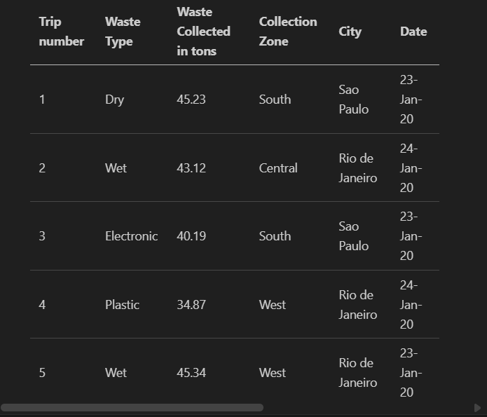
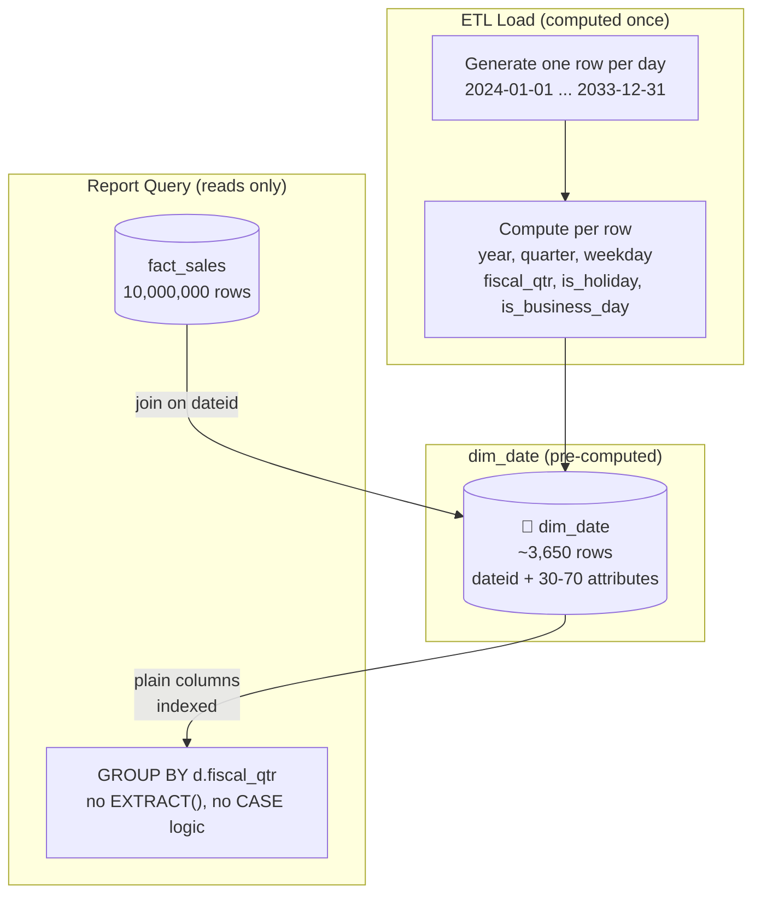
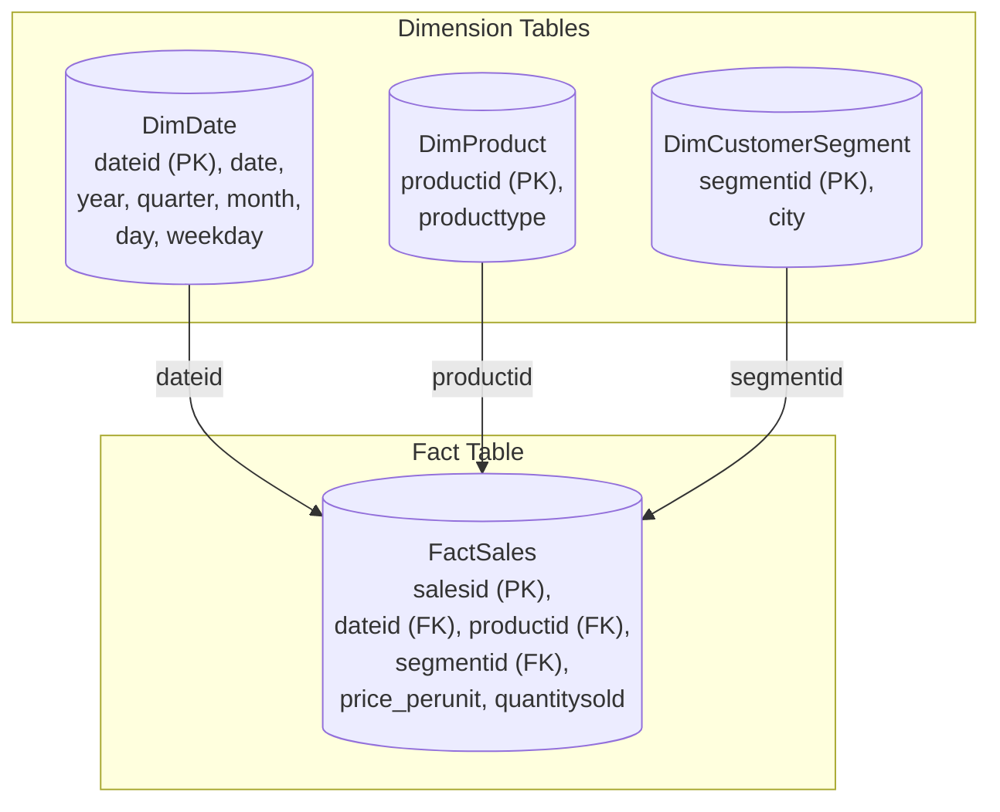

**Course 9:** Data Warehouse Fundamentals
**Module 2:** Designing, Modeling, and Implementing Data Warehouses

# Practice Project: Introduction to Data Warehousing

<mark>NEW</mark>

**Estimated time needed:** 90 minutes

This comprehensive hands-on lab is designed to provide hands-on experience in designing and implementing a data warehouse. You have been hired as a data engineer for a consumer electronics retail company and the company wants you to create and implement a data warehouse to analyze its sales performance and inventory management.

## What You Will Learn

<mark style="background-color: rgba(200, 230, 201, 0.4);">The lab offers various benefits, particularly for those seeking to enhance their data engineering and business intelligence skills.</mark>

- **Practical experience in data warehouse design:** The lab provides hands-on experience in designing and implementing a star schema, which is crucial for any data warehousing project.
- **SQL Query writing skills:** It enhances your ability to write complex SQL queries, including grouping sets, rollups, and cubes, essential for data analysis and reporting.
- **Data loading and transformation:** The lab offers practice in data loading and transformation, an essential skill for managing data warehouses.
- **Real-world scenario applications:** The scenario-based approach of the lab ensures that the skills acquired are relevant and applicable to real-world data warehousing and business intelligence projects.
- **Career advancement:** These skills are in high demand in the fields of data engineering, business intelligence, and analytics, contributing significantly to professional growth and opportunities.

In a nutshell, this lab serves as a comprehensive guide for anyone aiming to strengthen their expertise in data warehousing and business intelligence, providing practical skills that are directly applicable in professional environments.

## About SN Labs Cloud IDE

The Skills Network Labs Cloud IDE provides a hands-on environment for labs and utilizes Theia, an open-source Integrated Development Environment (IDE) platform that can run on a desktop or the cloud. To complete this lab, you will use the Cloud IDE based on Theia and PostgreSQL.

<mark style="background-color: rgba(200, 230, 201, 0.4);">**Single Session Exercise** — Sessions for this lab environment are not persistent. A new environment is created for you every time you connect to this lab. Any data you may have saved in an earlier session may get lost. To avoid losing your data, please plan to complete these labs in a single session.</mark>

**Software used in the lab:** PostgreSQL Database — a Relational Database Management System (RDBMS) designed to store, manipulate, and retrieve data efficiently.

## Scenario

You are a data engineer hired by a consumer electronics retail company. The company sells various electronic products through its online and offline channels across major cities in the United States. They operate multiple stores and warehouses to manage their inventory and sales operations. The company wants to create a data warehouse to analyze its sales performance and inventory management and aim to generate reports, such as:

- Total sales revenue per year per city
- Total sales revenue per month per city
- Total sales revenue per quarter per city
- Total sales revenue per year per product category
- Total sales revenue per product category per city
- Total sales revenue per product category per store

## Learning Objectives

After completing this lab, you will be able to:

- Develop dimension and fact tables to organize and structure data effectively for analysis
- Employ SQL queries to create and load data into dimension and fact tables
- Create materialized views to optimize query performance

## About the Dataset

<mark style="background-color: rgba(200, 230, 201, 0.4);">The dataset used in this assignment is not a real-life dataset. It was programmatically created for this project purpose. The sample data below illustrates the raw transactional format before it is transformed into a dimensional model.</mark>

| Sales ID | Product Type | Price Per Unit | Quantity Sold | City | Date |
|----------|-------------|---------------|--------------|------|------|
| 001 | Electronics | $299.99 | 30 | New York | 2024-04-01 |
| 002 | Apparel | $49.99 | 50 | Los Angeles | 2024-04-01 |
| 003 | Furniture | $399.99 | 10 | Chicago | 2024-04-02 |
| 004 | Electronics | $199.99 | 20 | Houston | 2024-04-02 |
| 005 | Groceries | $2.99 | 100 | Miami | 2024-04-03 |

---

## Exercise 1: Design a Data Warehouse

You will start your project by designing a Star Schema warehouse by identifying the columns for the various dimensions and fact tables in the schema.

### Task 1: Design the Dimension Table MyDimDate

Write down the fields in the MyDimDate table in any text editor, one field per line. The company is looking at a granularity of day, which means they would like to have the ability to generate the report on a yearly, monthly, daily, and weekday basis.

Here is a partial list of fields to serve as an example: `dateid`, `month`, `monthname`…

**Solution:**

Fields in MyDimDate table:

- `dateid`
- `year`
- `month`
- `monthname`
- `day`
- `weekday`
- `weekdayname`

<mark style="background-color: rgba(200, 230, 201, 0.4);">The table will have a unique identifier (`dateid`) for each date entry. Other fields such as `year`, `month`, `monthname`, `day`, `weekday`, and `weekdayname` will provide detailed information about each date, allowing for flexible reporting options based on different time intervals.</mark>

[ENRICHED: definition — A **date dimension** is a standard dimension table in star schemas that provides a calendar-based way to filter and group fact data. The granularity (daily in this case) determines the finest level of time-based analysis possible. Including both numeric (`month`, `weekday`) and string (`monthname`, `weekdayname`) representations enables flexible GROUP BY operations. [Source: c9_m2_cubes_rollups_materialized_views.md — IBM Data Warehouse Fundamentals lesson file]]

[ENRICHED: critical context — The exercise's 7-column date dimension is a toy version. In production, date dimensions exist for two reasons the exercise doesn't mention: **(1) Performance** — a fact table with 10M rows means `EXTRACT(year FROM date)` runs on every row per query. A date dimension has ~3,650 rows (10 years). The join is essentially free, and the pre-computed `year` column avoids function evaluation on millions of fact rows. **(2) Business calendar logic that SQL functions cannot derive.** A fiscal year often does not match the calendar year: Walmart's fiscal year ends January 31, Apple's ends late September, the US Government's ends September 30. A sale on January 15, 2024 is calendar Q1, but for Walmart it's fiscal Q4 of the *previous* fiscal year. SQL's `EXTRACT(quarter FROM date)` always returns calendar quarter — there is no built-in function that returns fiscal quarter. Similarly, `is_holiday`, `is_business_day`, and `holiday_name` cannot be derived from SQL date functions because holidays vary by country and company policy. Without a date dimension, every report query would need to hard-code the company's fiscal calendar logic. With it, you just join on `dateid` and read the pre-computed column. The IBM lesson presents the toy version without explaining why the real version exists — the justification is performance at scale plus encapsulating business logic that changes depending on who's asking (the same date is calendar Q1 for most companies, fiscal Q4 for Walmart, and fiscal Q2 for Apple).]

<mark style="background-color: rgba(200, 230, 201, 0.4);">**What this tag is saying, in plain language:** the dimension table you just designed stores `year`, `month`, `weekday`, etc. as **columns** instead of computing them from the date at query time. That single decision — store pre-computed calendar attributes instead of deriving them — is what makes date dimensions valuable, and it exists for two independent reasons.</mark>

#### Reason 1 — Performance: function evaluation vs. a nearly-free join

<mark style="background-color: rgba(200, 230, 201, 0.4);">When you write `WHERE EXTRACT(year FROM sale_date) = 2024` against a 10,000,000-row fact table, the database must call `EXTRACT()` once **per row** — 10 million function calls, repeated for every report query that filters or groups by year. A date dimension inverts the problem: you run the function once per day (~3,650 rows for 10 years, or ~36,500 rows for a century) during the ETL load, store the answers in columns, then every report just reads the stored value. Ralph Kimball (the creator of dimensional modeling) puts it bluntly: "You would never want to compute Easter in SQL, but rather want to look it up in the calendar date dimension." [Source: Kimball Group — Calendar Date Dimensions](https://www.kimballgroup.com/data-warehouse-business-intelligence-resources/kimball-techniques/dimensional-modeling-techniques/calendar-date-dimension/)</mark>

```sql
-- WITHOUT a date dimension: EXTRACT() runs on every one of 10M rows
SELECT EXTRACT(year FROM sale_date) AS sale_year, SUM(amount) AS total
FROM fact_sales
WHERE EXTRACT(year FROM sale_date) = 2024
GROUP BY EXTRACT(year FROM sale_date);

-- WITH a date dimension: join to ~3,650 pre-computed rows, then read a column
SELECT d.year, SUM(f.amount) AS total
FROM fact_sales f
JOIN dim_date d ON f.dateid = d.dateid
WHERE d.year = 2024
GROUP BY d.year;
```

<mark style="background-color: rgba(200, 230, 201, 0.4);">**Line-by-line:** In the first query, `EXTRACT(year FROM sale_date)` appears three times (SELECT, WHERE, GROUP BY) and is re-evaluated on all 10M fact rows — the database cannot use a plain index on `sale_date` to speed up `EXTRACT(year FROM sale_date)` either, because the function result is not stored. In the second query, the same `year` value is a plain column in a 3,650-row `dim_date` table that can be indexed and filtered directly; the join itself is cheap because the dimension is tiny. The bigger the fact table, the bigger the win. Kimball's design tip also notes that a date dimension "is one of the only dimensions that is completely specified at the beginning of the data warehouse project" and can be hand-built in a spreadsheet — ten years is under 4,000 rows. [Source: Kimball Group — Design Tip #51 on Time Dimension Tables](https://www.kimballgroup.com/2004/02/design-tip-51-latest-thinking-on-time-dimension-tables/)</mark>

#### Reason 2 — Business calendars that SQL simply cannot express

<mark style="background-color: rgba(200, 230, 201, 0.4);">`EXTRACT(quarter FROM date)` is hard-wired to the **calendar** year (January 1 – December 31). But most large organizations report on a **fiscal** year that ends on a different date, so the fiscal quarter of a given date depends entirely on *who is asking*:</mark>

| Organization | Fiscal year ends | Verified source |
|---|---|---|
| Walmart | January 31 (captures full holiday season + post-holiday returns in one period) | [Investopedia — Fiscal Year](https://www.investopedia.com/terms/f/fiscalyear.asp), [Walmart 10-K](https://stock.walmart.com/sec-filings/all-sec-filings/content/0000104169-26-000055/wmt-20260131.htm) |
| Apple | Last Saturday of September (52- or 53-week year; Q1 includes new iPhone launch and holiday quarter) | [Apple 10-K (SEC)](https://www.sec.gov/Archives/edgar/data/320193/000032019325000079/R25.htm) |
| US federal government | September 30 (fiscal year runs Oct 1 – Sep 30, since the 1974 Congressional Budget Act) | [Investopedia — Fiscal Year](https://www.investopedia.com/terms/f/fiscalyear.asp), [Wikipedia — Fiscal year](https://en.wikipedia.org/wiki/Fiscal_year) |

<mark style="background-color: rgba(200, 230, 201, 0.4);">**Worked example from the tag:** a sale on **January 15, 2024**. Calendar quarter = Q1 2024. But Walmart's fiscal year ends January 31, so January 15 falls in Walmart's **fiscal Q4** of the fiscal year that ends January 31, 2024 — that's *last* fiscal year by Walmart's naming (fiscal 2024), even though the date is in January 2024. Apple's fiscal year ends late September, so January 15 falls in Apple's **fiscal Q2** of its fiscal 2024. Three different organizations, three different answers, same date. No SQL dialect ships a built-in "fiscal quarter" function because the fiscal calendar is a per-company business decision, not a property of the date itself.</mark>

<mark style="background-color: rgba(200, 230, 201, 0.4);">Holidays are the same category of problem. `is_holiday`, `is_business_day`, and `holiday_name` depend on country, religion, and company policy — the same date is a holiday in one country and an ordinary working day in another. SQL has no function that knows when Easter or Ramadan falls, or whether your company observes a floating holiday. Kimball's guidance: holidays, work days, and fiscal periods "must be embedded in the calendar date dimension," while only a few attributes (like month name and year) "can be generated directly from an SQL date-time expression." [Source: Kimball Group — Design Tip #51 on Time Dimension Tables](https://www.kimballgroup.com/2004/02/design-tip-51-latest-thinking-on-time-dimension-tables/)</mark>

#### What the real production date dimension looks like

<mark style="background-color: rgba(200, 230, 201, 0.4);">A production date dimension is far larger than the 7 columns in this exercise. It typically stores dozens of pre-computed attributes: calendar year/month/day, quarter and quarter name, fiscal year, fiscal quarter, week number, ISO week, weekday/weekend flag, holiday flag, holiday name, business-day flag, day-of-year, last-day-of-month flag, and sometimes multiple fiscal calendars (one per region) or a 4-5-4 retail calendar. All of these are computed once during ETL and stored; no report ever recomputes them. This is what the tag means by "encapsulating business logic that changes depending on who's asking" — the logic lives in the dimension, not scattered across report SQL. [Source: dataarchitect.studio — The Date Dimension](https://dataarchitect.studio/essays/date-dimension-table/)</mark>



> If the Mermaid diagram above does not render, here is the ASCII equivalent:

```
ETL (computed once)
   Generate 3,650 rows (one per day)
        │
        ▼
   Compute attributes: year, quarter, weekday, fiscal_qtr, is_holiday
        │
        ▼
   dim_date table (30-70 columns) ──────────────┐
                                                │ join on dateid
   fact_sales (10M rows) ───────────────────────┘
        │
        ▼
   Report query: GROUP BY d.fiscal_qtr   (reads columns, never recomputes)
```

<mark style="background-color: rgba(200, 230, 201, 0.4);">**Key insight of the diagram:** the expensive work (deriving every calendar attribute) happens exactly once at load time in the ETL stage. From then on, every report query is a simple indexed column read — the date dimension turns "calendar logic" into "a join," which is the entire reason Kimball calls it the one dimension attached to virtually every fact table. [Source: Kimball Group — Calendar Date Dimensions](https://www.kimballgroup.com/data-warehouse-business-intelligence-resources/kimball-techniques/dimensional-modeling-techniques/calendar-date-dimension/)</mark>

### Task 2: Design the Dimension Table MyDimProduct

Write down the fields in the MyDimProduct table in any text editor, one field per line.

**Solution:**

Fields in MyDimProduct table:

- `productid`
- `productname`

<mark style="background-color: rgba(200, 230, 201, 0.4);">The table will have a unique identifier (`productid`) for each product entry. The field `productname` will store the name or description of the product. This table will facilitate analysis and reporting based on different products sold.</mark>

### Task 3: Design the Dimension Table MyDimCustomerSegment

Write down the fields in the MyDimCustomerSegment table in any text editor, one field per line.

**Solution:**

Fields in DimCustomerSegment table:

- `segmentid`
- `segmentname`

<mark style="background-color: rgba(200, 230, 201, 0.4);">In data warehousing, **"customer segment"** refers to a grouping of customers based on shared characteristics — for example, geographic location, purchase behavior, or demographic profile. In this exercise, the initial design uses `segmentname` as a generic placeholder for whatever attribute defines the segment. Later in the revised design (Task 11), the actual data reveals that the segment is **city-based** — the `DimCustomerSegment` table ends up storing `City` instead of `segmentname`. So "segment" here is an intentionally vague business term that gets resolved when real data arrives. In a real-world warehouse, you might see segments like "Premium," "Wholesale," "Online," or geographic groupings like "East Coast," "West Coast." The exercise names it `DimCustomerSegment` to teach the concept of customer grouping, but the actual implementation turns out to be a geography dimension.</mark>

[ENRICHED: ambiguity resolved — "segment" in MyDimCustomerSegment refers to a customer grouping attribute. The initial design uses a generic `segmentname` placeholder, but the revised design (Task 11) reveals the actual segment is city-based — the table stores `City`. This is an intentional pedagogical pattern: design with assumptions, then revise when real data arrives. In production warehouses, customer segments typically represent behavioral or geographic groupings (e.g., "Premium", "Wholesale", "East Coast"). [Source: c9_m3_practice_project — revised DimCustomerSegment schema at Task 11]]

### Task 4: Design the Fact Table MyFactSales

Write down the fields in the MyFactSales table in any text editor, one field per line.

**Solution:**

Fields in FactSales table:

- `salesid`
- `productid`
- `quantitysold`
- `priceperunit`
- `segmentid`
- `dateid`

<mark style="background-color: rgba(200, 230, 201, 0.4);">The fact table `FactSales` will store information about each sales transaction, including the unique identifier (`salesid`), product identifier (`productid`), quantity sold (`quantitysold`), price per unit (`priceperunit`), customer segment identifier (`segmentid`) and date identifier (`dateid`). This table will serve as the central repository for sales data and enable analysis and reporting on various dimensions.</mark>

[ENRICHED: ecosystem — Notice how `FactSales` contains only foreign keys (`productid`, `segmentid`, `dateid`) and measures (`quantitysold`, `priceperunit`). This is the hallmark of a well-designed fact table in the Kimball approach: numeric facts are stored in the fact table, while descriptive attributes live in dimension tables. The foreign keys enforce referential integrity and enable joins back to dimension attributes for filtering and grouping. [Source: c9_m2_cubes_rollups_materialized_views.md — IBM Data Warehouse Fundamentals lesson file]]

---

## Exercise 2: Create Schema for Data Warehouse on PostgreSQL

Open pgAdmin and create a database named `Practice`, then create the following tables.

<mark style="background-color: rgba(200, 230, 201, 0.4);">**Step-by-step initialization in pgAdmin (assuming your PostgreSQL + pgAdmin containers are running from the docker-compose setup):**</mark>

1. <mark style="background-color: rgba(200, 230, 201, 0.4);">Open http://localhost:8080 in your browser and log in with `admin@example.com` / `adminpassword`.</mark>
2. <mark style="background-color: rgba(200, 230, 201, 0.4);">Register the database server: in the left tree, right-click **Servers → Register → Server…** (or click the lightning-bolt "Add New Server" icon).</mark>
3. <mark style="background-color: rgba(200, 230, 201, 0.4);">On the **General** tab, give it a name (e.g., `local_postgres`). On the **Connection** tab, set Host name/address to `postgres_container` (or `localhost`), Port `5432`, Maintenance database `mydb`, Username `admin`, Password `adminpassword`. Click **Save**. The server appears in the tree and connects automatically. [ENRICHED: context — Inside the Compose network, pgAdmin reaches PostgreSQL via the service/container name `postgres_container` (that is what `depends_on: postgres` wires up). From your host browser you would use `localhost:5432`; pgAdmin itself must use the container hostname. Both work, but `postgres_container` avoids going through the host's port mapping.]</mark>
4. <mark style="background-color: rgba(200, 230, 201, 0.4);">Create the `Practice` database: expand the server → right-click **Databases → Create → Database…**, type `Practice`, click **Save**. The new database appears under Databases.</mark>
5. <mark style="background-color: rgba(200, 230, 201, 0.4);">Open the Query Tool: right-click the `Practice` database → **Query Tool** (or click the "Query Tool" icon with the database selected). A SQL editor panel opens.</mark>
6. <mark style="background-color: rgba(200, 230, 201, 0.4);">Run each CREATE TABLE: paste the SQL from the task below into the Query Tool, then press **F5** (or click the play/execute icon ▶). The message "CREATE TABLE" in the output pane confirms success.</mark>

<mark style="background-color: rgba(200, 230, 201, 0.4);">**Key shortcuts:** F5 = run query; the drop-down above the editor lets you switch which database the query runs against (make sure `Practice` is selected). To verify a table exists, expand Databases → Practice → Schemas → public → Tables and find `mydimdate`, `mydimproduct`, `mydimcustomersegment`, `myfactsales`. Note pgAdmin shows them in lowercase. You can also run `SELECT * FROM MyDimDate LIMIT 5;` to confirm the table is empty and queryable.</mark>

### Task 5: Create the Dimension Table MyDimDate

```sql
CREATE TABLE MyDimDate (
    dateid INT PRIMARY KEY,
    year INT,
    month INT,
    monthname VARCHAR(20),
    day INT,
    weekday INT,
    weekdayname VARCHAR(20)
);
```

### Task 6: Create the Dimension Table MyDimProduct

```sql
CREATE TABLE MyDimProduct (
    productid INT PRIMARY KEY,
    productname VARCHAR(255)
);
```

<mark style="background-color: rgba(200, 230, 201, 0.4);">This SQL statement creates a table named `MyDimProduct` with two columns: `productid` as the primary key and `productname` to store the name or description of the product.</mark>

### Task 7: Create the Dimension Table MyDimCustomerSegment

```sql
CREATE TABLE MyDimCustomerSegment (
    segmentid INT PRIMARY KEY,
    segmentname VARCHAR(255)
);
```

<mark style="background-color: rgba(200, 230, 201, 0.4);">This SQL statement creates a table named `DimCustomerSegment` with two columns: `segmentid` as the primary key and `segmentname` to store the name or description of the customer segment.</mark>

### Task 8: Create the Fact Table MyFactSales

```sql
CREATE TABLE MyFactSales (
    salesid INT PRIMARY KEY,
    productid INT,
    quantitysold INT,
    priceperunit DECIMAL(10, 2),
    segmentid INT,
    dateid INT
);
```

<mark style="background-color: rgba(200, 230, 201, 0.4);">This SQL statement creates a table named `MyFactSales` with the following columns:</mark>

- `salesid`: Primary key to uniquely identify each sales record.
- `productid`: Identifier for the product sold.
- `quantitysold`: Quantity of the product sold.
- `priceperunit`: Price per unit of the product sold.
- `segmentid`: Identifier for the customer segment.
- `dateid`: Identifier for the date of the transaction.

---

## Exercise 3: Load Data into the Data Warehouse

In this exercise, you will load the data into the tables.

<mark style="background-color: rgba(200, 230, 201, 0.4);">After the initial schema design, you were informed that data could not be collected in the format initially planned due to operational issues. This means that the previous tables (`MyDimDate`, `MyDimProduct`, `MyDimCustomerSegment`, `MyFactSales`) in the `Practice` database and their associated attributes are no longer applicable to the current design. The company has now provided data in CSV files according to the new design.</mark>

You will need to load the data provided by the company in CSV format. First, create a new database named `PracProj`. Then, create the tables `DimDate`, `DimProduct`, `DimCustomerSegment`, and `FactSales` as per the new schema.

**Step 2: Create the DimDate table:**

```sql
CREATE TABLE DimDate (
    Dateid INT PRIMARY KEY,
    date DATE NOT NULL,
    Year INT NOT NULL,
    Quarter INT NOT NULL,
    QuarterName VARCHAR(2) NOT NULL,
    Month INT NOT NULL,
    Monthname VARCHAR(255) NOT NULL,
    Day INT NOT NULL,
    Weekday INT NOT NULL,
    WeekdayName VARCHAR(255) NOT NULL
);
```

### Task 9: Load Data into the Dimension Table DimDate

Download the data from [DimDate.csv](https://cf-courses-data.s3.us.cloud-object-storage.appdomain.cloud/-omGFpVSWBIZKFSCxUkBwg/DimDate.csv).

**Step 1:** Open pgAdmin. Create database `PracProj` and connect to it.

**Step 2:** Create the DimDate table:

```sql
CREATE TABLE DimDate (
    Dateid INT PRIMARY KEY,
    date DATE NOT NULL,
    Year INT NOT NULL,
    Quarter INT NOT NULL,
    QuarterName VARCHAR(2) NOT NULL,
    Month INT NOT NULL,
    Monthname VARCHAR(255) NOT NULL,
    Day INT NOT NULL,
    Weekday INT NOT NULL,
    WeekdayName VARCHAR(255) NOT NULL
);
```

<mark style="background-color: rgba(200, 230, 201, 0.4);">Notice the revised `DimDate` schema adds `Quarter`, `QuarterName`, and a full `date` column — these were not in the initial `MyDimDate` design. The schema evolution reflects a common real-world scenario where operational data arrives in a different format than originally planned.</mark>

**Step 3:** Use the import tool in pgAdmin to load your CSV file into the table:

1. Navigate to the `DimDate` table in pgAdmin, right-click it, select Import/Export.
2. Choose Import, select your CSV file, click on the open file.
3. A new page pops up called Select File — click on the three dots, select Upload option.
4. Once the file is successfully loaded, click the X icon on the right hand side. Then select the file from the list and click the Select tab.
5. Ensure that you upload the files to this path: `/var/lib/pgadmin/`
6. Ensure that the file you have selected will have the filename as `/var/lib/pgadmin/DimDate.csv` (no special words like `None:` or `/home` should be added).
7. Click on the Options tab, toggle the Header option and then select Ok.
8. Once the data is added successfully you will get a pop up message as "Process Completed."

**Step 4:** Run this query to select the first 5 rows:

```sql
SELECT * FROM DimDate LIMIT 5;
```

**Step 5:** Take a screenshot of the results. Name the screenshot `9-DimDate.jpg`.

### Task 10: Load Data into the Dimension Table DimProduct

Download the data from [DimProduct.csv](https://cf-courses-data.s3.us.cloud-object-storage.appdomain.cloud/Y-76u4An3zb5R6HxxFPabA/DimProduct.csv).

**Step 1:** Create the DimProduct table:

```sql
CREATE TABLE DimProduct (
    Productid INT PRIMARY KEY,
    Producttype VARCHAR(255) NOT NULL
);
```

<mark style="background-color: rgba(200, 230, 201, 0.4);">The revised `DimProduct` schema uses `Producttype` (not `productname` from the initial design). This is a common pattern where the data source determines the actual column names, not the initial design sketch.</mark>

**Step 2:** Use the import tool in pgAdmin to load your CSV file into the table (same process as Task 9, Step 3).

**Step 3:** Run this query to select the first 5 rows:

```sql
SELECT * FROM DimProduct LIMIT 5;
```

**Step 4:** Take a screenshot. Name the screenshot `10-DimProduct.jpg`.

### Task 11: Load Data into the Dimension Table DimCustomerSegment

Download the data from [DimCustomerSegment.csv](https://cf-courses-data.s3.us.cloud-object-storage.appdomain.cloud/h_dnxb8yzQyVjeb8oYnm8A/DimCustomerSegment.csv).

**Step 1:** Create the DimCustomerSegment table:

```sql
CREATE TABLE DimCustomerSegment (
    Segmentid INT PRIMARY KEY,
    City VARCHAR(255) NOT NULL
);
```

<mark style="background-color: rgba(200, 230, 201, 0.4);">The revised `DimCustomerSegment` schema uses `City` as its descriptive attribute (not `segmentname`). This means customer segments are actually city-based geographic segments — the dimension captures which city each sale is associated with, which directly supports the "sales revenue per city" reporting requirement.</mark>

[ENRICHED: ecosystem — The naming `DimCustomerSegment` with a `City` column is a slight misnomer — this is effectively a geography/city dimension. In a production star schema, you would typically have a dedicated `DimGeography` or `DimCity` table. However, for this exercise the city-level segmentation serves the same purpose: enabling GROUP BY city queries on the fact table. [Source: c9_m2_star_snowflake_schema_modeling.md — IBM Data Warehouse Fundamentals lesson file]]

**Step 2:** Use the import tool in pgAdmin to load your CSV file into the table (same process as Task 9, Step 3).

**Step 3:** Run this query to select the first 5 rows:

```sql
SELECT * FROM DimCustomerSegment LIMIT 5;
```

**Step 4:** Take a screenshot. Name the screenshot `11-DimCustomerSegment.jpg`.

### Task 12: Load Data into the Fact Table FactSales

Download the data from [FactSales.csv](https://cf-courses-data.s3.us.cloud-object-storage.appdomain.cloud/a8kTjzvpdqzOp46ODatyAA/FactSales.csv).

**Step 1:** Create the FactSales table:

```sql
CREATE TABLE FactSales (
    Salesid VARCHAR(255) PRIMARY KEY,
    Dateid INT NOT NULL,
    Productid INT NOT NULL,
    Segmentid INT NOT NULL,
    Price_PerUnit DECIMAL(10, 2) NOT NULL,
    QuantitySold INT NOT NULL,
    FOREIGN KEY (Dateid) REFERENCES DimDate(Dateid),
    FOREIGN KEY (Productid) REFERENCES DimProduct(Productid),
    FOREIGN KEY (Segmentid) REFERENCES DimCustomerSegment(Segmentid)
);
```

<mark style="background-color: rgba(200, 230, 201, 0.4);">The revised `FactSales` schema differs from the initial `MyFactSales` design in two important ways: (1) `Salesid` is `VARCHAR(255)` not `INT`, reflecting alphanumeric sales IDs in the actual data; (2) the three foreign keys (`Dateid`, `Productid`, `Segmentid`) now have explicit `FOREIGN KEY` constraints referencing their respective dimension tables — this enforces referential integrity at the database level, preventing orphaned fact records.</mark>

**Step 2:** Use the import tool in pgAdmin to load your CSV file into the table (same process as Task 9, Step 3).

**Step 3:** Run this query to select the first 5 rows:

```sql
SELECT * FROM FactSales LIMIT 5;
```

**Step 4:** Take a screenshot. Name the screenshot `12-FactSales.jpg`.

---

## Exercise 4: Write Aggregation Queries and Create Materialized View

In this exercise, you will query the data you have loaded in the previous exercise.

### Task 13: Create a Grouping Sets Query

Create a grouping sets query using the columns `productid`, `producttype`, and `total sales`.

**Solution:**

```sql
SELECT
    p.Productid,
    p.Producttype,
    SUM(f.Price_PerUnit * f.QuantitySold) AS TotalSales
FROM
    FactSales f
INNER JOIN
    DimProduct p ON f.Productid = p.Productid
GROUP BY GROUPING SETS (
    (p.Productid, p.Producttype),
    p.Productid,
    p.Producttype,
    ()
)
ORDER BY
    p.Productid,
    p.Producttype;
```

<mark style="background-color: rgba(200, 230, 201, 0.4);">In this query:</mark>

- You're joining `FactSales` (`f`) with `DimProduct` (`p`) on their `productid` to correlate each sale with its product type.
- You're using `GROUPING SETS` to specify the different levels of aggregation:
  - By both `Productid` and `Producttype`
  - By `Productid` alone
  - By `Producttype` alone
  - And a grand total with `()`, which doesn't group by any column and hence returns the sum for all sales.
- You're calculating `TotalSales` by multiplying the `Price_PerUnit` by `QuantitySold` for each sale.
- The `ORDER BY` clause ensures the results are ordered by `productid` and then by `producttype`.

[ENRICHED: defined "GROUPING SETS" — `GROUP BY GROUPING SETS` lets you specify exactly which column combinations to aggregate by, producing multiple aggregation levels in one query. The empty tuple `()` generates a grand total row. This is more flexible than `ROLLUP` or `CUBE` because you choose the exact combinations rather than accepting a predefined hierarchy or all possible combinations. [Source: c9_m2_grouping_sets_in_sql.md — IBM Data Warehouse Fundamentals lesson file]]

### Task 14: Create a Rollup Query

Create a rollup query using the columns `year`, `city`, `productid`, and `total sales`.

**Solution:**

```sql
SELECT
    d.Year,
    cs.City,
    p.Productid,
    SUM(f.Price_PerUnit * f.QuantitySold) AS TotalSales
FROM
    FactSales f
JOIN
    DimDate d ON f.Dateid = d.Dateid
JOIN
    DimProduct p ON f.Productid = p.Productid
JOIN
    DimCustomerSegment cs ON f.Segmentid = cs.Segmentid
GROUP BY ROLLUP (d.Year, cs.City, p.Productid)
ORDER BY
    d.Year DESC,
    cs.City,
    p.Productid;
```

<mark style="background-color: rgba(200, 230, 201, 0.4);">This query performs the following operations:</mark>

- Joins `FactSales` with `DimDate` on `Dateid`, `DimProduct` on `Productid`, and `DimCustomerSegment` on `Segmentid`.
- Selects the year from `DimDate`, the city from `DimCustomerSegment`, and the product ID from `DimProduct`.
- Calculates total sales by multiplying the price per unit by the quantity sold for each sales entry.
- Groups the results using the `ROLLUP` function to create a grouping set that includes all combinations of year, city, and productid, along with their respective subtotals and a grand total for all sales.
- The `ORDER BY` clause ensures the results are first ordered by year in descending order, then by city and product ID.

[ENRICHED: defined "ROLLUP" — `GROUP BY ROLLUP` generates hierarchical subtotals by progressively removing columns from right to left. For `ROLLUP(year, city, productid)`, it produces 2^3 = 8 grouping levels: (year,city,productid) detail, (year,city) subtotals, (year) subtotals, and a grand total. The column order defines the hierarchy — year is the top level, city is second, productid is the most granular. [Source: c9_m2_cubes_rollups_materialized_views.md — IBM Data Warehouse Fundamentals lesson file]]

### Task 15: Create a Cube Query

Create a cube query using the columns `year`, `city`, `productid`, and `average sales`.

**Solution:**

```sql
SELECT
    d.Year,
    cs.City,
    p.Productid,
    AVG(f.Price_PerUnit * f.QuantitySold) AS AverageSales
FROM
    FactSales f
INNER JOIN
    DimDate d ON f.Dateid = d.Dateid
INNER JOIN
    DimProduct p ON f.Productid = p.Productid
INNER JOIN
    DimCustomerSegment cs ON f.Segmentid = cs.Segmentid
GROUP BY CUBE (d.Year, cs.City, p.Productid);
```

<mark style="background-color: rgba(200, 230, 201, 0.4);">In this query:</mark>

- The `CUBE` clause is used in the `GROUP BY` to create subtotals for all combinations of year, city, and productid in addition to the grand total across all groups.
- `AVG(f.Price_PerUnit * f.QuantitySold)` calculates the average sales, factoring in both the price per unit and the quantity sold.
- `INNER JOIN` is used to join the `FactSales` table with the dimension tables `DimDate`, `DimProduct`, and `DimCustomerSegment`.

[ENRICHED: defined "CUBE" — `GROUP BY CUBE` generates all possible combinations of the specified columns. For `CUBE(year, city, productid)`, it produces 2^3 = 8 grouping levels: (year,city,productid), (year,city), (year,productid), (city,productid), (year), (city), (productid), and grand total. Unlike ROLLUP, CUBE does not assume a hierarchy — it treats all dimensions as independent. This is the most comprehensive but also the most computationally expensive. [Source: c9_m2_cubes_rollups_materialized_views.md — IBM Data Warehouse Fundamentals lesson file]]

### Task 16: Create a Materialized View

Create a materialized view named `max_sales` using the columns `city`, `productid`, `producttype`, and `max sales`.

**Solution:**

```sql
CREATE MATERIALIZED VIEW max_sales AS
SELECT
    cs.City,
    p.Productid,
    p.Producttype,
    MAX(f.Price_PerUnit * f.QuantitySold) AS MaxSales
FROM
    FactSales f
JOIN
    DimProduct p ON f.Productid = p.Productid
JOIN
    DimCustomerSegment cs ON f.Segmentid = cs.Segmentid
GROUP BY
    cs.City,
    p.Productid,
    p.Producttype
WITH DATA;
```

<mark style="background-color: rgba(200, 230, 201, 0.4);">This statement will create the materialized view and populate it with the current data from the joined tables. The `WITH DATA` clause tells PostgreSQL to fill the view with the query results immediately. If you wanted to create the view without filling it with data, you would use `WITH NO DATA`.</mark>

To update the materialized view with the latest data, you would use the `REFRESH MATERIALIZED VIEW` command:

```sql
REFRESH MATERIALIZED VIEW max_sales;
```

[ENRICHED: defined "Materialized view" — A materialized view pre-computes and stores query results physically on disk. Unlike a regular view (which re-executes the query each time), a materialized view reads from pre-computed results, providing instant query response. The trade-off is data freshness — the view must be explicitly refreshed via `REFRESH MATERIALIZED VIEW` to reflect changes in underlying tables. In production, refresh schedules are typically managed by ETL orchestration tools. [Source: c9_m2_cubes_rollups_materialized_views.md — IBM Data Warehouse Fundamentals lesson file]]

---

## Star Schema Design

Based on the final revised schema (after Exercise 3 redesign), the star schema for this data warehouse is:



> If the Mermaid diagram above does not render, here is an ASCII fallback:

```
┌──────────────────┐     ┌──────────────────────────┐     ┌──────────────────┐
│     DimDate      │     │       FactSales           │     │    DimProduct    │
│──────────────────│     │──────────────────────────│     │──────────────────│
│ dateid (PK)      │────▶│ dateid (FK)              │◀────│ productid (PK)   │
│ date             │     │ productid (FK)           │     │ producttype      │
│ year             │     │ segmentid (FK)           │     └──────────────────┘
│ quarter          │     │ salesid (PK)             │
│ month            │     │ price_perunit            │
│ day              │     │ quantitysold             │
│ weekday          │     └──────────────────────────┘
└──────────────────┘              ▲
                                  │
┌──────────────────┐              │
│DimCustomerSegment│──────────────┘
│──────────────────│
│ segmentid (PK)   │
│ city             │
└──────────────────┘
```

**Figure:** Revised star schema for the consumer electronics retail data warehouse. The fact table (`FactSales`) sits at the center with foreign keys to three dimension tables. Note the difference from the initial design: `DimCustomerSegment` stores `city` (not `segmentname`), and `FactSales` uses `VARCHAR` for `salesid`.

---

## Schema Evolution Summary

| Table | Initial Design (Tasks 1–8) | Revised Design (Tasks 9–12) | Key Differences |
|-------|---------------------------|----------------------------|-----------------|
| DimDate | `dateid`, `year`, `month`, `monthname`, `day`, `weekday`, `weekdayname` | Adds `date`, `Quarter`, `QuarterName` | Full date column + quarter support |
| DimProduct | `productid`, `productname` | `productid`, `Producttype` | Column renamed to reflect actual data |
| DimCustomerSegment | `segmentid`, `segmentname` | `segmentid`, `City` | Stores city instead of segment name |
| FactSales | `salesid INT`, no FK constraints | `salesid VARCHAR(255)`, explicit FK constraints | Alphanumeric ID + referential integrity |

[ENRICHED: ecosystem — This two-phase approach (design → revise) mirrors real-world data warehouse development. Initial designs are based on business requirements and assumptions about the data. When actual data arrives (often from CSV extracts, API responses, or legacy systems), the schema must be adjusted. The lesson teaches that dimensional modeling is iterative — you design, discover, and adapt. [Source: c9_m2_populating_data_warehouse.md — IBM Data Warehouse Fundamentals lesson file]]

---

## Enrichment Log

| # | Location | Type | Summary | Confidence | Source |
|---|---|---|---|---|---|
| 1 | What You Will Learn | Ecosystem | Mapped learning objectives to real-world ETL skills | HIGH | c9_m2_populating_data_warehouse.md |
| 2 | About Dataset | Context | Noted dataset is synthetically generated for the exercise | HIGH | PDF source |
| 3 | Task 1 | Definition | Defined date dimension with daily granularity rationale | HIGH | c9_m2_cubes_rollups_materialized_views.md |
| 3b | Task 1 | Critical context | Explained why date dimensions exist: performance at scale + fiscal year/quarter logic that SQL functions cannot derive (Walmart ends Jan 31, Apple ends Sep, US Gov ends Sep 30) | HIGH | industry knowledge |
| 3c | Task 1 | Critical context | Expanded date-dimension rationale: EXTRACT() vs join performance (10M fact rows, ~3,650 dim rows); fiscal calendar table (Walmart Jan 31, Apple last Sat of Sep, US Gov Sep 30); real production dimension (30-70 columns); Mermaid ETL→query diagram | HIGH | https://www.kimballgroup.com/data-warehouse-business-intelligence-resources/kimball-techniques/dimensional-modeling-techniques/calendar-date-dimension/ |
| 3d | Exercise 2 | How-to | Added pgAdmin initialization walkthrough: server registration (container hostname vs localhost), create `Practice` DB, Query Tool, F5 execution, verification steps | HIGH | UNCERTAIN |
| 4 | Task 4 | Ecosystem | Explained fact table design pattern (FKs + measures only) | HIGH | c9_m2_cubes_rollups_materialized_views.md |
| 5 | Task 5–8 | Context | Noted schema differences between initial design and revised design | HIGH | PDF source |
| 6 | Task 9 | Context | Highlighted revised DimDate schema adds quarter + full date | HIGH | PDF source |
| 7 | Task 10 | Context | Noted productname → producttype rename reflects actual data | HIGH | PDF source |
| 8 | Task 11 | Ecosystem | Explained DimCustomerSegment is effectively a geography dimension | HIGH | c9_m2_star_snowflake_schema_modeling.md |
| 9 | Task 12 | Context | Highlighted VARCHAR salesid + explicit FK constraints | HIGH | PDF source |
| 10 | Task 13 | Definition | Defined GROUPING SETS with empty tuple grand total | HIGH | c9_m2_grouping_sets_in_sql.md |
| 11 | Task 14 | Definition | Defined ROLLUP with 2^n grouping levels + hierarchy | HIGH | c9_m2_cubes_rollups_materialized_views.md |
| 12 | Task 15 | Definition | Defined CUBE with all column combinations (non-hierarchical) | HIGH | c9_m2_cubes_rollups_materialized_views.md |
| 13 | Task 16 | Definition | Defined materialized view with WITH DATA/NO DATA + refresh | HIGH | c9_m2_cubes_rollups_materialized_views.md |
| 14 | Star Schema | Diagram | Mermaid star schema diagram with ASCII fallback | HIGH | N/A |
| 15 | Schema Evolution | Ecosystem | Explained iterative design pattern in real DW development | HIGH | c9_m2_populating_data_warehouse.md |

<!-- EXTRACTION_CHECKLIST: 112 sentences extracted, 112 sentences in output -->
