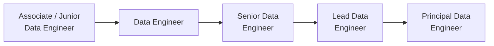
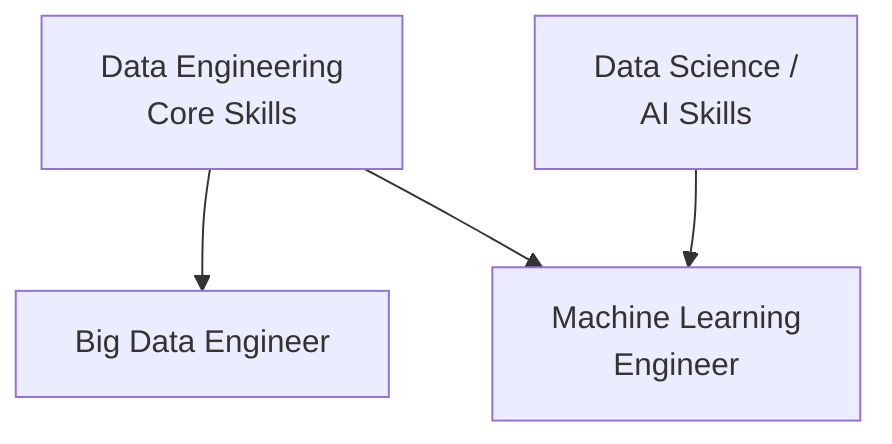

> **Course 1:** Introduction to Data Engineering
> **Module 4:** Career Opportunities and Data Engineering in Action
> **Section 4.1:** Career Opportunities and Learning Paths

# Career Opportunities in Data Engineering

## Introduction

Data engineering has emerged as one of the most in-demand and fastest-growing technical disciplines of the decade. Demand spans every industry — from healthcare to retail to automotive — and the variety of specialization paths means there is no single, rigid definition of what a data engineer does. This document outlines the job market landscape, the spectrum of available roles and specializations, the career progression ladder, and the emerging roles shaping the field's future.

---

## Job Market Overview

Three major industry reports from 2020 independently confirm the scale and pace of growth in data engineering:

| Source | Finding |
|---|---|
| **LinkedIn 2020 Emerging Jobs Report** | Data engineering joins machine learning and data science as one of the top-10 jobs experiencing tremendous growth in the U.S., with adoption across industries from retail to automotive |
| **Dice Tech Job Report 2020** | Data engineering ranked as the **fastest-growing tech occupation**, with a year-over-year growth rate of **50%** — expected to accelerate as companies compete for scarce talent |
| **Glassdoor Best Jobs in America 2020** | Data engineering listed in the **top 10 jobs**, evaluated on earning potential, job satisfaction ratings, and number of open positions |

### Industries with the Highest Demand

According to the Dice Tech Job Report, the three sectors with the greatest need for data engineering talent are:

1. **Healthcare** — leveraging data for patient outcomes, operations, and compliance
2. **Technology** — product analytics, platform infrastructure, and AI/ML pipelines
3. **Consulting** — delivering data strategy and implementation services to clients across sectors

> The report notes that *no industry* in the coming years will be untouched by data engineering. Demand is broad, not concentrated.

---

## Specialization Areas

Job titles in data engineering are fluid — the same role can carry a different label at every company. However, responsibilities within organizations typically break down into the following specialization tracks:

| Specialization | Example Job Titles | Focus Area |
|---|---|---|
| **Data Architecture** | Data Architect, Database Architect | Designing the overall structure of data systems and storage strategies |
| **Database Design & Architecture** | Database Architect, Database Engineer | Schema design, normalization, indexing, and relational/NoSQL modeling |
| **Data Platforms** | Data Platform Engineer, Data Lake Engineer | Building and managing cloud or on-premise platforms that host data at scale |
| **Data Pipelines & ETL** | ETL Engineer, Data Pipeline Engineer | Designing and operating ingestion, transformation, and delivery pipelines |
| **Data Warehousing** | Data Warehouse Engineer | Implementing and maintaining analytical data stores optimized for reporting |
| **Big Data** | Big Data Engineer | Managing large-scale data processing using distributed computing frameworks |

> **Title fluidity:** All of the above roles may be posted generically as **"Data Engineer"** at some organizations, especially smaller companies or those early in their data journey. Always read the job description, not just the title.

For a detailed breakdown of how these specializations compare with adjacent roles (Data Analyst, Data Scientist, Data Manager, DBA), see [Data Engineering Specializations](data_engineering_specializations.md) and [Role Comparisons Deep Dive](role_comparisons_deep_dive.md).

### Common Baseline Expectations Across All Roles

Regardless of specialization, the following knowledge areas are baseline expectations across data engineering positions:

- Operating systems (Linux/Unix fluency)
- Programming and query languages (Python, SQL, Scala, etc.)
- Databases (relational and NoSQL)
- Infrastructure components: virtual machines, networking, application services
- Understanding of data's potential application in business contexts

---

## Career Progression

### Early Career: Generalist in a Small Team or Startup

For engineers joining a company that is just beginning to build its data engineering practice, it is common to work across the **entire data engineering lifecycle** — ingestion, transformation, storage, quality, and delivery. This generalist exposure is highly valuable and accelerates the breadth of skills developed early.

As the practice matures, a multi-disciplinary engineering team takes shape and roles become more specialized.

### The Career Ladder

In established data engineering practices, the typical progression is:

Career growth in data engineering is not purely vertical — it is **matrix-like**. Advancing requires:

1. **Deepening expertise** in your chosen specialization (e.g., becoming highly proficient in data warehousing or streaming pipelines)
2. **Broadening functional understanding** into adjacent areas — for example, a Data Architect gaining working knowledge of data lakes, data pipelines, and ETL processes
3. **Growing the big-picture view** — understanding how your work fits into the complete data engineering lifecycle, not just your slice of it

For a time-based estimate and alternate fast-track path (MVP track), see the [Career Ladder](career_ladder.md) page.

### Skills That Grow With Seniority

Technical depth alone does not drive advancement to lead and principal roles. The following competencies become increasingly important as seniority grows:

| Competency | Why It Matters at Lead Level |
|---|---|
| **Communication** | Translating business requirements into technical specifications and vice versa |
| **Stakeholder collaboration** | Acting as the bridge between business teams and engineering teams |
| **Tool & platform evaluation** | Weighing and recommending the technologies the team should adopt |
| **Data quality & governance** | Taking greater responsibility for systems, processes, and tools that ensure data integrity, privacy, and regulatory compliance |
| **Project/operational management** | Coordinating work across engineers, timelines, and business priorities |

---

## Emerging Roles

Two specializations are growing rapidly at the intersection of data engineering and adjacent disciplines:

### Big Data Engineer

- **Focus:** Large-scale data pipelines, movement, and processing at scale using distributed computing frameworks
- **Key technologies:** Hadoop, HDFS, Apache Spark, Hive, and cloud-native equivalents (e.g., Databricks, AWS EMR)
- **Distinguishing factor:** Expertise in managing data volume, velocity, and variety that exceeds the capacity of traditional single-node systems

For the full technology landscape, see [Big Data Foundations](big_data_foundations.md) and [Hadoop Ecosystem](hadoop_ecosystem.md).

### Machine Learning Engineer

- **Focus:** Designing and implementing machine learning algorithms; building the data infrastructure that feeds AI/ML systems
- **Datasets:** Primarily large collections of structured and unstructured data
- **Distinguishing factor:** This role sits at the **intersection of data engineering and data science/AI** — requiring both strong engineering fundamentals and working knowledge of ML model training, serving, and monitoring pipelines

---

## Key Principles for Long-Term Growth

- **Continuous learning is non-negotiable.** Tools and technologies in the data engineering landscape evolve rapidly. Engineers must proactively adopt new frameworks, platforms, and paradigms as they emerge.
- **Be curious and context-aware.** Understanding *why* data is being collected and *how* it will be used in business decisions separates strong engineers from exceptional ones.
- **Breadth enables leadership.** Specialization gets you hired; breadth in the lifecycle gets you promoted to lead roles.

---

## Summary

| Topic | Key Takeaway |
|---|---|
| **Job market** | Data engineering is a top-10 fastest-growing tech occupation with 50% YoY growth (Dice, 2020) and strong demand across all industries |
| **Top sectors** | Healthcare, Technology, and Consulting have the largest immediate demand |
| **Role variety** | Specializations include Architecture, ETL, Warehousing, Platforms, and Big Data — all may be titled generically as "Data Engineer" |
| **Career ladder** | Associate → Data Engineer → Senior → Lead → Principal, with matrix-style growth across both depth and breadth |
| **Lead-level skills** | Communication, stakeholder management, tool evaluation, and governance ownership become critical above senior level |
| **Emerging roles** | Big Data Engineer (scale & distributed systems) and Machine Learning Engineer (data engineering × AI/ML) are the two key growth roles |
| **Growth mindset** | Continuous learning, curiosity, and lifecycle awareness are the defining traits of long-term career growth in this field |

---

## Cross-References

- [Career Ladder](career_ladder.md) — time-based progression estimates and MVP fast-track path
- [Data Engineering Specializations](data_engineering_specializations.md) — specialization tracks with tools and responsibilities
- [Role Comparisons Deep Dive](role_comparisons_deep_dive.md) — cross-role comparison with Data Analyst, Data Scientist, Data Manager, DBA
- [Big Data Foundations](big_data_foundations.md) — the technology stack big data engineers work with
- [Hadoop Ecosystem](hadoop_ecosystem.md) — distributed computing frameworks for large-scale data
- [Certification Roadmap](certification_roadmap.md) — Azure, AWS, GCP, Snowflake, Databricks certs for career growth
