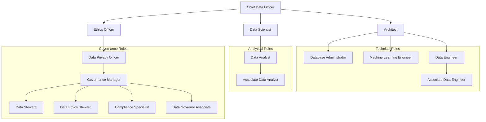

> **Course 1:** Introduction to Data Engineering
> **Module 4:** Career Opportunities and Data Engineering in Action
> **Section 4.1:** Career Opportunities and Learning Paths

# Data Manager: Data-Related Roles in Enterprise Organizations

## Learning Objectives

- Explain typical data-related roles in enterprise organizations
- Map the level, placement, and relationships between roles within a typical company's organizational structure
- Categorize roles into Technical, Analysis & Insight, Governance, and Leadership tracks
- Describe the expected impacts AI may have on each category of role

---

## Overview

Enterprise data organizations are made up of distinct but interdependent role categories. Data roles broadly fall into four categories:

| Category | Focus |
|---|---|
| **Technical** | Infrastructure, architecture, pipelines, and machine learning |
| **Analytical** | Exploring data, identifying insights, and communicating findings |
| **Governance & Privacy** | Ensuring compliance, data quality, ethics, and regulatory adherence |
| **Leadership** | Setting vision, policy, and organizational direction for data |

---

## Organizational Structure

The diagram below represents a typical reporting hierarchy for data-related roles across all four categories. Exact positioning varies by organization, but this structure is representative of most mature enterprise data functions.

---

## Technical Roles

Technical data roles focus on **infrastructure, architecture, and machine learning**. They require programming proficiency, knowledge of databases and data systems, and skill in handling large datasets at scale.

| Role | Key Responsibilities | Entry Point? |
|---|---|---|
| **Data Engineer** | Build and maintain data pipelines and infrastructure under the direction of senior engineers | ✅ Yes — Associate Data Engineer |
| **Associate Data Engineer** | Entry-level; familiarizes you with the data ecosystem, pipelines, and infrastructure under senior guidance | ✅ Entry level |
| **Machine Learning Engineer** | Develop ML algorithms and models; assess the most appropriate models for given data problems | — |
| **Database Administrator (DBA)** | Manage and maintain databases to ensure performance, availability, and security | — |

> **Entry path:** Starting as an **Associate Data Engineer** is the recommended entry point into technical data roles. It provides direct exposure to the data ecosystem — pipelines, infrastructure, and tooling — under the mentorship of senior practitioners.

### AI Impact on Technical Roles

| Change | Detail |
|---|---|
| **Automation of routine tasks** | AI will handle repetitive, low-complexity engineering work |
| **Code optimization assistance** | AI tools will assist engineers in writing and optimizing code |
| **Shift toward higher-level work** | Engineers will increasingly focus on designing and integrating AI components into infrastructure and ensuring those components function correctly |

---

## Analytical Roles

Analytical roles center on **exploring collected data to surface insights** and communicating those insights effectively to the business.

| Role | Key Responsibilities | Reports To |
|---|---|---|
| **Data Scientist** | Lead the analytical team; apply statistical techniques; craft data stories; champion recommendations to the broader organization | Chief Data Officer / Architect |
| **Data Analyst** | Create visualizations, dashboards, and reports; operate under the direction of the Data Scientist | Data Scientist |
| **Associate Data Analyst** | Entry-level analytical role; supports analysts in data exploration and reporting tasks | Data Analyst |

> **Distinction:** Analysts *produce* outputs (dashboards, reports); Data Scientists *lead* the team's analytical direction and bear responsibility for advocating the team's findings to organizational stakeholders.

### AI Impact on Analytical Roles

| Change | Detail |
|---|---|
| **Automation of analysis tasks** | AI will automate significant portions of data exploration and pattern detection |
| **Human value shifts to storytelling** | The enduring human contribution will be crafting coherent, compelling narratives from data and guiding *how* insights are best utilized — skills AI cannot fully replicate |

---

## Governance and Privacy Roles

Governance and privacy roles ensure that **data collection, storage, and use comply with legal, ethical, and organizational standards**. This category is expected to grow rapidly as AI adoption increases regulatory complexity.

| Role | Key Responsibilities | Focus Area |
|---|---|---|
| **Data Privacy Officer** | Oversee organizational compliance with data privacy laws and regulations | Legal / Regulatory |
| **Governance Manager** | Establish and enforce policies governing how the business uses and manages its data; ensure data integrity and security | Policy & Enforcement |
| **Data Steward** | Ensure data quality, integrity, and proper management; ensure data is secure and handled per company policy; prevent AI model bias and misuse | Data Quality & Security |
| **Data Ethics Steward** | Ensure data practices align with societal values and ethical principles beyond mere compliance; champion transparency and accountability | Ethics & Values |
| **Compliance Specialist** | Monitor adherence to regulations and standards; flag and remediate violations | Regulatory Compliance |
| **Data Governor Associate** | Entry-level governance role; develops documentation and supports data quality initiatives | ✅ Entry level |

> **Steward vs. Ethics Steward:**
> - **Data Stewards** tend toward *technical* issues: data quality, integrity, security, and policy compliance.
> - **Data Ethics Stewards** operate at a *values* level: ensuring data practices align with broader societal expectations for fairness, transparency, and accountability — even when no specific law requires it.

### AI Impact on Governance and Privacy Roles

| Change | Detail |
|---|---|
| **Rapid field growth** | As AI adoption matures, governance demand will grow significantly as organizations navigate fast-changing laws and policies |
| **AI-assisted policy monitoring** | AI tools can monitor established policies and flag violations automatically |
| **Human focus shifts to strategy** | With routine monitoring automated, governance professionals will focus on strategic alignment with business objectives, evolving ethics standards, and regulatory interpretation |

---

## Leadership Roles

Leadership roles set the **vision, mission, and policy** for data across the organization. These roles determine how, where, and why AI is deployed.

| Role | Key Responsibilities |
|---|---|
| **Chief Data Officer (CDO)** | Top executive responsible for the organization's overall data strategy; oversees all data functions across technical, analytical, and governance tracks |
| **Data Architect** | Defines the structural design of data systems and the policies governing data storage, integration, and use across the enterprise |
| **Ethics Officer** | Establishes ethical frameworks for data use; ensures organizational practices align with legal, societal, and internal standards |

### AI Impact on Leadership Roles

Leadership roles will be the **decision-makers** on AI adoption and governance. Their choices determine:
- **How** AI is integrated into data processes
- **Where** AI is appropriate to deploy
- **Why** AI should (or should not) be used in specific contexts

> Ultimately, these leadership roles will determine the impact AI has on their organizations and establish the ethical and operational guardrails that govern its use.

---

## Entry Points by Category

| Category | Recommended Entry Role | What You Learn |
|---|---|---|
| **Technical** | Associate Data Engineer | Data pipelines, infrastructure, tooling under senior guidance |
| **Analytical** | Associate Data Analyst | Data exploration, visualization, reporting under analyst direction |
| **Governance** | Data Governor Associate | Documentation, data quality, policy fundamentals |
| **Leadership** | (Reached via progression within a track) | — |

---

## Summary

| Topic | Key Takeaway |
|---|---|
| **Role categories** | Technical, Analytical, Governance & Privacy, and Leadership — each with distinct focus areas and skill requirements |
| **Org structure** | CDO at the top, with Architect (Technical), Data Scientist (Analytical), and Ethics Officer (Governance) as the three direct branches |
| **Technical roles** | Focused on pipelines, infrastructure, ML, and databases; entry via Associate Data Engineer |
| **Analytical roles** | Data Scientists lead; Analysts execute; storytelling with data remains the irreplaceable human skill |
| **Governance roles** | Growing rapidly due to AI; split between technical stewardship and values-based ethics stewardship |
| **Leadership roles** | Set vision and policy; will make the key decisions about AI adoption |
| **AI's net effect** | Automates routine tasks across all categories; elevates human focus toward strategy, ethics, storytelling, and system design |

---

## Cross-References

- [Career Opportunities in Data Engineering](c1_m4_career_opportunities.md) — job market, specializations, and career ladder
- [Career Ladder](career_ladder.md) — time-based progression estimates and MVP fast-track
- [Data Engineering Specializations](data_engineering_specializations.md) — specialization tracks with tools and responsibilities
- [Role Comparisons Deep Dive](role_comparisons_deep_dive.md) — cross-role comparison tables
- [Governance and Compliance](governance_compliance.md) — the regulatory framework governance roles enforce
