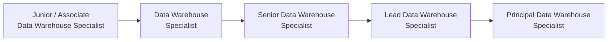

> **Course 1:** Introduction to Data Engineering
> **Module 4:** Career Opportunities and Data Engineering in Action
> **Section 4.1:** Career Opportunities and Learning Paths

# Data Warehousing Specialist

## Learning Objectives

- Describe the Data Warehousing Specialist role
- Provide opportunity estimates for the role
- Identify alternative job titles
- List tasks performed and skills required
- Describe career progression paths

---

## Role Description

A **Data Warehousing Specialist** is a particular kind of Data Engineer — one more tightly focused on the data warehousing aspects of the broader discipline. Their core responsibilities are:

- Designing, modeling, and implementing corporate data warehousing activities
- Programming and configuring warehouses of databases
- Providing support to data warehouse users

> **Relationship to Data Engineering:** The tasks for this specialist role form a significant and focused subset of the wider Data Engineering role. A Data Warehousing Specialist is not a separate profession — it is a specialization within the data engineering career track.

For the broader specializations landscape, see [Data Engineering Specializations](data_engineering_specializations.md).

---

## Market Opportunity

### Job Growth

According to **CareerOneStop** (sponsored by the U.S. Department of Labor):

| Metric | Figure |
|---|---|
| Expected annual growth rate | ~8–10% per year over the next decade (above average) |
| Projected annual U.S. job openings | ~13,900 per year (including similar roles such as Data Architects and Database Administrators) |

### Compensation

According to **Salary.com**:

| Role | Median U.S. Salary |
|---|---|
| Data Warehouse Specialist | **$110,168** |

---

## Alternative Job Titles

Because the role is fluid and varies by organization, searching job boards returns many closely related titles:

| Job Title |
|---|
| Data Warehouse Specialist |
| Data Warehouse Engineer |
| Data Warehouse Solution Architect |
| Data Warehousing / ETL Solution Specialist |
| Data Warehouse Architect |
| Data Architect, Data Warehousing & MPP |
| Data Warehouse Analyst |
| Data Warehouse Administrator |
| Data Warehousing Development Specialist |

> When job searching, cast a wide net using multiple title variants. The responsibilities behind these titles often overlap significantly.

---

## Tasks and Responsibilities

| Category | Tasks |
|---|---|
| **Design & Modeling** | Designing, modeling, or implementing corporate data warehousing activities; designing data architectures, models, tools, and databases |
| **Development** | Writing or modifying programs to meet customer requirements; implementing business rules via stored procedures, middleware, or other technologies |
| **Standards & Governance** | Developing or maintaining standards for the design of data warehouse elements (organization, structure, nomenclature) |
| **Process Improvement** | Analyzing and improving data warehousing processes for efficiency, accuracy, usability, or security |
| **Testing & Quality** | Creating test plans, test files, and scripts ranging from unit to integration testing; reviewing designs, code, test plans, and documentation |
| **Documentation** | Creating metadata documentation, entity-relationship diagrams, business process diagrams, and process flow documentation |
| **Systems & Performance** | Designing and operating data warehouse systems to balance data access optimization with batch loading and resource utilization |
| **Support** | Providing or coordinating troubleshooting support; supporting data warehouse end users |
| **Analysis** | Performing system analysis, data analysis, or programming across a variety of languages and procedures |

---

## Skills Required

### Soft Skills

| Skill | Description |
|---|---|
| **Critical Thinking** | Using logic and reasoning to identify the strengths and weaknesses of alternative solutions |
| **Complex Problem Solving** | Identifying complex problems, reviewing related information, and evaluating and implementing solutions |
| **Decision Making** | Assessing costs and benefits of optional solutions and choosing the most appropriate course of action |
| **Systems Evaluation** | Identifying and evaluating system performance measures and determining corrective actions |
| **Active Learning** | Understanding the implications of new information or technologies for current and future problem-solving |
| **Effective Communication** | Communicating clearly with technical and non-technical stakeholders across teams |

### Technical Skills — Knowledge Areas

| Knowledge Area | Description |
|---|---|
| **Programming** | Writing computer programs for various purposes across multiple languages |
| **Systems Analysis** | Determining how a business system works and understanding how changes affect outcomes |
| **Data Architecture** | Models, policies, rules, and standards governing how data is collected, stored, arranged, integrated, and used |
| **Data Management & Analysis** | Securely collecting, storing, and analyzing data |
| **Data Pipelines** | Building and maintaining data pipelines |
| **Business Intelligence** | Data warehousing, ETL/ELT, and data mapping |
| **Database Normalization** | Ensuring data integrity and applying normalization principles |
| **Data Storage Structures** | Especially relational databases |
| **Data Migration** | ETL of data from one system to another |
| **Metadata Management** | Metadata standards and metadata management tools |
| **Data Integration Platforms** | Working with integration middleware and data platform components |
| **Cloud Data** | Building scalable cloud data infrastructure |
| **Database Administration** | Including Big Data administration |
| **Data Acquisition & Transformation** | Digitizing data for display, analysis, and storage |
| **Data Lakes, Data Marts, Data Reservoirs** | Understanding and implementing multi-zone storage architectures |
| **IoT Data Integration** | Integrating data from connected devices and systems via pipelines |
| **Event Streaming Pipelines** | Building real-time data streaming pipelines |
| **Laws & Regulations** | Legal and ethical requirements related to data access and use — including intellectual property, PII, and customer data |

### Technical Skills — Software and Tool Proficiency

**Cloud Platforms**

| Tool | Provider |
|---|---|
| Amazon Web Services (AWS) | Amazon |
| Microsoft Azure | Microsoft |
| Google Cloud Storage (GCS) | Google |
| SpringCloud | VMware / Open Source |

**Data Warehouse Tools**

| Tool |
|---|
| Snowflake |
| Databricks |
| Google BigQuery |
| Amazon Redshift |
| IBM Db2 |

**Data Pipeline Tools**

| Tool |
|---|
| Apache Kafka |
| Apache Airflow |
| Luigi |

**Big Data Tools**

| Tool |
|---|
| Apache Hadoop |
| Apache Spark |
| Apache Hive |

**Operating Systems**

| OS |
|---|
| UNIX |
| Linux |

**Programming Languages**

| Language | Primary Use |
|---|---|
| SQL | Querying and data manipulation |
| Bash | Shell scripting and automation |
| Python | Pipeline development and data processing |
| R | Statistical analysis |
| Java | Enterprise application development |
| C++ | Performance-critical systems |

**Databases**

| Database | Type |
|---|---|
| PostgreSQL | Relational (open source) |
| MySQL | Relational (open source) |
| Microsoft SQL Server | Relational (enterprise) |
| Oracle PL/SQL | Relational (enterprise) |
| IBM Db2 | Relational (enterprise) |
| Amazon DynamoDB | NoSQL (key-value) |
| Apache Cassandra | NoSQL (wide-column) |
| MongoDB | NoSQL (document) |
| Neo4j | Graph |
| Apache Solr | Search |

**Metadata Management Software**

CA Erwin Data Modeler, Oracle Warehouse Builder, SAS Data Integration Server, Talend Data Fabric, Alation Data Catalog, SAP Information Steward, Azure Data Catalog, IBM Watson Knowledge Catalog, Oracle Enterprise Metadata Management (OEMM), Adaptive Metadata Manager, Unifi Data Catalog, data.world, Informatica Enterprise Data Catalog.

**Business Intelligence & Analytics Tools**

IBM Cognos Impromptu, MicroStrategy, Microsoft Power BI, Google Analytics, InsightSquared, Oracle Business Intelligence Enterprise Edition, Qlik QlikView, Sisense, Tableau, Dundas BI, SAS Analytics, Domo, SAP Lumira.

**Software Development Practices**

| Practice |
|---|
| Agile software development methodologies |
| Version control (Git) |
| Modeling and API development |

---

## Pathways Into the Role

There is no single required educational path:

| Path | Details |
|---|---|
| **Bachelor's Degree** | Computer Science, Computer Engineering, or Mathematical Sciences — the most common academic background |
| **Technology / Technical Diploma** | A diploma in a computational or IT discipline combined with hands-on experience is a viable alternative |
| **Hands-On Experience** | Application development experience plus practical use of database management and metadata tools accelerates entry |

> Formal education establishes foundations; hands-on experience with real data systems is what translates into job readiness.

---

## Career Progression

### Standard Ladder

### The Reality: Non-Linear Paths

Career progression in this specialization is rarely a straight line:

- **Team size:** On small teams, practitioners frequently cover many or all stages of the data engineering lifecycle, building breadth even within a specialist role
- **Organizational needs:** The team's current priorities and skill gaps influence which direction an individual's expertise develops
- **Cross-specialization shifts:** Because the Data Warehousing Specialist is a Data Engineer at heart, lateral moves into adjacent specializations (pipelines, data lakes, cloud platforms) are common

> Regardless of the path, continuous learning about and adoption of emerging tools and technologies is the defining trait of long-term growth in this field.

---

## Summary

| Topic | Key Takeaway |
|---|---|
| **What is the role?** | A Data Engineer with a focused specialization in designing, building, and supporting data warehouses |
| **Job market** | ~8–10% annual growth; ~13,900 U.S. openings per year; median salary of $110,168 |
| **Title fluidity** | At least 9 common alternative job titles exist — read the job description carefully |
| **Core tasks** | Design, development, standards, testing, documentation, systems optimization, and user support |
| **Critical soft skills** | Critical thinking, complex problem solving, active learning, and communication |
| **Technical breadth** | SQL, Python, cloud platforms, warehouse tools (Snowflake, Redshift, BigQuery), pipeline tools (Kafka, Airflow), metadata management |
| **Education** | Bachelor's in CS/Math or a technical diploma, combined with hands-on database and pipeline experience |
| **Career path** | Junior → Specialist → Senior → Lead → Principal, with frequent lateral moves across Data Engineering specializations |

---

## Cross-References

- [Career Opportunities in Data Engineering](c1_m4_career_opportunities.md) — broader job market, specializations, and emerging roles
- [Career Ladder](career_ladder.md) — time-based progression estimates and MVP fast-track path
- [Data Engineering Specializations](data_engineering_specializations.md) — full specialization tracks landscape
- [Data Warehouses, Lakes, and Lakehouses](data_warehouses_lakes.md) — the storage architectures this role builds and maintains
- [ETL, ELT, and Data Pipelines](etl_elt_pipelines.md) — the pipeline patterns central to warehouse operations
- [Certification Roadmap](certification_roadmap.md) — certs for cloud warehouse platforms
