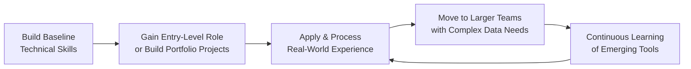

> **Course 1:** Introduction to Data Engineering
> **Module 4:** Career Opportunities and Data Engineering in Action
> **Section 4.1:** Career Opportunities and Learning Paths

# Data Engineering Learning Path

## Overview

Data engineering is a highly technical field, but the path into it is not singular. Whether you are a recent graduate, a self-taught developer, or a professional transitioning from an adjacent role, multiple structured pathways exist to build the skills required. The key is understanding your current position, defining your goals, and selecting the learning resources and entry strategy that fit your situation.

---

## Pathway 1 — Academic Degree

A formal degree in **computer science or engineering** provides the most direct entry point into data engineering.

- Some employers list a relevant academic degree as an **entry-level hiring criterion**
- A degree establishes foundational knowledge in algorithms, systems, databases, and mathematics that underpins the entire data engineering discipline
- It is, however, not the only path — many practicing data engineers are self-taught, particularly those who entered with a prior coding background

---

## Pathway 2 — Online Programs and Professional Certifications

For those without a traditional degree, or looking to upskill efficiently, comprehensive online programs have made data engineering accessible to a much broader population.

### Recommended Platforms

| Platform | What They Offer |
|---|---|
| **Coursera** | Multi-course specializations designed and delivered by top universities and technology companies |
| **edX** | University-backed programs with professional certificates recognized in the job market |
| **Udacity** | Nanodegree programs with hands-on projects and real-world assignments |

### What These Programs Provide

- **Hands-on assignments** and **real-world projects** that build practical confidence
- **Professional certifications** that are recognized and valued by employers
- Exposure to the breadth of data engineering sub-domains, enabling informed specialization choices

> Given how broad data engineering is, use what you have already learned about the field to choose a focused starting path — for example, **data pipelines**, **distributed systems**, or **data architecture** — before branching into other areas. Clarity about your short- and long-term goals will make your learning path more effective.

---

## Pathway 3 — Upskilling from a Technical Role

If you are already working in a technical role but want to move into data engineering, your existing skills are a significant head start.

| Current Role | Transferable Skills |
|---|---|
| **IT Support Specialist** | Systems knowledge, troubleshooting, infrastructure familiarity |
| **Software Tester** | QA thinking, understanding of data flows and edge cases |
| **Programmer / Software Developer** | Coding proficiency, application logic, database interaction |
| **Other technical roles** | Operating systems, networking, scripting |

**Recommended next steps:**
1. Build foundational data engineering skills via online courses or certifications
2. Focus on: programming/query languages, operating systems, and databases
3. Apply skills through personal or open-source projects to build a portfolio
4. Use that portfolio to target an entry-level data engineering role

---

## Pathway 4 — Re-skilling from a Data or Analytics Role

Data and analytics professionals are particularly well-positioned to transition into data engineering, as they already understand data's business context and analytical lifecycle.

| Current Role | What Carries Over |
|---|---|
| **Statistician** | Mathematical foundations, data analysis, probability |
| **Data Analyst** | SQL proficiency, data wrangling, business data context |
| **Business Intelligence (BI) Analyst** | ETL concepts, reporting pipelines, data modeling awareness |
| **Other data professionals** | Domain knowledge of data quality, data access patterns, and stakeholder needs |

**Recommended next steps:**
1. Identify the technical gaps between your current skill set and data engineering requirements (infrastructure, pipelines, distributed systems)
2. Target those gaps with focused courses or certifications
3. Seek opportunities within your current organization to work on data pipeline or infrastructure projects

---

## The Universal Entry Strategy

Regardless of background, the following progression applies broadly:

### Baseline Technical Skills to Acquire First

- **Programming and query languages** (Python, SQL, Bash)
- **Operating systems** (Linux/Unix fundamentals)
- **Databases** (relational and NoSQL concepts)

> Real-world exposure is essential. Experience applying and processing what you have learned — on actual data problems — is what solidifies understanding and accelerates growth into more complex environments.

---

## Your Mainstay in This Profession

Regardless of how you enter the field, two things will define your long-term effectiveness as a data engineer:

1. **Technical abilities** — your command of the tools, languages, infrastructure, and systems that power data pipelines
2. **Broad understanding of data's role in business** — knowing not just *how* to build data systems, but *why* they matter and what decisions they enable

---

## Traits That Make You a Great Asset

Data engineering is a fast-moving field. The practitioners who thrive long-term share a consistent set of characteristics:

- **Curiosity** — a genuine interest in how systems work and how data flows through them
- **Openness to learning** — willingness to continuously adopt new tools, frameworks, and paradigms as the landscape evolves
- **Enthusiasm for technology** — an intrinsic motivation that sustains long-term learning through a fast-changing field

---

## Summary

| Pathway | Best Suited For |
|---|---|
| **Academic Degree (CS / Engineering)** | Those starting from scratch or seeking the most direct formal route |
| **Online Programs & Certifications** | Self-starters, career changers, or those seeking flexible, structured learning |
| **Upskilling from a Technical Role** | IT professionals, developers, and testers building on existing technical foundations |
| **Re-skilling from a Data/Analytics Role** | Analysts, BI professionals, and statisticians bridging into the engineering side |

No matter the path, the formula is consistent: build baseline skills, get hands-on with real data systems, grow through experience, and never stop learning.

---

## Cross-References

- [Viewpoints: Get into Data Engineering](viewpoints_get_into_data_engineering.md) — real practitioner accounts of entering the field
- [Career Opportunities in Data Engineering](c1_m4_career_opportunities.md) — job market, specializations, and career ladder
- [Career Ladder](career_ladder.md) — time-based progression estimates and MVP fast-track
- [Certification Roadmap](certification_roadmap.md) — Azure, AWS, GCP, Snowflake, Databricks certs
- [Skills and Responsibilities](skills_and_responsibilities.md) — technical/functional/soft skill taxonomy
