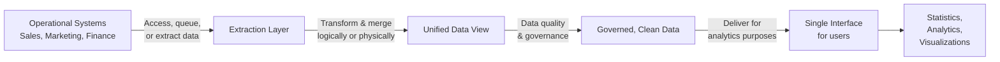

# Data Integration Platforms

> **LTHP Status:** NEW — Module 2 ecosystem expansion.
> **Source files:** `data-integration-platforms.md` (primary, 167 lines), `integration-pipeline-etl-qa.md` (companion clarification, 89 lines)

## Introduction

**Data integration** is defined by Gartner as a discipline comprising the practices, architectural techniques, and tools that allow organizations to ingest, transform, combine, and provision data across various data types. Data integration covers several usage scenarios: ensuring data consistency across applications, master data management, data sharing between enterprises, and data migration and consolidation.

---

## Data Integration in Analytics and Data Science

In the context of analytics and data science, data integration encompasses extracting individual data from operational systems (Sales, Marketing, Finance), transforming and merging it logically or physically into a unified data view, applying data quality and governance, and delivering a single interface for users to derive statistics, analytics, and visualizations — without needing to know which source system each piece came from.

---

## How Data Integration Relates to ETL and Data Pipelines

These three concepts are related but operate at different levels of scope:

| Concept | Scope | Role |
|---|---|---|
| **Data Integration** | Broadest — the overall discipline | Defines the goal: unified, consistent, accessible data |
| **Data Pipeline** | Mid-level — the implementation mechanism | Covers the complete data movement journey from source to destination; used to perform data integration |
| **ETL / ELT** | Narrowest — a specific process | A process within data integration; handles extract, transform, and load operations |

> **In plain terms:** You use a data pipeline to *perform* data integration, and ETL is one of the processes that runs *inside* that pipeline.

### Detailed Breakdown (from companion Q&A)

The statement "Data integration combines disparate data into a unified view, a data pipeline covers the entire data movement journey, and ETL is a process within data integration" is **true** — all three claims are accurate.

**Claim 1:** Data integration combines disparate data into a unified view. The goal of data integration is not just to move data — it is to make data from many sources look and behave like one source for analytics purposes.

**Claim 2:** A data pipeline covers the entire data movement journey from source to destination. It encompasses everything that happens as data travels from a source system to its destination (a data lake, warehouse, application, or visualization tool).

**Claim 3:** ETL is a process within data integration. ETL is one specific process used inside data integration — it is the mechanism; data integration is the goal.

> **Memory aid (construction analogy):** Data Integration = the architect's goal (one unified building from many separate structures). Data Pipeline = the construction process (the full plan for how materials move). ETL = one specific trade within that construction (how the plumbing gets installed).

---

## Capabilities of Modern Data Integration Platforms

### 1. Pre-Built Connectors and Adapters
An extensive catalog of connectors enabling integration flows with relational databases, flat files, social media data, APIs, CRM applications, ERP applications, big data sources, and cloud services.

### 2. Open-Source Architecture
Provides greater flexibility in customization and extension, and avoids vendor lock-in — organizations are not dependent on a single vendor's proprietary ecosystem.

### 3. Batch and Streaming Optimization
Supports large-scale batch processing for high-volume periodic workloads and continuous data streams for real-time event-driven workloads. Many modern platforms support both simultaneously within the same integration flow.

### 4. Big Data Integration
Support for big data sources is increasingly a primary decision driver when selecting an integration platform. Platforms must handle the volume, velocity, and variety characteristic of big data workloads.

### 5. Additional Functionalities

| Functionality | Description |
|---|---|
| **Data quality & governance** | Built-in rules and controls to ensure data is accurate, complete, and trustworthy |
| **Compliance & security** | Controls to meet regulatory requirements and protect sensitive data |
| **Portability** | Ability to run in any environment — on-premise, single cloud, multi-cloud, or hybrid cloud |
| **Cloud-native operation** | Works natively across cloud environments without requiring separate configurations |

---

## Data Integration Platforms and Tools

### Commercial Platforms

**IBM:** IBM Cloud Pak for Data (unified data and AI platform), IBM Cloud Pak for Integration (enterprise application and data integration), IBM Data Replication (real-time data replication), IBM Data Virtualization Manager, IBM InfoSphere Information Server on Cloud, IBM InfoSphere DataStage (high-performance ETL).

**Talend:** Talend Data Fabric (end-to-end data integration), Talend Cloud, Talend Data Catalog, Talend Data Management, Talend Big Data (Hadoop and Spark-based big data integration), Talend Data Services, Talend Open Studio (free, open-source).

**Other major vendors:** SAP, Oracle, Denodo, SAS, Microsoft, Qlik, TIBCO.

### Open-Source Frameworks
Dell Boomi, Jitterbit, SnapLogic.

### Cloud-Based iPaaS (Integration Platform as a Service)

**iPaaS** delivers data integration capabilities as a hosted service via virtual private cloud or hybrid cloud — eliminating the need to install and manage integration infrastructure on-premise.

| Platform | Provider |
|---|---|
| Adeptia Integration Suite | Adeptia |
| Google Cloud Cooperation | Google Cloud |
| IBM Application Integration Suite on Cloud | IBM |
| Informatica Integration Cloud | Informatica |

---

## Summary and Key Takeaways

- **Data integration** is the broader discipline; ETL is a process within it, and data pipelines are the mechanism used to implement it.
- Modern integration platforms must support pre-built connectors, open-source flexibility, batch and stream processing, big data compatibility, governance, security, and cloud portability.
- The market spans commercial off-the-shelf tools (IBM, Talend, Oracle), open-source frameworks (Dell Boomi, Jitterbit), and cloud-hosted iPaaS (Informatica, Google Cloud).
- Portability is an increasingly critical capability — as organizations move to cloud and hybrid models, integration platforms must run anywhere without reconfiguration.
- The data integration space continues to evolve as both the variety of data sources and the role of data in business decision-making continue to grow.
