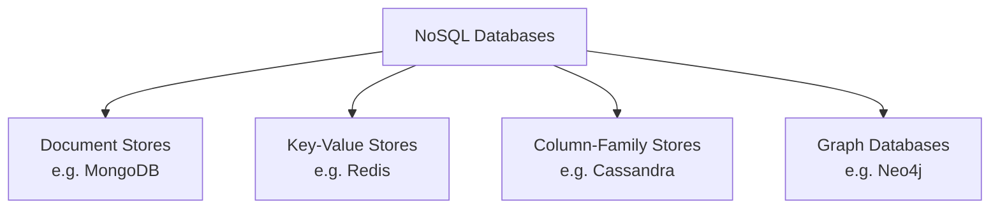
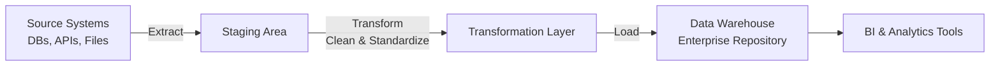

# Overview of Data Repositories

> **LTHP Status:** NEW — Module 2 ecosystem expansion.
> **Source files:** `data-repositories-overview.md` (primary, 179 lines), `choosing-repository-viewpoints.md` (§17 practitioner decision frameworks, 190 lines)

## Introduction

A **data repository** is a general term for data that has been collected, organized, and isolated so that it can be used for business operations or mined for reporting and data analysis. A data repository may be a small or large database infrastructure — consisting of one or more databases — that collects, manages, and stores data sets.

This page covers the primary types of data repositories: databases (relational and non-relational), data warehouses, data marts, data lakes, and big data stores.

---

## What is a Database?

A **database** is a collection of data or information designed for input (ingesting new data), storage (persisting data reliably), search and retrieval (finding records efficiently), and modification (updating existing records).

### Database Management System (DBMS)

A **Database Management System (DBMS)** is a set of programs that creates and maintains the database. It enables users and applications to store data, modify data, and extract information via querying.

> **Example:** To find all customers inactive for six months or more, a query submitted to the DBMS retrieves only the matching records from the full dataset — without manual scanning.

> **Note:** Although "database" and "DBMS" are technically distinct concepts, the terms are commonly used interchangeably in practice.

---

## Types of Databases

Several factors influence the choice of database:

| Factor | Description |
|---|---|
| **Data type and structure** | Is the data tabular, document-based, key-value, etc.? |
| **Querying mechanisms** | Does the use case require SQL, graph traversal, key lookups? |
| **Latency requirements** | How fast must reads/writes be? |
| **Transaction speeds** | How many operations per second are needed? |
| **Intended use** | OLTP (operational), OLAP (analytical), or archival? |

### Relational Databases (RDBMS)

Relational databases organize data into a tabular format with rows and columns, following a well-defined structure and schema. Key characteristics include being built on the organizational principles of flat files but far more powerful, optimized for operations involving many tables and large data volumes, and using SQL as the standard querying interface.

```sql
SELECT customer_id, name, last_active_date
FROM customers
WHERE last_active_date <= CURRENT_DATE - INTERVAL '6 months';
```

> **Best Practice:** Always define primary keys and foreign keys in relational schemas to enforce data integrity and enable efficient joins.

### Non-Relational Databases (NoSQL)

Non-relational databases, also known as **NoSQL** ("Not Only SQL"), emerged in response to the volume, diversity, and velocity of modern data generation — driven largely by cloud computing, IoT, and social media proliferation. Key characteristics: built for speed, flexibility, and scale; allow data to be stored in a schema-less or free-form fashion; widely used for processing Big Data.



> **Common Pitfall:** NoSQL does not mean "no structure at all" — it means flexible structure. Many NoSQL systems still enforce schema at the application layer.

---

## Data Warehouses

A **data warehouse** is a central repository that merges information from disparate sources, consolidates it through the ETL process (Extract, Transform, Load), and produces one comprehensive database for analytics and business intelligence (BI).

### The ETL Process



| ETL Stage | Description |
|---|---|
| **Extract** | Pull raw data from multiple, heterogeneous source systems |
| **Transform** | Clean, standardize, deduplicate, and reshape data into a usable state |
| **Load** | Write the processed data into the enterprise data repository |

> **Historical Note:** Data warehouses and data marts have traditionally been relational, since most enterprise data resided in RDBMSes. However, with the rise of NoSQL and new data sources, non-relational repositories are increasingly used for warehousing workloads as well.

---

## Related Concepts: Data Marts and Data Lakes

| Concept | Description |
|---|---|
| **Data Mart** | A subset of a data warehouse scoped to a specific business function or department (e.g., Sales, Finance) |
| **Data Lake** | A large-scale storage repository that holds raw data in its native format until it is needed |
| **Data Warehouse** | A structured, integrated repository optimized for analytical querying across the enterprise |

---

## Big Data Stores

**Big Data Stores** are a category of data repositories that provide distributed computational infrastructure (processing spread across many nodes), distributed storage infrastructure (data stored across clusters rather than a single server), and the ability to store, scale, and process very large data sets that exceed the capacity of traditional databases.

> **Example technologies:** Hadoop HDFS, Apache Spark, Amazon S3 (as a raw data store), Google Cloud Storage.

---

## Practitioner Perspectives: Choosing a Data Repository

> **Source:** `choosing-repository-viewpoints.md` — §17 enrichment with decision frameworks from data professionals.

### The Use Case

The single most important starting point is understanding what the repository will actually be used for. Key questions: What type of data will be stored? Is the schema known in advance (schema-on-write vs. schema-on-read)? Is this for transactions, analytics, or archival? Are queries short and frequent, or long-running?

### Performance Requirements

Data at rest favors traditional databases or warehouses; streaming data favors stream processing platforms or low-latency NoSQL. Short, frequent query patterns favor OLTP relational databases; long-running analytical queries favor OLAP data warehouses; archival data favors cold storage or data lakes.

### Data Volume and Ingestion Rate

| Volume / Velocity | Recommended Approach |
|---|---|
| Moderate structured data | Relational database (IBM Db2, Oracle, PostgreSQL) |
| Gigabytes to terabytes per day | Document stores (MongoDB) or wide-column stores (Cassandra) |
| Terabytes to petabytes for analytics | Distributed processing engine (Hadoop with MapReduce) |
| Highly connected relational data | Graph database (Neo4J, Apache TinkerPop) |

> **Rule of thumb:** In most cases a relational database is sufficient. NoSQL and big data systems are for edge cases where the data's volume, velocity, or structure exceeds what an RDBMS can handle effectively.

### Data Structure

The structure of the data — more than almost any other factor — determines the category of repository that will serve it best. Structured tabular data with known schema fits relational databases or data warehouses. Semi-structured data (JSON, XML, logs) fits document stores or data lakes. Unstructured data (text, media, documents) fits data lakes or object storage. Highly connected data with relationships between entities fits graph databases.

### Security and Compliance

Does the data need to be encrypted at rest and in transit? What are the access control requirements (role-based, row-level, column-level)? Are there regulatory or organizational standards that mandate or restrict the use of specific platforms? Organizations often have internal standards dictating which approved databases or repositories may be used for specific data classifications or task types.

### Scalability

Current performance is not enough — the repository must be able to grow with the organization. Can it scale horizontally (adding more nodes) as data volume grows? Does it support elastic scaling in cloud environments (pay-as-you-go)? Will it still perform well when data volume is 10x or 100x what it is today?

### Ecosystem Compatibility

A technically superior repository that does not integrate with existing tools creates more problems than it solves. Evaluate compatibility with programming languages used by the engineering and data science teams, existing tools and platforms (BI tools, orchestration frameworks, ETL pipelines), and current processes and data workflows already in production.

### Organizational Skills and Costs

Technical merit alone does not determine the right choice. Team expertise (what databases does the team already know? — retraining has a real cost), licensing and infrastructure cost (commercial enterprise databases vs. open-source alternatives), and hosting platform (cloud provider and deployment model) all factor into the decision.

### Real-World Example: A Typical Multi-Repository Setup

In practice, most organizations maintain a portfolio of repositories rather than a single solution. An organization might run an enterprise relational DB (IBM Db2) for large-scale structured workloads, an open-source relational DB (PostgreSQL or MySQL) for smaller projects and microservices, an unstructured or NoSQL store (MongoDB, Cassandra) for high-volume or flexible-schema data, and choose a hosting platform layer (AWS RDS, Amazon Aurora, Google Cloud SQL, Azure SQL) that affects cost, latency, compliance, and integration options.

---

## Decision Framework: Matching Use Case to Repository

```
What is the primary use case?
  ├── Structured data, transactional workloads → Relational DB (Db2, Oracle, PostgreSQL, MySQL)
  ├── High-volume ingest, flexible schema
  │   ├── Document / JSON → Document Store (MongoDB, DocumentDB)
  │   └── Wide-column / IoT → Column Store (Cassandra, HBase)
  ├── Highly connected data / relationships → Graph DB (Neo4J, Apache TinkerPop)
  ├── Petabyte-scale analytics → Distributed Engine (Hadoop + MapReduce)
  ├── Raw storage, unknown future use → Data Lake (S3, HDFS, Azure Data Lake)
  └── Enterprise analytics, BI workloads → Data Warehouse (Snowflake, Redshift, BigQuery)
```

---

## Summary

| Repository Type | Structure | Best For | Query Language |
|---|---|---|---|
| **RDBMS** | Tabular, strict schema | Transactional systems, structured analytics | SQL |
| **NoSQL** | Schema-less / flexible | Big data, IoT, real-time apps | Varies (no standard) |
| **Data Warehouse** | Integrated, structured | Enterprise BI and historical analytics | SQL |
| **Data Lake** | Raw, unstructured/semi-structured | Data science, ML, raw storage | SQL (via engines like Spark SQL) |
| **Big Data Store** | Distributed | Massive-scale processing and storage | Varies |

**Core takeaways:**

- A data repository isolates and organizes data to make reporting and analytics more efficient and credible.
- RDBMS uses SQL and enforces strict schemas; ideal for structured, transactional data.
- NoSQL prioritizes flexibility and scale; ideal for unstructured or rapidly evolving data.
- Data warehouses centralize data from multiple sources using ETL for BI workloads.
- Big Data stores use distributed infrastructure to handle data volumes beyond the reach of traditional systems.
- The three core dimensions of any repository decision are: **Structure** (what kind of data?), **Nature** (what is the application doing with it?), and **Volume** (how much data and how fast?).
- Most organizations do not use a single repository — they build a **portfolio** of solutions, each matched to a specific workload, team, or data type.
