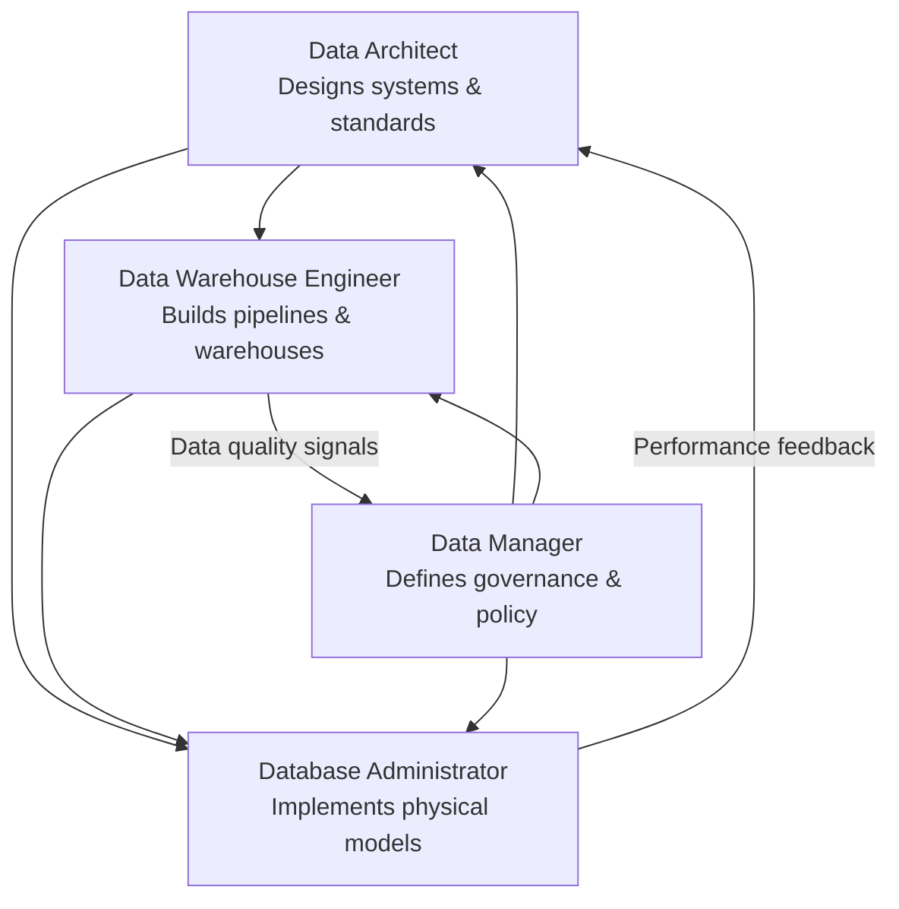

# Data Roles in the Ecosystem

Organizations using data to uncover opportunities require a range of skillsets and people playing different roles.

## Data Engineer

Develops and maintains data architectures, making data available for business operations and analysis.

**Key responsibilities:** Work within the data ecosystem to extract, integrate, and organize data from disparate sources. Clean, transform, and prepare data. Design, store, and manage data in repositories. Enable data accessibility in formats and systems for business applications and stakeholders (Data Analysts, Data Scientists).

**Required skills:** Programming, systems and technology architectures, relational and non-relational databases.

## Data Analyst

Translates data and numbers into plain language so organizations can make decisions.

**Key responsibilities:** Inspect and clean data for insights. Identify correlations, find patterns, apply statistical methods. Visualize data to interpret and present findings.

**Example questions:** "Are users' search experiences generally good or bad?" "What is the popular perception of people regarding rebranding?" "Is there a correlation between sales of one product and another?"

**Required skills:** Spreadsheets, queries, statistical tools, charts/dashboards, programming (modern expectation), analytical and story-telling skills.

## Data Scientist

Analyzes data for actionable insights and builds ML/DL models that train on past data to create predictive models.

**Example questions:** "How many new social media followers am I likely to get next month?" "What percentage of customers am I likely to lose to competition?" "Is this financial transaction unusual for this customer?"

**Required skills:** Mathematics, statistics, programming, databases, data modeling, domain knowledge.

## Business Analyst & BI Analyst

**Business Analyst:** Leverages Data Analyst and Data Scientist work to look at implications for business and actions needed.

**BI Analyst:** Focuses on market forces and external influences. Provides BI solutions by organizing and monitoring data on business functions.

## Role Summary

- **Data Engineering** → Converts raw data into usable data
- **Data Analytics** → Uses usable data to generate insights
- **Data Science** → Uses Data Analytics + Data Engineering to predict the future
- **Business/BI Analysts** → Use insights and predictions to drive decisions

It is not uncommon for data professionals to start in one role and transition to another within the data ecosystem by supplementing their skills.

---

## Additional Data Roles: Warehouse Engineer, Architect, Manager, and DBA

> **Source:** `data_roles_comparison.md` — IBM Skills Network comparison of four data roles focused on infrastructure, governance, and operations.

Beyond the analytics-facing roles above, modern data organizations also rely on these four closely related roles:

### 1. Data Warehouse Engineer

**Focus:** Building and maintaining the data movement layer — pipelines, transformations, and warehousing infrastructure.

**Key deliverables:** ETL/ELT pipelines that ingest data from source systems, data transformation applying business logic and normalization, and warehouse deployment including schema design and partitioning.

**Tools:** Apache Kafka, Apache Spark, dbt, Apache Airflow, Snowflake, BigQuery, Amazon Redshift.

**Collaboration:** Works with Data Architects (to implement approved designs), DBAs (coordination on storage performance and access control), and BI Analysts (to understand reporting requirements).

### 2. Data Architect

**Focus:** Designing how data systems are structured, interconnected, and scaled — providing the blueprint that engineers build from.

**Key deliverables:** Scalable end-to-end data platforms, entity-relationship diagrams (ERDs), dimensional models (star/snowflake schemas), and platform standards defining approved technologies and integration patterns.

**Tools:** erwin, Lucidchart, dbdiagram.io, MySQL, PostgreSQL, MongoDB, Cassandra, cloud data platforms (AWS Glue, Azure Synapse, Google Cloud Dataflow).

**Collaboration:** Communicates architectural decisions to engineers, aligns physical model choices with DBAs, and translates business requirements into system capabilities for business leaders.

### 3. Data Manager

**Focus:** Strategy and governance — defining the rules, standards, and processes that govern how data is created, stored, used, and protected.

**Key deliverables:** Data handling policies (retention, classification, access), naming conventions and metadata standards, and compliance with regulations (GDPR, CCPA, HIPAA).

**Tools:** Collibra, Alation, Apache Atlas, Microsoft Purview, DataHub, Amundsen, OneTrust, BigID.

**Collaboration:** Works with business teams to capture requirements and enforce data ownership, and with technical teams to ensure governance is built into system design.

### 4. Database Administrator (DBA)

**Focus:** Day-to-day operational health of database systems — uptime, security, and performance.

**Key deliverables:** Reliable operations (backup/recovery, patching, incident response), secure operations (access control, encryption, audit logging), and performance tuning (query optimization, index management, capacity planning).

**Tools:** SQL (ANSI, T-SQL, PL/SQL), pgAdmin, DBeaver, Datadog, SolarWinds DPA, pgBadger, Grafana, Veeam, pgBackRest.

**Collaboration:** Reviews schema changes with engineers, advises on query performance, and implements physical data model decisions with architects.

### Role Interaction Map

### Key Takeaways on These Four Roles

| Theme | Insight |
|---|---|
| **Specialization** | Each role owns a distinct slice — design, build, govern, and operate |
| **Interdependence** | Architects design what Engineers build; DBAs operate what Architects specify; Managers govern all of it |
| **Tooling divergence** | Stream processors for Engineers, ERD tools for Architects, governance platforms for Managers, monitoring suites for DBAs |
| **Shared goal** | All four roles serve trustworthy, accessible, performant, and compliant data |

## Glossary

| Term | Definition |
|------|------------|
| Data Ecosystem | The network of data sources, roles, tools, and processes that collectively generate business value from data |
| Data Repository | A storage system where data is held for organization, cleaning, and access |
| Correlation | A statistical relationship between two variables that can indicate predictive patterns |
| Predictive Model | A model that uses historical data to forecast future outcomes, built via ML/DL training |
| Business Intelligence | Tools and processes for monitoring and analyzing business functions through data |
| Statistical Method | A mathematical technique for collecting, analyzing, and interpreting data to identify patterns or test hypotheses |
| Deep Learning | An advanced ML technique using multi-layered neural networks to model complex patterns |

[Cross-ref: topics/defining_data_engineering.md — practitioner perspectives on the same three roles]
[Cross-ref: topics/data_engineering_specializations.md — deeper look at DE-specific specializations]
[Cross-ref: topics/role_comparisons_deep_dive.md — cross-role boundaries and confusion points]

---

## UCSD Big Data Specialization — Data Science as Iterative Research

Data science is empirical research that derives insight from observations — an iterative, not static, process. The cycle is: formulate hypothesis → collect/observe data → analyze → refine hypothesis → repeat. Amazon's book recommendation system exemplifies this: initial purchase data feeds a model, which is continuously refined as more browsing and purchasing behavior is collected. Data science differs from traditional BI in its exploratory, hypothesis-generating nature — it asks "what might be true?" rather than "what happened?"

### Data Scientist Skills — The Three-Domain Intersection

> **Source:** UCSD Course 1, Module 4 — Data Science: Getting Value out of Big Data

Data science sits at the intersection of three domains:

| Domain | Skills |
|--------|--------|
| **Computer Science** | Data engineering, computing infrastructure, programming |
| **Mathematics / Statistics** | Machine learning, statistical modeling, relational algebra |
| **Business Expertise** | Domain knowledge, problem framing, business passion |

**The "Unicorn" Problem:** The wide range of required skills prompted the question — do people with all of these skills actually exist? The UCSD answer: data science experts with expertise in more than one area exist but are rare. Even the most skilled individual data scientist would need help from experts in at least some areas. **"In reality, data scientists are teams of people who act like one."**

**Key traits of effective data science teams:** passion for data, problem understanding, analytical orientation, engineering interest (building solutions, not just analyzing), curiosity about cross-domain work, and communication skills for presenting results to stakeholders. [Cross-ref: topics/data_science_process.md — Five P's: People dimension]
