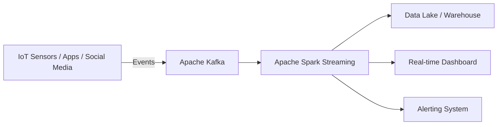

# Data Sources

> **LTHP Status:** NEW — All content is new for the Module 2 ecosystem expansion.
> **Source files:** `sources-of-data.md` (primary), `sensor-data-structured.md` (companion clarification), `viewpoints-data-sources.md` (§17 practitioner perspectives)

## Overview

Modern data engineering operates in an environment where data is more dynamic, diverse, and distributed than ever before. Understanding *where* data originates is foundational: the choice of data source directly influences ingestion strategy, pipeline architecture, storage design, and downstream analytics quality.

This page catalogues the primary categories of data sources encountered in real-world data engineering, explains their characteristics, and highlights tools and use cases associated with each.

---

## 1. Relational Databases

### What They Are

Organizations rely on **relational database management systems (RDBMS)** to power their internal applications — managing day-to-day business activities such as customer transactions, human resource operations, and operational workflows. These systems store data in a highly structured, tabular format governed by a schema.

**Common RDBMS platforms:**

| Platform | Common Use Case |
|---|---|
| SQL Server | Enterprise ERP and CRM systems |
| Oracle DB | Financial and large-scale OLTP workloads |
| MySQL | Web applications and SaaS platforms |
| IBM DB2 | Banking, insurance, and mainframe-backed systems |

### Role as a Data Source

Data stored in relational databases and data warehouses serves as a primary source for analytical pipelines. Examples include retail transaction systems feeding regional sales analysis and inventory forecasting, and CRM systems powering sales projections, customer churn prediction, and lead scoring.

### Key Characteristics

- Structured data with enforced schemas
- Supports ACID transactions
- Queried via SQL
- Well-suited for joins across normalized tables

---

## 2. Flat Files and XML Datasets

External datasets — from government agencies, data vendors, and third-party providers — are commonly distributed as **flat files** or **XML documents**. These formats are widely used because they are portable, human-readable, and do not require a database engine to consume.

### 2.1 Flat Files

Flat files store data in plain text format, with one record per line and values separated by a delimiter (comma, semicolon, tab, pipe, etc.).

> **Key distinction:** Flat files map to a single table, unlike relational databases which contain multiple related tables.

**Common delimiter types:**

| Format | Delimiter | Extension |
|---|---|---|
| CSV | Comma (`,`) | `.csv` |
| TSV | Tab (`\t`) | `.tsv` |
| PSV | Pipe (`\|`) | `.txt`/`.psv` |

### 2.2 Spreadsheet Files

Spreadsheets are a specialized form of flat file that organize data in a tabular (rows and columns) layout. Unlike basic flat files, a single spreadsheet can contain multiple worksheets, each mapping to a different logical table, and can store additional metadata such as formatting, formulas, data validation rules, and charts beyond raw data.

**Common spreadsheet formats:**

| Application | Format(s) |
|---|---|
| Microsoft Excel | `.xls`, `.xlsx` |
| Google Sheets | Google-native (cloud) |
| Apple Numbers | `.numbers` |
| LibreOffice Calc | `.ods` |

### 2.3 XML Files

**XML (Extensible Markup Language)** identifies data values using tags, enabling representation of more complex, hierarchical data structures — unlike the flat, single-table nature of CSV files.

```xml
<transaction>
  <date>2024-06-15</date>
  <description>Wire Transfer</description>
  <amount currency="USD">5000.00</amount>
  <type>debit</type>
</transaction>
```

**Common XML use cases in data engineering:** data from online surveys, bank statements and financial exports, configuration files for ETL tools, RSS and Atom feeds, legacy enterprise system integrations.

---

## 3. APIs and Web Services

**APIs (Application Programming Interfaces)** and **Web Services** are programmatic interfaces that allow multiple users or applications to request and receive data over a network — without direct database access.

APIs typically listen for incoming HTTP/HTTPS requests and return data in one of several formats: plain text, JSON (most common in modern APIs), XML, HTML, or binary/media files.

**Common API data source use cases:**

| Use Case | Example APIs |
|---|---|
| Social media analytics | Twitter API, Facebook Graph API |
| Financial market data | Stock market APIs (share prices, EPS, historical data) |
| Data validation and enrichment | Postal/ZIP code lookup APIs, address verification |
| Internal database access | Enterprise REST APIs wrapping internal databases |

**Social media sentiment analysis:** Twitter and Facebook APIs are widely used to source posts and tweets for opinion mining and sentiment analysis — summarizing public appreciation or criticism of a product, service, government policy, or brand.

**Stock market APIs** supply real-time and historical share prices, commodity prices, and earnings per share for algorithmic trading systems and financial analytics pipelines.

**Data lookup APIs** are useful during data preparation and cleansing phases — for example, resolving which city or state a postal/ZIP code belongs to, enabling accurate geographic co-relation across datasets.

---

## 4. Web Scraping

**Web scraping** (also called screen scraping, web harvesting, or web data extraction) is a technique for programmatically extracting structured data from unstructured web page sources based on defined parameters.

### What Can Be Scraped

Text content, contact information, images and videos, product listings and pricing, forum posts and community data.

### Common Use Cases

| Use Case | Description |
|---|---|
| Price comparison engines | Collect product details from retailers, manufacturers, and eCommerce sites |
| Sales lead generation | Extract business contact data from public directories |
| Community intelligence | Extract posts and author metadata from forums |
| ML dataset construction | Build training and testing datasets for machine learning models |

### Popular Web Scraping Tools

| Tool | Notes |
|---|---|
| **BeautifulSoup** | Python library for parsing HTML/XML trees |
| **Scrapy** | Full-featured Python scraping framework with built-in crawling |
| **Pandas** | Can read HTML tables directly via `pd.read_html()` |
| **Selenium** | Automates a real browser; handles JavaScript-rendered pages |

```python
# Example: Simple web scrape using BeautifulSoup
import requests
from bs4 import BeautifulSoup

url = "https://example.com/products"
response = requests.get(url)
soup = BeautifulSoup(response.content, "html.parser")

products = soup.find_all("div", class_="product-item")
for product in products:
    name = product.find("h2").text
    price = product.find("span", class_="price").text
    print(f"{name}: {price}")
```

> **Best Practice:** Always check a website's `robots.txt` and terms of service before scraping. Many sites prohibit automated access or rate-limit aggressively.

---

## 5. Data Streams and Feeds

**Data streams** represent a fundamentally different ingestion paradigm: instead of querying a static dataset, engineers aggregate continuous, real-time flows of data from a variety of live sources.

### Characteristics of Streaming Data

- **Timestamped:** Each event carries a timestamp indicating when it was generated.
- **Geo-tagged:** Many streams include geographic metadata (latitude/longitude) for location-aware analytics.
- **Unbounded:** Unlike batch datasets, streams have no defined end — they are continuous by nature.

### Common Data Stream Sources

| Source | Engineering Use Case |
|---|---|
| Stock and market tickers | Real-time financial trading algorithms |
| Retail transaction streams | Demand prediction, supply chain optimization |
| Surveillance and video feeds | Threat detection, security monitoring |
| Social media feeds | Sentiment analysis, trend detection |
| Industrial IoT sensor data | Predictive maintenance for machinery |
| Web click/event streams | Web performance monitoring, UX optimization |
| Real-time flight event data | Rebooking and schedule rescheduling systems |
| GPS data from vehicles | Route optimization, traffic analytics |

### Stream Processing Platforms

| Tool | Description |
|---|---|
| **Apache Kafka** | Distributed event streaming platform; acts as a high-throughput message broker |
| **Apache Spark Streaming** | Micro-batch and continuous stream processing on top of Spark |
| **Apache Storm** | Low-latency, distributed real-time computation system |



---

## 6. RSS Feeds

**RSS (Really Simple Syndication)** feeds are a specialized form of data stream designed for capturing continuously refreshed content from online sources such as news sites, blogs, and forums.

### How RSS Works

1. A publisher (e.g., a news website) generates an RSS XML file that lists recent articles, titles, links, and publication dates.
2. A feed reader (aggregator) periodically polls the RSS endpoint and parses the XML.
3. New or updated content is streamed to subscriber devices or downstream systems.

### Engineering Use Cases

Monitoring competitor news and press releases, aggregating industry publications for NLP analysis, building news sentiment pipelines, tracking regulatory or policy updates in real time.

---

## 7. Understanding Sensor Data as Structured Data

> **Source:** `sensor-data-structured.md` — companion clarification on the structured/semi-structured/unstructured classification as it applies to sensor data.

A common point of confusion is why sensor data counts as structured, given that it originates from a physical device rather than a human-entered business system. The resolution lies in separating two ideas that are often mistakenly treated as the same thing: the source of the data and the shape of the data.

### The Core Misconception

It is natural to assume that "structured" data equals data made by a computer system for business purposes, while data from the real world (sensors, devices) is inherently messy or unstructured. This assumption is incorrect. The classification of data as structured, semi-structured, or unstructured has nothing to do with *where the data came from* and everything to do with **whether the data consistently maps to a fixed, predictable set of fields.**

> **Key Principle:** A dataset is structured if you can define its column headers *before* you have even seen a single row of data, and every subsequent row reliably fills in those same columns.

### Why Sensor Data Qualifies as Structured

Sensor data follows a clear, organized, and repeatable format. Consider a weather station sensor that measures temperature, humidity, and wind speed every hour. Each reading behaves like a single row in a table:

| timestamp | temperature_C | humidity_% | wind_speed_kmh |
|---|---|---|---|
| 2026-06-26 09:00 | 28.4 | 41 | 12 |
| 2026-06-26 10:00 | 29.1 | 38 | 15 |
| 2026-06-26 11:00 | 30.0 | 35 | 10 |

Every time the sensor fires, it produces the exact same set of fields with fixed data types — never an extra field, never a missing one. This consistency is precisely what defines structured data: it conforms to a predefined schema.

```sql
CREATE TABLE weather_readings (
    reading_id INT PRIMARY KEY,
    sensor_id VARCHAR(20),
    reading_timestamp TIMESTAMP,
    temperature_c DECIMAL(5,2),
    humidity_pct DECIMAL(5,2),
    wind_speed_kmh DECIMAL(5,2)
);
```

> **Common Pitfall:** Assuming "digital" or "machine-generated" automatically means structured, or that "physical/real-world origin" automatically means messy. Neither is true — the origin of the data is irrelevant to its structural classification.

### Contrast with Other Data Types

| Data Type | Example | Why Classified This Way |
|---|---|---|
| **Structured** | Weather/GPS sensor reading | Fixed, predictable fields every time; schema known in advance |
| **Semi-structured** | An email | Some fixed fields (To, From, Subject) but also free-form body and optional attachments |
| **Unstructured** | A tweet or social media post | Variable length, no guaranteed fields, free text, optional media — no fixed schema |

The mental shortcut: **"Could I draw the column headers before seeing the data?"** If yes, it is structured — regardless of whether the data came from a business system or a physical sensor.

---

## 8. Practitioner Perspectives on Working with Varied Data Sources

> **Source:** `viewpoints-data-sources.md` — §17 enrichment capturing hard-won experience from real-world data professionals.

### The Relational Database as a Foundation — and Its Limits

SQL's power for moving, structuring, and securing data has proven durable across decades and continues to be the backbone of most enterprise data environments. Practitioners highlight that SQL is highly expressive for data movement and transformation between systems, relational databases provide mature access control and security mechanisms, and their flexibility has allowed them to remain competitive across a wide range of use cases.

Despite their longevity, relational databases came under intense scrutiny with the rise of unstructured data — logs, documents, XML, JSON — and the explosion of data-intensive applications such as IoT platforms and social media systems. The core technical issue is that relational databases are powered by **B-tree data structures**, which are optimized for balanced read/write patterns. **Heavy write-intensive workloads** — such as continuous sensor data ingestion or high-volume social media event streams — cause performance degradation due to the random read/write nature of B-tree updates. This limitation drove the industry toward NoSQL alternatives.

Google's BigTable white paper (2006) proposed an architectural model for storing and accessing massive amounts of structured data at scale. Cassandra and HBase were both built from this same architectural lineage and became widely adopted solutions for the problems relational databases struggled to solve.

### The Challenge of Moving Data Across Systems

A critical distinction practitioners emphasize is between one-time migration (sub-terabyte, moderate complexity, key concern is correctness) and ongoing continuous movement (high complexity, key concerns are performance, reliability, and maintainability).

**Cross-vendor migration case study (IBM Db2 to Microsoft SQL Server):** When exporting data to a delimited flat file for transfer, engineers must choose a character to separate fields. The standard choice is a comma (CSV). However, if the data contains commas, those must be escaped or quoted — or a different delimiter must be chosen. In this migration, data contained such a wide variety of special characters that no single delimiter worked across all tables. Engineers were forced to use different separators for different tables. Even unusual candidates like the Bell character (`\a`, ASCII 7) were disqualified.

> **Practical takeaway:** When designing data export and ingestion pipelines, always audit the actual data for delimiter collisions *before* choosing a format. Never assume CSV will be clean.

**The versioning problem:** A feature available in a newer version of a database may not exist in the version deployed in production. Behavior that worked in an older version may have changed in a newer release. Engineers must constantly verify which version of each platform they are targeting and code defensively.

### The Evolution of Data Formats

Practitioners observe a clear generational progression in data formats driven by the twin pressures of expressiveness and resource efficiency:

- **1990s — CSV/Delimited Files:** Simple, portable, human-readable.
- **2000s — XML:** Hierarchical structure, SOAP web services; resource-intensive due to opening and closing tags.
- **2010s — JSON:** Key-value pairs, RESTful APIs; lighter than XML, widely adopted.
- **2020s — Apache Avro/Parquet/ORC:** Binary, schema-embedded, highly efficient; dominant in big data and streaming pipelines.

**Log data** is largely unstructured or semi-structured with no universal schema; parsing logic is application-specific, and custom parsers are often required. Common approaches include regular expressions, log parsing libraries, or purpose-built tools like Logstash and Fluentd.

**XML** was widely used in the 2000s with SOAP-based web services but is verbose — every data element requires both an opening and a closing tag, making files larger and more memory-intensive to parse. It is still present in legacy systems and certain enterprise integrations but largely displaced by JSON for web APIs.

**JSON** eliminated closing tags in favor of key-value pairs, achieving the same hierarchical expressiveness as XML with significantly less overhead. It is the dominant format for RESTful APIs and web-based data exchange, though it lacks a native schema enforcement mechanism (addressed by JSON Schema and tools like Avro).

**Apache Avro** (and similar formats like Parquet and ORC) use a binary format with the schema embedded in the file itself. Advantages include compact storage, fast serialization/deserialization, and schema evolution support. They are used in streaming pipelines (Kafka), data lakes, and Hadoop/Spark workloads, and are rapidly gaining adoption as big data and streaming architectures mature.

### Practitioner Mindset: Adaptability as a Core Skill

A recurring theme across all viewpoints is that technical breadth and adaptability matter as much as depth in any single tool. A data engineer may start a project expecting to work with relational databases and encounter NoSQL, flat files, streaming feeds, and proprietary formats before it is done. Skills with standard formats (CSV, JSON, XML) are necessary but not sufficient — proprietary formats from specific vendors or legacy systems will appear. Working with data at rest (batch), streaming data (real-time), and data in motion (in-transit) requires different tools and mental models.

**The learning posture required:**

| Scenario | Required Response |
|---|---|
| Unfamiliar data format | Learn the format's structure and find or build the appropriate parser |
| New database platform | Understand its import/export conventions and version-specific behavior |
| Performance bottleneck | Evaluate alternative architectures — do not assume the current stack is the right one |
| Cross-vendor migration | Audit the data first; the tool is rarely the hardest part |

> **Key insight from practitioners:** "You might not have the skills to work with all of these different types of data sources from day one — but you need to be able to learn as you go and pick up the skills required for the project."

---

## Summary and Key Takeaways

| Source Type | Format | Latency | Best For |
|---|---|---|---|
| Relational Databases | Tables (SQL) | Batch / Near-real-time | Structured transactional data |
| Flat Files / CSV | Delimited text | Batch | Bulk data transfer, simple datasets |
| Spreadsheets | `.xlsx`, `.ods` | Batch | Business reports, ad-hoc data |
| XML Files | Tagged markup | Batch | Hierarchical and legacy data |
| APIs / Web Services | JSON, XML | Near-real-time | Third-party data integration |
| Web Scraping | HTML → structured | Batch / Scheduled | Public web data without an API |
| Data Streams | Event records | Real-time | IoT, financial tickers, clickstreams |
| RSS Feeds | XML | Near-real-time | News, blogs, forum content |

**Core principles:**

- Match source type to ingestion strategy: static files suit batch pipelines; streams require dedicated streaming platforms.
- Understand data freshness requirements: real-time use cases (trading, fraud detection) cannot rely on batch file drops.
- APIs abstract complexity but introduce rate limits and schema drift — always build robust error handling and schema validation into API-based pipelines.
- Web scraping is fragile by nature; website structure changes break scrapers. Maintain scrapers actively and prefer APIs when available.
- Streaming data must be handled at scale; tools like Kafka are designed for fault-tolerant, high-throughput delivery.
- The structured/semi-structured/unstructured classification depends on data shape and schema consistency, not on whether a human or machine produced the data.
- Build fluency with CSV, JSON, and XML early — they appear everywhere.
- Treat data migration projects with respect: the data itself is typically the source of the hardest problems, not the tools.
- Version awareness is non-negotiable in multi-platform environments.
- Adopt a format-agnostic mindset: the right format depends on the workload, volume, and downstream consumers.
