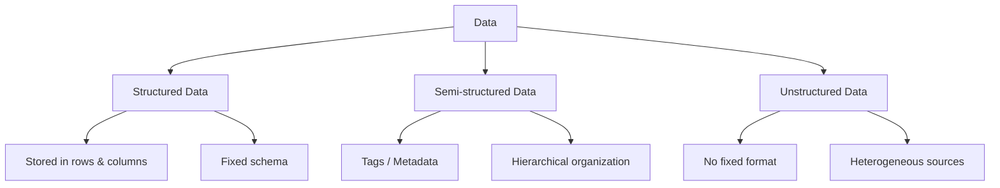

# Types of Data

## Overview

Data is the raw material that data engineers collect, transport, transform, and store so that it can eventually be turned into insight. The *type* of data determines almost every downstream decision: which database to use, which file format to choose, which processing tools apply, and how a pipeline should be designed.

Data can be categorized along many dimensions; the most fundamental classification is by **structure**, which yields three broad categories:

- **Structured data** — fixed schema, tabular format
- **Semi-structured data** — tags/metadata, hierarchical organization
- **Unstructured data** — no fixed format, heterogeneous sources



---

## Structured Data

### Definition

**Structured data** has a well-defined structure that adheres to a specified data model. It can be stored in well-defined schemas, such as those found in relational databases, and is typically organized into **rows and columns**. Structured data consists of objective facts and numbers that can be easily collected, exported, stored, organized, and queried using standard tools.

### Common Sources

| Source | Description |
|---|---|
| **SQL Databases / OLTP Systems** | Transaction processing systems recording day-to-day operations (banking, retail sales) |
| **Spreadsheets** | Microsoft Excel, Google Sheets — data arranged in rows and columns |
| **Online Forms** | Web forms capturing structured fields (name, email, date, etc.) |
| **Sensors** | GPS and RFID tags emitting structured readings |
| **Network and Web Server Logs** | Logs following a consistent, predictable format per entry |

### Storage and Analysis

Structured data is typically stored in **relational (SQL) databases**. Its predictability makes it the easiest data type to validate, index, and query efficiently. Whenever data *can* be modeled with a fixed schema, doing so early in the pipeline reduces downstream processing complexity.

```sql
CREATE TABLE transactions (
    transaction_id INT PRIMARY KEY,
    customer_id INT,
    transaction_date DATE,
    amount DECIMAL(10,2),
    payment_method VARCHAR(20)
);
```

---

## Semi-Structured Data

### Definition

**Semi-structured data** has *some* organizational properties but lacks a fixed or rigid schema. It cannot be neatly stored in rows and columns of a traditional database. Instead, it contains **tags and elements (metadata)** that group data and organize it into a hierarchy. This middle category exists because much real-world data is *partially* organized — components can vary from record to record (optional fields, nested structures, varying depth).

### Common Sources

- E-mails (structured headers, unstructured body)
- XML and other markup languages
- Binary executables
- TCP/IP network packets
- Zipped/compressed files
- Data integrated from multiple heterogeneous sources

### Key Formats: XML and JSON

**XML** and **JSON** are the two most widely used formats for representing semi-structured data. Both allow user-defined tags and attributes, enabling hierarchical data storage and exchange.

```xml
<customer>
    <name>Jane Doe</name>
    <email>jane.doe@example.com</email>
    <orders>
        <order id="1001">
            <item>Laptop</item>
            <price>1200.00</price>
        </order>
    </orders>
</customer>
```

```json
{
  "customer": {
    "name": "Jane Doe",
    "email": "jane.doe@example.com",
    "orders": [
      { "id": 1001, "item": "Laptop", "price": 1200.00 }
    ]
  }
}
```

Because semi-structured data carries its own metadata (tags), it is self-describing to a degree — a consumer can infer some structure without needing an external schema definition.

---

## Unstructured Data

### Definition

**Unstructured data** does not have an easily identifiable structure and cannot be organized into the rows and columns of a mainstream relational database. It does not follow a particular format, sequence, semantics, or set of rules. It is inherently **heterogeneous** and has become central to modern BI and analytics applications such as sentiment analysis, image recognition, and natural language processing.

### Common Sources

- Web pages
- Social media feeds
- Images (JPEG, GIF, PNG)
- Video and audio files
- Documents and PDF files
- PowerPoint presentations
- Media logs
- Survey responses (open-ended text)

### Storage Considerations

Unstructured data is typically stored in one of two ways:
1. **Files and documents** (e.g., Word documents) — appropriate for manual or ad-hoc analysis.
2. **NoSQL databases** — come with specialized tools for examining and querying this data, since traditional SQL engines are not well-suited to unstructured content.

> **Common Pitfall:** Treating unstructured data as if it can be forced into a rigid schema early in a pipeline often leads to data loss or excessive preprocessing overhead. Instead, ingest it "as-is" into flexible storage (data lake or NoSQL store) and structure it later, closer to the point of analysis.

---

## Comparison Summary

| Characteristic | Structured | Semi-Structured | Unstructured |
|---|---|---|---|
| **Schema** | Fixed, well-defined | Flexible, tag/metadata-based | None |
| **Storage Format** | Rows and columns (tabular) | Hierarchical (tags/elements) | No consistent format |
| **Typical Storage** | Relational / SQL databases | XML/JSON stores, document stores | Files, NoSQL databases, data lakes |
| **Examples** | SQL databases, spreadsheets, sensor data | Emails, XML, JSON, TCP/IP packets | Images, videos, PDFs, social media feeds |
| **Ease of Analysis** | High | Moderate | Lower — requires NLP, CV, etc. |

---

## Key Takeaways

1. **Data** is raw, unorganized information that becomes meaningful once processed.
2. Data can be classified by structure into three categories: **structured**, **semi-structured**, and **unstructured**.
3. **Structured data** follows a fixed schema, fits into rows and columns, and is easiest to store and analyze using relational database tools.
4. **Semi-structured data** has partial organization via tags/metadata (XML or JSON) and is organized hierarchically.
5. **Unstructured data** has no identifiable structure, comes from varied sources, and is stored in files or NoSQL databases with specialized tools.
6. Recognizing which category a dataset belongs to is foundational — it informs storage systems, file formats, and processing tools.
