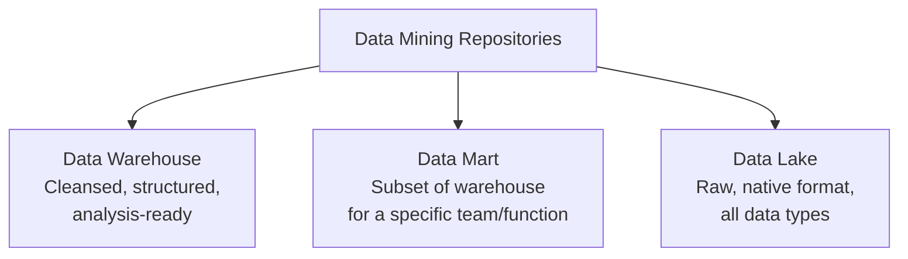

# Data Warehouses, Data Marts, Data Lakes, and Lakehouses

> **LTHP Status:** NEW — Module 2 ecosystem expansion.
> **Source files:** `warehouses-marts-lakes.md` (primary, 222 lines), `data-lakehouse.md` (companion, 164 lines)

## Introduction

All data mining repositories share a common goal: house data for reporting, analysis, and deriving insights. However, they differ in their purpose, the types of data they store, and how that data is accessed.



---

## Data Warehouse

### What It Is

A **data warehouse** is a central repository of data integrated from multiple sources. It serves as the single source of truth — storing current and historical data that has been cleansed (errors and inconsistencies removed), conformed (standardized across sources), and categorized (organized into a coherent structure). When data lands in a data warehouse, it is already modeled and structured for a specific purpose — meaning it is analysis-ready from the moment it arrives.

> **Traditionally**, data warehouses stored relational data from transactional systems such as CRM, ERP, HR, and Finance applications. With the rise of NoSQL and new data sources, non-relational repositories are now also used for data warehousing.

### Three-Tier Architecture

```mermaid
flowchart TB
    subgraph Tier 3 — Top: Client Front-End Layer
        T3["Querying, Reporting & Analytics Tools\n(BI dashboards, SQL clients, visualization tools)"]
    end
    subgraph Tier 2 — Middle: OLAP Server
        T2["Online Analytical Processing Engine\nProcesses & analyzes data from multiple DB servers"]
    end
    subgraph Tier 1 — Bottom: Database Servers
        T1["Relational and/or Non-Relational DBs\nExtract data from source systems"]
    end
    T1 --> T2 --> T3
```

| Tier | Layer | Role |
|---|---|---|
| **Bottom** | Database Servers | Extract data from source systems (relational, non-relational, or both) |
| **Middle** | OLAP Server | Process and analyze information from multiple database servers |
| **Top** | Client Front-End | Tools and applications for querying, reporting, and analyzing data |

### On-Premise vs. Cloud Data Warehouses

| Feature | On-Premise | Cloud-Based |
|---|---|---|
| **Cost** | High upfront hardware/infrastructure investment | Lower cost, pay-as-you-go |
| **Storage & Compute** | Fixed, capacity-limited | Limitless, elastic |
| **Scalability** | Manual, slow | Scale on demand |
| **Disaster Recovery** | Complex and slow | Faster, built-in replication |

### When to Use a Data Warehouse

Use a data warehouse when you have massive amounts of operational data that needs to be readily available for reporting and analysis across the enterprise.

### Popular Data Warehouse Platforms

| Platform | Provider |
|---|---|
| Teradata Enterprise Data Warehouse | Teradata |
| Oracle Exadata | Oracle |
| IBM Db2 Warehouse on Cloud | IBM |
| Amazon Redshift | AWS |
| BigQuery | Google Cloud |
| Snowflake Cloud Data Warehouse | Snowflake |

---

## Data Mart

### What It Is

A **data mart** is a sub-section of the data warehouse, built specifically for a particular business function, purpose, or community of users. For example, the Sales team accesses a sales data mart for quarterly reporting; the Finance team accesses a separate finance data mart for budgeting analysis. Each team gets a focused, fast, and secure slice of the enterprise data.

### Three Types of Data Marts

| Type | Data Source | Transformation Responsibility |
|---|---|---|
| **Dependent** | Enterprise data warehouse | None — data is already cleaned and transformed by the warehouse |
| **Independent** | Operational systems or external data | Must perform its own transformation on raw source data |
| **Hybrid** | Combination of warehouse, operational, and external systems | Varies — handles transformations from multiple input types |

### Purpose of a Data Mart

Regardless of type, every data mart is designed to provide users with the data most relevant to them, accelerate business processes through efficient query response times, enable cost- and time-efficient data-driven decisions, improve end-user response time compared to querying the full warehouse, and provide secure access and control by isolating one team's data from another's.

---

## Data Lake

### What It Is

A **data lake** is a data repository that stores large amounts of structured, semi-structured, and unstructured data in their native format — straight from the source, without requiring a predefined structure or schema.

| Dimension | Data Warehouse | Data Lake |
|---|---|---|
| **Data state** | Cleaned, transformed, structured | Raw, native format |
| **Schema** | Defined before loading (schema-on-write) | Defined at query time (schema-on-read) |
| **Data types** | Primarily structured (relational) | All types: structured, semi-structured, unstructured |
| **Users** | Business analysts, BI teams | Data scientists, data engineers, analysts |
| **Use case** | Known, predefined reporting and analytics | Exploratory analysis, ML, future use cases not yet defined |

> **Important:** A data lake is not a dumping ground. While data can be stored in its raw form, it must still be appropriately classified, protected, and governed.

### Schema-on-Read vs. Schema-on-Write

A data warehouse applies schema-on-write: raw data is transformed and structured before loading, making it analysis-ready. A data lake applies schema-on-read: raw data is loaded immediately in native format, and structure is applied at query time.

### Deployment Options

A data lake can be deployed using cloud object storage (Amazon S3), large-scale distributed systems (Apache Hadoop), relational database management systems, or NoSQL data repositories capable of storing very large volumes of data.

### Benefits of a Data Lake

| Benefit | Description |
|---|---|
| **Stores all data types** | Unstructured (PDFs, emails, documents), semi-structured (JSON, XML, CSV, logs), and structured (relational DB exports) |
| **Scales elastically** | Grows from terabytes to petabytes as storage needs increase |
| **Saves time** | No need to define structures or transformations before ingestion |
| **Flexible repurposing** | Data can be reused across many use cases, including ones not anticipated at ingestion time |

---

## Data Lakehouse

> **Source:** `data-lakehouse.md` — companion explanation of the lakehouse architecture.

### The Problem: Neither Lake nor Warehouse Is Enough Alone

Data lakes are cheap and flexible but suffer from poor governance and query performance. Data warehouses are fast and trusted but expensive and inflexible with new data types. Neither alone is sufficient for modern data needs.

### The Solution: The Data Lakehouse

The **data lakehouse** combines the best of both architectures: the flexibility and low cost of a data lake with the query performance, structure, and governance of a data warehouse — on a single platform.

| Feature | Data Lake | Data Warehouse | Data Lakehouse |
|---|---|---|---|
| **Storage cost** | Low | High | Low |
| **Data types supported** | All (structured, semi, unstructured) | Primarily structured | All |
| **Query performance** | Low | High | High |
| **Data governance** | Weak | Strong | Strong (built-in layer) |
| **BI workloads** | Limited | Excellent | Excellent |
| **ML / AI workloads** | Good | Limited | Excellent |

The lakehouse enables storing data from an exploding number of new sources at low cost, governing data through built-in data management and governance layers, and powering both BI (dashboards, reports) and high-performance ML workloads from a single platform.

### How to Adopt a Lakehouse

Organizations can modernize an existing data lake (add governance, structure, and query optimization layers) or complement an existing data warehouse (extend the warehouse to support new AI and ML workloads).

---

## Choosing the Right Repository

```
What is your need?
├── Structured data, predefined analytics, single source of truth → Data Warehouse
├── Departmental focus, specific business function/team → Data Mart
├── Raw data at scale, exploratory analysis, unknown future use → Data Lake
└── Need both flexibility and high performance → Data Lakehouse
```

---

## Summary and Key Takeaways

| Repository | Data State | Schema | Best For |
|---|---|---|---|
| **Data Warehouse** | Cleansed, structured, analysis-ready | Schema-on-write | Enterprise reporting, BI, historical analysis |
| **Data Mart** | Cleansed subset of warehouse or source data | Predefined, scoped to function | Departmental reporting (Sales, Finance, HR) |
| **Data Lake** | Raw, native format | Schema-on-read | Exploratory analytics, data science, ML, raw archiving |
| **Data Lakehouse** | Combined raw + structured | Flexible | BI + ML workloads, unified platform |

- A data warehouse is the single source of truth — structured, integrated, and analysis-ready.
- A data mart is a focused, faster, more secure slice of that warehouse scoped to a team or function.
- A data lake trades upfront structure for maximum flexibility — storing everything raw for repurposing.
- A data lakehouse merges the flexibility of a lake with the performance and governance of a warehouse.
- All four can coexist in a modern data architecture, and the right choice depends on the use case, data type, and who needs access.
