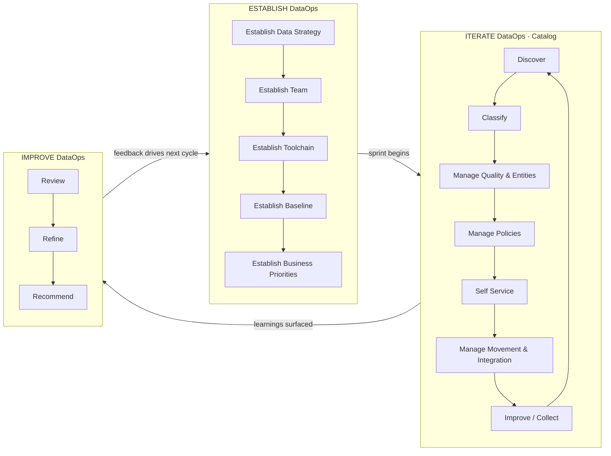

> **Course 1:** Data Engineering Foundations
> **Module 1:** DataOps Methodology Overview

# DataOps Methodology Overview

## Introduction

As data pipelines, infrastructures, and teams grow in size and complexity, ad-hoc processes and informal coordination become bottlenecks. A small team working on a limited number of use cases can meet business requirements efficiently in the early stages — but at scale, organizations need a disciplined, repeatable approach to govern the full data and analytics lifecycle.

**DataOps** is that approach. It brings together methodology, tooling, and culture to ensure data is trustworthy, secure, and continuously available to everyone who needs it.

---

## What Is DataOps?

> *"DataOps is a collaborative data management practice focused on improving the communication, integration, and automation of data flows between data managers and consumers across an organization. DataOps aims to create predictable delivery and change management of data, data models, and related artifacts. DataOps uses technology to automate data delivery with the appropriate levels of security, quality, and metadata to improve the use and value of data in a dynamic environment."*
>
> — Gartner

In practice, DataOps borrows principles from **Agile development**, **DevOps**, and **lean manufacturing** and applies them to the data domain. The goal is to reduce data defects, shorten cycle times, and ensure 360-degree access to quality data for all stakeholders — from ingestion and processing through to analytics and reporting.

---

## The Problem DataOps Solves

Without a structured methodology, data teams commonly experience:

| Problem | Impact |
|---|---|
| **Slow delivery** | Manual handoffs and undocumented processes create bottlenecks |
| **Data defects** | Inconsistent transformation logic and missing validation steps erode trust |
| **Siloed teams** | Data engineers, analysts, and business consumers work in isolation |
| **Compliance risk** | Lack of lineage tracking makes audits difficult and error-prone |
| **Duplication of effort** | Teams rebuild pipelines and datasets independently |

DataOps addresses these issues through **metadata management**, **workflow and test automation**, **code repositories**, **collaboration tools**, and **orchestration**.

---

## The DataOps Methodology

The DataOps Methodology provides a repeatable process for building and deploying analytics and data pipelines. Successful implementation enables an organization to **know**, **trust**, and **use** data to drive measurable business value.

It ensures that data used in problem-solving and decision-making is:

| Property | Description |
|---|---|
| **Relevant** | Data is fit for the intended analytical purpose |
| **Reliable** | Data is accurate, consistent, and validated |
| **Traceable** | Data lineage is documented for audits and compliance |

The methodology is organized into **three main phases**, each containing specific activities that feed into the next, with a continuous feedback loop back to the organization's business priorities:

### Phase 1 — Establish DataOps

**Purpose:** Set up the organization for success in managing data.

This foundational phase puts the right structures, tools, and governance frameworks in place before any sprint work begins. It consists of five sequential activities:

| Step | Activity | Description |
|---|---|---|
| 1 | **Establish Data Strategy** | Define goals and objectives *before* deciding on data infrastructure. Strategy drives tooling, not the reverse |
| 2 | **Establish Team** | Form multi-disciplinary, cross-functional teams spanning data engineering, analytics, governance, and business stakeholders |
| 3 | **Establish Toolchain** | Orchestrate the tools and workflows required for production-grade data delivery — including ingestion, transformation, cataloging, and monitoring |
| 4 | **Establish Baseline** | Create the framework that details the guidelines and standards to be applied within each subsequent data sprint |
| 5 | **Establish Business Priorities** | Align the entire data effort to business needs — ensuring data produced satisfies priorities defined by the business, not just engineering convenience |

> **Common failure mode:** Skipping this phase is a frequent mistake. Teams that jump straight into pipeline development without a governance foundation accumulate technical debt rapidly and struggle to scale. Business priorities established here also serve as the **re-entry point** for the feedback loop coming out of the Improve phase.

### Phase 2 — Iterate DataOps

**Purpose:** Deliver data for one defined sprint.

This phase is the operational heart of DataOps. All work revolves around a central **Catalog** — the authoritative registry of data assets. Seven activities form a continuous cycle around it, each sprint executing this loop to produce trusted, accessible data:

| Step | Activity | Description |
|---|---|---|
| 1 | **Discover** | Use automation to discover patterns in data — profiling sources, identifying schema structures, and surfacing anomalies |
| 2 | **Classify** | Add context and a common lexicon to data — tagging assets with business terms, sensitivity labels, and domain metadata |
| 3 | **Manage Quality & Entities** | Assess data quality and mitigate poor quality — applying validation rules, resolving duplicates, and standardizing entity representations |
| 4 | **Manage Policies** | Manage legal and regulatory requirements — enforcing data access controls, retention policies, privacy rules, and audit trails |
| 5 | **Self Service** | Manage repeatability and traceability of data — enabling consumers to independently access, reproduce, and audit data outputs |
| 6 | **Manage Movement & Integration** | Execute the virtual or physical movement of data from source to target — covering batch and streaming pipelines, ETL/ELT, and API integrations |
| 7 | **Improve / Collect** | Create a plan to address issues discovered during the sprint — logging defects, gaps, and process inefficiencies as inputs to the Improve phase |

> **The Catalog is central:** Every activity in this cycle feeds into and draws from the Catalog. It is the single source of truth for what data exists, where it came from, what it means, and who can access it.

> **Why it matters:** The cyclical structure ensures that no step is skipped and that each sprint produces a complete, governed increment — not just raw data.

### Phase 3 — Improve DataOps

**Purpose:** Channel learnings from each sprint back into the process continuously.

The Improve phase closes the loop. Issues and observations collected during the Iterate phase's **Improve / Collect** step are systematically processed through three activities:

| Step | Activity | Description |
|---|---|---|
| 1 | **Review** | Examine sprint outcomes, pipeline metrics, data quality scores, and logged issues. Identify what worked and what did not |
| 2 | **Refine** | Update processes, automation scripts, quality rules, policies, and toolchain configurations based on Review findings |
| 3 | **Recommend** | Produce actionable recommendations that feed back into the **Establish DataOps** phase — specifically re-evaluating and updating **Business Priorities** to reflect new knowledge |

> **The feedback arrow is critical:** The output of Recommend does not loop back to Iterate — it loops all the way back to **Establish**, ensuring that business priorities, team structures, and baselines evolve with every cycle rather than becoming stale artifacts.

> **Why it matters:** This phase is what transforms DataOps from a project into a culture. Without it, the methodology stagnates and teams revert to old habits.

---

## Key Enablers of DataOps

DataOps is made operational through a combination of tools and practices:

| Enabler | Role in DataOps |
|---|---|
| **Metadata Management** | Automates cataloging of data assets; makes them discoverable and accessible |
| **Data Lineage Tracking** | Establishes credibility of data; supports compliance and audit requirements |
| **Workflow Automation** | Ensures jobs run in the correct order with the correct security permissions |
| **Test Automation** | Validates data integrity, relevancy, and security at every stage of the pipeline |
| **Code Repositories** | Provides version control, peer review, and a single source of truth for pipeline code |
| **Orchestration** | Manages complex task dependencies and scheduling across the data lifecycle |
| **Collaboration Tools** | Aligns data engineers, analysts, and business stakeholders around shared goals |

---

## Benefits of Adopting DataOps

### For the Organization

- **Automated metadata management** makes data assets easy to discover and access
- **Data lineage tracing** ensures credibility and supports compliance and audit processes
- **Automated workflows** enforce data integrity, relevancy, and security end-to-end
- **Streamlined processes** ensure data access and delivery needs are met at optimal speed
- **Always-available pipelines** serve all data consumers and business stakeholders without interruption
- **Data-driven culture** emerges through automation, quality standards, and governance frameworks

### For the Data Practitioner

- Reduced development time through reusable patterns and automation
- Less duplication of effort across teams
- Increased personal productivity and pipeline throughput
- Higher-quality outputs with greater confidence in correctness

---

## DataOps Platforms

Several commercial platforms implement the DataOps methodology out of the box:

| Platform | Notes |
|---|---|
| **IBM DataOps** | Enterprise-grade; integrates with IBM Cloud and Watson ecosystem |
| **Nexla** | Focuses on data operations and cross-team data sharing |
| **Switchboard** | Emphasizes data pipeline automation and monitoring |
| **StreamSets** | DataOps platform with strong support for streaming and batch pipelines |
| **Infoworks** | Automates data engineering workflows end-to-end |

> Platform selection should be driven by existing infrastructure, team size, data volume, and specific governance requirements — not brand recognition alone.

---

## Career Implications: The DataOps Engineer

DataOps also creates a distinct career path within data engineering.

**DataOps Engineers** are technical professionals who focus on the **development and deployment lifecycle** rather than the data product itself. Their responsibilities span:

- Designing and maintaining CI/CD pipelines for data artifacts
- Building and enforcing data quality frameworks and test suites
- Managing orchestration infrastructure and monitoring pipelines in production
- Defining and tracking performance metrics for data delivery

As experience grows, DataOps practitioners can move into more specialized roles:

- Defining organizational **data strategy**
- Developing and deploying **business processes** around data governance
- Establishing **performance metrics** and measuring outcomes against SLAs

---

## Summary

| Concept | Key Takeaway |
|---|---|
| **What is DataOps?** | A collaborative methodology for automating and governing data flows at scale |
| **Establish (5 steps)** | Strategy → Team → Toolchain → Baseline → Business Priorities |
| **Iterate (7-step cycle)** | Discover → Classify → Manage Quality → Manage Policies → Self Service → Move & Integrate → Improve/Collect, centered on the Catalog |
| **Improve (3 steps)** | Review → Refine → Recommend, feeding back to Establish — not just Iterate |
| **Core Enablers** | Metadata management, data lineage, test automation, orchestration, self-service access |
| **Organizational Benefit** | Trusted, secure, always-available data for all stakeholders |
| **Practitioner Benefit** | Higher productivity, less waste, and a clear specialist career path |

DataOps is not a one-time project — it is a **systemic, cultural shift** that requires investment in process, tooling, and people. When implemented well, it makes data and analytics more efficient, more reliable, and more valuable to the entire organization.

---

## Cross-References

- [Governance and Compliance](governance_compliance.md) — the governance framework DataOps operationalizes
- [Metadata Management](metadata_management.md) — metadata management as a core DataOps enabler
- [ETL, ELT, and Data Pipelines](etl_elt_pipelines.md) — pipeline patterns that DataOps automates
- [Data Integration Platforms](data_integration_platforms.md) — platform capabilities that support DataOps
