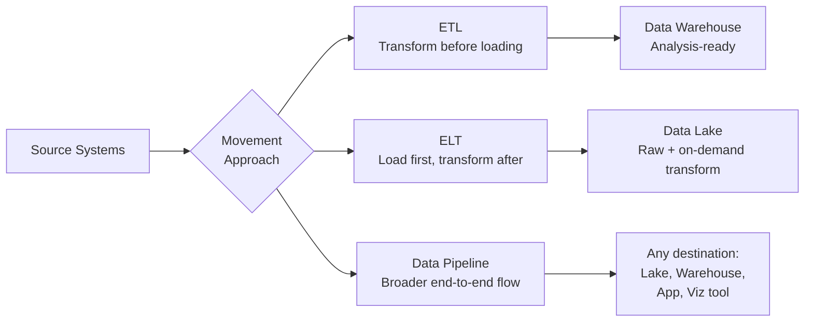
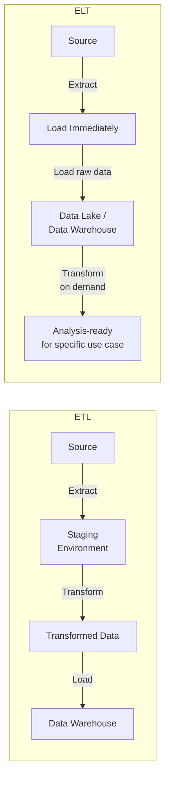

# ETL, ELT, and Data Pipelines

> **LTHP Status:** NEW — Module 2 ecosystem expansion.
> **Source files:** `etl-elt-pipelines.md` (primary, 228 lines), `stream-vs-transform-qa.md` (companion clarification, 102 lines)

## Introduction

Moving data from source to destination systems is one of the most fundamental operations in data engineering. Three closely related concepts govern this process:

- **ETL** — Extract, Transform, and Load
- **ELT** — Extract, Load, and Transform
- **Data Pipelines** — the broader architecture that encompasses both



---

## ETL — Extract, Transform, and Load

ETL is how raw data is converted into analysis-ready data. It is an automated process that gathers raw data from identified sources, extracts the information that aligns with reporting and analysis needs, cleans and standardizes that data, and loads it into a data repository.

### Step 1: Extract

Data from source locations is collected for transformation. Extraction can happen in two modes:

| Mode | Description | Tools |
|---|---|---|
| **Batch Processing** | Source data moved in large chunks at scheduled intervals | Stitch, Blendo |
| **Stream Processing** | Data pulled in real-time, transformed while in transit before loading | Apache Samza, Apache Storm, Apache Kafka |

### Step 2: Transform

Transformation is the execution of rules and functions that convert raw data into data usable for analysis. Common operations include standardizing formats (make date formats and units consistent across sources), removing duplicates, filtering unnecessary data, enriching data (splitting a full name into first/last), establishing key relationships, and applying business rules.

```sql
SELECT
    customer_id,
    SPLIT_PART(full_name, ' ', 1) AS first_name,
    SPLIT_PART(full_name, ' ', 2) AS last_name,
    TO_DATE(raw_date, 'MM/DD/YYYY') AS standardized_date,
    UPPER(country_code) AS country_code
FROM raw_customers
WHERE customer_id IS NOT NULL;
```

### Step 3: Load

Processed data is transported to the destination system. Loading can take three forms:

| Load Type | Description |
|---|---|
| **Initial Loading** | Populating all data in the repository for the first time |
| **Incremental Loading** | Applying ongoing updates and modifications periodically |
| **Full Refresh** | Erasing contents of one or more tables and reloading with fresh data |

> **Load Verification** is a critical part of this step, including checking for missing or null values, monitoring server performance during load, and tracking and recovering from load failures. Recovery mechanisms must be in place before load failures occur — not after.

### ETL Tools

IBM InfoSphere Information Server, AWS Glue, Improvado, Skyvia, HEVO, Informatica PowerCenter.

> **Historical note:** ETL was traditionally used for batch workloads at large scale. With the emergence of streaming ETL tools, it is increasingly applied to real-time streaming event data as well.

---

## ELT — Extract, Load, and Transform

ELT is a variation of ETL in which the order of operations is changed: extracted data is first loaded into the target system, and transformations are applied there.



### Why ELT?

ELT is a relatively new technology powered by cloud computing, designed to address the limitations of ETL for modern data types and volumes.

| Use Case | ETL | ELT |
|---|---|---|
| Large volumes of unstructured/non-relational data | Struggles | Designed for this |
| Data lake as the destination | Adds staging overhead | Native fit |
| Speed from extraction to delivery | Slower — staging required | Faster — no staging layer |
| Exploratory analytics flexibility | Schema changes costly | Greater flexibility |
| Multiple use cases from same data | May require warehouse restructure | Transform only what each use case needs |

### ELT Advantages

- **Shorter cycle time** — raw data is delivered directly to the destination without a staging environment
- **Immediate ingestion** — paired with a data lake, data can be ingested as soon as it becomes available
- **Greater analyst flexibility** — data scientists can apply transformations on demand for exploratory analytics
- **Use-case-specific transformation** — only the data required for a particular analysis is transformed
- **No warehouse restructuring** — adding a new use case does not require modifying the entire warehouse structure

---

## Data Pipelines

A **data pipeline** is a broader term that encompasses the entire journey of moving data from one system to another. ETL and ELT are both subsets of a data pipeline.

### Pipeline Architectures

| Architecture | Description | Best For |
|---|---|---|
| **Batch** | Data is collected and processed in scheduled chunks | Large-volume, non-time-sensitive workloads |
| **Streaming** | Data is processed in a continuous, real-time flow | Sensor data, live monitoring, event-driven systems |
| **Hybrid (Batch + Streaming)** | Combines both modes in a single pipeline | Mixed workloads requiring both historical and real-time processing |

### Data Pipeline Tools

Apache Beam (unified model for batch and streaming), Apache Airflow (workflow orchestration for scheduling and monitoring), Google Dataflow (managed cloud pipeline service built on Apache Beam).

---

## Understanding Stream Processing vs. Transform

> **Source:** `stream-vs-transform-qa.md` — companion clarification on a common conceptual confusion.

### The Core Distinction

Stream processing and transform answer two completely different questions:

| | Stream Processing | Transform |
|---|---|---|
| **What it answers** | *How* does data move from source to destination? | *What* do you do to the data once you have it? |
| **What it is** | A delivery mechanism | An operation applied to data |
| **Part of ETL** | Part of the Extract step | Its own dedicated Transform step |

They are not alternatives to each other — they operate on different dimensions. You can have transformation happen inside stream processing, or after batch processing.

**Stream processing** is about the mode of extraction — it describes the way data is pulled from the source and moved toward its destination. Data flows continuously and in real-time, event by event, as it is generated.

**Transform** is a processing operation — it describes the rules and functions applied to data to make it usable for analysis, completely independent of whether the data arrived via batch or stream.

### Why the Confusion Exists

The lesson says stream processing involves data being "transformed while it is in transit" — which makes it sound like stream processing and transform are the same thing. They are not. What that phrase means is: when you use stream processing, the Transform step happens earlier in the journey (mid-flight, before the data reaches the repository) rather than after it arrives.

In both batch and streaming ETL, the Transform step still exists and still does the same job — clean, standardize, enrich the data. The only difference is where in the journey it happens:
- **Batch:** Extract everything first → then Transform in a staging area → then Load
- **Stream:** Extract, Transform, and Load happen as a near-simultaneous continuous flow

> **Key takeaway:** Stream processing is a property of the Extract step — it describes delivery mode. Transform is its own dedicated step — it describes data manipulation. Every ETL pipeline has a Transform step, regardless of whether extraction is batch or stream.

---

## ETL vs. ELT vs. Data Pipeline — At a Glance

| Dimension | ETL | ELT | Data Pipeline |
|---|---|---|---|
| **Transform timing** | Before load | After load | Varies |
| **Primary destination** | Data Warehouse | Data Lake | Any (lake, warehouse, app, viz) |
| **Best for** | Structured, known schema | Unstructured, exploratory | End-to-end data movement |
| **Flexibility** | Lower — schema must be predefined | Higher — schema applied on demand | Highest — architecture-agnostic |
| **Latency** | Higher — staging required | Lower — direct ingestion | Depends on batch vs. stream mode |
| **Big Data support** | Limited | Strong | Strong (with streaming architecture) |

---

## Summary and Key Takeaways

- **ETL** (Extract → Transform → Load) is the traditional method. Transformation happens before the data reaches its destination.
- **ELT** (Extract → Load → Transform) is the modern alternative powered by cloud and data lakes. Raw data lands at the destination first, and transformation is applied on demand.
- **Data pipelines** are the broader architectural concept — ETL and ELT are both implementation patterns within a pipeline.
- **Stream processing** answers *how* data moves (continuously, in real-time); **transform** answers *what* happens to the data (clean, standardize, enrich). They are not alternatives — every pipeline has a transform step.
- Load verification is a critical and often overlooked component of the ETL load step.
- The right approach depends on the data type, volume, destination, and how quickly the data needs to be available for analysis.
