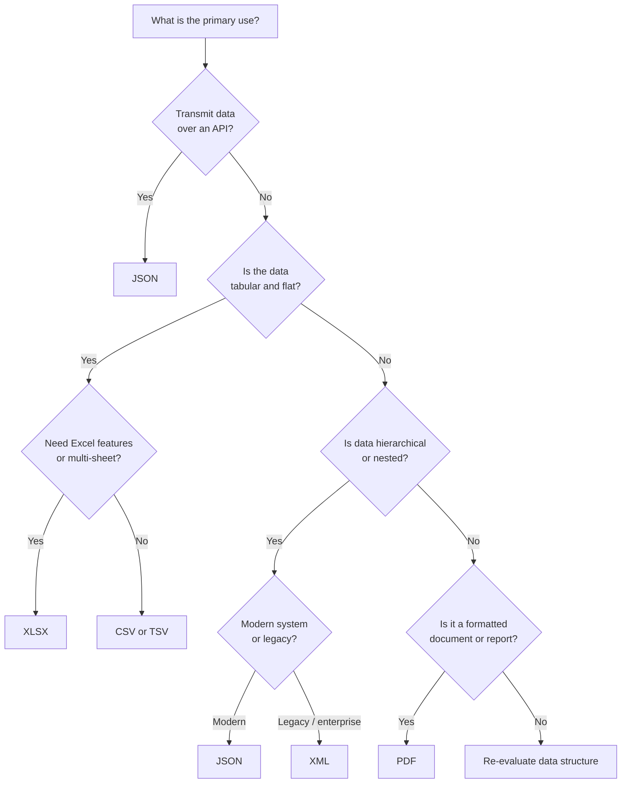

# Understanding Different Types of File Formats

## Overview

Data professionals work with a wide variety of file formats — ingesting them from source systems, transforming them mid-pipeline, and delivering them to downstream consumers. Choosing the wrong format leads to bloated storage costs, slow query performance, incompatible tooling, or loss of data fidelity.

This document covers the standard file formats, examining their internal structure, strengths, limitations, and appropriate use cases.

---

## Core Concept: What Is a File Format?

A file format defines the **structure, encoding, and rules** by which data is organized inside a file. Two files can contain the same information but be completely different in format — one might be CSV, another JSON — and the correct parser is required to read each one.

Understanding a format means understanding three things:

1. **Structure** — How is data laid out? (rows/columns, hierarchical, flat, binary, etc.)
2. **Readability** — Is it human-readable text or a binary representation?
3. **Portability** — Which systems, tools, and languages can consume it natively?

---

## 1. Delimited Text Files (CSV and TSV)

### What They Are

A **delimited text file** stores tabular data as plain text, where each line is a record (row) and values within that record are separated by a **delimiter**. Any character can serve as a delimiter; the most common are:

| Delimiter | Name | Format |
|---|---|---|
| `,` | Comma | CSV — Comma-Separated Values |
| `\t` | Tab | TSV — Tab-Separated Values |
| `:` | Colon | — |
| `\|` | Pipe | — |
| ` ` | Space | — |

### Structure

Each row represents one record. The first row is conventionally the column header defining field names. Fields containing the delimiter must be quoted (e.g., `"Smith, Jr."` in CSV).

```
employee_id,first_name,last_name,hire_date,salary
1001,Alice,Nguyen,2021-03-15,92000
1002,Bob,Martinez,2019-07-22,87500
```

### When to Use CSV vs. TSV

- **CSV** — general tabular data, maximum spreadsheet compatibility
- **TSV** — text fields containing commas (addresses, names with suffixes)
- Tab stops are rarely used in natural language text, making TSV a safer delimiter when fields contain punctuation

**Structural rules:**
- Each row (line) represents one record.
- The **first row** is conventionally the column header — it defines the field names.
- Each column can hold a different data type (date, string, integer, float, boolean).
- Field values may be of any length.
- Values containing the delimiter character must be **quoted** (e.g., `"Smith, Jr."` in a CSV).

### When to Use CSV vs. TSV

| Scenario | Recommended Format |
|---|---|
| General tabular data with no commas in values | CSV |
| Text fields that contain commas (e.g., addresses, names with suffixes) | TSV |
| Data with tab characters in values | CSV |
| Maximum compatibility with spreadsheet tools (Excel, Google Sheets) | CSV |

> **Why TSV over CSV?** Tab stops (`\t`) are rarely used in natural language text, making them a safer delimiter when field values contain punctuation-heavy content. A field like `"New York, NY"` breaks a naive CSV parser but is unambiguous in a TSV.

### Strengths

Universal compatibility, human-readable, lightweight (no markup overhead), standard schema representation via header row.

### Limitations

No native data typing (all values are text), no support for hierarchical/nested data, fragile with inconsistent delimiters, no metadata or schema enforcement within the file.

---

## 2. Microsoft Excel Open XML Spreadsheet (XLSX)

### What It Is

**XLSX** is the default format for Microsoft Excel workbooks since Excel 2007, built on the Open XML specification (ECMA-376). Despite being associated with a proprietary application, XLSX is an **open standard** — it is a ZIP archive of XML files.

### Structure

An XLSX file is organized as a **workbook** containing one or more **worksheets**. Each worksheet is a grid of rows and columns, at the intersection of which lies a **cell** holding a value (number, string, date, boolean, formula, or empty).

### Strengths

Open format accessible to most applications, rich feature set (formulas, charts, pivot tables), multiple sheets, no macro execution, explicit cell data typing.

### Limitations

Not ideal for large-scale pipelines (memory-intensive to parse), verbose and non-trivial to generate programmatically, not streamable — typically must load the entire file.

### Common Use in Data Engineering

XLSX is frequent as a **source format** (business teams produce it). It is rarely used as an intermediate or output format in automated pipelines — those use CSV, Parquet, or JSON.

### Internal Structure of XLSX

An `.xlsx` file is a **ZIP archive**. Unzipping it reveals:

```
[Content_Types].xml
xl/
  workbook.xml            ← sheet names, references
  worksheets/
    sheet1.xml            ← actual cell data
  sharedStrings.xml       ← string values (deduplicated)
  styles.xml              ← formatting definitions
  charts/                 ← chart definitions (if any)
```

### Challenges for Data Engineering Pipelines

- **Not streamable:** The entire file must be loaded into memory to parse (unlike CSV, which can be read line by line).
- **Formulas, not values:** A cell containing `=A1+B1` stores the formula, not the result, until the file is opened and calculated by Excel.
- **Multiple sheets create ambiguity:** A pipeline must explicitly specify which sheet to read.
- **Merged cells:** Cells merged across rows/columns break naive row-by-row parsing.
- **Formatting masquerading as data:** A cell may appear to show `2024-01-15` but actually store a serial number (`45306`) formatted as a date.

---

## 3. Extensible Markup Language (XML)

### What It Is

**XML** is a text-based markup language that encodes data in a format that is both human-readable and machine-readable. It uses custom, user-defined tags to describe data structure and meaning. XML was designed for **transmitting structured data between systems** and is platform-independent.

### Structure

XML organizes data in a **hierarchical tree** of elements with a single **root element** containing all others as children.

```xml
<?xml version="1.0" encoding="UTF-8"?>
<employees>
  <employee id="1001">
    <first_name>Alice</first_name>
    <last_name>Nguyen</last_name>
    <salary currency="USD">92000</salary>
  </employee>
</employees>
```

Key structural concepts: **elements** (named nodes), **attributes** (key-value pairs in opening tags), **root element** (top-level wrapper), **nesting** (child elements), **prolog** (XML declaration).

### XML vs. HTML

| Dimension | XML | HTML |
|---|---|---|
| Purpose | Data transport and storage | Web page rendering |
| Tags | User-defined | Predefined |
| Closing tags | Mandatory | Often optional |
| Validation | Against schema (XSD, DTD) | Against HTML spec |

### Strengths

Self-descriptive, platform and language independent, supports hierarchy and nesting, schema validation via XSD, widely adopted in enterprise (SOAP APIs, legacy systems).

### Limitations

Verbose (open/close tag syntax produces larger files than JSON or CSV), slower to parse, complex for simple data.

### Parsing Strategies for XML

Two primary approaches exist for parsing XML in data engineering:

**DOM (Document Object Model) Parsing** — loads the entire document into memory as a tree:

```python
import xml.etree.ElementTree as ET

tree = ET.parse("employees.xml")
root = tree.getroot()

for employee in root.findall("employee"):
    emp_id = employee.find("employee_id").text
    name = employee.find("first_name").text
    print(emp_id, name)
```

**SAX (Simple API for XML) Parsing** — event-driven, streams through the document without loading it all at once. Suitable for very large XML files.

### When XML Appears in Data Engineering

- **SOAP web services:** Legacy enterprise APIs (banking, insurance, government) often return XML payloads.
- **Configuration files:** Many systems (Hadoop, Maven, Spring) use XML for configuration.
- **Data exchange standards:** HL7 (healthcare), FpML (finance), XBRL (financial reporting) are XML-based standards.
- **RSS/Atom feeds:** News and content syndication formats.
- **Office file formats:** Internally, `.docx` and `.xlsx` files are XML documents inside a ZIP archive.

---

## 4. Portable Document Format (PDF)

### What It Is

**PDF** was developed by Adobe Systems to present documents with text, images, vector graphics, and fonts in a manner independent of application, hardware, and OS. A PDF renders identically on any device. It was designed for **document fidelity**, not data exchange.

### Structure

PDF is **not** a tabular or hierarchical data format. It encodes text as positioned character streams, images as binary blobs, fonts as embedded programs, and layout as positioning instructions. Extracting structured data from a PDF requires specialized tooling that reverse-engineers visual layout back into machine-readable structure.

### Common Uses in Data Engineering

- **Document storage** — legal contracts, financial reports, invoices
- **Form data** — interactive PDF forms with fillable fields
- **Source for extraction** — OCR or text extraction pipelines
- **Regulatory filings** — SEC filings, compliance reports

### Extracting Data from PDFs

PDF is the most common "accidental unstructured data" format in enterprise pipelines.

```python
# Extracting text from a PDF using pdfplumber
import pdfplumber

with pdfplumber.open("contract_q4_2024.pdf") as pdf:
    for page in pdf.pages:
        text = page.extract_text()
        print(text)

# Extracting a table from a PDF page
with pdfplumber.open("report.pdf") as pdf:
    table = pdf.pages[0].extract_table()
    for row in table:
        print(row)
```

> **Common Pitfall:** PDFs generated by scanning a physical document are images, not text. A text extraction library will return nothing useful. These require **OCR (Optical Character Recognition)** tooling (e.g., Tesseract, AWS Textract) to convert pixel data to text before any further processing.

### Strengths

Universal rendering, compact for rich documents, supports interactive forms, trusted in legal/financial contexts.

### Limitations

Not designed for data extraction, not queryable, scanned PDFs are images requiring OCR.

---

## 5. JavaScript Object Notation (JSON)

### What It Is

**JSON** is a lightweight, text-based, open standard for representing structured data. Despite referencing JavaScript, JSON is **language-independent** — it can be read, written, and parsed in virtually every language. It was designed for transmitting structured data over the web and is the dominant format for web APIs.

### Structure

JSON is built on two fundamental structures:
1. **Object** — unordered collection of key/value pairs in `{}`
2. **Array** — ordered list of values in `[]`

Value types: string, number, boolean, null, object, array.

```json
[
  {
    "employee_id": 1001,
    "first_name": "Alice",
    "hire_date": "2021-03-15",
    "salary": 92000,
    "skills": ["Python", "SQL", "Spark"],
    "address": { "city": "San Francisco", "state": "CA" }
  }
]
```

JSON naturally accommodates **nested objects** and **arrays** within a single record — a capability flat formats like CSV lack.

### JSON in APIs and Web Services

JSON is the default response format for the vast majority of modern REST APIs. When a data engineer queries an API, the response almost always arrives as JSON.

```python
# Calling a REST API and parsing the JSON response
import requests

response = requests.get("https://api.example.com/employees")
data = response.json()  # Parses the JSON string into a Python dict/list

for employee in data:
    print(employee["first_name"], employee["salary"])
```

### Strengths

Language-independent, supports nesting, wide browser and web compatibility, compact relative to XML, versatile data types, de facto standard for APIs.

### Limitations

No comments, no built-in schema enforcement (JSON Schema is optional and external), numbers are IEEE 754 floats by default, not column-oriented (Parquet or ORC better for analytical queries).

---

## Flat Files

A **flat file** is a plain-text or binary file that stores data in a **two-dimensional, tabular structure** — rows and columns — with no hierarchical relationships, embedded logic, or internal references between records.

### Core Characteristics

- **Self-contained:** Each row is independent; no joins or relational links
- **Plain text (usually):** Human-readable in any text editor
- **Single table:** One dataset per file
- **Delimiter or fixed-width:** Fields separated by delimiter or fixed character count
- **No schema enforcement:** Validation happens at the application level

### Two Subtypes

| Subtype | Description | Example |
|---|---|---|
| **Delimited** | Fields separated by a special character | CSV, TSV, pipe-delimited |
| **Fixed-width** | Each field occupies a set number of characters | Legacy mainframe exports |

### Comparison: Flat Files vs. Spreadsheets

| Dimension | Flat File (CSV) | Spreadsheet (XLSX) |
|---|---|---|
| **Structure** | Single table | Multiple sheets in one workbook |
| **Metadata** | None (no formatting, formulas) | Rich (formulas, formatting, charts) |
| **Typing** | All text | Explicit cell types |
| **Tooling** | Any text editor or programming language | Excel, Google Sheets, pandas with library |
| **Pipeline use** | Directly ingested — no library required | Requires a parser library |

---

## XML and Apache Avro

Avro schemas can be defined in XML in addition to the more common JSON format. This is the extent of the relationship between XML and Avro.

| Aspect | XML | Avro |
|---|---|---|
| Schema format | XML itself | JSON (XML optionally supported) |
| Data encoding | Verbose text | Compact binary |
| Schema required? | Optional (DTD/XSD) | Always required |
| Typical use case | Config, web/enterprise services | Big data pipelines (Hadoop, Kafka) |

Avro's data encoding is compact binary — not XML, not JSON. XML schema definitions are rarely used in practice; JSON schema format is the standard across the Avro ecosystem.

---

## Format Comparison Summary

| Dimension | CSV / TSV | XLSX | XML | PDF | JSON |
|---|---|---|---|---|---|
| **Structure** | Flat tabular | Tabular (multi-sheet) | Hierarchical tree | Document / layout | Hierarchical |
| **Human-readable** | Yes | Via application | Yes | Visually | Yes |
| **Supports nesting** | No | No | Yes | N/A | Yes |
| **Schema enforcement** | No | Cell types only | XSD/DTD | N/A | Optional |
| **Ideal for APIs** | No | No | Legacy (SOAP) | No | Yes |
| **Large-scale pipelines** | Efficient | Memory-intensive | Verbose | No | Moderate |

---

## Choosing the Right Format: Decision Guide



> **Best Practice:** In production data pipelines, flat files (especially CSV/TSV) should be treated as an **ingestion source**, not a storage layer. Once data enters a pipeline, move it to a typed, schema-enforced format (Parquet, Avro, a relational table) as early as possible to eliminate ambiguity and improve downstream performance.

No single format is universally best — the right choice is determined by the system interface, the data's structure, the volume, and the downstream consumer's requirements.

---

## Key Takeaways

- **Delimited files (CSV/TSV)** are the workhorse of flat tabular data exchange — simple, universal, but limited to two dimensions and untyped.
- **XLSX** is standard for business spreadsheets; convert to CSV or Parquet for processing at scale.
- **XML** is self-descriptive and hierarchical but verbose — a disadvantage in high-throughput pipelines.
- **PDF** is a presentation format, not a data format — treat it as unstructured.
- **JSON** is dominant for web APIs and semi-structured data; its nesting support makes it far more expressive than CSV.
- **Flat files** are self-contained, single-table, plain-text data stores — the simplest format category.
- **Avro** uses JSON for schema definition (XML optional) and compact binary for data encoding.
