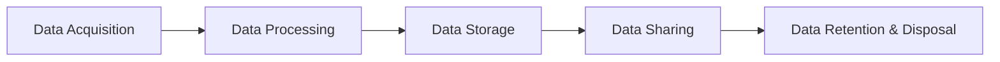

> **Course 1:** Introduction to Data Engineering
> **Module 3:** Data Engineering Lifecycle

# Governance and Compliance

## Overview

**Data Governance** is a collection of principles, practices, and processes that maintain the **security, privacy, and integrity of data** throughout its lifecycle. A data governance framework encompasses every part of an organization's data management process — including technologies, databases, and data models.

**Compliance** is the set of processes and procedures through which an organization adheres to governance regulations in a legal and ethical manner.

> Governance and compliance go hand-in-hand and are critical at every stage of the data lifecycle.

---

## What Data Do Regulations Protect?

Regulations primarily seek to protect **personal and sensitive data** — that is, data that:

- Can be traced back to an individual
- Can be used to identify an individual
- Contains information that could be used to cause harm (e.g., data about race, sexual orientation, or genetic information)

---

## Key Regulations

### Geographic Regulations

| Regulation | Jurisdiction | Scope |
|---|---|---|
| **GDPR** (General Data Protection Regulation) | European Union | Protects the personal data and privacy of EU citizens for transactions within EU member states |
| **CCPA** (California Consumer Privacy Act) | California, USA | Protects customer data for California residents |

### Industry-Specific Regulations

| Regulation | Industry | Scope |
|---|---|---|
| **HIPAA** | Healthcare | Governs the collection and disclosure of protected health information |
| **PCI DSS** | Retail / Payments | Governs credit card data handling and processing |
| **SOX** | Finance | Governs the handling and reporting of financial information |

### Regulatory Context in the Data Lifecycle

These regulations affect design decisions at every layer of a data platform. For a detailed mapping of how compliance requirements influence data store selection and architecture, see [Data Store Selection Factors](c1_m3_factors_selecting_designing_data_stores.md).

---

## What is Compliance?

Compliance covers the **processes and procedures** through which an organization adheres to regulations and conducts its operations legally and ethically. Key requirements include:

- Establishing controls and checks to meet regulatory obligations
- Maintaining a **verifiable audit trail** that demonstrates adherence to regulations at all times

### Consequences of Non-Compliance

- Financial penalties
- Damage to public perception
- Loss of trust among clients and partners

> Compliance is not a one-time activity — it is an **ongoing process** requiring a blend of people, process, and technology that continues to evolve.

---

## Governance Across the Data Lifecycle

Governance regulations require organizations to be **clear and transparent** at every stage of the data lifecycle:

### Data Acquisition

- What data needs to be collected, and what **contracts and consent** provide legal basis for collecting it
- The **intended use** of the data, published as a privacy policy and communicated internally and to individuals whose data is collected
- The **minimum amount** of data needed to meet the defined purpose (e.g., is an email address sufficient, or is a phone number also required?)

### Data Processing

- Details of **how** personal data will be processed
- The **legal basis** for processing (e.g., a contract or consent)

### Data Storage

- **Where** data will be stored
- Specific security measures to prevent both **internal and external breaches**

### Data Sharing

- Which **third-party vendors** in the supply chain may have access to collected data
- How vendors will be held **contractually accountable** to the same regulations the organization is liable for

### Data Retention and Disposal

- **Policies and processes** for retaining and deleting personal data after a designated period
- Ensuring that deleted data is **removed from all locations**, including third-party systems

> At each stage, an **auditable trail** of personal data acquisition, processing, storage, access, retention, and deletion must be maintained.

---

## Technology Controls for Governance Compliance

### Authentication and Access Control

| Control | Description |
|---|---|
| **Authentication** | Layered verification (passwords, tokens, biometrics) to confirm a user is who they claim to be |
| **Access Control** | Ensures authorized users access only the resources (systems, tables, rows, columns) permitted by their role and user group |

For the broader security framework governing these controls, see [Security in Data Platforms](security_in_data_platforms.md).

### Encryption and Data Masking

| Control | Description |
|---|---|
| **Encryption at Rest** | Data stored in storage systems is encoded and only legible when decrypted via a secure key |
| **Encryption in Transit** | Data moving through browsers, services, applications, and storage systems is encrypted |
| **Anonymization** | Abstracts the presentation layer without changing the underlying data — e.g., replacing characters with symbols on screen |
| **Pseudonymization** | A de-identification process where personally identifiable information is replaced with artificial identifiers so the dataset cannot be traced back to an individual (e.g., replacing a name with a random value from a names dictionary) |

> **Anonymization vs. Pseudonymization:** Anonymization changes how data is *displayed* without altering the database. Pseudonymization changes the *data itself* by replacing identifiers — the dataset can theoretically be re-identified if the mapping is known, unlike full anonymization.

### Hosting Options

On-premise and cloud systems must comply with requirements and restrictions for **international data transfers** — particularly relevant under GDPR for data crossing EU borders.

### Monitoring and Alerting

| Capability | Description |
|---|---|
| **Security monitoring** | Proactively monitors, tracks, and reacts to security violations across infrastructure, applications, and platforms |
| **Audit reports** | Track access and operations on data to maintain a verifiable compliance trail |
| **Alerting** | Flags security breaches as they occur based on pre-defined severity and urgency levels, triggering immediate remedial action |

See [Security in Data Platforms](security_in_data_platforms.md) for the full security monitoring framework.

### Data Erasure

Data erasure is a **software-based method of permanently clearing data** by overwriting it — ensuring it cannot be recovered.

> **Erasure vs. Deletion:** Simple deletion does not permanently remove data — deleted data can still be retrieved. Data erasure overwrites the storage location, making recovery impossible. This distinction is critical for compliance with retention and disposal obligations.

---

## Key Takeaways

- **Data Governance** is a framework of principles, practices, and processes for maintaining security, privacy, and integrity across the data lifecycle.
- Regulations primarily protect **personal and sensitive data** — information traceable to or harmful to an individual.
- Key regulations include **GDPR** (EU), **CCPA** (California), **HIPAA** (healthcare), **PCI DSS** (retail/payments), and **SOX** (finance).
- **Compliance is ongoing** — not a one-time checkbox — and requires people, process, and technology working together.
- Every stage of the data lifecycle (acquisition, processing, storage, sharing, retention, disposal) carries specific governance obligations.
- An **auditable trail** must be maintained across all lifecycle stages.
- Technology controls for compliance include: **authentication and access control, encryption, data masking (anonymization and pseudonymization), compliant hosting, monitoring and alerting, and data erasure**.
- **Data erasure** ≠ deletion — erasure overwrites data permanently; deleted data can still be retrieved.

## Cross-References

- [Security in Data Platforms](security_in_data_platforms.md) — encryption, access control, and the full security framework
- [Data Store Selection Factors](c1_m3_factors_selecting_designing_data_stores.md) — regulatory compliance as a design criterion
- [Data Integration Platforms](data_integration_platforms.md) — governance in data pipelines
- [Metadata Management](metadata_management.md) — data lineage and cataloging for compliance
- [Data Roles Overview](data_roles_overview.md) — the Data Manager role and governance ownership
