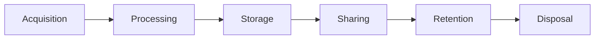

> **Course 1:** Introduction to Data Engineering
> **Module 3:** Data Engineering Lifecycle

# Summary and Highlights: Governance and Compliance

## Overview

This summary consolidates the key concepts covered in the Governance and Compliance lesson. For the full treatment with detailed examples and technology controls, see [Governance and Compliance](governance_compliance.md).

---

## Data Governance

**Data Governance** is a collection of principles, practices, and processes that maintain the **security, privacy, and integrity of data** through its lifecycle.

---

## What Data Needs Protection?

| Data Type | Description |
|---|---|
| **Personal Information** | Data that can be traced back to an individual |
| **Sensitive Personal Information** | Data that can be used to identify or cause harm to an individual (e.g., race, sexual orientation, genetic information) |

---

## Key Regulations

### Geographic

| Regulation | Jurisdiction | Scope |
|---|---|---|
| **GDPR** | European Union | Protects personal data and privacy of EU citizens for transactions within EU member states |

### Industry-Specific

| Regulation | Full Name | Industry |
|---|---|---|
| **HIPAA** | Health Insurance Portability and Accountability Act | Healthcare |
| **PCI DSS** | Payment Card Industry Data Security Standard | Retail |
| **SOX** | Sarbanes-Oxley Act | Financial |

---

## Compliance

Compliance covers the **processes and procedures** through which an organization adheres to regulations and conducts operations legally and ethically.

Organizations must maintain an **auditable trail** of personal data through every stage of its lifecycle:

---

## Technology Controls for Governance Implementation

| Control | Purpose |
|---|---|
| **Authentication and Access Control** | Verify identity and restrict access based on role and user group |
| **Encryption and Data Masking** | Protect data at rest and in transit; anonymize or pseudonymize sensitive data |
| **Compliant Hosting Options** | On-premise and cloud systems that meet requirements for international data transfers |
| **Monitoring and Alerting** | Proactively track security violations and flag breaches in real time |
| **Data Erasure** | Permanently overwrite deleted data so it cannot be retrieved |

---

## Key Takeaways

- Data Governance maintains **security, privacy, and integrity** of data throughout its lifecycle.
- **Personal and Sensitive Personal Information** must be protected under governance regulations.
- Key regulations include **GDPR** (EU-wide), **HIPAA** (healthcare), **PCI DSS** (retail), and **SOX** (finance).
- Compliance is an **ongoing process** requiring an auditable trail across all six lifecycle stages: acquisition, processing, storage, sharing, retention, and disposal.
- Technology controls — authentication, encryption, masking, compliant hosting, monitoring, and data erasure — are essential enablers of governance compliance.
- **Data erasure** permanently overwrites data, ensuring deleted data cannot be retrieved — unlike simple deletion.

---

## Cross-References

- [Governance and Compliance](governance_compliance.md) — full lesson with detailed stage-by-stage obligations
- [Security in Data Platforms](security_in_data_platforms.md) — CIA triad and security framework
