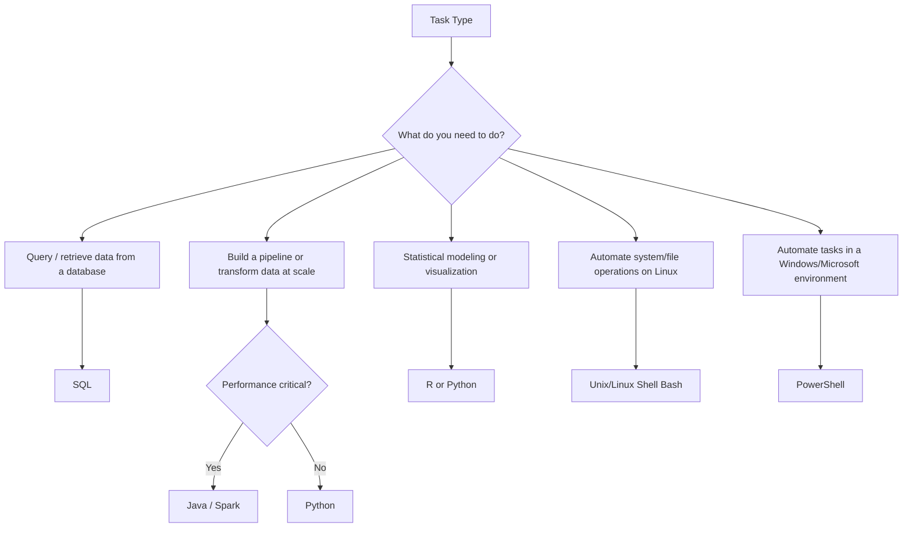

# Languages for Data Professionals

> **LTHP Status:** NEW — Module 2 ecosystem expansion.
> **Source files:** `languages-professionals.md` (primary, 314 lines), `languages-data-professionals.md` (companion enrichment, 263 lines)

## Overview

Data professionals work across a broad set of tasks — querying databases, building pipelines, automating operations, performing statistical analysis, and visualizing results. No single language covers all of these needs. Instead, the field has converged on **three categories of languages**, each optimized for a different class of work:

| Category | Purpose | Examples |
|---|---|---|
| **Query Languages** | Accessing and manipulating data in databases | SQL |
| **Programming Languages** | Developing applications, data processing logic | Python, R, Java |
| **Shell & Scripting Languages** | Automating repetitive and operational tasks | Unix/Linux Shell, PowerShell |

> **Core Principle:** Proficiency in at least one language from each category is considered essential for any practicing data professional.

---

## 1. Query Languages

### 1.1 SQL — Structured Query Language

SQL is the foundational query language for accessing and manipulating data in relational databases — and, increasingly, in data warehouses, data lakes with SQL engines, and other repositories. SQL is declarative: you describe *what* you want (not *how* to get it) and the database engine figures out the execution plan.

#### What SQL Can Do

- Insert, update, and delete records in a database
- Create new databases, tables, and views
- Write stored procedures — reusable sets of instructions that can be defined once and called repeatedly
- Query and retrieve data with precise filtering, aggregation, joining, and sorting logic

#### Advantages of SQL

| Advantage | Detail |
|---|---|
| **Portability** | Platform-independent; runs across virtually all database systems (PostgreSQL, MySQL, SQL Server, Oracle, SQLite, and even BigQuery, Snowflake, Spark SQL) |
| **Simple syntax** | English-like syntax with keywords such as `SELECT`, `INSERT INTO`, `UPDATE`, `DELETE` — lowers the barrier to entry |
| **Conciseness** | Achieves complex data operations in fewer lines than most general-purpose languages |
| **Interpreted execution** | Code executes immediately upon submission — no compile step — excellent for rapid prototyping |
| **Performance at scale** | Databases are optimized to execute SQL against large datasets far faster than equivalent row-by-row code |
| **Ubiquity** | One of the most widely adopted languages in the world, with an enormous community and decades of documentation |

```sql
-- Retrieve total sales by region
SELECT
    region,
    SUM(sale_amount) AS total_sales,
    COUNT(transaction_id) AS transaction_count
FROM retail_transactions
WHERE transaction_date >= '2024-01-01'
GROUP BY region
ORDER BY total_sales DESC;
```

Beyond queries, SQL also handles data manipulation and schema definition:

```sql
-- Insert a new record
INSERT INTO employees (employee_id, first_name, department, salary)
VALUES (1004, 'Diana', 'Engineering', 91000);

-- Update an existing record
UPDATE employees
SET salary = 97000
WHERE employee_id = 1001;

-- Delete a record
DELETE FROM employees
WHERE employee_id = 1002;

-- Create a new table
CREATE TABLE departments (
    department_id   INT PRIMARY KEY,
    department_name VARCHAR(100) NOT NULL
);

-- Create a view
CREATE VIEW engineering_team AS
SELECT employee_id, first_name, last_name, salary
FROM employees
WHERE department = 'Engineering';

-- Write a stored procedure
CREATE PROCEDURE get_employee_by_department(IN dept_name VARCHAR(100))
BEGIN
    SELECT * FROM employees WHERE department = dept_name;
END;
```

> **Note:** While core SQL is standardized (ANSI SQL), most vendors implement extensions — T-SQL (SQL Server), PL/pgSQL (PostgreSQL), PL/SQL (Oracle). Window functions, JSON operators, and procedural extensions differ across platforms.

---

## 2. Programming Languages

### 2.1 Python

Python is a widely-used, open-source, general-purpose, high-level programming language and the dominant language in data engineering, data science, and machine learning today.

#### Why Python for Data Work

- **Readability and simplicity:** Syntax closely mirrors natural language; concepts expressed in fewer lines of code compared to older languages.
- **Low learning curve:** Widely regarded as one of the easiest languages for beginners.
- **High-computational capability:** Well-suited for processing vast amounts of data using parallel processing libraries.
- **Multi-paradigm:** Supports object-oriented, imperative, functional, and procedural programming.
- **Cross-platform:** Runs on Windows, Linux, and macOS.
- **Rich ecosystem:** Extensive libraries for data manipulation, machine learning, web scraping, and pipeline orchestration.

#### Key Python Libraries for Data Professionals

| Library | Category | Use Case |
|---|---|---|
| **Pandas** | Data manipulation | Loading, cleaning, transforming tabular data |
| **NumPy** | Numerical computing | Array operations, mathematical functions |
| **SciPy** | Scientific computing | Statistical tests, signal processing |
| **Matplotlib** | Data visualization | Line charts, bar graphs, histograms |
| **Seaborn** | Statistical visualization | Aesthetic plots built on Matplotlib |
| **BeautifulSoup** | Web scraping | Parsing HTML/XML for data extraction |
| **Scrapy** | Web scraping | Full-featured crawling and scraping framework |
| **OpenCV** | Image processing | Computer vision and image analysis |
| **SQLAlchemy** | Database connectivity | ORM and raw SQL across multiple databases |
| **Apache Airflow** | Pipeline orchestration | Scheduling and monitoring data workflows |

```python
import pandas as pd

df = pd.read_csv("sales_data.csv")
print(df.head())
df_clean = df.dropna()
df_west = df_clean[df_clean["region"] == "West"]
sales_summary = df_west.groupby("product")["sale_amount"].sum().reset_index()
```

---

### 2.2 R

R is an open-source programming language and environment purpose-built for statistical analysis, data visualization, machine learning, and statistics. It is the language of choice in academic research, biostatistics, and any domain where statistical rigor and rich visualization are paramount.

#### Key Strengths of R

| Strength | Detail |
|---|---|
| **Statistical dominance** | Unmatched depth in statistical modeling, hypothesis testing, and experimental design |
| **Superior visualization** | `ggplot2` produces publication-quality charts; `Plotly` enables interactive web-based charts |
| **Extensibility** | CRAN hosts over 20,000 packages; developers can define new functions to extend capabilities |
| **Structured + unstructured data** | Handles both tabular and text/document data natively |
| **Interoperability** | Can be paired with Python (via `reticulate`) and with databases |
| **Reporting** | R Markdown enables dynamic documents; Shiny enables interactive web apps |

#### Key R Libraries

| Library | Use Case |
|---|---|
| **ggplot2** | Grammar-of-graphics data visualization |
| **Plotly** | Interactive charts and dashboards |
| **dplyr** | Data manipulation (filter, select, mutate, summarize) |
| **tidyr** | Data tidying and reshaping |
| **caret / tidymodels** | Machine learning workflows |
| **shiny** | Interactive web applications |

```r
library(ggplot2)
data(mpg)

ggplot(mpg, aes(x = displ, y = hwy, color = class)) +
  geom_point(size = 3, alpha = 0.7) +
  labs(title = "Engine Displacement vs. Highway MPG",
       x = "Engine Displacement (L)", y = "Highway MPG",
       color = "Vehicle Class") +
  theme_minimal()
```

---

### 2.3 Java

Java is an object-oriented, class-based, platform-independent programming language. It occupies a unique position in the data ecosystem: while data scientists rarely write Java day-to-day, most of the major big data frameworks are written in Java.

**Big data tools built on Java:**

| Tool | Role |
|---|---|
| Apache Hadoop | Distributed storage and batch processing (MapReduce) |
| Apache Hive | SQL-on-Hadoop query engine |
| Apache Spark | Unified analytics engine (also has Scala/Python APIs) |
| Apache Kafka | Distributed event streaming |
| Apache Flink | Stream processing |
| Elasticsearch | Distributed search and analytics |

#### Java in the Data Analytics Lifecycle

| Phase | Java Use Case |
|---|---|
| Data ingestion | Importing and exporting large data volumes |
| Data cleaning | Processing and transforming raw data at scale |
| Statistical analysis | Running computation-heavy analytical workloads |
| Data visualization | Building enterprise dashboards and reporting tools |
| Performance-critical workloads | Speed-critical projects where JVM performance is an advantage |

> **Best Practice:** For most data engineering work, Python or Scala is preferred for productivity. Java is most relevant when extending or customizing big data frameworks at the core level. Data engineers today typically interact with Java-based tools through higher-level APIs in Python (PySpark, kafka-python) or Scala.

---

## 3. Shell and Scripting Languages

Shell scripting languages are designed for automating repetitive, time-consuming operational tasks directly at the operating system level. They are indispensable for infrastructure automation, pipeline scheduling, and system administration in data environments.

### 3.1 Unix/Linux Shell

A Unix/Linux Shell script is a plain text file containing a series of UNIX commands executed sequentially by the shell interpreter (`bash`, `sh`, `zsh`). Shell scripting is the standard tool for automating operational tasks in data engineering environments, which predominantly run on Linux.

#### Typical Shell Script Operations

| Operation Type | Examples |
|---|---|
| **File manipulation** | Moving, renaming, archiving, and compressing data files |
| **Program execution** | Triggering ETL jobs, running Python scripts, calling APIs |
| **System administration** | Disk backups, evaluating and rotating system logs |
| **Installation automation** | Installing and configuring complex software environments |
| **Batch processing** | Running scheduled batches of data processing jobs |
| **Routine backups** | Automated database dumps and file system snapshots |

```bash
#!/bin/bash
# Archive processed CSV files older than 7 days
SOURCE_DIR="/data/incoming"
BACKUP_DIR="/data/archive"
find "$SOURCE_DIR" -name "*.csv" -mtime +7 | while read file; do
    mv "$file" "$BACKUP_DIR/"
done
```

---

### 3.2 PowerShell

PowerShell is a cross-platform automation tool and configuration framework developed by Microsoft. Unlike traditional Unix shells that operate on plain text, PowerShell is **object-based** — it passes structured .NET objects through its pipeline rather than raw text strings.

#### Key Characteristics

| Feature | Detail |
|---|---|
| **Object-based pipeline** | Commands pass .NET objects — enabling filtering, sorting, measuring, grouping without text parsing |
| **Structured data support** | Natively optimized for JSON, CSV, XML, and REST API responses |
| **Cross-platform** | Available on Windows, Linux, and macOS (PowerShell Core v6+) |
| **Data engineering use cases** | Data mining, building GUIs, creating charts, dashboards, and interactive reports |

#### PowerShell vs. Unix Shell

| Property | Unix/Linux Shell | PowerShell |
|---|---|---|
| Primary OS | Linux / macOS | Windows (cross-platform in PS Core) |
| Pipeline type | Text streams | .NET objects |
| Structured data | Manual parsing (awk, sed, jq) | Native cmdlets for CSV, JSON, XML |
| Best for | Linux server automation, cron jobs | Windows automation, Microsoft ecosystem |

```powershell
# Fetch data from a REST API and filter results
$response = Invoke-RestMethod -Uri "https://api.example.com/sales" -Method GET
$highValueSales = $response | Where-Object { $_.amount -gt 1000 }
$highValueSales | Export-Csv -Path "C:\data\high_value_sales.csv" -NoTypeInformation
```

---

## Language Selection Guide



---

## Summary and Key Takeaways

| Language | Category | Primary Strength | Typical Data Engineering Use |
|---|---|---|---|
| **SQL** | Query | Data retrieval and manipulation | Querying databases, building views, stored procedures |
| **Python** | Programming | Versatility and ecosystem | ETL pipelines, data wrangling, ML, API integration |
| **R** | Programming | Statistics and visualization | Statistical analysis, research, rich visual reporting |
| **Java** | Programming | Performance and big data tooling | Hadoop/Spark ecosystem, speed-critical processing |
| **Unix/Linux Shell** | Scripting | OS-level automation | Scheduling jobs, file ops, system admin tasks |
| **PowerShell** | Scripting | Object-based structured automation | Windows/cloud automation, REST API processing |

**Practical guidance for aspiring data engineers:**

- **SQL is non-negotiable** — nearly every data role requires it regardless of specialization.
- **Python is the most versatile** — its ecosystem covers the full data engineering lifecycle from ingestion to visualization.
- **Shell scripting dramatically increases productivity** for pipeline automation and scheduled jobs.
- **R is a strong complement** if your work involves heavy statistical analysis or academic/research contexts.
- **Java knowledge becomes relevant** when working deeply with big data infrastructure (Hadoop, Kafka internals, Spark extensions).
- **PowerShell is particularly valuable** in Windows-centric or Microsoft Azure environments.
- Data engineers rarely use only one language. A typical pipeline might use shell scripts to trigger jobs, Python to fetch and clean data, SQL to load and query a warehouse, and Spark for distributed transformation at scale.
