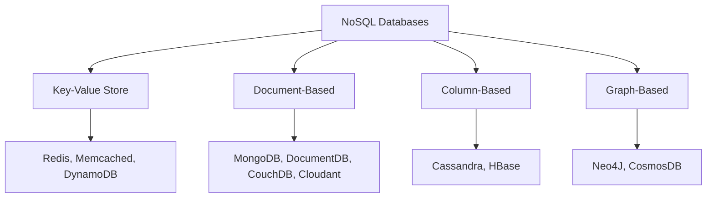
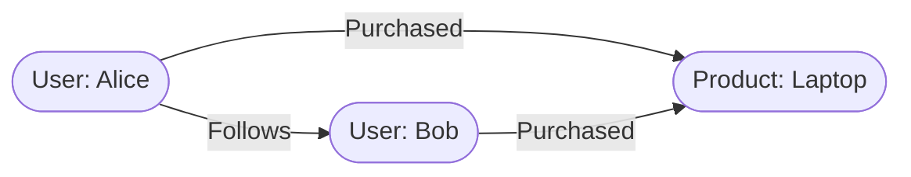

# NoSQL Databases

> **LTHP Status:** NEW — Module 2 ecosystem expansion.
> **Source files:** `nosql-databases.md` (primary, 233 lines), `nosql-column-based-qa.md` (companion clarification, 152 lines)

## Introduction

**NoSQL** — short for "Not Only SQL" — refers to a broad class of database systems built for specific data models with flexible schemas. While NoSQL databases have existed for many years, they have surged in popularity in the era of cloud computing, big data, and high-volume web and mobile applications, where they are valued for their scale, performance, and ease of use.

Key distinctions from relational databases:
- Do not use the traditional row/column/table design with fixed schemas
- Typically do not use SQL to query data (though some support SQL-like interfaces)
- Allow data to be stored in a schema-less or free-form fashion
- Can store structured, semi-structured, and unstructured data within the same record

> **Common Misconception:** "NoSQL" does not mean "No SQL forever" — it means the database is *not limited to* SQL. Some NoSQL systems do support SQL or SQL-like query interfaces.

---

## The Four Types of NoSQL Databases



---

### 1. Key-Value Store

Data is stored as a collection of key-value pairs, where the key is a unique identifier representing an attribute of the data and the value can be anything from a simple integer or string to a complex JSON document.

```json
{
  "user:1001": {
    "name": "Jane Smith",
    "preferences": { "theme": "dark", "language": "en" },
    "last_login": "2024-02-10T14:32:00Z"
  }
}
```

**Best suited for:** storing user session data and preferences, real-time recommendations and targeted advertising, in-memory data caching.

**Not ideal when:** you need to query on specific data values (only key-based lookup is efficient), relationships between data values are required, or multiple unique keys are needed per record.

| Platform | Notes |
|---|---|
| **Redis** | In-memory, extremely fast; widely used for caching |
| **Memcached** | Lightweight in-memory caching |
| **DynamoDB** | AWS-managed, highly scalable key-value and document store |

---

### 2. Document-Based

Each record and all its associated data are stored together within a single document (typically JSON or BSON). These databases enable flexible indexing, powerful ad hoc queries, and analytics over document collections.

```json
{
  "_id": "order_78901",
  "customer": { "id": "C001", "name": "Acme Corp" },
  "items": [
    { "sku": "A100", "qty": 2, "price": 49.99 },
    { "sku": "B200", "qty": 1, "price": 129.99 }
  ],
  "total": 229.97,
  "status": "shipped"
}
```

**Best suited for:** eCommerce platforms, medical records storage, CRM platforms, analytics platforms.

**Not ideal when:** complex multi-table/multi-operation transactions are required, or advanced search queries spanning many document types are needed.

| Platform | Notes |
|---|---|
| **MongoDB** | Most widely used document database |
| **DocumentDB** | AWS-managed, MongoDB-compatible |
| **CouchDB** | Open-source, HTTP-based API |
| **Cloudant** | IBM-managed, CouchDB-based |

---

### 3. Column-Based

Column-based databases store data in cells grouped by columns rather than rows. A logical grouping of columns that are typically accessed together is called a **column family**.

> **Understanding column-oriented storage (from companion Q&A):** The name "column-based" is misleading because relational databases also have columns. The difference is how data is physically stored on disk. In a row-oriented database (RDBMS), all fields of a single record are written together as one continuous block — to read one column across all rows, the database must scan every full row. In a column-oriented database, all values for a single column are stored together as one continuous block — to read one column, the database goes directly to that column's block, skipping unrelated columns entirely.

**Row storage (RDBMS):**
```
[C001, Alice, alice@mail.com, New York, $1200]
[C002, Bob,   bob@mail.com,  Austin,   $450 ]
[C003, Carol, carol@mail.com, Chicago, $3800]
```

**Column storage (NoSQL):**
```
CustomerID:     [C001, C002, C003]
Name:           [Alice, Bob, Carol]
PurchaseTotal:  [$1200, $450, $3800]
```

A **column family** is a named group of related columns that are typically accessed together. For example, Profile columns (name, email, city) are accessed when displaying a user's account page; PurchaseHistory columns (last order, total, loyalty tier) are accessed when showing order summaries. By keeping these families separate on disk, the database fetches only the column family it needs.

Column databases like Cassandra are also optimized for heavy write throughput because new data simply appends to the relevant column blocks — no need to locate and update an existing row. This makes writes extremely fast and ideal for time-series data.

**Best suited for:** systems requiring heavy write throughput, time-series data, weather data, IoT data.

**Not ideal when:** complex or frequently changing query patterns are needed, or ad hoc queries across many columns are required.

| Platform | Notes |
|---|---|
| **Cassandra** | Highly scalable, distributed; popular for IoT and time-series |
| **HBase** | Hadoop-native column store; built for massive datasets |

| Situation | Column-Based a Good Fit? |
|---|---|
| Aggregating one or two columns across millions of rows | Yes — reads only the needed column |
| Storing time-series data (IoT, metrics, logs) | Yes — append-optimized writes |
| Heavy, continuous write throughput | Yes |
| Retrieving a complete single record with all its fields | Less ideal — must reassemble from multiple column blocks |
| Complex or ad hoc queries with changing patterns | No — query patterns should be known and stable |

---

### 4. Graph-Based

Graph databases use a graphical model to represent and store data: nodes contain the data entities, and edges represent the relationships between entities.



Graph databases excel at traversing relationships — something that is computationally expensive in relational databases (multiple joins) but native and fast in a graph model.

**Best suited for:** social networks, real-time product recommendations, network diagrams and topology mapping, fraud detection, access management and identity graphs.

**Not ideal when:** processing very high volumes of transactions is required, or large-volume analytics queries are the primary workload.

| Platform | Notes |
|---|---|
| **Neo4J** | The most widely adopted graph database |
| **CosmosDB** | Microsoft Azure-managed; supports multiple NoSQL models including graph |

---

## Advantages of NoSQL

| Advantage | Description |
|---|---|
| **Handles diverse data types** | Stores structured, semi-structured, and unstructured data natively |
| **Distributed by design** | Can run as distributed systems scaled across multiple data centers, leveraging cloud infrastructure |
| **Cost-effective scaling** | Scale-out architecture adds capacity by adding new nodes — no expensive hardware upgrades |
| **Flexibility and agility** | Simpler design, better availability, and improved scalability enable faster iteration |
| **Low-cost hardware** | Designed specifically for low-cost commodity hardware |

---

## NoSQL vs. RDBMS: Key Differences

| Dimension | RDBMS | NoSQL |
|---|---|---|
| **Schema** | Rigid, predefined schema — all data must conform | Schema-agnostic — unstructured and semi-structured data supported |
| **Data types supported** | Structured only | Structured, semi-structured, and unstructured |
| **Scalability** | Vertical scaling (bigger hardware) | Horizontal scale-out (more nodes) |
| **ACID compliance** | Full ACID support | Most NoSQL databases do not support full ACID |
| **Query language** | SQL (standardized) | Varies by platform; no universal standard |
| **Maturity** | Mature, well-documented, lower risk | Relatively newer; risks less predictable |
| **Best for** | Structured data, complex transactions | Big data, real-time apps, flexible schemas |

---

## Choosing the Right NoSQL Type

```
What is your primary need?
├── Simple fast lookups by unique key? → Key-Value Store (Redis, DynamoDB)
├── Self-contained records with flexible structure? → Document-Based (MongoDB, CouchDB)
├── Heavy writes or time-series data? → Column-Based (Cassandra, HBase)
├── Highly connected data with relationships? → Graph-Based (Neo4J, CosmosDB)
└── None of the above? → Re-evaluate requirements or consider RDBMS
```

---

## Summary and Key Takeaways

- **NoSQL = "Not Only SQL"** — freedom from SQL-only constraints, not the absence of SQL.
- NoSQL databases are purpose-built for scale, flexibility, and performance in cloud, big data, and high-velocity application environments.
- There are **four main types**: Key-Value, Document-Based, Column-Based, and Graph-Based — each optimized for a different data model and access pattern.
- Column-oriented storage stores values for each column together on disk (not row by row), enabling queries to touch only the column blocks they need.
- NoSQL's primary strengths are handling diverse data types, distributed scale-out, and low infrastructure cost.
- Its primary trade-off vs. RDBMS is the lack of full ACID compliance and the absence of a universal query standard.
- NoSQL databases are not a replacement for RDBMS — they are a complement, and the right choice depends on the data model, access patterns, and scalability requirements of the workload.
