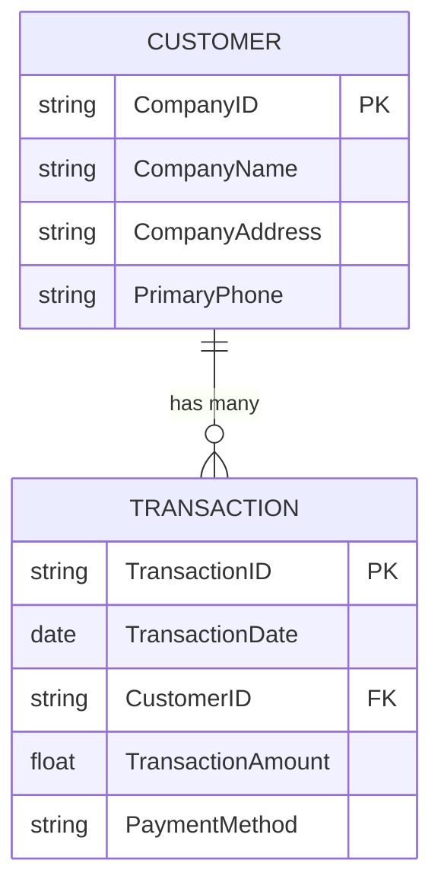

# Relational Databases (RDBMS)

> **LTHP Status:** NEW — Module 2 ecosystem expansion.
> **Source files:** `rdbms.md` (primary, 196 lines), `oltp-rdbms-qa.md` (companion OLTP clarification, 57 lines)

## Introduction

A **relational database** is a collection of data organized into a table structure, where tables can be linked — or related — based on data common to each. This ability to relate tables and query across them is what makes relational databases one of the most powerful and enduring technologies in data engineering.

---

## Core Structure: Tables, Rows, and Columns

Relational databases store data in tables, which consist of rows (individual records) and columns (attributes that describe each record).

### Example: Customer Table

| Company ID | Company Name | Company Address | Primary Phone |
|---|---|---|---|
| C001 | Acme Corp | 123 Main St | 555-0101 |
| C002 | Globex Inc | 456 Oak Ave | 555-0202 |

### Example: Transaction Table

| Transaction Date | Customer ID | Transaction Amount | Payment Method |
|---|---|---|---|
| 2024-01-15 | C001 | $1,200.00 | Credit Card |
| 2024-01-20 | C002 | $850.00 | Bank Transfer |
| 2024-02-01 | C001 | $300.00 | Credit Card |

The two tables are related via the shared `Customer ID` field, enabling queries that join them together.



By joining the tables on `CustomerID`, you can produce entirely new result sets — such as a customer statement consolidating all transactions within a given period.

```sql
SELECT c.CompanyName, t.TransactionDate, t.TransactionAmount, t.PaymentMethod
FROM Customer c
JOIN Transaction t ON c.CompanyID = t.CustomerID
WHERE t.TransactionDate BETWEEN '2024-01-01' AND '2024-03-31'
ORDER BY t.TransactionDate;
```

---

## RDBMS vs. Flat Files

| Feature | Flat File / Spreadsheet | Relational Database (RDBMS) |
|---|---|---|
| **Volume** | Limited rows and columns | Optimized for millions of records |
| **Relationships** | None — single table only | Tables can be linked via keys |
| **Data integrity** | Manual, error-prone | Enforced via data types and constraints |
| **Redundancy** | High — data duplicated across sheets | Minimized via normalization |
| **Query power** | Basic filters | Full SQL query engine |
| **Security** | File-level only | Granular, role-based access control |

---

## Key Advantages of RDBMS

### 1. Flexibility
SQL allows you to add new columns, add new tables, rename relations, and make other structural changes while the database is running and queries are happening — without downtime.

### 2. Reduced Redundancy
Customer information appears in a single entry in the customer table. The transaction table stores only a link (foreign key) back to that record — eliminating duplicate data.

### 3. Ease of Backup and Disaster Recovery
Export and import operations can run while the database is live. Cloud-based RDBMS instances perform continuous mirroring, meaning data loss on failure can be measured in seconds or less.

### 4. ACID Compliance

RDBMS transactions are ACID-compliant, ensuring reliability and consistency even in the event of failures.

| Property | Definition |
|---|---|
| **Atomicity** | A transaction is all-or-nothing — it either fully completes or is fully rolled back |
| **Consistency** | A transaction brings the database from one valid state to another; no partial or corrupt states |
| **Isolation** | Concurrent transactions execute independently without interfering with each other |
| **Durability** | Once a transaction is committed, it persists — even in the event of a system crash |

### 5. Performance at Scale
SQL enables retrieval of millions of records in seconds, making RDBMS ideal for both high-volume transactional and analytical workloads.

### 6. Security Architecture
Relational databases provide controlled, role-based access to data and support enforcement of data governance standards and policies.

---

## Popular RDBMS Platforms

### On-Premises / Self-Managed

| Platform | Type |
|---|---|
| IBM DB2 | Commercial |
| Microsoft SQL Server | Commercial (closed-source) |
| Oracle Database | Commercial (closed-source) |
| MySQL | Open-source |
| PostgreSQL | Open-source |

### Cloud-Based (Database-as-a-Service)

| Platform | Provider |
|---|---|
| Amazon RDS | AWS |
| Google Cloud SQL | Google Cloud |
| IBM DB2 on Cloud | IBM |
| Oracle Cloud | Oracle |
| Azure SQL (SQL Azure) | Microsoft |

> **Note:** RDBMS is a mature and well-documented technology, making it relatively straightforward to learn and easier to find qualified talent compared to emerging data technologies.

---

## Use Cases

### Online Transaction Processing (OLTP)
RDBMS is well-suited for OLTP workloads because it accommodates a large number of concurrent users, supports insert, update, and delete of small data volumes at high rates, and handles frequent queries with fast response times.

> **OLTP clarification (from companion Q&A):** OLTP transactions are individually tiny (one order, one payment, one login) but happen at massive frequency. RDBMS is optimized precisely for this pattern. The defining RDBMS advantage for OLTP is supporting the ability to insert, update, or delete small amounts of data at high rates — not the general structural advantages like minimizing redundancy (normalization) or easy backup (disaster recovery).

| OLTP Requirement | How RDBMS Meets It |
|---|---|
| Many concurrent users | RDBMS can accommodate a large number of users simultaneously |
| High-frequency small writes | Supports insert/update/delete of small data volumes at high rates |
| Fast query turnaround | Supports frequent queries and updates with fast response times |

### Data Warehousing (OLAP)
In data warehouse environments, relational databases can be optimized for Online Analytical Processing (OLAP), where historical data is analyzed for business intelligence.

### IoT Solutions
IoT requires speed and lightweight footprint. RDBMS can support edge device data collection and processing in constrained environments when a lean relational engine is deployed.

---

## Limitations of RDBMS

| Limitation | Description |
|---|---|
| **Poor fit for unstructured/semi-structured data** | RDBMS is designed for structured data with defined schemas; it does not handle JSON blobs, media files, or free-form text analytics well |
| **Migration complexity** | Moving data between two RDBMS platforms requires schemas and data types to be identical between source and destination tables |
| **Field length limits** | Database fields have a maximum length; data exceeding that limit will not be stored — it is silently truncated or rejected |

---

## Summary and Key Takeaways

- Relational databases store data in tables (rows = records, columns = attributes) and link tables via common fields (keys).
- SQL is the standard querying language and enables retrieval of millions of records in seconds.
- Key advantages include flexibility, reduced redundancy, ACID compliance, strong security, and ease of backup.
- Popular platforms span open-source (MySQL, PostgreSQL) and commercial (Oracle, SQL Server, IBM DB2), with cloud-based equivalents from all major providers.
- RDBMS is best suited for structured data and excels in OLTP and OLAP workloads.
- Its primary limitations are around semi-structured/unstructured data, migration friction, and field length constraints.
- Despite the rise of big data and NoSQL, RDBMS remains the predominant technology for working with structured data.
