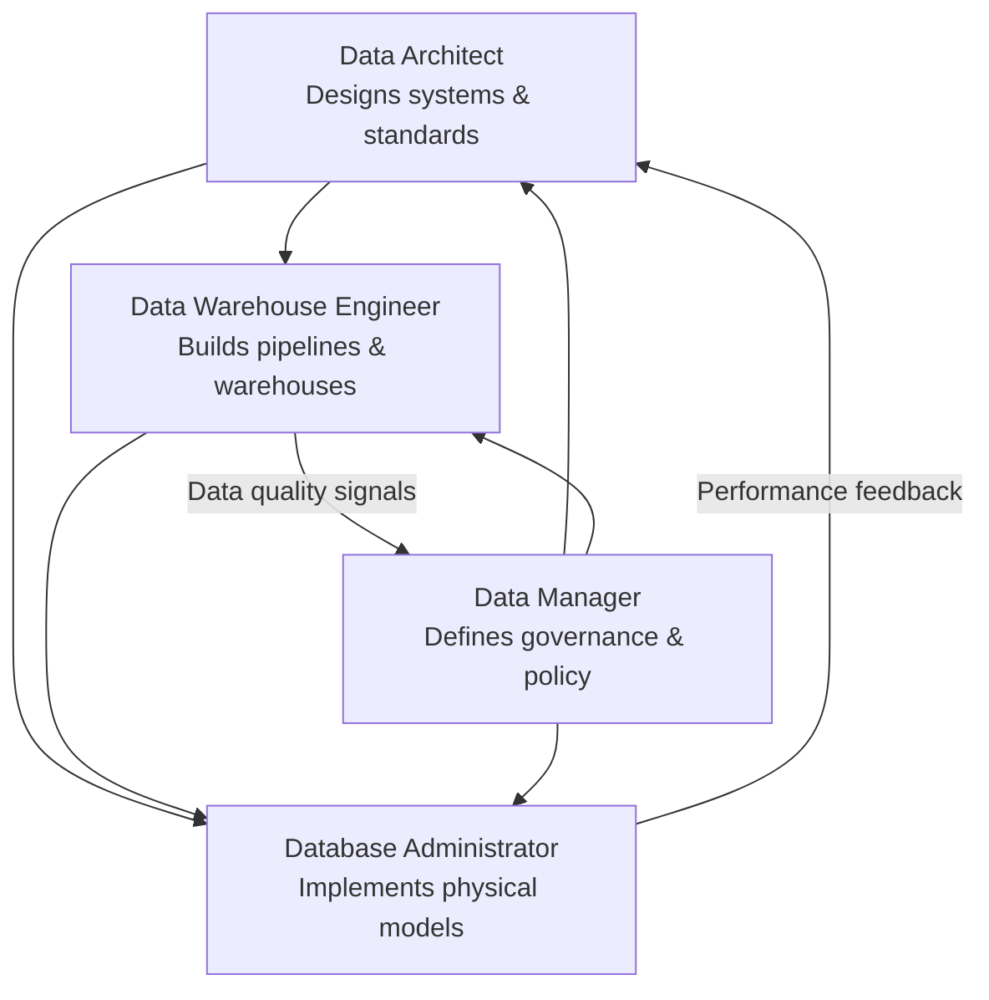

# Role Comparisons Deep Dive

Modern data organizations rely on a set of distinct but deeply interconnected roles to build, govern, and maintain data systems. While these roles often collaborate closely, each carries a unique mandate — from hands-on pipeline construction to high-level governance strategy. This page provides a comprehensive breakdown of four foundational data roles.

## Four Foundational Roles: At a Glance

| Aspect | Data Warehouse Engineer | Data Architect | Data Manager | Database Administrator |
|--------|----------------------|---------------|--------------|----------------------|
| Focus | Data pipelines and warehousing | Data warehouses, big data, analytics platforms | Strategy and governance | Operational management |
| Key Deliverables | ETL pipelines, warehouse deployment | Scalable data management systems | Policies, standards, compliance | Reliable, secure DB operations |
| Tools | Kafka, Spark, cloud warehouses | ERD tools, MySQL, MongoDB, cloud platforms | Governance platforms | SQL, monitoring tools |
| Collaboration | Architects, DBAs, BI analysts | Engineers, DBAs, business leaders | Business + technical teams | Engineers, architects |

## Role Deep Dives

### Data Warehouse Engineer
The builders of the data movement layer. Primary concern is the reliable flow of data from source systems into analytical storage.

**Key deliverables:** ETL/ELT pipelines, data transformation (deduplication, normalization, enrichment), warehouse deployment and schema design (including partitioning strategies).

**Tools used:**

| Tool Category | Examples |
|---|---|
| Stream Processing | Apache Kafka, Apache Flink |
| Batch Processing | Apache Spark, dbt, Apache Airflow |
| Cloud Data Warehouses | Snowflake, Google BigQuery, Amazon Redshift |

**Why this role matters:** Without well-built pipelines, data simply does not move — or moves incorrectly. The Data Warehouse Engineer ensures that analytics and reporting teams always have access to fresh, trustworthy data.

**Common pitfall:** Over-engineering transformations inside the ETL layer rather than pushing logic downstream to a transformation tool like dbt, which is harder to test and version-control.

### Data Architect
Operates at the design level — defines how data systems are structured, interconnected, and scaled. Their work precedes implementation and provides the blueprint that engineers build from.

**Key deliverables:** Scalable data management systems (end-to-end data platforms), data models (ERDs, dimensional star/snowflake schemas, data vault designs), platform standards and technology approvals.

**Tools used:**

| Tool Category | Examples |
|---|---|
| Modeling & ERD Tools | erwin, Lucidchart, dbdiagram.io, draw.io |
| Relational Databases | MySQL, PostgreSQL |
| NoSQL / Big Data | MongoDB, Apache Cassandra, Apache Hive |
| Cloud Data Platforms | AWS Glue, Azure Synapse, Google Cloud Dataflow |

**Why this role matters:** Well-designed architecture prevents technical debt and enables the organization to adapt as data volumes and use cases evolve. Poor architectural decisions compound over time, leading to fragile, expensive-to-maintain systems.

**Best practice:** Document architecture decision records (ADRs) capturing the reasoning behind major design choices, enabling future teams to understand *why* a system was built a certain way.

### Data Manager
A governance and strategy role — defines the rules, standards, and processes governing how data is created, stored, used, and protected.

**Key deliverables:** Policies (formal documentation of data handling rules including retention, classification, and access), standards (naming conventions, metadata requirements, data quality thresholds, taxonomy definitions), compliance with GDPR/CCPA/HIPAA and industry-specific mandates.

**Tools used:**

| Tool Category | Examples |
|---|---|
| Data Governance Platforms | Collibra, Alation, Apache Atlas, Microsoft Purview |
| Data Catalog Tools | DataHub, Amundsen, Google Data Catalog |
| Policy & Compliance | OneTrust, BigID |

**Why this role matters:** Data without governance becomes a liability. The Data Manager ensures data assets are discoverable, trustworthy, and compliant — turning raw data into a governed, reliable organizational resource.

**Common pitfall:** Treating data governance as a one-time project rather than an ongoing program. Policies must evolve as systems, regulations, and business needs change.

### Database Administrator (DBA)
The most operationally focused role — responsible for the day-to-day operational health of database systems. Keeping databases running reliably, securely, and at peak performance.

**Key deliverables:** Uptime management, backup and recovery, patching, incident response, user access control and role-based permissions, encryption at rest and in transit, audit logging, query optimization, index management, statistics maintenance, capacity planning.

**Tools used:**

| Tool Category | Examples |
|---|---|
| Query & Management | SQL (ANSI, T-SQL, PL/SQL), pgAdmin, DBeaver |
| Monitoring Tools | Datadog, SolarWinds DPA, pgBadger, Grafana |
| Backup & Recovery | Veeam, pgBackRest, AWS RDS automated snapshots |

**Why this role matters:** Even the most elegant data architecture fails if the underlying databases are slow, insecure, or unavailable. The DBA is the last line of defense for data reliability and the first responder when production systems degrade.

**Best practice:** Implement automated backup verification — regularly restore from backups in a test environment to confirm recoverability before it's needed in a real incident.

## Role Interaction Map

The four roles form a feedback loop: Architects design what Engineers build, DBAs operate what Architects specify, Managers govern all of it. No single role covers all of data engineering — it is a team discipline requiring multiple specializations working in concert.

## Architect vs. Engineer Analogy

**Data Architect = Master Planner / Architect of a building**
Designs the entire blueprint of how data should be organized, stored, and accessed. Creates big-picture plan covering warehouses, big data platforms, analytics tools. Decides strategies for security, retrieval, scalability.

**Data Warehouse Engineer = Builder**
Takes the architect's blueprint and brings it to life. Focuses on designing, building, and maintaining the data warehouse. Develops collection and loading processes.

**Analogy:** If the Data Architect designs the city, the Data Warehouse Engineer builds a key building within it.

## Data Analysis vs. Business Analysis

**Data Analysis = Detective:** Looks closely at clues (data) to find patterns, relationships, or answers. Cleans, organizes, and explains what data shows (e.g., exploring whether customers prefer one product over another).

**Business Data Analysis = Strategist:** Uses the detective's findings to make smart business decisions. Looks at insights and recommends actions (e.g., if data shows a sales drop, the business analyst recommends changing marketing strategies).

| Role | Analogy | Focus |
|------|---------|-------|
| Data Analysis | Detective | Understanding data itself |
| Business Analysis | Strategist | Using insights to guide decisions |

| Job Family | DWE | DA | DBA | DM |
|---|---|---|---|---|---|
| Design | ✅ Leads | ✅ Owns | — | ❌ (policy) |
| Build | ✅ Owns | ✅ Specifies | — | — |
| Operate | — | — | ✅ Owns | — |
| Govern | — | ✅ Standards | ❌ (enforces) | ✅ Owns |
| Strategy | — | ✅ Owns | — | ✅ Owns |

## Career Pathways

Data Warehouse Engineers often grow into Architect roles. DBAs may specialize into cloud database engineering or move toward architecture. The four roles form a feedback loop across the data lifecycle. Data Architects design systems and standards; Data Warehouse Engineers build pipelines and warehouses; Database Administrators operate the physical databases and monitor performance; Data Managers define governance and policy. Each owns a distinct slice (design, build, govern, operate) but no role functions in isolation. Understanding these pathways helps engineers plan their career trajectory: hands-on pipeline work leads naturally to architectural design, while operational expertise can evolve into cloud specialization.

## Key Takeaways

| Theme | Insight |
|-------|---------|
| Specialization | Each role owns a distinct slice of the data lifecycle |
| Interdependence | No role functions in isolation — all four collaborate |
| Tooling Divergence | Tool sets reflect each role's focus area |
| Shared Goal | All roles serve trustworthy, accessible, performant, compliant data |
| Career Pathways | Engineers grow into Architects; DBAs move toward cloud engineering |

## Glossary

| Term | Definition |
|------|------------|
| ERD | Entity-Relationship Diagram — a visual model of data entities and their relationships |
| Data Vault | A modeling methodology for auditability and scalability in enterprise data warehouses |
| Data Catalog | A metadata management tool for discovering and understanding data assets |

[Cross-ref: topics/data_roles_overview.md — broader role landscape including Data Analyst and Data Scientist]
[Cross-ref: topics/data_engineering_specializations.md — specialization-specific details with hospital example]
[Cross-ref: topics/defining_data_engineering.md — data engineer vs analyst vs scientist from practitioner perspective]
