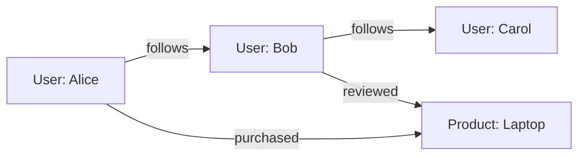
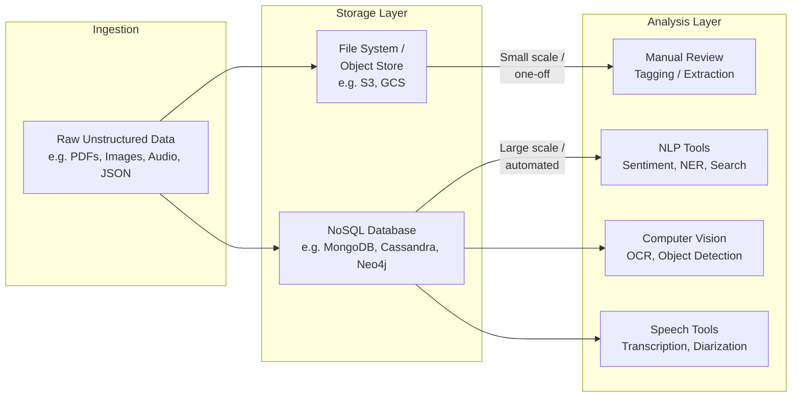

# Unstructured Data: Storage and Analysis Paths

> **LTHP Status:** NEW — Module 2 ecosystem expansion.
> **Source file:** `unstructured-data-storage-analysis.md` (primary, 269 lines)

## Overview

Unstructured data — text documents, PDFs, images, audio recordings, social media posts, video files — has no fixed schema and cannot be forced into traditional rows-and-columns storage without significant pre-processing. This creates a fundamental challenge: how do you store something that has no predictable shape, and how do you extract meaning from it once it's stored?

The answer depends on scale and intent. At small volumes or for one-off investigations, a lightweight file-based approach with human review is often the most pragmatic option. At scale, dedicated NoSQL databases and specialized analysis tooling become necessary. These two paths are not mutually exclusive — many real-world pipelines begin with manual exploration and graduate to automated, tool-assisted analysis as data volumes grow.

---

## The Core Distinction: Structured vs. Unstructured Data Handling

With structured data (e.g., a relational database), the storage engine and the analysis interface are tightly coupled. You store data in a SQL database and you query it with SQL — the same system handles both concerns.

With unstructured data, this tight coupling breaks down. There is no universal query language for a folder of PDFs or a collection of audio recordings.

| Concern | Structured Data | Unstructured Data |
|---|---|---|
| **Storage** | Relational database (PostgreSQL, MySQL, etc.) | File system / document store / NoSQL |
| **Analysis interface** | SQL | Varies by content type (NLP, CV, search, etc.) |
| **Schema requirement** | Required at write time | Not required |
| **Scalability of analysis** | Native (SQL engines scale with the DB) | Requires external tooling |

The practical implication: when designing a pipeline for unstructured data, you must make *two* independent architectural decisions — where to store the data, and what tools will analyze it.

---

## Path 1: Files and Documents → Manual Analysis

### When to Use This Path

Appropriate when data volumes are small or bounded (e.g., a one-time batch of scanned contracts), the analysis task is exploratory or non-repeating, automation is not yet justified, and the output is human judgment rather than a machine-generated signal.

### Storage: File Systems and Document Repositories

Unstructured data is stored exactly as it arrives — as files. Common storage locations include local or network file systems (`.pdf`, `.docx`, `.jpg`, etc.), cloud object stores (Amazon S3, Google Cloud Storage, Azure Blob Storage), and document management systems (SharePoint, Google Drive, Confluence) that add metadata and access control.

> **Best Practice:** Even when storing raw files, attach as much metadata as possible (source, ingestion timestamp, content type, size, owner). This metadata, often managed in a separate catalog or database, is what makes later retrieval feasible.

### Analysis: Manual Review

Analysis in this path means a human engaging directly with the content: reading and summarizing, tagging and labeling, using point tools (Ctrl+F, grep), or extracting key data points into a spreadsheet.

### Limitations of This Path

| Limitation | Description |
|---|---|
| **Does not scale** | A team cannot manually review millions of documents |
| **Inconsistency** | Different reviewers may interpret the same content differently |
| **No repeatability** | Cannot be re-run automatically when new data arrives |
| **No aggregation** | Cannot compute averages across large datasets via manual review |

Manual analysis is a valid starting point, but it is a dead end at scale.

---

## Path 2: NoSQL Databases → Specialized Analysis Tools

### When to Use This Path

Appropriate when data volumes are large (millions of records), analysis must be automated and repeatable, multiple downstream consumers need access, and the analysis task is well-defined enough to be expressed as a pipeline or model.

### Storage: NoSQL Databases

NoSQL databases are designed to store data without requiring a fixed schema. There are four major NoSQL data models:

**Document Stores** (MongoDB, CouchDB) store data as self-describing documents, typically JSON or BSON. Best for JSON/XML data, content management, user profiles, product catalogs, logs. Documents are queryable but there is no join semantics across documents by default.

```json
// Example MongoDB document — note the variable structure per record
{
  "_id": "doc_001",
  "type": "support_ticket",
  "customer": "Acme Corp",
  "description": "Login page returns 502 after password reset.",
  "tags": ["auth", "bug", "high-priority"],
  "attachments": ["screenshot_1.png"]
}
```

**Key-Value Stores** (Redis, DynamoDB) store data as simple key-to-value pairs. Extremely fast reads and writes but no query capability on the value's contents. Best for caching, session storage, real-time leaderboards.

**Wide-Column Stores** (Apache Cassandra, HBase) organize data into rows and dynamic columns where each row can have a different set of columns. Horizontally scalable to petabyte scale, optimized for append-heavy workloads. Best for time-series data, IoT sensor streams, event logs.

**Graph Databases** (Neo4j, Amazon Neptune) store data as nodes (entities) and edges (relationships), enabling traversal of complex relationships that would require expensive JOINs in a relational system. Best for social networks, fraud detection, knowledge graphs, recommendation engines.



### NoSQL vs. Relational — Side-by-Side

| Dimension | Relational (SQL) | NoSQL |
|---|---|---|
| Schema | Fixed, enforced at write | Flexible, schema-on-read |
| Scaling model | Vertical (bigger server) | Horizontal (more servers) |
| Query language | SQL (universal) | Database-specific |
| Joins | Native and efficient | Limited or absent |
| ACID compliance | Strong by default | Varies (eventual consistency common) |
| Best fit | Structured, relational data | Unstructured, high-volume, diverse data |

> **Common Pitfall:** Choosing a NoSQL store without considering the data model. Each NoSQL type is optimized for a specific access pattern. Using a key-value store for data requiring rich querying leads to poor performance.

### Analysis: Specialized Tools by Content Type

#### Text and Natural Language Processing (NLP)

Text data requires NLP tools that can parse language semantically. Common tasks include sentiment analysis (Hugging Face Transformers, VADER, spaCy), named entity recognition (spaCy, Stanford NLP), topic modeling (LDA, BERTopic), text classification (scikit-learn, BERT), summarization (GPT-based models, BART), and full-text search (Elasticsearch, OpenSearch, Apache Solr).

```python
import spacy
nlp = spacy.load("en_core_web_sm")
doc = nlp("Acme Corp filed a complaint with the SEC on March 15, 2024.")
for ent in doc.ents:
    print(f"{ent.text:30} → {ent.label_}")
# Acme Corp → ORG, SEC → ORG, March 15, 2024 → DATE
```

> **Note on Full-Text Search:** Elasticsearch and OpenSearch are commonly layered on top of a primary NoSQL or object store. Documents live in MongoDB or S3; Elasticsearch holds an inverted index for fast keyword retrieval. These two systems serve different purposes and are often run in tandem.

#### Computer Vision (Images and Video)

Image and video data requires pixel-level analysis. Tasks include image classification (TensorFlow, PyTorch, AWS Rekognition), object detection (YOLO, Detectron2), OCR (Tesseract, AWS Textract, Google Vision API), facial recognition (AWS Rekognition, DeepFace), and video analysis (OpenCV, Google Video Intelligence API).

#### Audio and Speech Analysis

Audio data typically requires transcription followed by NLP. Tasks include speech-to-text (Whisper, Google Speech-to-Text, AWS Transcribe), speaker diarization (pyannote.audio), audio classification (librosa + ML models), and sentiment from speech (AWS Comprehend after transcription).

---

## The Storage–Analysis Split: A Design Principle

> **In unstructured data pipelines, storage and analysis are decoupled layers. You choose each independently, and you connect them deliberately.**

This stands in contrast to structured data, where the storage system *is* the analysis interface (e.g., a Postgres database queried with SQL). In unstructured pipelines:

1. **Storage layer** answers: "Where does this data live in a way that is durable, scalable, and retrievable?"
2. **Analysis layer** answers: "What specialized processing does this content type require to extract meaning?"



The choice of path is driven by **volume and repeatability**, not by the content type alone. A company with 100 scanned contracts can handle them manually. The same company with 10 million contracts must automate.

---

## Summary and Key Takeaways

- **Unstructured data has no fixed schema**, meaning it cannot be stored in or queried by traditional relational databases without significant pre-processing.
- **Two paths exist**: file/document storage with manual analysis (low volume, one-off), and NoSQL storage with specialized analysis tools (high volume, automated).
- **NoSQL databases** are the foundational storage mechanism for unstructured data at scale. The four major types — document, key-value, wide-column, and graph — each serve different data models and access patterns.
- **Analysis tools are content-specific**: text requires NLP, images require computer vision, audio requires speech processing. There is no equivalent of SQL that works across all content types.
- **Storage and analysis are decoupled** in unstructured pipelines — a deliberate architectural pattern that distinguishes this domain from structured data engineering.
- **Full-text search engines** (Elasticsearch, OpenSearch) are a common analysis layer for text-heavy NoSQL collections, run alongside the primary data store.
- **Scale and repeatability** are the key decision drivers when choosing between the two paths.
