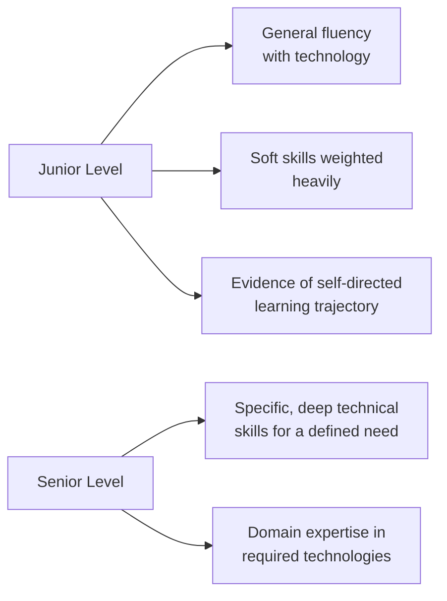
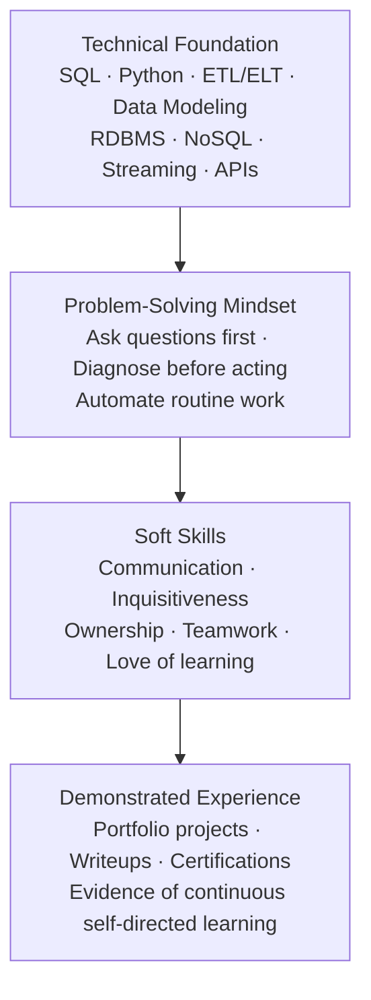

> **Course 1:** Introduction to Data Engineering
> **Module 4:** Career Opportunities and Data Engineering in Action
> **Section 4.1:** Career Opportunities and Learning Paths

# Viewpoints: What Do Employers Look for in a Data Engineer?

## Overview

There is no single, universal answer to what employers look for in a data engineer — it varies by company size, role focus, and seniority level. This reading compiles perspectives from multiple hiring managers and practicing data engineers to surface the consistent themes and role-specific nuances that shape hiring decisions.

---

## Practitioner Perspectives

### Practitioner 1 — Breadth of Technology Exposure and Data Movement Skills

The emphasis placed on specific skills varies significantly from role to role. Two dominant patterns emerge across job postings:

| Role Type | Primary Hiring Focus |
|---|---|
| **Data-source-oriented roles** | Breadth of exposure across data source types — relational databases, NoSQL databases, in-memory databases, and key-value stores |
| **Data-movement-oriented roles** | Experience designing and executing data movement processes — pulling data from RDBMSes, NoSQL systems, and social media APIs and loading it into analytical databases such as Hadoop |

In addition to technical breadth, **analytical and problem-solving skills** are consistently valued across role types.

---

### Practitioner 2 — Inquisitiveness, Communication, and Ownership (Hiring Manager Perspective)

This practitioner, who actively hires for data roles, identifies three core qualities they evaluate above technical skills:

**1. Inquisitiveness**

> *"I look for somebody who doesn't just take the data given to them, but asks additional questions just to figure out what direction to take something."*

A representative interview question they use:
> *"Somebody comes to you and says the database is slow. What do you do?"*

The expected answer is **not** a specific technical fix (tuning memory, checking a metric). The expected answer is to **ask clarifying questions** — exploring the different possible sources of slowness before acting. The question tests whether the candidate thinks before they act.

**2. Communication**

Data professionals never work in isolation. The ability to communicate clearly with engineers, analysts, business stakeholders, and other teams is non-negotiable.

**3. Work Ethic and Ownership**

A strong work ethic paired with a sense of **genuine ownership** over one's work — not just completing tasks, but caring about the outcome — is a key differentiator.

---

### Practitioner 3 — Company Size Context and Core Technical Essentials

**Company size shapes the scope of the role:**

| Context | Expectation |
|---|---|
| **Large company** | Data engineer may have a narrow, specialized focus — e.g., building ETL pipelines only |
| **Small startup** | Data engineer is expected to wear many hats and bring broad skills across the full lifecycle |

**Core technical skills considered near-universal:**

- SQL
- Data modeling
- ETL methodologies
- Programming (Python specifically cited)

**Behavioral traits employers want alongside technical skills:**

- Curiosity
- Good communication
- Love of learning

---

### Practitioner 4 — Comprehensive Technical Skills Checklist

| Skill Area | Description |
|---|---|
| **RDBMS** | Proficiency with relational database systems |
| **NoSQL Databases** | Expertise with non-relational data stores |
| **Schema Design** | Ability to design effective data models and schemas |
| **ETL and ELT** | Experience with both extract-transform-load and extract-load-transform patterns |
| **Streaming Data** | Ability to handle real-time or near-real-time data pipelines |
| **Multiple File Formats** | Working with varied data formats (JSON, CSV, Parquet, Avro, etc.) |
| **Web APIs and Web Scraping** | Pulling data from external sources via APIs or scraping techniques |
| **Basic Analytical Skills** | Foundational ability to query, explore, and interpret data |
| **Problem Solving** | Diagnosing and resolving data pipeline and system issues |
| **Automation** | Ability to automate routine operational tasks |

---

### Practitioner 5 — Seniority, Learning Trajectory, Portfolio, and Culture Fit (Hiring Manager Perspective)

This practitioner draws a clear distinction between what they look for at different seniority levels:

**For junior candidates:**

- Familiarity with at least one relevant technology as a foundation to grow from
- *What have you done to learn the field?* — courses taken, blogs read, active learning directions
- **Portfolio evidence:** projects built, technical writeups, presentations, or videos produced
- Soft skills: clear communication, ability to articulate your work
- **Culture fit:** collaborative working style and readiness to function in a team environment

**On credentials:**

> A degree or certificate is a good starting point to get *noticed* — but candidates must also demonstrate the right technical and soft skills and stand out from other candidates through their portfolio and communication ability.

---

## Synthesized Framework

Combining all perspectives, employer expectations fall into four layers:

| Layer | Weight at Junior Level | Weight at Senior Level |
|---|---|---|
| **Technical Foundation** | General fluency across tools | Specific, deep expertise |
| **Problem-Solving Mindset** | Demonstrated in interviews | Proven through experience |
| **Soft Skills** | Weighted heavily | Assumed; culture fit assessed |
| **Demonstrated Experience** | Portfolio projects, courses | Track record of delivery |

---

## Summary

| Theme | Key Takeaway |
|---|---|
| **No universal standard** | Role requirements vary significantly by company, team, and seniority — always read the job description carefully |
| **Inquisitiveness is prized** | Employers want engineers who ask the right questions before jumping to solutions |
| **Company size changes scope** | Large companies want specialists; startups want generalists who can cover the full lifecycle |
| **Core technical baseline** | SQL, Python, data modeling, ETL/ELT, and familiarity with both relational and NoSQL systems are the most universally cited requirements |
| **Soft skills matter at every level** | Communication, ownership, curiosity, and teamwork are evaluated at junior and senior levels alike |
| **Credentials open doors; portfolios close them** | A degree or certificate gets you noticed; demonstrated work — projects, writeups, presentations — differentiates you |
| **Junior hiring is about potential** | At entry level, employers prioritize learning trajectory and general technical fluency over deep specialization |

---

## Cross-References

- [Viewpoints: Get into Data Engineering](viewpoints_get_into_data_engineering.md) — practitioner accounts of entering the field
- [Data Engineering Learning Path](data_engineering_learning_path.md) — structured pathways into the profession
- [Career Opportunities in Data Engineering](c1_m4_career_opportunities.md) — job market, specializations, and career ladder
- [Skills and Responsibilities](skills_and_responsibilities.md) — technical/functional/soft skill taxonomy
- [Data Engineering Specializations](data_engineering_specializations.md) — specialization tracks with tools and responsibilities
