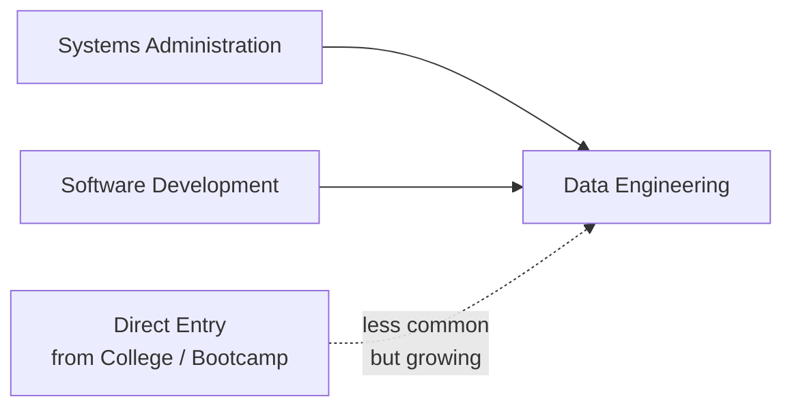
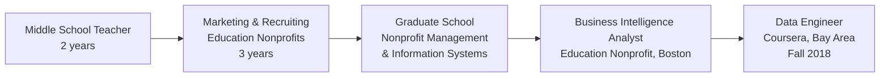

> **Course 1:** Introduction to Data Engineering
> **Module 4:** Career Opportunities and Data Engineering in Action
> **Section 4.1:** Career Opportunities and Learning Paths

# Viewpoints: Get into Data Engineering

## Overview

This reading presents personal accounts from practicing data engineers on how they entered the field. The paths are varied — spanning traditional IT roles, non-technical starting points, and accidental pivots — and together illustrate that there is no single prescribed route into data engineering.

---

## Practitioner Accounts

### Practitioner 1 — DBA to Data Engineer via Technology Expansion

**Starting point:** Database Administrator (DBA) on IBM Db2 (RDBMS)

This practitioner's entry into data engineering was organic rather than deliberate. As a DBA, they specialized in solving performance problems for both **OLTP** and **OLAP** databases. The role provided cross-functional exposure — working alongside web application developers, ETL developers, business intelligence users, and business stakeholders.

The transition to data engineering was driven by evolving business requirements that pushed the team beyond the boundaries of traditional RDBMS:

| Business Need | Technology Adopted |
|---|---|
| Document storage | MongoDB |
| 24×7 high-availability applications | Apache Cassandra |
| Analytical workloads at scale | Apache Hadoop (standalone cluster, POC) |

> *"So all of a sudden, after exploring all these technologies and starting to work on some of them, I'm a data engineer now, not a DBA anymore."*

**Key takeaway:** Technology expansion driven by real business problems — not a formal career pivot — was what produced this transition.

---

### Practitioner 2 — Targeted Entry via IBM, Mentorship, and Self-Direction

**Starting point:** College graduate with a targeted goal to become a DBA

This practitioner describes their path as somewhat unusual — entering data directly from college rather than via a prior technical discipline. They secured a role at IBM with an explicit goal of becoming a DBA and reached competency within two years.

They identify **two common paths** practitioners typically take into data engineering:

They note that data engineering — like DevOps — benefits from practitioners bringing expertise from adjacent fields:

| Prior Background | Value Brought to Data Engineering |
|---|---|
| **Systems Administration** | Storage management, network latency awareness, infrastructure fundamentals |
| **Software Development** | Understanding what developers and data scientists need from data systems |
| **Direct Entry** | Possible with foundational IT knowledge and guided learning |

**On mentorship:**
> Finding a mentor is identified as one of the most impactful accelerators — helping practitioners know which areas to focus on and which to deprioritize, especially when the landscape of tools and resources is overwhelming.

**On learning resources:**
- Online undergraduate and graduate degree programs
- Web-based courses and tutorials
- A broad ecosystem of freely accessible technical resources

---

### Practitioner 3 — Computer Engineering Graduate, Self-Taught, Freelance First

**Starting point:** Computer Engineering degree + hands-on self-study

Despite holding a relevant degree, this practitioner notes that the degree alone did not secure a data engineering role. At a time before widely available online courses, they:

1. Purchased technical books and studied database concepts independently
2. Built database applications to apply what they learned
3. Took on **volunteer and freelance work** to gain real-world experience
4. Used that experience portfolio to secure an **internship**
5. Learned new technologies primarily **on the job** after that, supplemented by occasional training

**Current approach to keeping up:**
> Watching YouTube videos and taking online courses to stay current with new data technologies.

**Key takeaway:** Demonstrated, applied experience — not credentials alone — is what opens doors. Building real things with databases, even on a volunteer basis, is a viable path to the first professional role.

---

### Practitioner 4 — Non-Linear Path: Teacher → Nonprofit → BI Analyst → Data Engineer

**Starting point:** College graduate who taught science and geography at middle school level

This is the most non-linear path in the group, illustrating that data engineering is reachable from well outside traditional technical backgrounds:

**Key moments in the transition:**

- **Graduate school** was where interest in data first emerged — through coursework in information systems.
- The **BI Analyst role** was their first full-time data-related position. The learning curve was steep but engaging.
- After nearly **7 years in nonprofits**, they pursued opportunities in education technology.
- Applied for a **Data Scientist role at Coursera** — and was rejected.
- Coursera's team identified their background as a potential fit for a **Data Engineering role** instead and reached out proactively.
- At the time of the offer, they were unfamiliar with the distinction between data engineering and BI analysis, or between data engineering and data science — but accepted the opportunity regardless.

> *"To be honest, at that time data engineering was new to me. I didn't even know what's different between data engineering and business intelligence analyst... But anyway, I took the opportunity."*

**Key takeaway:** Openness to unexpected opportunities — including roles you didn't originally target — can be as important as deliberate career planning. Domain knowledge from non-technical fields (education, nonprofits) can be a differentiating asset in data engineering contexts.

---

## Cross-Practitioner Themes

| Theme | How It Appeared Across Accounts |
|---|---|
| **No single path** | DBA, college-direct, self-taught freelancer, and teacher all arrived at data engineering successfully |
| **Applied experience over credentials** | Every practitioner emphasizes doing real work with data systems — not just studying them |
| **On-the-job learning is the norm** | All practitioners describe continued learning as a constant feature, not something that ends after formal education |
| **Mentorship accelerates entry** | Specifically called out as a force multiplier for navigating an overwhelming and rapidly expanding field |
| **Openness to adjacent roles** | Two practitioners arrived via a role they weren't originally targeting (DBA evolving, rejected data scientist offer) |
| **Technology pushes the transition** | Exposure to new tools — Hadoop, Cassandra, MongoDB — organically expanded the DBA's role into data engineering without a formal title change |

---

## Summary

| Practitioner | Starting Background | Key Accelerator | Entry Role |
|---|---|---|---|
| **1** | IBM Db2 DBA | Business-driven technology expansion (MongoDB, Cassandra, Hadoop) | DBA → Data Engineer (organic) |
| **2** | College graduate | Targeted goal + IBM role + mentorship | DBA → Data Engineer |
| **3** | Computer Engineering graduate | Self-study, books, freelance/volunteer database projects | Internship → On-the-job learning |
| **4** | Middle school teacher / nonprofit professional | Graduate school information systems + BI analyst role + open pivot | BI Analyst → Data Engineer (Coursera, 2018) |

> **Bottom line:** Data engineering is an accessible field from a wide range of starting points. What is consistent across all paths is a willingness to engage with data systems hands-on, a commitment to continuous learning, and an openness to opportunity — even when it arrives in an unexpected form.

---

## Cross-References

- [Career Opportunities in Data Engineering](c1_m4_career_opportunities.md) — job market, specializations, and career ladder
- [Data Manager: Enterprise Data Roles](c1_m4_data_manager.md) — role categories and organizational structure
- [Data Warehousing Specialist](c1_m4_data_warehousing_specialist.md) — specialization reading
- [Career Ladder](career_ladder.md) — time-based progression estimates
- [Day in the Life](day_in_the_life.md) — practitioner narrative with concrete task examples
