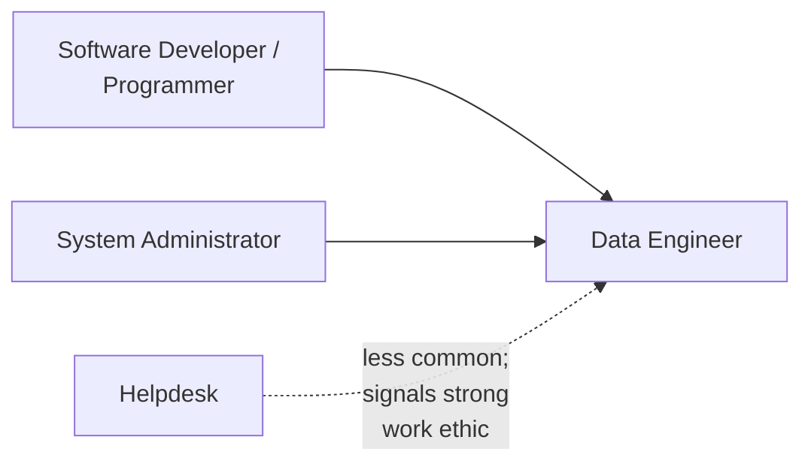
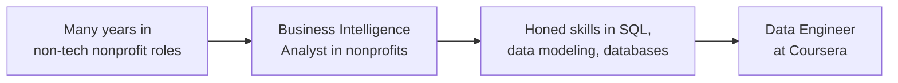

> **Course 1:** Introduction to Data Engineering
> **Module 4:** Career Opportunities and Data Engineering in Action

# Viewpoints: The Many Paths to Data Engineering

## Overview

There is no single, mandatory route into data engineering. This lesson features several practicing data professionals sharing their own backgrounds and observations about how people typically enter the field. The common thread across all the perspectives is that data engineering is a relatively young discipline, and because requirements vary from company to company, there are multiple legitimate paths in — through formal education, structured training programs, or lateral transition from adjacent technical roles.

---

## 1. Formal Education Route

Earning a **college or university degree** in a field such as **software engineering** or **computer science** is one well-established path.

**Trade-offs:**
- Can be **expensive**
- Requires a multi-year **time investment**
- Even after graduating, most people still need to **supplement their academic training** with additional skills to meet the practical demands of a real-world data engineering job

---

## 2. Accelerated / Alternative Training Routes

For people who already hold a degree in another field, or who cannot commit several years to a new degree, faster alternatives include:

- **Diploma programs** or **bootcamps** (in-person)
- **Online courses and certificate programs** (part-time or full-time)

### How to Choose the Right Program

| Evaluation Factor | What to Check |
|---|---|
| **Cost** | Is it affordable relative to your budget and expected return? |
| **Time to complete** | Does the timeline fit your circumstances? |
| **Provider reputation** | Is it from a reputable, recognized provider? |
| **Content currency** | Is the curriculum up to date with current tools and practices? |
| **Reviews** | What do past learners say? Have you spoken to people who completed it? |
| **Fit with learning style** | Are you self-motivated enough to learn online independently, or do you need more guided, hands-on instruction? |

---

## 3. Transitioning from an Existing Technical Role

Many practicing data engineers arrive laterally from adjacent roles rather than starting from a data-specific degree or program.

### Feeder Roles

| Current Role | Why It's a Good Entry Point |
|---|---|
| **System Administrator** | Mastery of operating systems and databases provides a direct foundation |
| **Database Administrator (DBA)** | Already one step away — deep database knowledge is the core of the role |
| **Automation Engineer** | Proficiency in automating manual tasks maps directly to pipeline automation |
| **Data Analyst** | Already working closely with data — strong contextual understanding of data's business use |
| **Programmer / Software Developer** | Coding proficiency is a core data engineering requirement |
| **ETL Developer** | Described as one of the most *natural* transitions into data engineering |
| **Helpdesk** | Less common but valued entry point; signals strong work ethic |

### Most Common Paths Observed in Hiring

Core knowledge needed regardless of path — a data engineer should be knowledgeable about **databases**, **different kinds of data sources**, and **different data formats**, and apply that knowledge to **build data pipelines**.

---

## 4. Value of an Academic Background

- A background in **computer science** and **mathematics** is described as helpful, since it can **reduce the time needed** to become proficient as a data engineer.
- However, this is explicitly **not a requirement** — strong examples are given of professionals without a deep CS background who became successful data engineers.

---

## 5. Personal Path Examples

### Practitioner A — Computer Science Graduate

Several Coursera colleagues started computer science in college and entered data engineering directly after graduation. Other data engineer colleagues were previously software engineers with strong technical backgrounds before transitioning.

### Practitioner B — Nonprofit to BI Analyst to Data Engineer

This practitioner directly challenges the assumption that a strong CS background is a prerequisite:

> *"You can enter into data engineering without a very strong computer science background."*

The key skills developed during the BI analyst role — SQL, data modeling, and database work — were sufficient to transition into data engineering at a major technology company.

### Practitioner C — DBA and ETL Tracks

This practitioner identifies two role paths they have personally observed or taken:

- **DBA → Data Engineer** — A proven transition that worked for them and multiple colleagues
- **ETL Developer → Data Engineer** — Described as a particularly natural transition given the direct overlap in skills

### Practitioner D — Education Assessment Framework

This practitioner walks through the trade-offs across education formats:

| Education Format | Trade-offs |
|---|---|
| **University Degree (CS / Software Engineering)** | Comprehensive foundation; expensive; multi-year commitment; likely requires supplementing with self-study |
| **Diploma Program or Bootcamp** (in-person) | Shorter time commitment; structured learning environment; good for those who benefit from in-person instruction |
| **Online Courses and Certificate Programs** | Flexible (part-time or full-time); lower cost; requires self-motivation; broad range of quality |

---

## Key Takeaways

- **Multiple valid paths exist** into data engineering: formal degree, bootcamp/certificate program, or lateral transition from a related role.
- **A computer science degree is not mandatory** — many successful data engineers transitioned from roles like DBA, system administrator, data analyst, automation engineer, or ETL developer.
- **If pursuing a non-degree program**, evaluate it on cost, duration, provider reputation, content currency, reviews, and fit with your personal learning style.
- **Core technical foundations** — databases, data sources, and data formats — are essential regardless of which path you take.
- **A CS/math background helps but isn't required**; real-world experience (e.g., honing SQL and data modeling skills in an analyst role) can substitute effectively.
- Because data engineering is a **young and evolving field**, requirements differ across companies, which is part of why so many different entry paths are viable.

---

## Cross-References

- [Viewpoints: Get into Data Engineering](viewpoints_get_into_data_engineering.md) — detailed practitioner narratives
- [Viewpoints: What Do Employers Look for in a Data Engineer](viewpoints_employer_expectations.md) — hiring manager perspectives
- [Data Engineering Learning Path](data_engineering_learning_path.md) — structured pathways
- [Career Opportunities in Data Engineering](c1_m4_career_opportunities.md) — job market and career ladder
