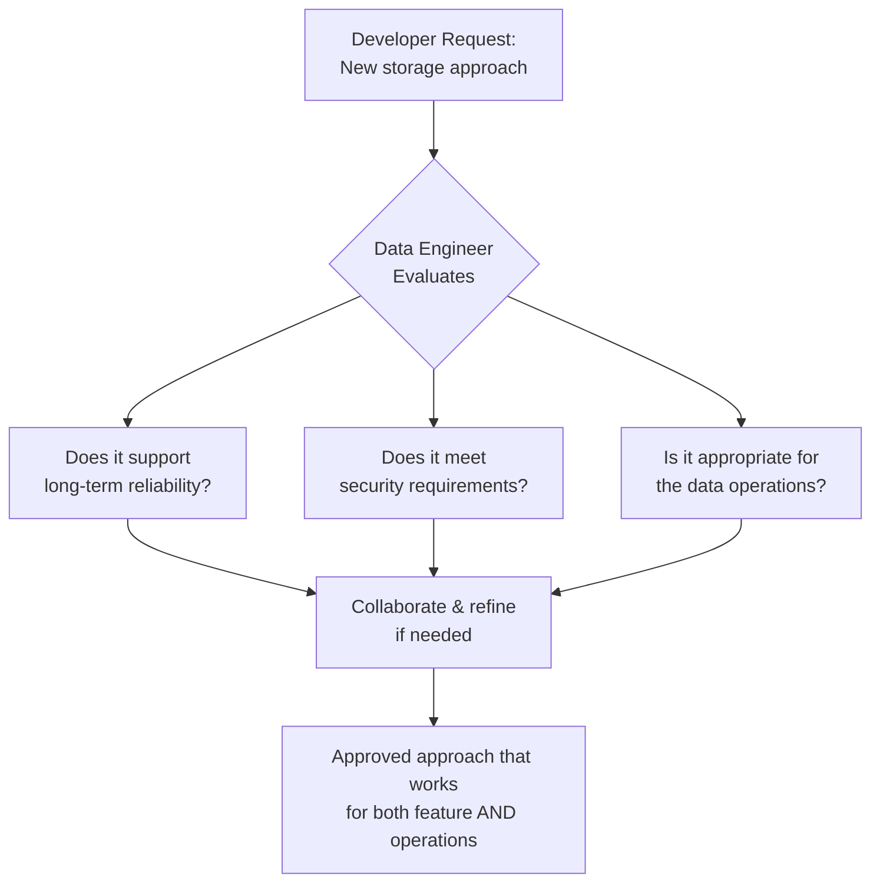
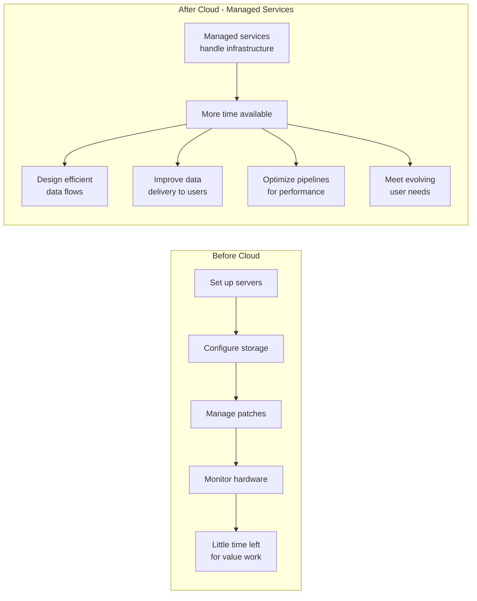

# Checkpoint Quiz — Weakness Review: Collaborative Architecture & Cloud-Era Engineering

## Overview

This document targets two specific concepts that tripped up on the checkpoint quiz. Both questions test understanding of how the **data engineer's role has shifted** — from rigid, top-down execution to collaborative, value-focused work. Getting these right requires internalizing the *mindset* shift, not just the facts.

---

## Question 4 — Developer Requests a New Storage Approach

### The Question
> *A developer requests data be stored in a new way to support a feature. Your role is to ensure long-term reliability and secure operations. What is the best response?*

### Correct Answer
**Collaborate with the developer to confirm the choice supports secure, reliable, long-term data operations.**

### Why the Other Options Fail

| Option | Why It's Wrong |
|---|---|
| **Approve immediately — feature deadlines take priority** | Skips all evaluation. Long-term reliability is the engineer's core responsibility — it cannot be traded away for speed. |
| **Reject and require the same storage approach for every feature** | Rigid uniformity ignores legitimate varying requirements. Modern data engineering explicitly recognizes that different needs call for different solutions. |
| **Implement first, address reliability and security after production** | This is one of the most dangerous anti-patterns in engineering. Security and reliability retrofitted after deployment are almost always inadequate and expensive to fix. |

### Why Collaboration Is the Right Answer

This question is a direct application of the **shift from hierarchical to collaborative architecture** covered in the evolution of data engineering:

> *"It's more of a conversation in how things happen... the data engineer has to take these varying sets of requirements from developers and work with them to make sure the choices they're making are appropriate for long-term use of data and storage of data in a secure and reliable way."*

The modern data engineer is not a gatekeeper who blocks requests, nor a passive executor who approves everything. They are an **advisor and collaborator** who:

- Evaluates whether the proposed storage approach fits the organization's data principles
- Guides developers toward choices that work both for the feature *and* for long-term operations
- Ensures reliability and security are built in — not bolted on later

### Key Principle to Retain
> The data engineer's job is not to say yes or no — it is to **ensure the outcome is secure, reliable, and sustainable**, however many conversations that takes.

---

## Question 5 — Focus Areas When Managed Infrastructure Is in Place

### The Question
> *Your organization uses managed infrastructure services, so engineers spend less time setting up systems from scratch. What should a data engineer focus on more in this environment?*

### Correct Answer
**Designing efficient data flows and improving how data is delivered to meet user needs.**

### Why the Other Options Fail

| Option | Why It's Wrong |
|---|---|
| **Avoiding changes to pipelines so managed systems remain untouched** | Stagnation is not a strategy. Data needs evolve constantly — pipelines must evolve with them. |
| **Manually configuring servers and managing infrastructure day-to-day** | This is precisely what managed services *eliminate*. Doing it anyway defeats the entire value of cloud infrastructure. |
| **Limiting the team to one storage approach so no one has to learn new patterns** | Modern needs vary — different use cases require different storage patterns. Artificial uniformity reduces the team's ability to solve problems effectively. |

### The Cloud Era Shift: From Setup to Value

The transcript from the evolution of data engineering made this explicit:

> *"With cloud computing, data infrastructure is now available as a service. A data engineer today needs to do a lot less from scratch. They can spend more time on doing things that matter and less time on setting up and managing these systems."*

The freed-up capacity from not managing physical infrastructure should be **redirected toward higher-value work** — specifically, designing efficient data flows and improving data delivery to users.

### What "Designing Efficient Data Flows" Actually Means

| Activity | Description |
|---|---|
| **Pipeline optimization** | Reducing latency, improving throughput, eliminating bottlenecks |
| **Data modeling** | Structuring data so it is fast and intuitive for end-users to query |
| **Delivery architecture** | Choosing the right access patterns (APIs, dashboards, query interfaces) for each user type |
| **Monitoring & reliability** | Ensuring pipelines run consistently and alert when something breaks |
| **Adapting to new requirements** | Evolving data flows as user needs and business requirements change |

### Key Principle to Retain
> Cloud removes the *infrastructure burden* — it does not remove the *engineering responsibility*. The engineer's focus shifts from *keeping systems alive* to *making data more useful*.

---

## The Common Thread Between Both Questions

Both Q4 and Q5 test the same underlying mindset shift in modern data engineering:

| Old Mindset | New Mindset |
|---|---|
| Execute within fixed rules | Collaborate and adapt |
| Maintain approved platforms | Evaluate the right tool for each need |
| Infrastructure is the job | Data value delivery is the job |
| Gatekeeping requests | Guiding toward good outcomes |
| Setup and maintenance first | Design and optimization first |

The wrong answers in both questions appealed to **rigidity** (reject everything, limit to one approach, avoid changes) or **negligence** (approve immediately, implement now and fix later, manually do what managed services handle). The correct answers both reflect **thoughtful, collaborative, value-focused engineering**.

---

## Quick-Reference: Exam Logic for These Question Types

When a question describes a scenario involving a **developer request or a change in environment**, ask:

1. Does this answer respect the engineer's responsibility for **reliability and security**?
2. Does this answer reflect **collaboration** rather than blanket approval or rejection?
3. Does this answer focus on **delivering value** rather than maintaining bureaucratic process?
4. Does this answer acknowledge that **requirements vary** and rigid uniformity is a problem?

If yes to all four → that's your answer.

---

## Key Takeaways

| # | Takeaway |
|---|---|
| 1 | When a developer requests a new storage approach, the correct response is always to **collaborate and evaluate** — not approve blindly, reject rigidly, or implement and fix later. |
| 2 | Security and reliability must be **designed in from the start** — retrofitting them after production is an anti-pattern. |
| 3 | Cloud-managed infrastructure frees engineers from setup work — that time should go toward **designing efficient data flows and improving data delivery**. |
| 4 | **Rigid uniformity** (one storage approach for everything) is consistently a wrong answer in this course — modern data engineering embraces varied solutions for varied needs. |
| 5 | The modern data engineer's core identity is **collaborative advisor and value deliverer**, not gatekeeper or infrastructure maintainer. |

---

*Source: IBM Data Engineering Fundamentals — Checkpoint Quiz Weakness Review*
