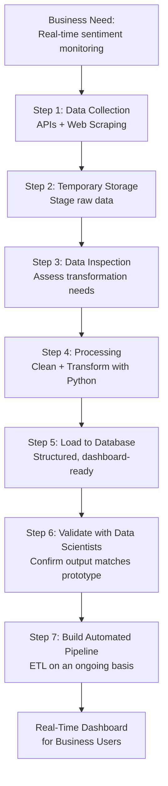
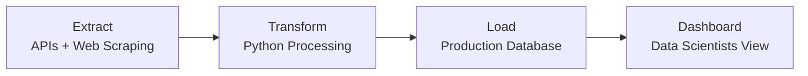

# A Day in the Life of a Data Engineer

## Overview

Abstract concepts become concrete when grounded in a real project. This document follows **Sarah Flinch**, a Data Engineer at a multinational hair care company, through an end-to-end data engineering project — from business problem to working pipeline. Her story illustrates how the responsibilities, skills, and lifecycle stages covered in previous modules manifest in actual day-to-day engineering work.

---

## The Business Context

### The Company
Sarah works for a multinational company in the hair care industry — one that positions itself on scientific research, rigorous product testing, and staying closely connected to its customers and market demographics.

### The Trigger: A New Product Launch
The company is in the final stages of launching a **new shampoo**. In the current market environment, social media sentiment can make or break a product launch — positive buzz can accelerate sales; negative commentary can damage brand perception before a product even finds its footing.

### The Business Need
The business team wanted to **monitor customer sentiment across social media and online platforms from day one of the launch** — in real time, across multiple channels, and broken down by demographic.

Platforms identified for monitoring:

| Platform Type          | Examples                                      |
|------------------------|-----------------------------------------------|
| **Social Media**       | Twitter, Facebook, Instagram                  |
| **eCommerce Platforms**| Product listing pages with customer reviews   |
| **Bloggers / Media**   | Product review blogs and online articles      |

They wanted to track:
- Positive feedback
- Negative comments
- Suggestions and feature requests
- Comparisons with competing products

---

## The Prototype: How It Started

The company's **Data Science team** built a prototype dashboard using:
- A **sentiment analysis algorithm** to score customer sentiment
- **Dummy data** to simulate what the real output would look like

### What the Dashboard Showed
- Graphs of customer sentiment scores plotted across time
- Breakdowns by **social media source**
- Breakdowns by **consumer demographic**

The prototype was well-received by the business team and received immediate go-ahead for full implementation.

> **This is where the Data Engineering team stepped in** — to turn the prototype into a production-ready, real-data system.

---

## The Engineering Workflow

### Step 1 — Data Collection via APIs

Sarah's first task was to **pull data from all identified social media sources into the organization's environment**.

She began with **APIs** (Application Programming Interfaces) — the standard method for programmatically retrieving data from platforms like Twitter and Facebook.

> APIs allow a data engineer to request specific data — in this case, tweets and posts containing the product's hashtag — and receive it in a structured format (typically JSON) for further processing.

**What was collected via API:**
- Tweets containing the product hashtag
- Social media posts from Facebook and Instagram

All collected data was moved into **temporary storage** — a staging area where raw data sits before transformation.

### Step 2 — Data Collection via Web Scraping

For sources that did not offer an API — eCommerce portals and product review blogs — Sarah used **web scraping**.

> **Web scraping** is the automated extraction of data from web pages. A scraper navigates to a URL, reads the HTML content, and extracts the specific data elements needed (e.g., review text, star ratings, reviewer demographics).

**What was collected via web scraping:**
- Product reviews from eCommerce listing pages
- Articles and reviews from product review blogs

This data was also moved into **temporary storage**.

### Step 3 — Data Inspection

With all raw data collected and staged, Sarah's next step was **inspection** — examining the data to understand what transformations would be needed before it could be loaded into the database.

#### The Challenge: Format and Structure Diversity

| Content Type     | Format Characteristics                                       |
|------------------|--------------------------------------------------------------|
| **Tweets**       | Short text, hashtags, emojis, @mentions, URLs, timestamps   |
| **Facebook Posts**| Longer text, reactions, comment threads, media attachments  |
| **eCommerce Reviews** | Star ratings, structured review text, verified purchase flags |
| **Blog Articles**| Long-form text, HTML markup, embedded images, author metadata |
| **Memes**        | Image-based, often with embedded text — unstructured         |

This diversity is a hallmark of real-world data engineering: sources rarely conform to a single format, and the engineer must assess and plan for every variation before writing a single line of transformation code.

### Step 4 — Data Processing with Python

After inspection, Sarah and her team **designed and built a Python program** to handle all processing tasks.

#### What Processing Involved

| Processing Task         | Description                                                         |
|-------------------------|---------------------------------------------------------------------|
| **Cleaning**            | Removing duplicates, handling nulls, stripping irrelevant HTML tags |
| **Normalization**       | Standardizing formats — date formats, text encoding, casing         |
| **Transformation**      | Reshaping raw data into the schema required by the database         |
| **Sentiment Preparation** | Formatting text fields so they are ready to be scored by the sentiment analysis algorithm |

> Python was the natural choice here — it is the dominant language in data engineering for pipeline logic, data manipulation, and integration with external services and algorithms.

### Step 5 — Loading to the Database

Once processed, the clean, transformed data was **loaded into the production database** — the same database the dashboard queries to display its reports.

### Step 6 — Validation with Data Scientists

With the database populated with real data, Sarah presented the results to the **Data Science team**.

The output matched what they had designed in the prototype — sentiment scores, demographic breakdowns, and source-level graphs all rendered correctly.

> **Job well done — but the job wasn't finished yet.**

### Step 7 — The Problem with a One-Time Load

After the initial load, a critical limitation emerged: **every time business users wanted updated sentiment data, they would have to submit a new request to the data engineering team** to re-run the collection and processing.

This is an inefficient, manual workflow that would not scale. It creates a bottleneck, introduces latency, and removes the self-service capability that business teams need.

### Step 8 — Building the Automated Data Pipeline

The final and most impactful step: **building a data pipeline** that runs the full ETL process on an **ongoing, automated basis**.

> A data pipeline is the operationalization of a one-time ETL process — it automates extraction, transformation, and loading so that data flows continuously without manual intervention.

#### What the Pipeline Enables

| Before Pipeline                          | After Pipeline                              |
|------------------------------------------|---------------------------------------------|
| Manual request required for each update  | Data updates automatically on a schedule or trigger |
| Data engineers are the bottleneck        | Business users are fully self-service       |
| Hours or days between data and dashboard | Real-time or near-real-time visibility      |
| Error-prone manual re-runs               | Monitored, automated, reliable process      |

Once the pipeline is in place, **business users can log into the dashboard at any time and see a real-time projection of customer sentiment** — with no engineering involvement required for routine updates.

---

## Key Concepts Illustrated

| Concept                      | How It Appeared in Sarah's Project                                  |
|------------------------------|---------------------------------------------------------------------|
| **Data Collection**          | APIs for social media, web scraping for eCommerce and blogs        |
| **Temporary / Staging Storage** | Raw data held before transformation                             |
| **Data Inspection**          | Assessing format diversity before writing transformation logic      |
| **ETL Pipeline**             | Extract (API/scrape) → Transform (Python) → Load (database)        |
| **Data Cleaning**            | Removing duplicates, nulls, irrelevant markup                      |
| **Data Transformation**      | Reshaping raw heterogeneous data into a consistent database schema  |
| **Pipeline Automation**      | Moving from one-time load to ongoing, self-service data flow       |
| **Collaboration**            | Working with Data Scientists (prototype) and Business Users (requirements) |
| **Analytics-Ready Data**     | The final database output — accurate, accessible, formatted for the dashboard |

## APIs vs. Web Scraping

| Dimension          | APIs                                                     | Web Scraping                                              |
|--------------------|----------------------------------------------------------|-----------------------------------------------------------|
| **How it works**   | Calls a structured endpoint; receives formatted data     | Navigates to a URL; parses HTML to extract data           |
| **Data format**    | Typically JSON or XML — already structured               | Raw HTML — requires parsing and cleaning                  |
| **Reliability**    | High — designed for programmatic access                  | Lower — breaks if the website's HTML structure changes    |
| **Rate limits**    | Usually enforced by the platform                         | Depends on the site; may require throttling               |
| **Legal/ToS**      | Generally permitted within API terms                     | Must be checked against the site's terms of service       |
| **Best for**       | Platforms that offer official APIs                       | Sources with no API (eCommerce sites, blogs)              |

---

## Key Takeaways

| # | Takeaway                                                                                                                          |
|---|-----------------------------------------------------------------------------------------------------------------------------------|
| 1 | Data engineering projects begin with a **business need** — the technical work is always in service of a specific organizational goal. |
| 2 | Real-world data comes in **diverse formats** — tweets, reviews, articles, memes — and the engineer must plan transformations for each. |
| 3 | **APIs and web scraping** are complementary collection techniques; the right choice depends on what the source platform provides.   |
| 4 | **Temporary/staging storage** is a standard pattern for holding raw data before processing begins.                                |
| 5 | **Python** is the go-to language for data processing logic — cleaning, transforming, and loading data in pipeline workflows.       |
| 6 | A **one-time ETL run is not a solution** — it must be automated into a pipeline for the data to be genuinely useful to business users. |
| 7 | The end goal of the pipeline is **real-time, self-service access** for business users — engineering disappears into the background. |
| 8 | Data engineers work **collaboratively** — with Data Scientists who design the output, and Business Teams who define the requirements.|

---

## Glossary

| Term                    | Definition                                                                                          |
|-------------------------|-----------------------------------------------------------------------------------------------------|
| **Sentiment Analysis**  | An NLP technique that scores text as positive, negative, or neutral based on language patterns.     |
| **API**                 | Application Programming Interface — a structured way for programs to request and exchange data.     |
| **Web Scraping**        | Automated extraction of data from web pages by parsing their HTML content.                          |
| **Temporary Storage**   | A staging area where raw, unprocessed data is held before transformation and loading.               |
| **ETL**                 | Extract, Transform, Load — the three-stage process of moving and reshaping data.                    |
| **Data Pipeline**       | An automated, ongoing ETL process that continuously moves and transforms data without manual intervention. |
| **Hashtag**             | A metadata tag on social media (e.g., #NewShampoo) used to categorize and discover content.        |
| **Dashboard**           | A visual interface that displays data metrics and reports for business users.                       |
| **Schema**              | The defined structure of a database — its tables, columns, types, and relationships.               |
| **Real-Time Data**      | Data that is processed and made available immediately or near-immediately as it is generated.       |

---

*Source: IBM Data Engineering Fundamentals — A Day in the Life of a Data Engineer (Sarah Flinch)*
