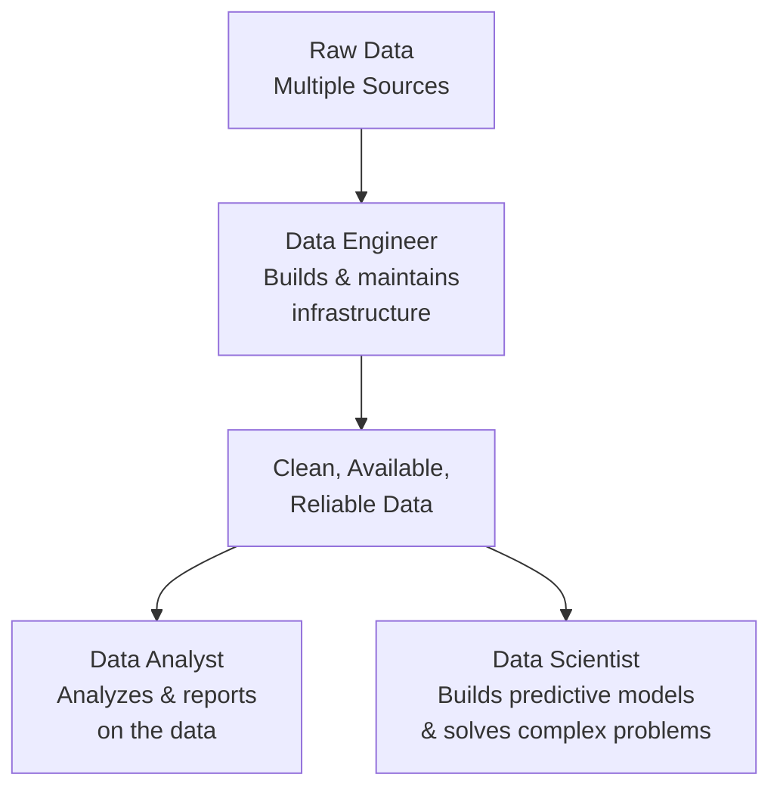
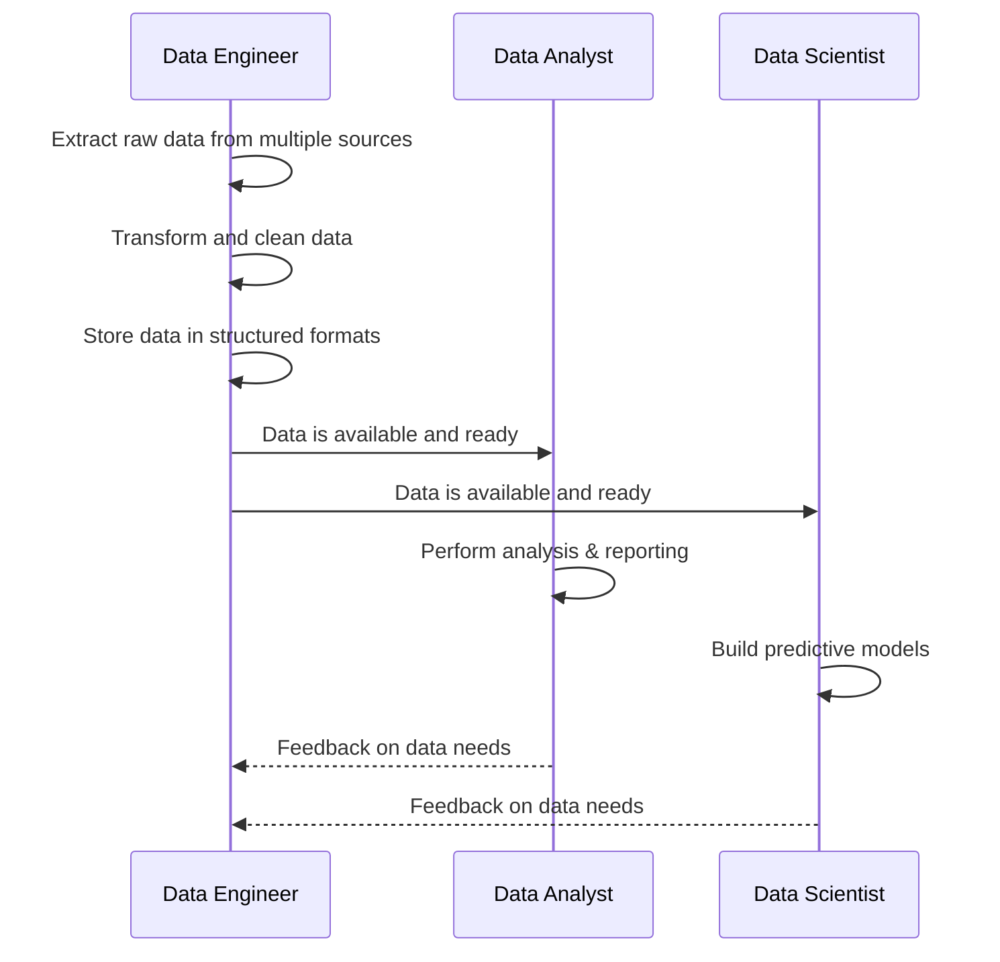
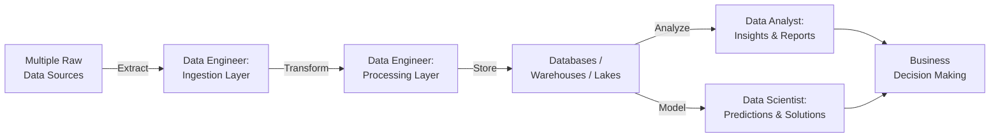

# Data Engineering Defined: Perspectives from Data Professionals

## Overview

Data engineering, data analytics, and data science are three distinct but deeply interdependent disciplines within the modern data organization. While they are often grouped together or conflated, each carries a unique mandate, requires a different skill set, and operates at a different stage of the data lifecycle.

This document captures how working data professionals define data engineering — and how they articulate its boundaries with data analytics and data science — organized into a comprehensive reference for anyone entering or navigating the data field.

---

## The Core Definition of Data Engineering

> **Data engineering is the discipline of designing, building, maintaining, and optimizing data infrastructures and platforms that make data available for analysis.**

These infrastructures include:

- **Databases** — Relational and non-relational stores for structured and semi-structured data
- **Big Data Repositories** — Distributed storage systems (data lakes, lakehouses) for high-volume, high-variety data
- **Data Pipelines** — Automated workflows that extract, transform, and move data between systems

A **Data Engineer** is the professional who performs these tasks — developing and continuously optimizing the systems that power every downstream data use case.

---

## The Three Roles: A Foundational Comparison

### Role Definitions at a Glance

| Role                | Primary Activity                                          | Output                                      |
|---------------------|-----------------------------------------------------------|---------------------------------------------|
| **Data Engineer**   | Design, build, and maintain data systems and pipelines    | Reliable, accessible, high-quality data     |
| **Data Analyst**    | Analyze data in systems to report and derive insights     | Reports, dashboards, business insights      |
| **Data Scientist**  | Perform deep analysis and develop predictive models       | Predictive models, complex data solutions   |

---

## Data Engineering: The "Plumbing" of Data

One of the most vivid and accurate analogies used by practitioners is that **data engineers are the plumbers of data**.

Just as a plumber ensures water flows reliably, safely, and consistently to wherever it is needed — a data engineer ensures data does the same. The engineer does not "use" the water; they guarantee it arrives.

### The Four Guarantees of a Data Engineer

| Guarantee            | What It Means in Practice                                                    |
|----------------------|------------------------------------------------------------------------------|
| **High Availability**| Data systems are up and accessible whenever downstream consumers need them   |
| **Consistency**      | Data is uniform, deduplicated, and free from conflicting states across systems |
| **Security**         | Data is protected from unauthorized access at rest and in transit            |
| **Recoverability**   | Data can be restored after failure, corruption, or incident with minimal loss |

### What Data Engineers Do NOT Primarily Do

Data engineers spend significantly **less** time on:

- Playing with or exploring data
- Performing analysis or deriving business insights
- Directly using data to answer business questions

These activities belong to analysts and scientists. The data engineer's job is to make those activities **possible** — by ensuring the data is ready.

---

## The Relationship Between the Three Disciplines

### Data Engineering as a Precursor

A key insight from practitioners: **data engineering is a precursor to data analytics and data science**. The work of analysts and scientists only begins after data engineers have completed theirs.

### Upstream vs. Downstream Work

| Stage            | Who Does It            | Nature of Work                                  |
|------------------|------------------------|-------------------------------------------------|
| **Upstream**     | Data Engineer          | Infrastructure, pipelines, storage, availability |
| **Downstream**   | Data Analyst / Scientist | Analysis, insight generation, modeling          |

> Data analysts and data scientists work *upstream of the business* — but *downstream of the data engineer*. They depend entirely on the foundation the engineer has built.

---

## Data Engineering as an Enabler

Practitioners consistently describe data engineers as **enablers** — professionals whose work materializes the projects of analysts and scientists into reality.

### How Data Engineers Enable Other Roles

| Enablement Activity                          | Who Benefits                   |
|----------------------------------------------|-------------------------------|
| Selecting the right databases and tools      | Data Analysts, Data Scientists |
| Building required data pipelines             | Data Analysts, Data Scientists |
| Structuring data for reporting               | Data Analysts                  |
| Preparing data for statistical analysis      | Data Scientists                |
| Ensuring data is available at the right time | All downstream consumers       |

This enabling relationship also requires **close collaboration**. Data engineers work alongside analysts and scientists to understand their needs and ensure that the data delivered matches the shape, grain, and freshness required for their work.

---

## Designing for Seamless Data Flow

From a systems design perspective, the goal of data engineering is to create an organizational data environment where:

> **Anyone authorized can access any data they need, in a split second, with minimal effort.**

Achieving this requires deliberate engineering decisions across multiple dimensions:

### Key Design Decisions in Data Engineering

| Decision Area              | Examples                                                              |
|----------------------------|-----------------------------------------------------------------------|
| **Database Selection**     | Choosing between relational (PostgreSQL, MySQL) vs. analytical (BigQuery, Redshift) databases based on use case |
| **Storage Systems**        | Data lakes for raw/unstructured data; data warehouses for structured, query-optimized storage |
| **Cloud Architecture**     | Selecting cloud platforms (AWS, GCP, Azure) and services that match scale, cost, and performance needs |
| **Data Pipeline Design**   | Building ETL/ELT pipelines that reliably move and transform data between systems |
| **Access Architecture**    | APIs, query interfaces, and dashboards that surface data to authorized consumers |

When all these decisions are made well and integrated thoughtfully, **data flow inside an organization becomes seamless**.

---

## Raw Data to Insight: The End-to-End Flow

Data engineers collect raw data from multiple sources, transform it, and store it in structured, accessible formats. Analysts and scientists then perform their work on top of this prepared foundation — and the resulting insights drive business decisions.

---

## Summary: How Practitioners Define the Boundary

Across all professional perspectives, three consistent themes emerge to define what data engineering is and where it ends:

### Theme 1 — Infrastructure Over Insight
Data engineering is about building and maintaining the systems that store and move data. It is not about deriving meaning from that data.

### Theme 2 — Enablement Over End-Use
Data engineers enable others to use data effectively. They are not the primary consumers of the data they manage.

### Theme 3 — Reliability as the Core Value
More than any other data profession, data engineering is measured by reliability — data that is always available, consistent, secure, and recoverable.

---

## Key Takeaways

| # | Takeaway                                                                                                                |
|---|-------------------------------------------------------------------------------------------------------------------------|
| 1 | Data engineering covers designing, building, maintaining, and optimizing data infrastructures and pipelines.            |
| 2 | Data engineers are the "plumbers" of data — they guarantee availability, consistency, security, and recoverability.     |
| 3 | Data analysts report and derive insights; data scientists build predictive models — both depend on the engineer's work. |
| 4 | Data engineering is a **precursor** to analytics and data science — downstream work cannot begin without it.            |
| 5 | The goal of well-designed data engineering is **seamless data flow** — any authorized user gets any data, instantly.    |
| 6 | Data engineers act as **enablers**, working closely with analysts and scientists to match data to their exact needs.    |
| 7 | Key engineering decisions span database selection, storage systems, cloud platforms, pipeline design, and access layers.|

---

## Glossary

| Term                   | Definition                                                                                        |
|------------------------|---------------------------------------------------------------------------------------------------|
| **Data Pipeline**      | An automated workflow that extracts, transforms, and loads data between systems.                  |
| **Data Infrastructure**| The collective systems — databases, pipelines, storage platforms — that support data operations. |
| **Big Data Repository**| A storage system designed to hold very large volumes of raw or semi-structured data (e.g., a data lake). |
| **ETL**                | Extract, Transform, Load — a pattern for moving and reshaping data between source and destination.|
| **ELT**                | Extract, Load, Transform — loads raw data first, then transforms it within the destination system.|
| **Data Availability**  | The guarantee that data systems are accessible and responsive when consumers need them.           |
| **Data Consistency**   | The property that data is uniform and conflict-free across all systems and time points.           |
| **Recoverability**     | The ability to restore data and systems to a working state after failure or incident.             |
| **Upstream (in data)** | Work that happens earlier in the data lifecycle — data engineering is upstream of analytics.      |
| **Downstream (in data)**| Work that depends on earlier stages — analytics and data science are downstream of engineering. |
| **Predictive Model**   | A statistical or machine learning model that uses historical data to forecast future outcomes.    |
| **Data Scientist**     | A professional who performs advanced analysis and builds predictive models from prepared data.    |
| **Data Analyst**       | A professional who analyzes prepared data to generate reports and business insights.              |

---

*Source: IBM Data Engineering Fundamentals — Data Professionals on Defining Data Engineering*
