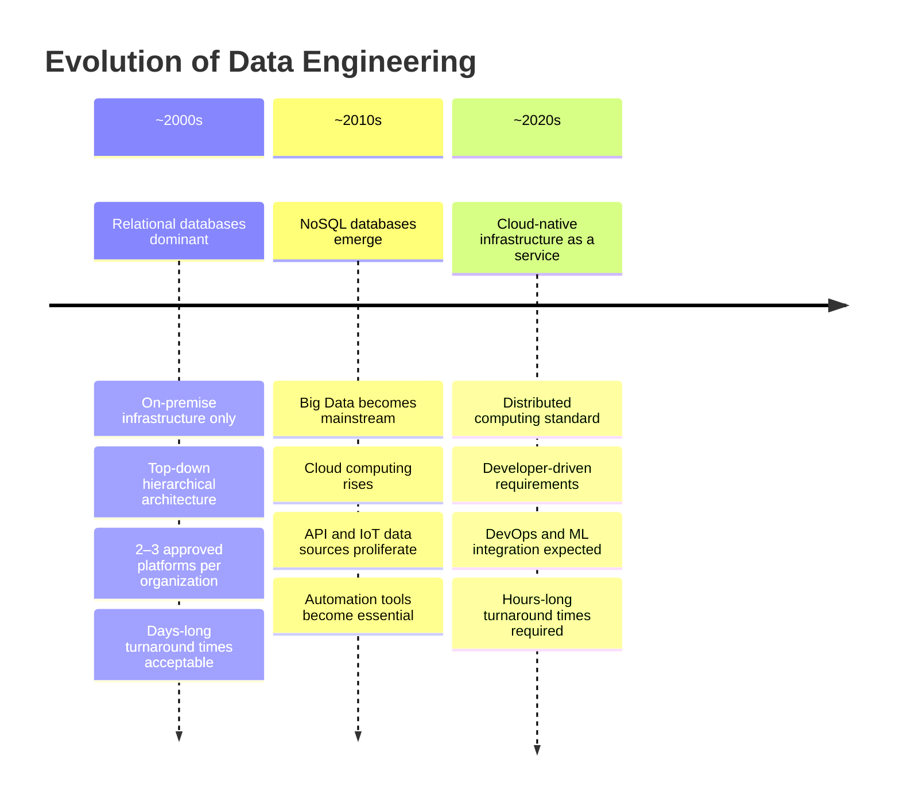
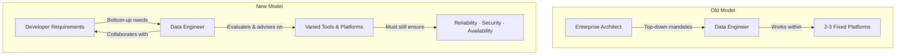
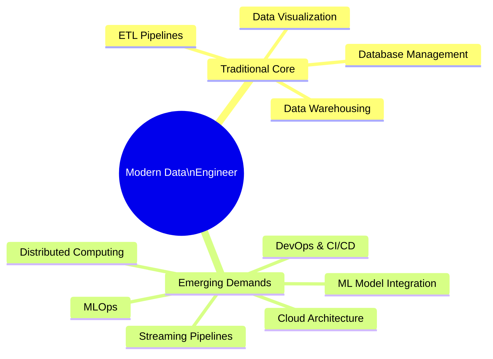

# The Evolution of Data Engineering: Two Decades of Change

## Overview

Data engineering has undergone one of the most dramatic transformations of any technical discipline over the past twenty years. From a narrow, well-defined practice centered on relational databases and hierarchical decision-making, it has expanded into a broad, fast-moving field that touches distributed systems, cloud infrastructure, real-time streaming, NoSQL databases, DevOps, and machine learning.

This document captures the perspectives of experienced data professionals — some with 25 years in the field — on how data engineering has evolved, what has driven that evolution, and what it means for the data engineers of today.

---

## The Landscape Then vs. Now

> *"The data engineering landscape is almost unrecognizable compared to what it was two decades ago."*

The transformation spans every dimension of the discipline — the volume of data handled, the variety of formats and sources, the tools available, the speed of delivery expected, and the organizational dynamics that shape how engineers work.

---

## What Changed: The Five Major Shifts

### Shift 1 — Volume and Variety of Data

Two decades ago, the quantity of data that modern organizations handle on a daily basis was simply **unthinkable**. Not only has volume grown exponentially, but the *variety* of data and data formats has expanded to include types that did not exist at the time.

| Dimension     | Then (~2000s)                          | Now (~2020s)                                              |
|---------------|----------------------------------------|-----------------------------------------------------------|
| **Volume**    | Manageable, database-scale datasets    | Petabyte-scale, continuously growing                      |
| **Variety**   | Structured relational data             | Structured, semi-structured, unstructured, streaming      |
| **Sources**   | Internal transactional databases       | APIs, IoT sensors, social media, SaaS platforms, events   |
| **Formats**   | Tables, CSVs                           | JSON, Parquet, Avro, XML, binary streams, images, video   |

### Shift 2 — The Rise of NoSQL and Big Data

Two of the most significant technological developments that reshaped data engineering:

#### NoSQL Databases
Two decades ago, **NoSQL was not part of the conversation**. Today, data engineers must be fluent across an entire ecosystem of non-relational database paradigms:

| NoSQL Category         | Examples                        | Best For                                          |
|------------------------|---------------------------------|---------------------------------------------------|
| **Column Stores**      | Apache Cassandra, HBase         | Time-series, high write-throughput workloads      |
| **Document Stores**    | MongoDB, Couchbase              | Flexible, hierarchical, semi-structured data      |
| **Key-Value Stores**   | Redis, DynamoDB                 | Caching, session management, fast lookups         |
| **Wide Column Stores** | BigTable                        | Sparse data at massive scale                      |
| **Graph Databases**    | Neo4j, Amazon Neptune           | Relationship-heavy, network-structured data       |

#### Big Data
**Big Data was unheard of two decades ago** — today it is a stable, well-established practice in many enterprises. Data engineers now need to know how to work with several different Big Data systems and pipelines, including distributed processing frameworks like Apache Spark and Hadoop.

### Shift 3 — Cloud Computing and Infrastructure as a Service

One of the most practically impactful shifts for working data engineers is the rise of **cloud computing** and the availability of data infrastructure as a managed service.

#### Before Cloud
- Engineers had to provision and manage physical hardware
- Setting up infrastructure consumed significant time and expertise
- Much of an engineer's capacity was absorbed by maintenance rather than value-adding work

#### After Cloud
- Data infrastructure is available as a service — provision in minutes, not weeks
- Engineers spend **less time setting up and managing systems**
- Engineers spend **more time on work that matters** — pipeline design, data quality, optimization

#### Key Cloud Data Services

| Category                  | AWS                    | Google Cloud           | Azure                     |
|---------------------------|------------------------|------------------------|---------------------------|
| **Data Warehouse**        | Redshift               | BigQuery               | Synapse Analytics         |
| **Managed ETL**           | AWS Glue               | Dataflow               | Data Factory              |
| **Object Storage**        | S3                     | Cloud Storage          | Azure Blob Storage        |
| **Stream Processing**     | Kinesis                | Pub/Sub + Dataflow     | Event Hubs                |
| **Managed Spark**         | EMR                    | Dataproc               | HDInsight / Databricks    |

### Shift 4 — Speed of Delivery and Automation

One of the most striking changes cited by practitioners is the **dramatic compression of expected turnaround time**:

| Era            | Expected Turnaround for a Solution |
|----------------|------------------------------------|
| **Two decades ago** | Days                          |
| **Today**      | Hours                              |

This acceleration is not possible without **automation**. Modern data engineering practice cannot function without automation tooling across every layer of the stack:

- **Pipeline Orchestration** — Apache Airflow, Prefect, Dagster
- **Infrastructure as Code** — Terraform, Pulumi, AWS CDK
- **CI/CD for Data** — dbt Cloud, GitHub Actions, Jenkins
- **Data Quality Automation** — Great Expectations, Soda, Monte Carlo
- **Monitoring & Alerting** — Datadog, Grafana, PagerDuty

> **Key Insight:** Automation is no longer optional. You cannot run a complete data engineering service at modern expectations without it.

### Shift 5 — From Hierarchical to Collaborative Architecture

Perhaps the most culturally significant shift is how architectural decisions are now made within organizations.

#### The Old Model (Hierarchical)
- A senior Data Architect or Enterprise Architect at the top defined the data strategy
- 2–3 approved platforms were selected and enforced organization-wide
- Data engineers' role was to be **experts in those fixed platforms**
- Requirements came **top-down**

#### The New Model (Collaborative)
- Developers bring specific storage and data requirements from the ground up
- Requirements now come **bottom-up**, from developers who have particular needs
- Data engineers must evaluate a **wider, more varied set of tools** for each new situation
- The role has become more **conversational and advisory** — engineers work *with* developers to ensure choices are appropriate for long-term data operations, security, and reliability

This shift means data engineers must now combine **deep technical breadth** with **advisory and communication skills** — they are no longer just executors of a predefined architecture, but active participants in shaping it.

---

## The Expanding Skill Set of the Modern Data Engineer

As the field has evolved, so has the breadth of knowledge required. Where a data engineer two decades ago could specialize deeply in one or two relational database platforms, today's engineer must be conversant across a much wider landscape.

### Then vs. Now: Required Knowledge

| Domain                        | ~2000s Expectation     | ~2020s Expectation                            |
|-------------------------------|------------------------|-----------------------------------------------|
| **Databases**                 | 1–2 relational DBs     | Relational + multiple NoSQL paradigms          |
| **Data Warehousing**          | On-premise only        | Cloud-native, MPP warehouses                  |
| **ETL/ELT**                   | Batch ETL              | Batch + streaming + ELT patterns               |
| **Big Data**                  | Not required           | Spark, Hadoop, distributed processing          |
| **Cloud Platforms**           | Not required           | AWS, GCP, Azure — at least one deeply          |
| **DevOps**                    | Not required           | CI/CD, IaC, containerization (Docker, K8s)     |
| **Distributed Computing**     | Not required           | Essential for large-scale pipeline work        |
| **Machine Learning Integration** | Not required        | Increasingly expected — MLOps awareness        |
| **Automation**                | Nice to have           | Mandatory for meeting delivery expectations    |

### Traditional vs. Emerging Focus Areas

---

## The Evolving Sources of Data

A major driver of the field's transformation is the **proliferation of new data sources** — types of data and connectivity that simply did not exist twenty years ago.

### Data Source Evolution

| Era            | Primary Data Sources                                               |
|----------------|--------------------------------------------------------------------|
| **~2000s**     | Internal relational databases, flat files, on-premise systems      |
| **~2010s**     | APIs, web data, social media feeds (e.g., Twitter API)             |
| **~2020s**     | IoT sensors, real-time event streams, SaaS platform data, weather APIs, interconnected everything |

The interconnected nature of today's data ecosystem means engineers must design systems that can ingest, normalize, and route data from dozens of heterogeneous sources simultaneously — each with different formats, update frequencies, and reliability characteristics.

---

## Data Engineering as a Growing Profession

Beyond the technical evolution, practitioners note that **data engineering as a recognized profession** has grown dramatically in demand and visibility:

> *"When I started 15 years ago as a database administrator, data engineering was not that hot a topic. There were data engineers, but it's a full-on, very hot requirement these days."*

This growth in demand is directly tied to the explosion of data sources and the organizational recognition that raw data has no value without the infrastructure to make it reliable and accessible.

---

## What Has Not Changed

Despite all the transformation, certain foundational principles have remained constant throughout the evolution of the field:

| Constant Principle             | Why It Endures                                                           |
|--------------------------------|--------------------------------------------------------------------------|
| **Reliability**                | Data systems must be dependable — pipelines that break destroy trust     |
| **Security**                   | Data must be protected regardless of where it lives or how it moves      |
| **High Availability**          | Downstream consumers need data when they need it — not eventually         |
| **Scalability**                | Systems must be designed to grow — this was true in 2000 and remains true today |
| **Data as a Business Asset**   | The reason data engineering exists — data must serve business goals      |

---

## Key Takeaways

| # | Takeaway                                                                                                                     |
|---|------------------------------------------------------------------------------------------------------------------------------|
| 1 | The data engineering landscape is **almost unrecognizable** compared to two decades ago — in volume, variety, tools, and pace. |
| 2 | **NoSQL databases and Big Data** — unheard of 20 years ago — are now core competencies for data engineers.                   |
| 3 | **Cloud computing** has shifted infrastructure from a build-from-scratch problem to a managed service, freeing engineers to focus on higher-value work. |
| 4 | **Turnaround expectations** have compressed from days to hours, making automation non-negotiable.                            |
| 5 | Architecture is now **collaborative and bottom-up** rather than hierarchical and top-down — engineers advise as much as they build. |
| 6 | The modern data engineer must be **broadly skilled** across databases, cloud, distributed systems, DevOps, and increasingly ML. |
| 7 | New data sources — **IoT, APIs, streaming feeds** — have fundamentally expanded the ingestion and integration challenges engineers face. |
| 8 | **Core principles** — reliability, security, availability, scalability — have not changed, even as the tools and context have. |

---

## Glossary

| Term                       | Definition                                                                                          |
|----------------------------|-----------------------------------------------------------------------------------------------------|
| **NoSQL**                  | A category of databases that store data in formats other than traditional relational tables.         |
| **Big Data**               | Datasets too large or complex for traditional data processing tools to handle efficiently.           |
| **Column Store**           | A database that stores data by column rather than by row, optimized for analytical queries.          |
| **Document Store**         | A NoSQL database that stores data as semi-structured documents (e.g., JSON or BSON).                |
| **Key-Value Store**        | A NoSQL database that stores data as simple key-value pairs, optimized for fast lookups.            |
| **IoT (Internet of Things)** | A network of physical devices embedded with sensors that collect and transmit data continuously.  |
| **Infrastructure as a Service (IaaS)** | Cloud-delivered computing infrastructure — servers, storage, networking — on demand.  |
| **Distributed Computing**  | Processing data across multiple networked machines simultaneously to handle large-scale workloads.   |
| **DevOps**                 | A set of practices combining software development and IT operations to shorten delivery cycles.      |
| **CI/CD**                  | Continuous Integration / Continuous Deployment — automated testing and deployment pipelines.         |
| **MLOps**                  | Practices and tools for deploying, monitoring, and maintaining machine learning models in production.|
| **Infrastructure as Code** | Managing and provisioning infrastructure through machine-readable configuration files (e.g., Terraform). |
| **ETL**                    | Extract, Transform, Load — a data integration pattern for moving data between systems.              |
| **ELT**                    | Extract, Load, Transform — loads raw data first, then transforms it within the destination system.  |
| **Hadoop**                 | An open-source framework for distributed storage and processing of large datasets.                  |
| **Apache Spark**           | A fast, distributed data processing engine widely used for big data workloads.                      |
| **Apache Cassandra**       | A wide-column NoSQL database designed for high availability and horizontal scalability.              |
| **MongoDB**                | A popular document-store NoSQL database using JSON-like BSON documents.                             |

---

*Source: IBM Data Engineering Fundamentals — Data Professionals on the Evolution of Data Engineering*
