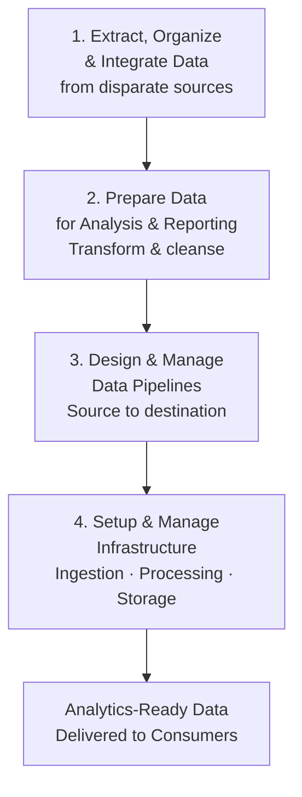
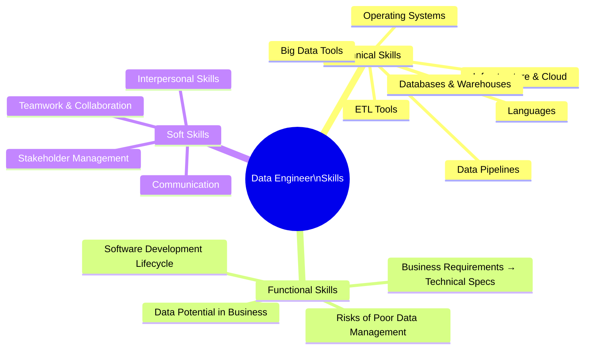
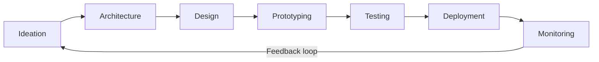
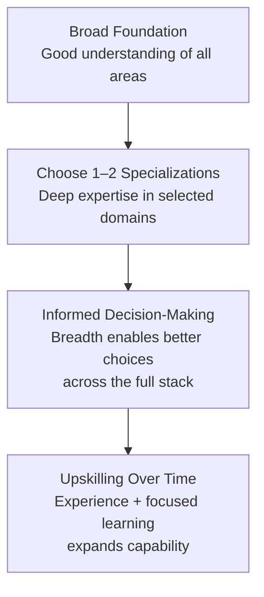

# Responsibilities and Skillsets of a Data Engineer

## Overview

Data engineering demands one of the broadest skill sets of any technical profession. It sits at the **intersection of software engineering and data science** — requiring deep technical knowledge, functional business understanding, and strong interpersonal skills to work effectively across teams.

This document provides a comprehensive breakdown of what data engineers are responsible for, the three categories of skills they need, and how those skills grow and specialize over a career.

---

## The Overarching Responsibility

> **The overarching responsibility of a Data Engineer is to provide analytics-ready data to data consumers.**

Every tool learned, every pipeline built, and every system designed ultimately serves this single goal. All other responsibilities flow from it.

### What Does "Analytics-Ready" Mean?

Data is considered analytics-ready when it meets all four of the following criteria:

| Criterion        | Description                                                                 |
|------------------|-----------------------------------------------------------------------------|
| **Accurate**     | Data correctly reflects the real-world entities and events it represents    |
| **Reliable**     | Data is consistently available and free from unexpected gaps or failures    |
| **Compliant**    | Data adheres to the regulations and governance policies that apply to it    |
| **Accessible**   | Data is available to the right consumers at the time they need it           |

If any one of these four properties is missing, the data is not truly analytics-ready — and downstream consumers cannot trust or effectively use it.

---

## Core Responsibilities

At a broad level, data engineers are responsible for four interconnected areas:

### 1. Extract, Organize, and Integrate Data

Collecting data from multiple, heterogeneous sources and bringing it into a unified environment. This includes:

- Connecting to source systems (databases, APIs, files, streams)
- Resolving structural and format differences between sources
- Organizing raw data into a usable staging structure

### 2. Prepare Data for Analysis and Reporting

Raw data is almost never analysis-ready on arrival. Preparation includes:

- **Transforming** — reshaping data into the right structure and format
- **Cleansing** — handling nulls, duplicates, inconsistencies, and outliers
- **Enriching** — joining datasets to add context or computed attributes
- **Validating** — applying quality checks to confirm data meets standards

### 3. Design and Manage Data Pipelines

Pipelines are the automated workflows that carry data from source to destination. A data engineer designs, builds, and maintains these end-to-end, covering:

- Ingestion from source systems
- Transformation and processing steps
- Loading into destination repositories
- Monitoring and error handling for ongoing reliability

### 4. Setup and Manage Infrastructure

The infrastructure layer underpins everything above. This includes:

| Infrastructure Component       | Purpose                                                        |
|--------------------------------|----------------------------------------------------------------|
| **Data Platforms**             | The overall environment where data is processed and stored     |
| **Data Stores**                | Aggregation points for source data before processing           |
| **Distributed Systems**        | Large-scale processing infrastructure (e.g., Spark clusters)  |
| **Data Repositories**          | Storage and dissemination of analysis-ready data               |

---

## The Three Skill Categories

Data engineering skills fall into three distinct but equally important categories:

---

## Technical Skills

### Operating Systems

Proficiency across operating system environments is foundational for a data engineer:

| OS Family        | Examples & Tools                                               |
|------------------|----------------------------------------------------------------|
| **UNIX / Linux** | Shell commands, system utilities, administrative tools, cron   |
| **Windows**      | PowerShell, Windows Server administration                      |

### Infrastructure Components

| Component Type         | Examples                                                      |
|------------------------|---------------------------------------------------------------|
| **Virtual Machines**   | VMware, VirtualBox, cloud VMs (EC2, Compute Engine)          |
| **Networking**         | DNS, VPCs, subnets, firewalls, load balancing                |
| **App Services**       | Load balancers, performance monitoring tools                  |
| **Cloud Platforms**    | Amazon Web Services, Google Cloud, IBM Cloud, Microsoft Azure |

### Databases and Data Warehouses

A data engineer must be fluent across multiple database paradigms:

#### Relational Databases (RDBMS)

| Database          | Common Use Cases                                        |
|-------------------|---------------------------------------------------------|
| **IBM DB2**       | Enterprise transactional and analytical workloads       |
| **MySQL**         | Web applications, open-source transactional workloads   |
| **Oracle Database** | Large-scale enterprise systems                        |
| **PostgreSQL**    | Advanced open-source relational workloads               |

#### NoSQL Databases

| Database       | Type            | Best For                                         |
|----------------|-----------------|--------------------------------------------------|
| **Redis**      | Key-Value       | Caching, session storage, real-time leaderboards |
| **MongoDB**    | Document Store  | Flexible, semi-structured JSON-like data         |
| **Cassandra**  | Wide Column     | High-availability, high-write-throughput workloads |
| **Neo4J**      | Graph Database  | Relationship-heavy, network-structured data      |

#### Data Warehouses

| Warehouse                          | Provider       |
|------------------------------------|----------------|
| **Oracle Exadata**                 | Oracle         |
| **IBM Db2 Warehouse on Cloud**     | IBM            |
| **IBM Netezza Performance Server** | IBM            |
| **Amazon Redshift**                | AWS            |

### Data Pipeline Tools

| Tool              | Description                                                   |
|-------------------|---------------------------------------------------------------|
| **Apache Beam**   | Unified model for batch and streaming data processing         |
| **Apache Airflow**| Workflow orchestration and pipeline scheduling                |
| **Google Dataflow**| Managed Apache Beam service on Google Cloud                  |

### ETL Tools

| Tool                                  | Provider   |
|---------------------------------------|------------|
| **IBM InfoSphere Information Server** | IBM        |
| **AWS Glue**                          | Amazon     |
| **Improvado**                         | Improvado  |

### Programming and Query Languages

A data engineer works across three language categories:

| Category                   | Languages / Tools                                    | Purpose                                               |
|----------------------------|------------------------------------------------------|-------------------------------------------------------|
| **Query Languages**        | SQL, SQL-like NoSQL query languages                  | Accessing and manipulating data in databases          |
| **Programming Languages**  | Python, R, Java                                      | Pipeline logic, automation, data processing           |
| **Shell & Scripting**      | Unix/Linux Shell, PowerShell                         | System administration, automation, task scheduling    |

### Big Data Processing Tools

| Tool            | Role                                                          |
|-----------------|---------------------------------------------------------------|
| **Apache Hadoop** | Distributed storage and batch processing of large datasets  |
| **Apache Hive**   | SQL-like querying over Hadoop-stored data                   |
| **Apache Spark**  | Fast, in-memory distributed data processing                 |

---

## Functional Skills

Functional skills bridge the gap between the technical and business worlds. They allow a data engineer to operate effectively within an organization — not just as a builder of systems, but as a contributor to business outcomes.

### 1. Converting Business Requirements into Technical Specifications

Data engineers must be able to take a business need — often expressed in non-technical terms — and translate it into a precise technical design. This requires understanding both domains well enough to bridge them.

### 2. Software Development Lifecycle (SDLC)

Data engineers work through the full SDLC:

Understanding every stage — including testing, deployment, and monitoring — ensures that data systems are not just built, but are maintainable and reliable in production.

### 3. Understanding Data's Potential in Business

Effective data engineers understand *why* the data they work with matters to the business. This enables them to prioritize work that generates the most value and communicate meaningfully with business stakeholders.

### 4. Understanding the Risks of Poor Data Management

| Risk Area          | Description                                                        |
|--------------------|--------------------------------------------------------------------|
| **Data Quality**   | Inaccurate or incomplete data leads to flawed decisions            |
| **Privacy**        | Mishandling personal data can cause regulatory violations and harm |
| **Security**       | Inadequate protection exposes data to breaches and unauthorized access |
| **Compliance**     | Failure to meet regulatory requirements (GDPR, HIPAA) carries legal and financial consequences |

---

## Soft Skills

Data engineering is explicitly a **team sport**. Technical excellence alone is not sufficient — data engineers must collaborate effectively with diverse stakeholders at every level.

### Interpersonal Skills and Teamwork

- Multiple data engineers with different specializations often collaborate on a single project
- Close interaction with data consumers — analysts, data scientists, business users, and technical teams — is constant
- The engineer must understand the needs of each stakeholder type and adapt accordingly

### Communication

One of the most critical soft skills in data engineering is the ability to **communicate effectively with both technical and non-technical stakeholders**:

| Audience               | Communication Style Required                                       |
|------------------------|--------------------------------------------------------------------|
| **Technical Teams**    | Precise, detailed — system design, code, infrastructure choices    |
| **Business Stakeholders** | Clear, jargon-free — focus on outcomes, timelines, and risks    |
| **Data Scientists / Analysts** | Collaborative — understanding their data needs and constraints |

---

## Specialization vs. Breadth

A critical career insight from the field:

> **No one data engineer can possibly master all of these skills.**

The appropriate response to this reality is not to feel overwhelmed, but to adopt a deliberate career strategy:

### Why Breadth Matters Even for Specialists

Having a working knowledge of comparable technologies — even outside your specialization — allows you to:
- Evaluate trade-offs between different tools objectively
- Make appropriate recommendations across the full engineering stack
- Collaborate more effectively with specialists in adjacent domains
- Avoid over-engineering or under-engineering solutions

---

## Full Skill Summary

| Category             | Key Areas                                                                                  |
|----------------------|--------------------------------------------------------------------------------------------|
| **Technical**        | OS, infrastructure, cloud, RDBMS, NoSQL, warehouses, pipelines, ETL, languages, Big Data  |
| **Functional**       | Business-to-tech translation, SDLC, data potential, data management risks                 |
| **Soft**             | Interpersonal skills, teamwork, technical & non-technical communication                   |

---

## Key Takeaways

| # | Takeaway                                                                                                               |
|---|------------------------------------------------------------------------------------------------------------------------|
| 1 | The overarching goal is **analytics-ready data** — accurate, reliable, compliant, and accessible.                      |
| 2 | Core responsibilities span **extract, prepare, pipeline, and infrastructure** — in that logical order.                 |
| 3 | Technical skills cover a wide stack: OS, cloud, databases (relational + NoSQL), pipelines, ETL, languages, Big Data.  |
| 4 | Functional skills bridge business and technology — especially converting requirements into specs and understanding SDLC.|
| 5 | Soft skills are non-optional — data engineering is a team sport requiring communication across all stakeholder types.  |
| 6 | No one masters everything — the strategy is **broad awareness + 1–2 deep specializations**, growing over time.        |
| 7 | Data engineering sits at the **intersection of software engineering and data science** — both worlds must be understood.|

---

## Glossary

| Term                  | Definition                                                                                          |
|-----------------------|-----------------------------------------------------------------------------------------------------|
| **Analytics-Ready**   | Data that is accurate, reliable, compliant, and accessible — ready for immediate use by consumers.  |
| **ETL**               | Extract, Transform, Load — a pattern for moving and reshaping data between systems.                 |
| **RDBMS**             | Relational Database Management System — stores data in structured tables with defined relationships. |
| **NoSQL**             | Non-relational databases designed for flexible, high-scale data storage.                            |
| **Data Pipeline**     | An automated workflow that moves and transforms data from source to destination.                    |
| **Distributed System**| A computing environment where processing is spread across multiple networked nodes.                 |
| **SDLC**              | Software Development Lifecycle — the full process from ideation through deployment and monitoring.  |
| **Load Balancing**    | Distributing incoming network traffic across multiple servers to ensure reliability and performance. |
| **Shell Scripting**   | Writing scripts in a command-line language (e.g., Bash) to automate system tasks.                  |
| **Big Data**          | Datasets too large or complex for traditional tools — requiring distributed processing frameworks.   |
| **Specialization**    | Deep expertise in one or more areas within a broad field, complemented by general awareness of others.|

---

*Source: IBM Data Engineering Fundamentals — Responsibilities and Skillsets of a Data Engineer*
