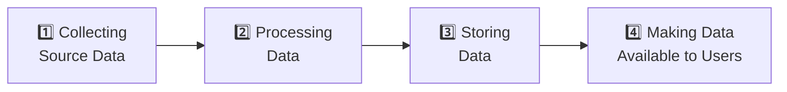

# The Scope of Data Engineering in the Modern Data Ecosystem

## Overview

Data Engineering is the foundational discipline that powers every data-driven organization. In its simplest form, **data engineering concerns itself with the mechanics for the flow and access of data** — ensuring that quality data is available for fact-finding and data-driven decision making.

As the volume, variety, and velocity of data have grown exponentially, so too has the field of data engineering. What was once a relatively contained problem — managing data within a single database — has evolved into a complex, multi-disciplinary practice spanning diverse sources, structures, storage paradigms, and access patterns.

This document explores the full scope of data engineering: what it covers, how it is structured, the skills it demands, and how modern teams and organizations approach it.

---

## The Core Goal of Data Engineering

> **Make quality data available for fact-finding and data-driven decision making.**

This single goal underpins every task, tool, and system within data engineering. Whether an engineer is building a real-time ingestion pipeline or designing a long-term archival strategy, the north star is always the same: reliable, accessible, high-quality data for downstream consumers.

---

## The Four Pillars of Data Engineering

Data engineering can be organized into four interconnected areas of responsibility. Each builds on the previous, forming a continuous pipeline from raw source data to actionable insights.

---

### 1. Collecting Source Data

**Scope:** Extracting, integrating, and organizing data from disparate sources.

The modern data landscape involves data arriving from a wide range of origins — transactional databases, APIs, IoT devices, event streams, third-party SaaS platforms, flat files, and more. The first pillar of data engineering is acquiring and organizing this data reliably.

#### Key Responsibilities

- **Develop tools, workflows, and processes** to acquire data from multiple, heterogeneous sources.
- **Design, build, and maintain scalable data architecture** to ingest and stage incoming data.

#### Storage Destinations at Ingestion

| Storage Type       | Description                                                                 |
|--------------------|-----------------------------------------------------------------------------|
| **Databases**      | Structured storage for operational or transactional data                    |
| **Data Warehouses**| Optimized for analytical queries over structured, historical data           |
| **Data Lakes**     | Schema-on-read stores for raw, unstructured, or semi-structured data        |
| **Data Lakehouses**| Hybrid architecture combining warehouse query performance with lake flexibility |

#### Common Pitfalls

- **Tight coupling to source systems** — Ingestion pipelines that directly query source operational databases can degrade source system performance. Use change data capture (CDC) or dedicated replication layers.
- **Ignoring schema evolution** — Source schemas change. Pipelines must handle schema drift gracefully without breaking downstream consumers.

---

### 2. Processing Data

**Scope:** Cleaning, transforming, and preparing data so that it is usable for analysis.

Raw data is rarely analysis-ready. It may be incomplete, inconsistently formatted, duplicated, or structurally incompatible with downstream systems. The processing pillar transforms raw data into clean, enriched, and trustworthy datasets.

#### Key Responsibilities

- **Implement and maintain distributed systems** for large-scale processing of data.
- **Design ETL/ELT pipelines** for the extraction, transformation, and loading of data into data repositories.
- **Validate and safeguard** data quality, privacy, and security throughout the transformation process.
- **Optimize tools, systems, and workflows** for performance, reliability, and scalability.
- **Ensure regulatory and compliance adherence** — data must meet all applicable legal and organizational guidelines before being made available downstream.

#### ETL vs. ELT

| Pattern | Flow                              | Best For                                         |
|---------|-----------------------------------|--------------------------------------------------|
| **ETL** | Extract → Transform → Load        | On-premise systems; strict schema requirements   |
| **ELT** | Extract → Load → Transform        | Cloud data warehouses; flexible, iterative work  |

#### Data Quality Dimensions to Validate

| Dimension        | Description                                              |
|------------------|----------------------------------------------------------|
| **Completeness** | Are all expected fields and records present?             |
| **Accuracy**     | Does the data correctly reflect the real-world entity?   |
| **Consistency**  | Is the data uniform across systems and time periods?     |
| **Timeliness**   | Is the data available when it is needed?                 |
| **Uniqueness**   | Are duplicate records identified and resolved?           |

#### Common Pitfalls

- **Skipping data validation** — Pushing unvalidated data downstream contaminates analytics. Build validation gates into every pipeline stage.
- **Non-idempotent transformations** — Pipeline reruns should produce the same output. Design transformations to be idempotent to enable safe retries and backfills.

---

### 3. Storing Data

**Scope:** Reliable and easy availability of processed, analysis-ready data.

Once data has been collected and processed, it must be stored in a way that makes it durable, accessible, and performant. Storage architecture decisions have long-lasting implications for cost, query performance, and maintainability.

#### Key Responsibilities

- **Architect or implement data stores** for processed data that balance read/write performance with cost.
- **Design for scalability** — storage systems must grow with the evolving volume of data and changing business requirements.
- **Implement data lifecycle management** — not all data needs to be retained at the same storage tier indefinitely.
- **Ensure operational readiness** by putting in place tools and systems for:

| Operational Concern | Description                                                       |
|---------------------|-------------------------------------------------------------------|
| **Privacy**         | Enforce data masking, anonymization, and access restrictions      |
| **Security**        | Encrypt data at rest and in transit; manage access credentials    |
| **Compliance**      | Apply retention policies aligned with GDPR, HIPAA, CCPA, etc.    |
| **Monitoring**      | Track storage health, query performance, and anomaly detection    |
| **Backup**          | Automate regular snapshots with verified restore procedures       |
| **Recovery**        | Define and test RPO (Recovery Point Objective) and RTO (Recovery Time Objective) targets |

#### Best Practice
> Treat storage architecture as a living system. Implement tiered storage strategies (hot → warm → cold) to balance performance and cost as data ages.

---

### 4. Making Data Available to Users

**Scope:** Secure, performant, and rights-based access to data for end-users and downstream systems.

Data has no value if it cannot be reliably accessed by the people and systems that need it. The final pillar covers the mechanisms by which processed, stored data is surfaced to analysts, data scientists, business stakeholders, and automated systems.

#### Key Responsibilities

- **Build and maintain APIs, services, and programs** that retrieve data on defined parameters for consumption by end-users or downstream applications.
- **Develop interfaces and dashboards** that present data in a form from which stakeholders can derive insights without needing direct database access.
- **Enforce rights-based access control** — users should have access only to the data they are authorized to see, with the appropriate level of permissions.

#### Access Patterns

| Access Method            | Use Case                                                        |
|--------------------------|-----------------------------------------------------------------|
| **REST / GraphQL APIs**  | Application integration, microservices, self-service data access|
| **SQL Query Interfaces** | Analyst-driven ad hoc exploration via tools like Redshift, BigQuery |
| **BI Dashboards**        | Business stakeholder reporting (Tableau, Power BI, Looker)      |
| **Data Sharing / Marketplace** | Governed cross-organizational data access             |

#### Security Considerations

- Implement **column-level** and **row-level security** where sensitive attributes (PII, financial data) must be restricted within a shared dataset.
- Use **role-based access control (RBAC)** to manage permissions at scale rather than individual user grants.
- Audit all data access to maintain an evidence trail for compliance purposes.

---

## Data Engineering Is a Team Sport

One of the most important principles in data engineering is that **no single person is expected to possess all the knowledge, skills, and specializations** required across the full scope of the discipline.

The field spans multiple specialized domains:

| Specialization              | Core Responsibility                                                        |
|-----------------------------|----------------------------------------------------------------------------|
| **Data Architect**          | Design scalable data management systems and platform standards             |
| **Database Engineer / DBA** | Ensure data stores are available, optimized, and secure                    |
| **Pipeline Engineer**       | Build and maintain ETL/ELT workflows and data transformation logic         |
| **Distributed Systems Engineer** | Design and operate large-scale processing infrastructure (Spark, Kafka) |
| **Data Governance Specialist** | Enforce compliance, data quality standards, and access policies          |

Effective data engineering teams are built by combining these complementary specializations, with clear ownership boundaries and strong cross-functional communication.

---

## Build vs. Buy: A Practical Consideration

Not every organization needs to build an end-to-end data engineering practice from scratch. A mature market of tools, platforms, and managed services exists — both on-premise and cloud-based — that can fulfill many data engineering needs.

### Evaluation Framework

When assessing whether to build or buy a solution, consider:

1. **Scale** — Does the data volume justify the operational overhead of a custom solution?
2. **Customization** — Do business requirements exceed what off-the-shelf tools support?
3. **Cost** — What is the total cost of ownership (TCO) for build vs. license/subscription?
4. **Time to value** — How quickly does the organization need a working solution?
5. **Team expertise** — Does the team have the skills to build and maintain a custom system?

### Common Off-the-Shelf Solutions

| Category                   | Examples                                              |
|----------------------------|-------------------------------------------------------|
| **Cloud Data Warehouses**  | Snowflake, Google BigQuery, Amazon Redshift           |
| **Managed ETL / ELT**      | AWS Glue, Azure Data Factory, Fivetran, Airbyte       |
| **Orchestration**          | Apache Airflow (managed via Astronomer, MWAA), Prefect|
| **Data Governance**        | Collibra, Alation, Microsoft Purview                  |
| **BI & Visualization**     | Tableau, Power BI, Looker, Metabase                   |

---

## The Dual Nature of Data Engineering

Data engineering sits at a unique intersection:

> **More than any other data profession, data engineering is about the tools and technologies involved in data manipulation. But it is also about understanding the complexities of data and how it is ultimately leveraged for fact-finding and decision-making.**

A data engineer who only understands the technology — but not *why* the data is being moved, or *how* it will be used — will consistently make architectural decisions that fail to serve business needs. Conversely, a practitioner who understands the business context but lacks technical depth will be unable to build reliable, scalable systems.

The best data engineers hold both.

---

## Key Takeaways

| Theme                        | Insight                                                                                          |
|------------------------------|--------------------------------------------------------------------------------------------------|
| **Core Purpose**             | Data engineering exists to make quality data accessible for decision-making.                     |
| **Four Pillars**             | Collect → Process → Store → Make Available. Each stage is interdependent.                        |
| **Team Discipline**          | No single person masters all of data engineering; specialization and collaboration are essential. |
| **Build vs. Buy**            | Evaluate managed solutions before committing to custom builds — the market is mature.            |
| **Dual Competency Required** | Technical mastery of tools must be paired with understanding of how data serves business goals.  |
| **Compliance Is Non-Optional**| Privacy, security, and regulatory compliance must be designed in — not retrofitted.             |

---

## Glossary

| Term                  | Definition                                                                                         |
|-----------------------|----------------------------------------------------------------------------------------------------|
| **ETL**               | Extract, Transform, Load — a pattern for moving and reshaping data between systems.                |
| **ELT**               | Extract, Load, Transform — loads raw data first, then transforms it within the destination system. |
| **Data Warehouse**    | A centralized analytical store optimized for structured, historical query workloads.               |
| **Data Lake**         | A storage repository holding raw data in native format until needed for processing.                |
| **Data Lakehouse**    | A hybrid architecture combining the flexibility of a data lake with the performance of a warehouse.|
| **CDC**               | Change Data Capture — tracks and captures row-level changes in source databases for replication.   |
| **RBAC**              | Role-Based Access Control — assigns permissions to roles rather than individual users.             |
| **RPO**               | Recovery Point Objective — the maximum acceptable amount of data loss measured in time.            |
| **RTO**               | Recovery Time Objective — the maximum acceptable time to restore a system after a failure.         |
| **PII**               | Personally Identifiable Information — data that can be used to identify a specific individual.     |
| **Idempotent**        | A pipeline operation that produces the same result regardless of how many times it is executed.    |
| **Distributed System**| A computing environment where processing is spread across multiple networked nodes.                |

---

*Source: IBM Skills Network — The Scope of Data Engineering in the Modern Data Ecosystem*
