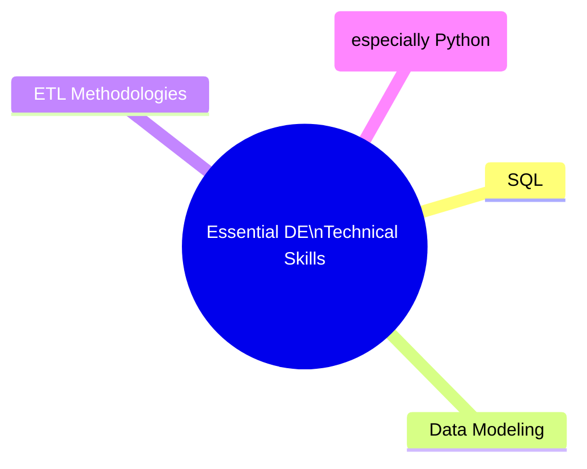

# Skills and Qualities to Be a Data Engineer

## Overview

Data engineering is one of the most dynamic technical disciplines — the tools, platforms, and best practices evolve rapidly. Success in the field requires more than just technical proficiency. It demands a specific mindset, a set of soft skills for cross-team collaboration, and the ability to adapt as the ecosystem shifts. This document captures the perspectives of practicing data professionals on what it actually takes to be a successful data engineer, organized into technical skills and personal qualities.

---

## The First Requirement: Love Data

> *"You need to love data, otherwise you shouldn't be a data engineer."*

Before any specific tool or language, the foundational prerequisite is genuine curiosity about data itself. Data engineering is not a role where you work with data occasionally — data is the full-time focus. Without intrinsic interest, the pace of change and depth of detail will become overwhelming.

---

## Technical Skills

### Skill Variability by Industry

One of the most important truths about data engineering skills is that **requirements vary significantly by industry and job role**. There is no single universal skillset:

| Industry         | Typical Skill Priorities                                                                 |
|------------------|------------------------------------------------------------------------------------------|
| **Retail**       | Relational databases, Cassandra, Google BigTable, Kafka Streams, WebSphere MQ, 24/7 system architecture |
| **Healthcare**   | Compliance-focused data handling, healthcare data standards (HIPAA), ETL pipelines       |
| **Social Media** | Real-time streaming, massive-scale distributed systems, NoSQL, custom pipeline frameworks |
| **Finance**      | Transaction processing, high-availability systems, audit trails, regulatory reporting    |

The takeaway: **data engineering is a very wide topic.** Job postings may look quite different depending on the industry — but the foundational skills transfer across them all.

### The Four Essential Technical Skills

According to practitioners, these four form the core that every data engineer should build on:

#### 1. SQL

SQL is consistently cited as the single most important technical skill for data engineers. It is the universal language for accessing, querying, and manipulating data across virtually every database system — relational and many NoSQL systems alike.

Proficiency goes beyond basic `SELECT` statements. A data engineer needs:
- Complex joins, subqueries, and CTEs (Common Table Expressions)
- Window functions for analytical queries
- Query optimization and execution plan analysis
- DDL (Data Definition Language) for schema design and modification

#### 2. Data Modeling

The ability to design how data is structured, related, and stored. This includes:

| Modeling Technique    | Description                                                                 |
|-----------------------|-----------------------------------------------------------------------------|
| **Entity-Relationship (ER) Modeling** | Defining entities, attributes, and relationships for transactional systems |
| **Dimensional Modeling** | Star schemas and snowflake schemas for analytical / data warehouse use      |
| **Normalization**     | Reducing redundancy in transactional databases                              |
| **Denormalization**   | Optimizing read performance in analytical systems                           |

#### 3. ETL Methodologies

Understanding how to extract data from source systems, transform it into a usable format, and load it into destination repositories. This covers both:
- **Traditional ETL** (Extract → Transform → Load) — transform before loading
- **Modern ELT** (Extract → Load → Transform) — load raw data, transform in place

#### 4. Programming Skills (Especially Python)

Programming is "very, very helpful" and increasingly expected. Python has become the dominant language in the data ecosystem due to its ecosystem of data libraries (pandas, PySpark, SQLAlchemy, etc.). Java, C, and Scala are also relevant, particularly in big data frameworks like Apache Spark and Apache Flink.

### Broader Technical Infrastructure Knowledge

Beyond the four essentials, a well-rounded data engineer needs working knowledge across the full infrastructure stack:

| Domain                      | Specific Knowledge Areas                                                      |
|-----------------------------|-------------------------------------------------------------------------------|
| **Operating Systems**       | Linux/Unix (shell commands, system administration), Windows                   |
| **Computer Architecture**   | CPU, memory, I/O fundamentals — essential for performance tuning              |
| **Cloud Platforms**         | AWS, Google Cloud, Azure — compute, storage, networking services              |
| **Virtualization**          | Virtual machines, containers (Docker, Kubernetes)                             |
| **Storage Types**           | Local (SSD/HDD), network-attached, cloud object storage (S3, Blob, GCS)       |
| **Networking**              | LAN, WAN, VPN, DNS, firewalls, load balancing                                |
| **Databases**               | Relational (PostgreSQL, MySQL, DB2, Oracle) AND NoSQL (MongoDB, Cassandra, Redis) |
| **Big Data Ecosystem**      | Data warehouses, data lakes, ETL pipelines, distributed processing (Spark, Hadoop) |
| **Automation**              | Pipeline orchestration (Airflow), infrastructure as code (Terraform), CI/CD  |

> **Technical is actually the easy part — because you can learn a new technology.** The harder skills are the personal qualities.

---

## Soft Skills and Personal Qualities

Practitioners consistently emphasize that **the most important skills are actually the soft skills**. Technical knowledge can be acquired; mindset and interpersonal effectiveness are harder to develop.

### Problem Solving and Troubleshooting

At its core, data engineering is a problem-solving discipline. Pipelines break. Data is inconsistent. Schemas drift. Systems underperform. The engineer must enjoy the process of diagnosing, isolating, and resolving issues.

### Communication

> *"A data engineer is constantly involved with multiple teams."*

Data engineers must communicate effectively with a wide range of stakeholders:

| Stakeholder         | What They Need From the Engineer                                      |
|---------------------|------------------------------------------------------------------------|
| **Developers**      | Technical collaboration — understanding their data storage requirements |
| **Management**      | Clear justification for engineering choices — defending tradeoffs       |
| **Business Users**  | Translation of technical constraints into business-impact language      |
| **Data Scientists** | Understanding their analytical needs and delivering the right data      |

Being able to **advocate for your choices** — explaining why a particular approach is necessary and what the tradeoffs are — is cited as a critical skill.

### Curiosity and Asking Questions

> *"You should be very curious and able to ask a lot of questions to business users and technical users."*

An effective data engineer does not wait for perfectly specified requirements. They proactively seek to understand the domain, the data sources, and the business context — and use that understanding to build better pipelines.

### Detail Orientation

> *"The best data engineer is a detail-oriented control-freak."*

Working with data at scale requires extreme attention to detail:
- Schema mismatches that break pipelines
- Off-by-one errors in partitioning logic
- Encoding issues that corrupt text data
- Timezone handling that produces incorrect aggregations

The phrase "control-freak" reflects the healthy mindset of someone who takes ownership of their data environment and cares about every unchecked box.

### Adaptability and Continuous Learning

> *"If you don't enjoy change, if you don't enjoy learning, data engineering is not the right place for you."*

The data engineering landscape evolves constantly. A practitioner who cannot adapt will be left behind. Willingness to learn new tools, paradigms, and approaches is not optional — it is a job requirement.

### Teamwork and Collaboration

Data engineering is never a solo discipline. Engineers work with:
- Other engineers (often with different specializations)
- Data architects and DBAs
- Data analysts and data scientists
- Business stakeholders and management

### Work Ethic and Passion to Learn

> *"A work ethic and passion to learn are the most important things."*

These two qualities underpin everything else. No amount of initial knowledge compensates for a lack of drive to grow and improve.

---

## The Complete Data Engineer Profile

```mermaid
flowchart TD
    subgraph Technical
        T1[SQL]
        T2[Data Modeling]
        T3[ETL / ELT]
        T4[Programming\nPython, Java, Scala]
        T5[Infrastructure\nOS, Cloud, Networking]
        T6[Databases\nRDBMS + NoSQL]
        T7[Big Data\nWarehouses, Lakes, Spark]
    end

    subgraph Personal
        P1[Curiosity]
        P2[Detail Orientation]
        P3[Adaptability]
        P4[Work Ethic]
        P5[Love of Data]
    end

    subgraph Interpersonal
        I1[Communication]
        I2[Problem Solving]
        I3[Teamwork]
        I4[Advocacy]
    end

    T1 --> Core
    T2 --> Core
    T3 --> Core
    T4 --> Core
    T5 --> Core
    T6 --> Core
    T7 --> Core
    P1 --> Core
    P2 --> Core
    P3 --> Core
    P4 --> Core
    P5 --> Core
    I1 --> Core
    I2 --> Core
    I3 --> Core
    I4 --> Core
    
    Core[Successful\nData Engineer]
```

---

## Key Takeaways

| # | Takeaway                                                                                                                   |
|---|----------------------------------------------------------------------------------------------------------------------------|
| 1 | **SQL, data modeling, ETL, and programming (Python)** are the four essential technical skills every data engineer needs.   |
| 2 | Technical skill requirements vary by industry — retail, healthcare, social media, and finance each emphasize different tools. |
| 3 | Infrastructure knowledge (OS, cloud, networking, storage, databases) provides the broader context for effective engineering. |
| 4 | **Soft skills are the most important** — communication, curiosity, problem solving, and detail orientation separate good engineers from great ones. |
| 5 | Data engineering is a field of constant change — **adaptability and a love of learning** are not optional.                  |
| 6 | Being a "detail-oriented control-freak" about your data environment is a sign of a great engineer, not a flaw.              |
| 7 | Automation is becoming increasingly critical in the modern data engineering landscape.                                      |

---

## Glossary

| Term                  | Definition                                                                                          |
|-----------------------|-----------------------------------------------------------------------------------------------------|
| **SQL**               | Structured Query Language — the standard language for querying and manipulating relational databases.|
| **ETL**               | Extract, Transform, Load — a data integration pattern that transforms data before loading.          |
| **ELT**               | Extract, Load, Transform — a modern pattern that loads raw data first, then transforms in place.    |
| **Data Modeling**     | The process of defining how data is structured, stored, and related across a system.               |
| **NoSQL**             | A category of non-relational databases (document, key-value, column, graph) for flexible, high-scale storage. |
| **RDBMS**             | Relational Database Management System — stores data in structured tables with defined relationships. |
| **Data Pipeline**     | An automated workflow that extracts, transforms, and loads data between systems.                   |
| **Data Warehouse**    | A centralized analytical store optimized for structured query workloads.                           |
| **Data Lake**         | A storage repository for raw data in native format until needed for processing.                    |
| **Kafka Streams**     | A client library for building real-time streaming applications on Apache Kafka.                    |
| **WebSphere MQ**      | An IBM messaging middleware product for reliable asynchronous communication between applications.   |
| **BigTable**          | Google's wide-column NoSQL database for large-scale analytical and operational workloads.          |
| **Cassandra**         | An open-source NoSQL database designed for high availability and horizontal scalability.            |
| **Containerization**  | Packaging applications with their dependencies into isolated containers (e.g., Docker).            |
| **Infrastructure as Code** | Managing infrastructure through machine-readable configuration files (e.g., Terraform).      |

---

*Source: IBM Data Engineering Fundamentals — Viewpoints: Skills and Qualities to Be a Data Engineer*
