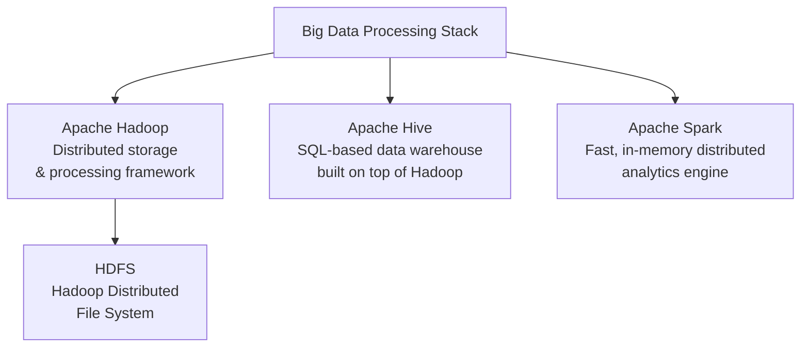
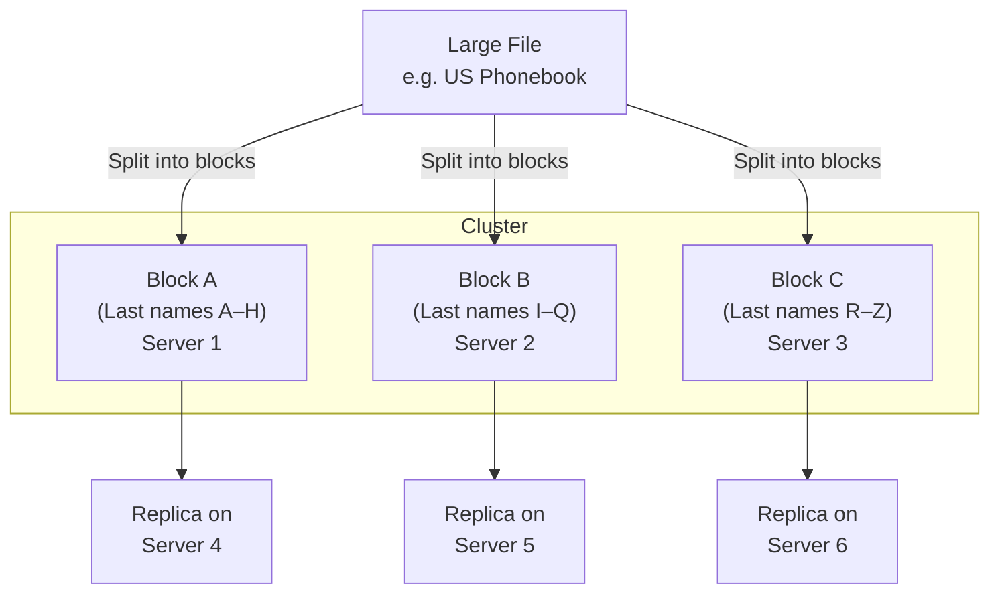
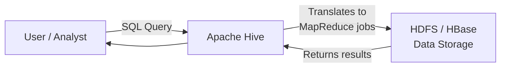
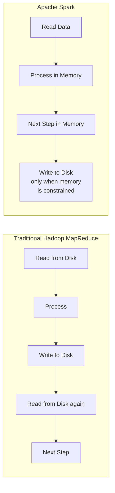
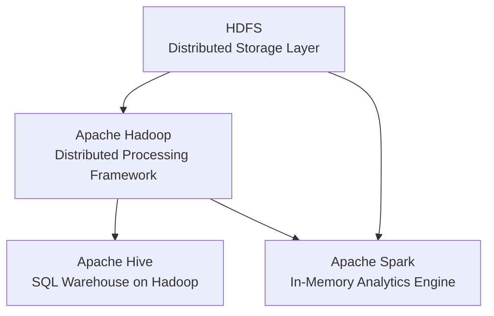

# Big Data Processing Tools: Hadoop, HDFS, Hive, and Spark

## Introduction

Big Data processing technologies provide ways to work with large sets of structured, semi-structured, and unstructured data so that value can be derived from them. This lesson covers three core open-source technologies in the Big Data ecosystem:

| Tool | Role in One Line |
|---|---|
| **Apache Hadoop** | Collection of tools for distributed storage and processing of big data |
| **Apache HDFS** | The storage layer of Hadoop — partitions and replicates files across a cluster |
| **Apache Hive** | Data warehouse built on Hadoop, enabling SQL-based querying of big data |
| **Apache Spark** | Distributed analytics engine for real-time and complex data processing |

---

## Apache Hadoop

### What It Is

**Hadoop** is a Java-based, open-source framework that allows distributed storage and processing of large datasets across **clusters of computers**.

Key terminology:

- **Node** — a single computer in the cluster
- **Cluster** — a collection of nodes working together

Hadoop can scale from a **single node** to **any number of nodes**, each contributing local storage and computation.

### Core Characteristics

- **Reliable** — built-in fault tolerance and data replication
- **Scalable** — grows horizontally by adding nodes, not by upgrading single machines
- **Cost-effective** — runs on commodity hardware; no format requirements for stored data

### What You Can Do with Hadoop

| Capability | Description |
|---|---|
| **Incorporate emerging formats** | Streaming audio, video, social media sentiment, clickstream data — formats not traditionally supported in data warehouses |
| **Self-service access** | Provides real-time, self-service data access for all stakeholders |
| **Cost optimization** | Consolidate enterprise data and move **cold data** (infrequently accessed) off expensive warehouse systems onto Hadoop |

> **Cold data** = data that is not in frequent use. Moving it to Hadoop reduces costs without sacrificing its availability for future use.

### Four Main Components of Hadoop

Hadoop is made up of four components. The most critical for data storage is **HDFS**, covered in the next section.

---

## HDFS — Hadoop Distributed File System

### What It Is

**HDFS** is the storage system for big data that runs on multiple pieces of commodity hardware connected through a network. It is one of the four main components of Hadoop.

### How HDFS Stores Data

HDFS solves the problem of storing files too large for any single machine by **splitting them into blocks and distributing those blocks across the cluster**.

> **Example:** A file containing phone numbers for every person in the US would be split across the cluster — names A–H on Server 1, I–Q on Server 2, and so on. To reconstruct the full file, your program assembles the blocks from every server. HDFS also **replicates each block onto two additional servers by default**, so if one server fails, the data is still available.

### Key HDFS Concepts

| Concept | Description |
|---|---|
| **Block splitting** | Large files are partitioned into blocks distributed across multiple nodes, enabling parallel access |
| **Parallel computation** | Because data lives on each node, computation runs locally on that node — no data transfer needed |
| **Replication** | Each block is replicated across additional nodes (default: 2 replicas) to prevent data loss |
| **Data locality** | Moving computation to the node where data resides, rather than moving data to the computation — minimizes network congestion and increases throughput |

### HDFS Benefits

| Benefit | Description |
|---|---|
| **Fast hardware failure recovery** | Built-in fault detection and automatic recovery |
| **Streaming data access** | Supports high data throughput rates for continuous data access |
| **Massive scale** | Can scale to hundreds of nodes in a single cluster |
| **Portability** | Runs across multiple hardware platforms and operating systems |
| **Fault tolerance** | Replication ensures no single point of failure causes data loss |

---

## Apache Hive

### What It Is

**Hive** is an open-source data warehouse software for **reading, writing, and managing large dataset files** stored in HDFS or other storage systems such as Apache HBase.

Hive enables data warehouse-style analytics on top of Hadoop by providing **SQL-like access** to big data — making it accessible to analysts and engineers who already know SQL.

### How Hive Works

### Strengths

- **SQL interface** — easy access to big data without needing to write low-level MapReduce code
- **ETL, reporting, and data analysis** — well-suited for batch-oriented warehousing tasks
- **Reads from HDFS and HBase** — works natively within the Hadoop ecosystem

### Limitations

| Limitation | Reason |
|---|---|
| **High query latency** | Hadoop is designed for long sequential scans; Hive inherits this — not suitable for fast response time requirements |
| **Not suitable for OLTP** | Hive is **read-based** and performs poorly with high-write transaction processing workloads |

> **When to use Hive:** Batch analytics, ETL pipelines, reporting over historical data — not for real-time or transactional workloads.

---

## Apache Spark

### What It Is

**Spark** is a general-purpose distributed data processing engine designed to extract and process large volumes of data for a **wide range of applications** — from interactive analytics to machine learning.

### What Sets Spark Apart: In-Memory Processing

> Spark keeps data **in memory** between processing steps, eliminating the repeated disk read/write cycles that make traditional Hadoop MapReduce slow. This makes Spark dramatically faster for iterative workloads like machine learning.

### Use Cases

| Use Case | Description |
|---|---|
| **Interactive Analytics** | Fast, ad hoc queries over large datasets with near-real-time response |
| **Stream Processing** | Processing continuous data streams in real time |
| **Machine Learning** | Iterative algorithms that benefit from in-memory data persistence |
| **Data Integration** | Combining and reconciling data from heterogeneous sources |
| **ETL** | Transforming and loading large volumes of data at speed |

### Language Support

Spark provides interfaces for all major data programming languages:

`Java` · `Scala` · `Python` · `R` · `SQL`

### Infrastructure Flexibility

- Can run on its **own standalone clustering technology**
- Can run **on top of Hadoop** — using HDFS for storage
- Can access data from **HDFS, Hive**, and a wide variety of other data sources

> **Key Spark use case:** The ability to process streaming data fast and perform complex analytics in real-time is Spark's defining strength.

---

## Hadoop vs. Hive vs. Spark — At a Glance

| Dimension | Hadoop | HDFS | Hive | Spark |
|---|---|---|---|---|
| **Primary role** | Distributed processing framework | Distributed file storage | SQL data warehouse on Hadoop | In-memory analytics engine |
| **Processing model** | Batch (MapReduce) | Storage only | Batch (via MapReduce) | Batch + real-time streaming |
| **Query interface** | Java/MapReduce | N/A | SQL (HiveQL) | Java, Scala, Python, R, SQL |
| **Latency** | High | N/A | High | Low (in-memory) |
| **Write support** | Yes | Yes | Limited (read-based) | Yes |
| **Best for** | Large-scale batch processing | Storing big data reliably | Warehousing, ETL, reporting | Real-time analytics, ML, ETL |
| **Runs on top of** | Commodity hardware | Commodity hardware | Hadoop / HDFS | Hadoop, HDFS, standalone |

---

## Summary and Key Takeaways

- **Apache Hadoop** is the foundational open-source framework for distributed big data storage and processing, running across clusters of commodity hardware.
- **HDFS** is Hadoop's storage layer — it splits large files into blocks, distributes them across nodes, replicates them for fault tolerance, and uses data locality to minimize network overhead.
- **Apache Hive** provides a SQL interface on top of Hadoop for data warehouse tasks like ETL and reporting — but is not suitable for low-latency or high-write transactional workloads.
- **Apache Spark** is a general-purpose, in-memory distributed analytics engine — dramatically faster than MapReduce for iterative and real-time workloads, supporting streaming, ML, ETL, and interactive analytics.
- All three tools are **open-source** and form the backbone of the modern big data processing ecosystem.
- Spark's key differentiator is **in-memory processing** — avoiding repeated disk I/O between steps, which makes it the tool of choice for real-time analytics and machine learning at scale.
