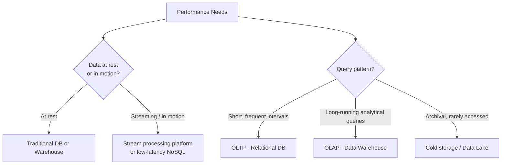
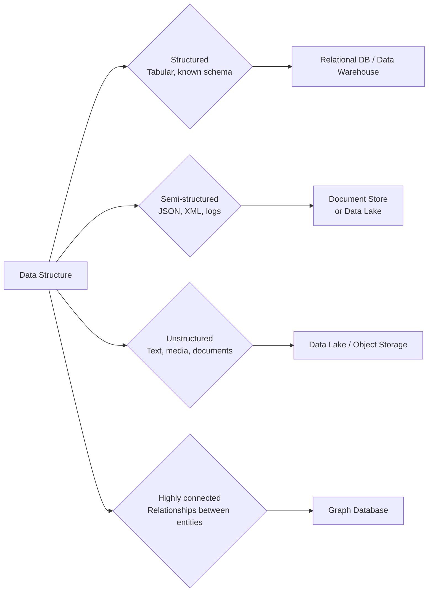
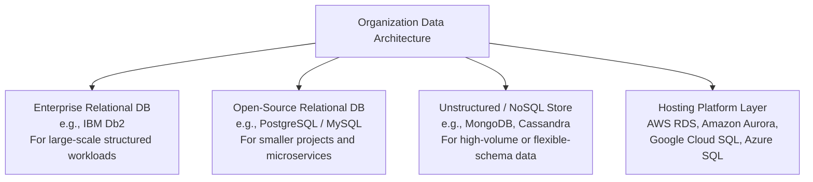
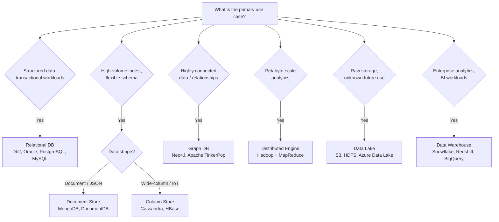
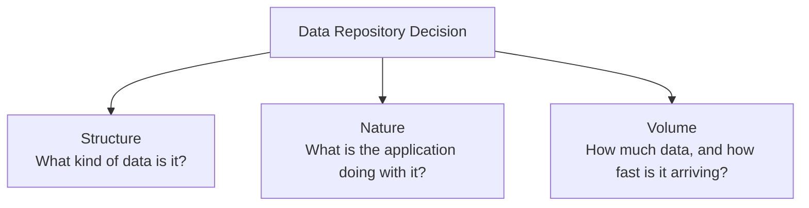

# Viewpoints: Considerations for Choice of Data Repository

## Introduction

Choosing the right data repository is rarely a simple decision. In this viewpoints lesson, several data professionals share the factors they weigh when selecting the most appropriate repository for their organization's needs. While the specific tools and platforms vary, the decision-making frameworks they describe share common themes.

> **Key takeaway upfront:** Very few organizations today use just one data repository. Most maintain a portfolio of solutions, each chosen for a specific purpose, workload, or team.

---

## Factor 1: The Use Case

The single most important starting point is understanding **what the repository will actually be used for**.

Key questions to answer before evaluating any platform:

| Question | Why It Matters |
|---|---|
| What type of data will be stored? | Structured, semi-structured, or unstructured data each favors different repository types |
| Is the schema known in advance? | Schema-on-write (warehouse) vs. schema-on-read (lake) is a foundational decision |
| Is this for transactions, analytics, or archival? | OLTP, OLAP, and cold storage have very different performance and cost profiles |
| Are queries short and frequent, or long-running? | Transactional DBs favor low-latency reads/writes; warehouses favor complex, batch queries |

---

## Factor 2: Performance Requirements

---

## Factor 3: Data Volume and Ingestion Rate

The **volume** and **velocity** of data arriving in the system is one of the most decisive factors.

| Volume / Velocity | Recommended Approach |
|---|---|
| Moderate structured data | Relational database (IBM Db2, Oracle, PostgreSQL) |
| Gigabytes to terabytes per day | Document stores (MongoDB) or wide-column stores (Cassandra) |
| Terabytes to petabytes for analytics | Distributed processing engine (Hadoop with MapReduce) |
| Highly connected relational data | Graph database (Neo4J, Apache TinkerPop) |

> **Rule of thumb:** In most cases a relational database is sufficient. NoSQL and big data systems are for edge cases where the data's volume, velocity, or structure exceeds what an RDBMS can handle effectively.

---

## Factor 4: Data Structure

The structure of the data — more than almost any other factor — determines the category of repository that will serve it best.

---

## Factor 5: Security and Compliance

Security is a non-negotiable evaluation criterion:

- Does the data need to be **encrypted at rest and in transit**?
- What are the **access control** requirements (role-based, row-level, column-level)?
- Are there **regulatory or organizational standards** that mandate or restrict the use of specific platforms?

> Organizations often have internal standards dictating which approved databases or repositories may be used for specific data classifications or task types. These constraints can narrow the field of choices significantly before technical evaluation even begins.

---

## Factor 6: Scalability

Current performance is not enough — the repository must be able to **grow with the organization**.

Key scalability questions:

- Can it scale **horizontally** (adding more nodes) as data volume grows?
- Does it support **elastic scaling** in cloud environments (pay-as-you-go)?
- Will it still perform well when data volume is 10x or 100x what it is today?

> *"We may be happy with its performance today, but is it scalable enough? Can it scale along with the organization?"* — Data Professional

---

## Factor 7: Ecosystem Compatibility

A technically superior repository that doesn't integrate with existing tools creates more problems than it solves.

Evaluate compatibility with:

- **Programming languages** used by the engineering and data science teams
- **Existing tools and platforms** (BI tools, orchestration frameworks, ETL pipelines)
- **Current processes** and data workflows already in production

---

## Factor 8: Organizational Skills and Costs

Technical merit alone does not determine the right choice. Two practical factors often tip the decision:

| Factor | Consideration |
|---|---|
| **Team expertise** | What databases does the team already know? Retraining has a real cost. |
| **Licensing and infrastructure cost** | Commercial enterprise databases vs. open-source alternatives have very different cost profiles |
| **Hosting platform** | The choice of hosting adds another layer — e.g., IBM Db2 on AWS RDS vs. Amazon Aurora vs. Google Cloud SQL are all valid options for relational workloads |

> *"The important thing is to think about the skills that you have within your organization or that you want to foster within your organization — and consider the costs of the various solutions."* — Data Professional

---

## Real-World Example: A Typical Multi-Repository Setup

In practice, most organizations maintain a **portfolio of repositories** rather than a single solution:

> The hosting platform adds a third dimension to the decision: it's not just *which* database, but *where* it runs — and the cloud provider chosen can affect cost, latency, compliance, and integration options.

---

## Decision Framework: Matching Use Case to Repository

---

## Summary and Key Takeaways

The three core dimensions of any data repository decision are:

| Dimension | Key Question | Points to... |
|---|---|---|
| **Structure** | Structured, semi-structured, or unstructured? | RDBMS → NoSQL → Data Lake |
| **Nature** | Transactions, analytics, recommendations, archival? | OLTP → OLAP → Graph → Cold Storage |
| **Volume** | GB/day or PB/day? Frequent or rare access? | RDBMS → Cassandra/MongoDB → Hadoop |

**Additional considerations that shape the final choice:**
- Performance requirements (latency, streaming vs. at-rest)
- Security and compliance mandates
- Scalability — not just today, but as the organization grows
- Ecosystem compatibility with existing tools and languages
- Team expertise and total cost of ownership
- Hosting platform (cloud provider and deployment model)

> Most organizations do not use a single repository — they build a **portfolio** of solutions, each matched to a specific workload, team, or data type. The goal is not to find the *one* right database, but to build the *right combination* for your organization's needs.
