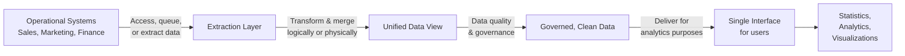
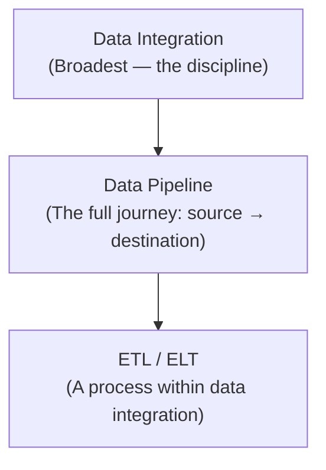
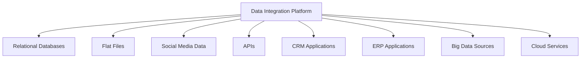
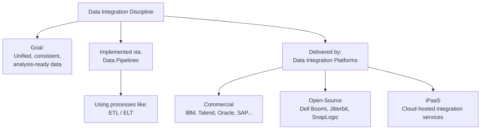

# Data Integration Platforms

## Introduction

**Data integration** is defined by Gartner as a discipline comprising the practices, architectural techniques, and tools that allow organizations to **ingest, transform, combine, and provision data across various data types**.

Data integration covers several usage scenarios:

- **Data consistency across applications** — ensuring the same data looks and behaves the same across all systems that use it
- **Master data management** — maintaining a single authoritative source of key business entities (customers, products, etc.)
- **Data sharing between enterprises** — exchanging data across organizational boundaries
- **Data migration and consolidation** — moving and merging data during system transitions or acquisitions

---

## Data Integration in Analytics and Data Science

In the context of analytics and data science specifically, data integration encompasses:

> **Example:** To make customer data available for analytics, you extract individual customer records from Sales, Marketing, and Finance systems separately. You then provide a **unified view** of the combined data so users can access, query, and manipulate it from a **single interface** to derive statistics, analytics, and visualizations — without needing to know which source system each piece came from.

---

## How Data Integration Relates to ETL and Data Pipelines

These three concepts are related but operate at different levels of scope:

| Concept | Scope | Role |
|---|---|---|
| **Data Integration** | Broadest — the overall discipline | Defines the goal: unified, consistent, accessible data |
| **Data Pipeline** | Mid-level — the implementation mechanism | Covers the complete data movement journey from source to destination; *used to perform* data integration |
| **ETL / ELT** | Narrowest — a specific process | A process *within* data integration; handles extract, transform, and load operations |

> **In plain terms:** You use a **data pipeline** to *perform* data integration, and **ETL** is one of the processes that runs *inside* that pipeline.

---

## Capabilities of Modern Data Integration Platforms

There is no single approach to data integration. However, modern platforms typically support the following capabilities:

### 1. Pre-Built Connectors and Adapters
An extensive catalog of connectors that enable integration flows with a wide variety of sources:

### 2. Open-Source Architecture
- Provides greater **flexibility** in customization and extension
- Avoids **vendor lock-in** — organizations are not dependent on a single vendor's proprietary ecosystem

### 3. Batch and Streaming Optimization
- Supports **large-scale batch processing** for high-volume periodic workloads
- Supports **continuous data streams** for real-time event-driven workloads
- Many modern platforms support **both simultaneously** within the same integration flow

### 4. Big Data Integration
- Support for big data sources is increasingly a **primary decision driver** when selecting an integration platform
- Platforms must handle the volume, velocity, and variety characteristic of big data workloads

### 5. Additional Functionalities

| Functionality | Description |
|---|---|
| **Data quality & governance** | Built-in rules and controls to ensure data is accurate, complete, and trustworthy |
| **Compliance & security** | Controls to meet regulatory requirements and protect sensitive data |
| **Portability** | Ability to run the integration platform in any environment — on-premise, single cloud, multi-cloud, or hybrid cloud |
| **Cloud-native operation** | Works natively across cloud environments without requiring separate configurations per environment |

---

## Data Integration Platforms and Tools

### Commercial Platforms

#### IBM
IBM offers a broad suite of data integration tools targeting enterprise integration scenarios:

| Tool | Focus |
|---|---|
| IBM Cloud Pak for Data | Unified data and AI platform |
| IBM Cloud Pak for Integration | Enterprise application and data integration |
| IBM Data Replication | Real-time data replication and synchronization |
| IBM Data Virtualization Manager | Virtual data access without physical movement |
| IBM InfoSphere Information Server on Cloud | Cloud-based data integration and governance |
| IBM InfoSphere DataStage | High-performance ETL and data pipeline execution |

#### Talend
| Tool | Focus |
|---|---|
| Talend Data Fabric | End-to-end data integration and integrity |
| Talend Cloud | Cloud-native integration platform |
| Talend Data Catalog | Metadata management and data discovery |
| Talend Data Management | Data quality and master data management |
| Talend Big Data | Hadoop and Spark-based big data integration |
| Talend Data Services | API and web service integration |
| Talend Open Studio | Free, open-source integration development |

#### Other Major Vendors
SAP, Oracle, Denodo, SAS, Microsoft, Qlik, TIBCO

---

### Open-Source Frameworks
Dell Boomi, Jitterbit, SnapLogic

---

### Cloud-Based iPaaS (Integration Platform as a Service)

**iPaaS** delivers data integration capabilities as a hosted service via virtual private cloud or hybrid cloud — eliminating the need to install and manage integration infrastructure on-premise.

| Platform | Provider |
|---|---|
| Adeptia Integration Suite | Adeptia |
| Google Cloud Cooperation 534 | Google Cloud |
| IBM Application Integration Suite on Cloud | IBM |
| Informatica Integration Cloud | Informatica |

---

## Summary and Key Takeaways

- **Data integration** is the broader discipline; ETL is a process within it, and data pipelines are the mechanism used to implement it.
- Modern integration platforms must support **pre-built connectors, open-source flexibility, batch and stream processing, big data compatibility, governance, security, and cloud portability**.
- The market spans **commercial off-the-shelf tools** (IBM, Talend, Oracle), **open-source frameworks** (Dell Boomi, Jitterbit), and **cloud-hosted iPaaS** (Informatica, Google Cloud).
- **Portability** is an increasingly critical capability — as organizations move to cloud and hybrid models, integration platforms must run anywhere without reconfiguration.
- The data integration space continues to evolve as both the **variety of data sources** and the **role of data in business decision-making** continue to grow.
