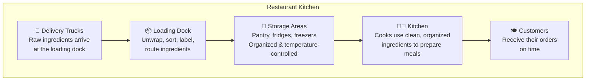
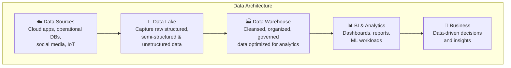
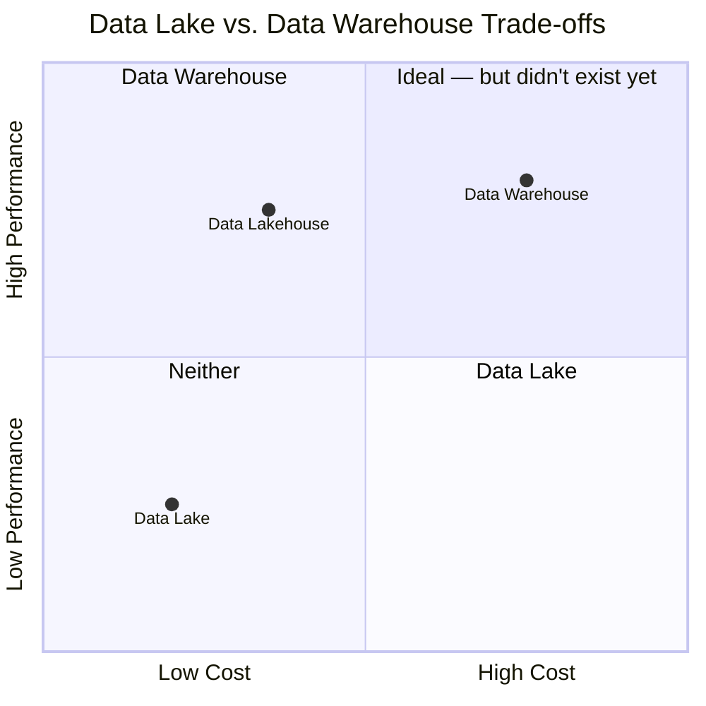
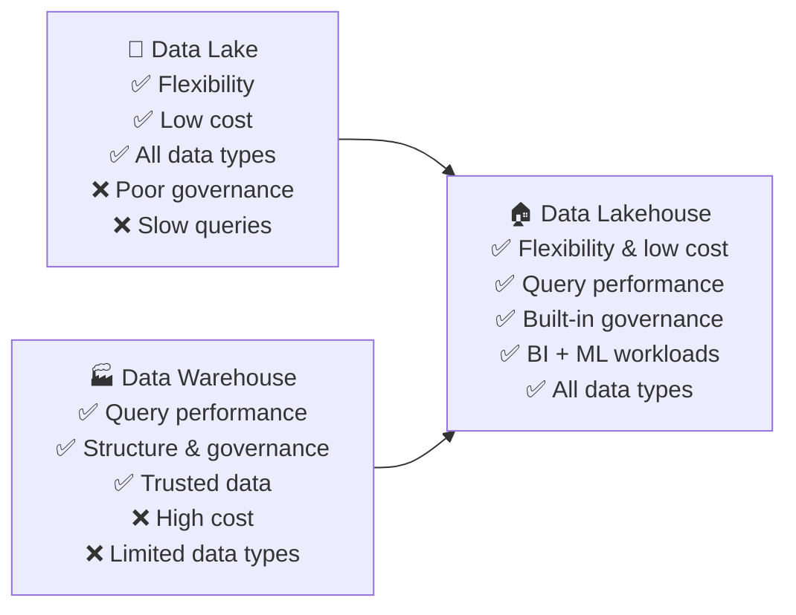
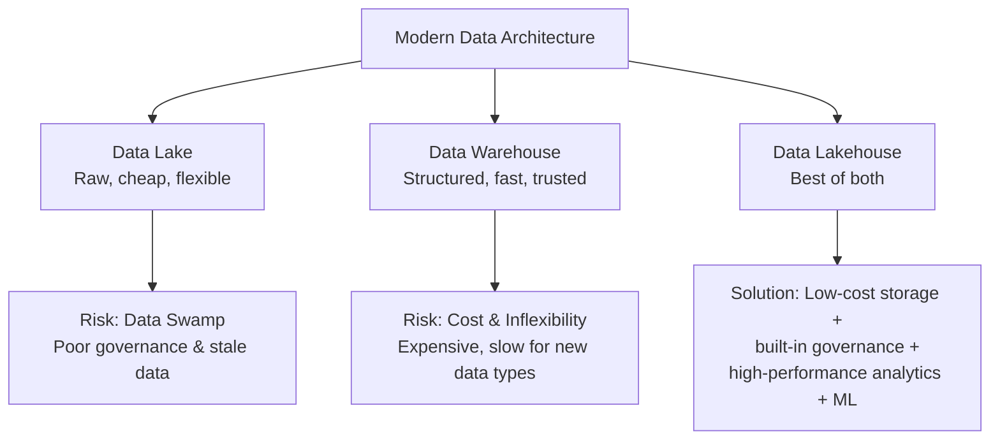

# (Optional) Data Lakehouses Explained

## Introduction

To understand why the **data lakehouse** exists, it helps to first understand the strengths and limitations of data lakes and data warehouses — and why neither alone is sufficient for modern data needs.

This lesson uses a **restaurant kitchen analogy** to map the entire data architecture journey to something tangible and familiar.

---

## The Restaurant Kitchen Analogy

| Restaurant | Data Architecture |
|---|---|
| Ingredient suppliers | Data sources (cloud, apps, social media, IoT) |
| Loading dock | Raw data ingestion layer |
| Pantries, fridges, freezers | Data lake (cheap, raw, all formats) |
| Organized kitchen storage | Data warehouse (cleaned, structured, trusted) |
| Cooks | Analysts, data scientists, BI tools |
| Meals served to customers | Business insights and decisions |

> **Key insight from the analogy:** Just as cooks can't work efficiently if they have to spend time searching for unlabeled, disorganized ingredients — analysts and data scientists can't work effectively if data is ungoverned, stale, or poorly structured.

---

## Data Lakes: Strengths and Challenges

### Strengths
- **Cost-effective** — cheap storage for massive volumes of data
- **Fast ingestion** — capture raw data from any source, in any format, immediately
- **Flexible** — accepts structured, semi-structured, and unstructured data without requiring predefined schemas

### Challenges

| Challenge | Description |
|---|---|
| **Data governance & quality** | Without proper management, data lakes can become **data swamps** — filled with duplicate, inaccurate, or incomplete data that is hard to track and manage |
| **Data staleness** | Stale, unused data loses its value for generating insights — just as ingredients spoil if left unused in storage |
| **Query performance** | Data lakes are not optimized for complex analytical queries; extracting insights directly from a lake can be slow and difficult |

> **"Data Swamp"**: A data lake that has degraded due to poor governance — full of low-quality, untrustworthy data that is difficult to navigate or use.

---

## Data Warehouses: Strengths and Challenges

### Strengths
- **Exceptional query performance** — optimized for complex analytical workloads
- **Data governance and quality** — cleaned, organized, and trusted data
- **BI workloads** — powers dashboards, reports, and analytical tools reliably

### Challenges

| Challenge | Description |
|---|---|
| **High cost** | Warehouses are expensive to run at scale — "you can't put everything in the freezer" |
| **Limited support for semi/unstructured data** | Warehouses struggle with the newest and fastest-growing data types (social media, IoT, documents) |
| **Latency** | Sorting, cleaning, and loading data into a warehouse takes time — making it too slow for applications that require the **freshest data** |

---

## The Problem: Neither Is Enough Alone

- **Data lake**: cheap and flexible, but poor governance and query performance
- **Data warehouse**: fast and trusted, but expensive and inflexible with new data types

---

## The Solution: The Data Lakehouse

The **data lakehouse** combines the best of both architectures:

| Feature | Data Lake | Data Warehouse | Data Lakehouse |
|---|---|---|---|
| **Storage cost** | Low | High | Low |
| **Data types supported** | All (structured, semi, unstructured) | Primarily structured | All |
| **Query performance** | Low | High | High |
| **Data governance** | Weak | Strong | Strong (built-in layer) |
| **BI workloads** | Limited | Excellent | Excellent |
| **ML / AI workloads** | Good | Limited | Excellent |
| **Schema requirement** | Schema-on-read | Schema-on-write | Flexible |

### What the Lakehouse Enables

- **Store** data from an exploding number of new sources at low cost
- **Govern** data through built-in data management and governance layers
- **Power** both **business intelligence** (dashboards, reports) and **high-performance machine learning** workloads — from a single platform

---

## How to Adopt a Lakehouse

Organizations don't need to start from scratch. There are two primary paths:

1. **Modernize an existing data lake** — add governance, structure, and query optimization layers on top of an existing lake
2. **Complement an existing data warehouse** — extend the warehouse to support new AI and machine learning driven workloads that it currently can't handle

> **Note:** The detailed architecture of the data lakehouse will be covered in a future lesson.

---

## Summary and Key Takeaways

- **Data lakes** are ideal for cheap, fast, flexible ingestion of all data types — but risk becoming data swamps without governance, and struggle with complex query performance.
- **Data warehouses** deliver exceptional query performance and data trust — but are costly, inflexible with semi/unstructured data, and too slow for real-time freshness needs.
- The **data lakehouse** merges the flexibility and cost-effectiveness of a lake with the performance and structure of a warehouse — on a single platform.
- The lakehouse supports **both BI and ML/AI workloads**, making it the most versatile architecture for modern data engineering.
- Adoption can be incremental: **modernize a lake** or **complement a warehouse** — no need to rebuild from scratch.
