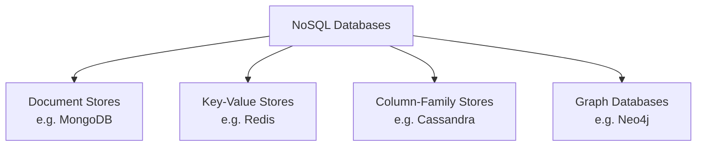
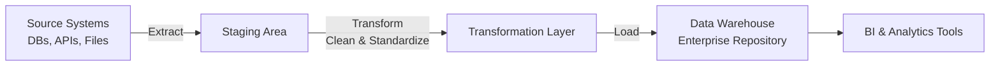
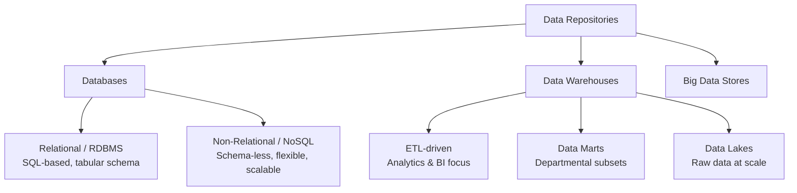

# Overview of Data Repositories

## Introduction

A **data repository** is a general term for data that has been collected, organized, and isolated so that it can be used for business operations or mined for reporting and data analysis. A data repository may be a small or large database infrastructure — consisting of one or more databases — that collects, manages, and stores data sets.

This document provides an overview of the primary types of data repositories, including:

- Databases (Relational and Non-Relational)
- Data Warehouses
- Data Marts and Data Lakes
- Big Data Stores

---

## What is a Database?

A **database** is a collection of data or information designed for:

- **Input** — ingesting new data
- **Storage** — persisting data reliably
- **Search and Retrieval** — finding records efficiently
- **Modification** — updating existing records

### Database Management System (DBMS)

A **Database Management System (DBMS)** is a set of programs that creates and maintains the database. It enables users and applications to:

- Store data
- Modify data
- Extract information via **querying**

> **Example:** To find all customers inactive for six months or more, a query submitted to the DBMS retrieves only the matching records from the full dataset — without manual scanning.

> **Note:** Although "database" and "DBMS" are technically distinct concepts, the terms are commonly used interchangeably in practice.

---

## Types of Databases

Several factors influence the choice of database:

| Factor | Description |
|---|---|
| **Data type and structure** | Is the data tabular, document-based, key-value, etc.? |
| **Querying mechanisms** | Does the use case require SQL, graph traversal, key lookups? |
| **Latency requirements** | How fast must reads/writes be? |
| **Transaction speeds** | How many operations per second are needed? |
| **Intended use** | OLTP (operational), OLAP (analytical), or archival? |

### Relational Databases (RDBMS)

**Relational databases** (also called **RDBMSes**) organize data into a tabular format with rows and columns, following a well-defined structure and schema.

Key characteristics:

- Built on the organizational principles of flat files, but far more powerful
- Optimized for operations and queries involving **many tables** and **large data volumes**
- Use **Structured Query Language (SQL)** as the standard querying interface

```sql
-- Example: Find customers inactive for 6+ months
SELECT customer_id, name, last_active_date
FROM customers
WHERE last_active_date <= CURRENT_DATE - INTERVAL '6 months';
```

> **Best Practice:** Always define primary keys and foreign keys in relational schemas to enforce data integrity and enable efficient joins.

---

### Non-Relational Databases (NoSQL)

**Non-relational databases**, also known as **NoSQL** ("Not Only SQL"), emerged in response to the volume, diversity, and velocity of modern data generation — driven largely by:

- Cloud computing
- the Internet of Things (IoT)
- Social media proliferation

Key characteristics:

- Built for **speed**, **flexibility**, and **scale**
- Allow data to be stored in a **schema-less** or **free-form** fashion
- Widely used for processing **Big Data**



> **Common Pitfall:** NoSQL does not mean "no structure at all" — it means flexible structure. Many NoSQL systems still enforce schema at the application layer.

---

## Data Warehouses

A **data warehouse** is a central repository that:

1. Merges information from **disparate sources**
2. Consolidates it through the **ETL process** (Extract, Transform, Load)
3. Produces one comprehensive database for **analytics and business intelligence (BI)**

### The ETL Process



| ETL Stage | Description |
|---|---|
| **Extract** | Pull raw data from multiple, heterogeneous source systems |
| **Transform** | Clean, standardize, deduplicate, and reshape data into a usable state |
| **Load** | Write the processed data into the enterprise data repository |

> **Historical Note:** Data warehouses and data marts have traditionally been **relational**, since most enterprise data resided in RDBMSes. However, with the rise of NoSQL and new data sources, non-relational repositories are increasingly used for warehousing workloads as well.

---

## Related Concepts: Data Marts and Data Lakes

| Concept | Description |
|---|---|
| **Data Mart** | A subset of a data warehouse scoped to a specific business function or department (e.g., Sales, Finance) |
| **Data Lake** | A large-scale storage repository that holds raw data in its native format until it is needed |
| **Data Warehouse** | A structured, integrated repository optimized for analytical querying across the enterprise |

> These concepts will be explored in greater depth in subsequent lessons.

---

## Big Data Stores

**Big Data Stores** are a category of data repositories that provide:

- **Distributed computational infrastructure** — processing spread across many nodes
- **Distributed storage infrastructure** — data stored across clusters rather than a single server
- The ability to **store, scale, and process very large data sets** that exceed the capacity of traditional databases

> **Example technologies:** Hadoop HDFS, Apache Spark, Amazon S3 (as a raw data store), Google Cloud Storage.

---

## Summary and Key Takeaways



| Repository Type | Structure | Best For | Query Language |
|---|---|---|---|
| **RDBMS** | Tabular, strict schema | Transactional systems, structured analytics | SQL |
| **NoSQL** | Schema-less / flexible | Big data, IoT, real-time apps | Varies (no standard) |
| **Data Warehouse** | Integrated, structured | Enterprise BI and historical analytics | SQL |
| **Data Lake** | Raw, unstructured/semi-structured | Data science, ML, raw storage | SQL (via engines like Spark SQL) |
| **Big Data Store** | Distributed | Massive-scale processing and storage | Varies |

**Core takeaways:**

- A **data repository** isolates and organizes data to make reporting and analytics more efficient and credible.
- **RDBMS** uses SQL and enforces strict schemas; ideal for structured, transactional data.
- **NoSQL** prioritizes flexibility and scale; ideal for unstructured or rapidly evolving data.
- **Data warehouses** centralize data from multiple sources using ETL for BI workloads.
- **Big Data Stores** use distributed infrastructure to handle data volumes beyond the reach of traditional systems.
- Data repositories also serve as a **data archive**, preserving historical data for auditing and trend analysis.
