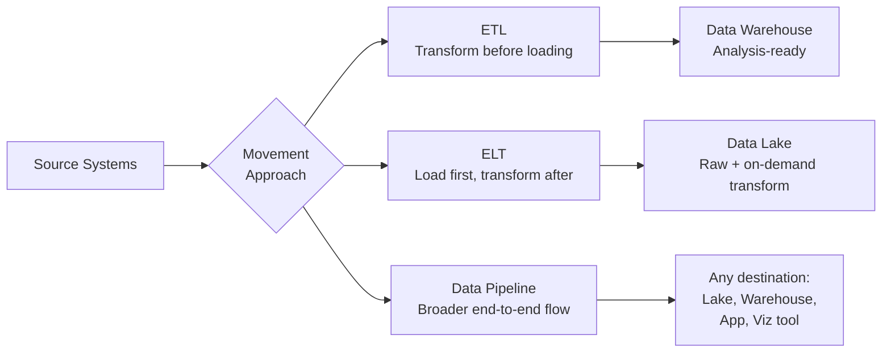
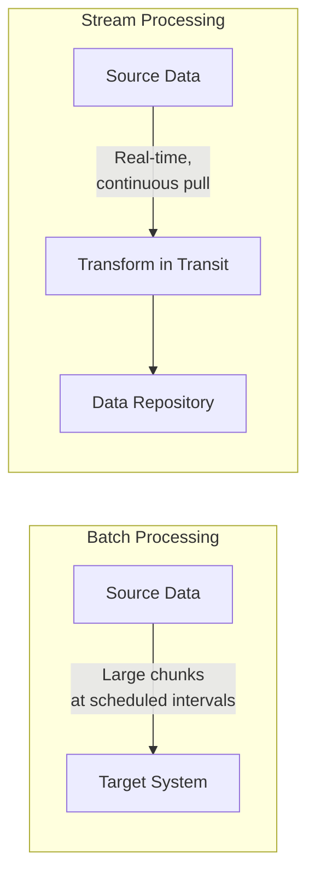
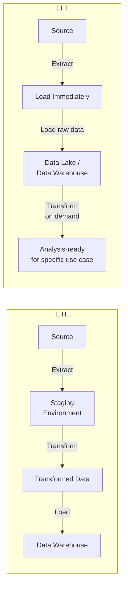
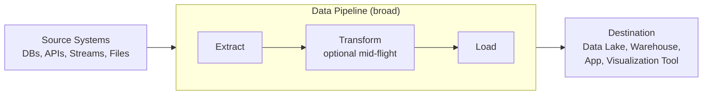
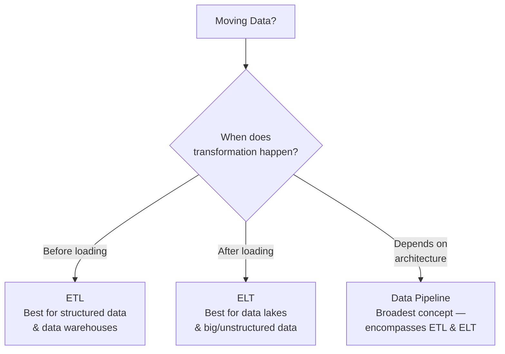

# ETL, ELT, and Data Pipelines

## Introduction

Moving data from source to destination systems is one of the most fundamental operations in data engineering. Three closely related concepts govern this process:

- **ETL** — Extract, Transform, and Load
- **ELT** — Extract, Load, and Transform
- **Data Pipelines** — the broader architecture that encompasses both



---

## ETL — Extract, Transform, and Load

ETL is **how raw data is converted into analysis-ready data**. It is an automated process that:

1. Gathers raw data from identified sources
2. Extracts the information that aligns with reporting and analysis needs
3. Cleans, standardizes, and transforms that data into a usable format
4. Loads it into a data repository

> ETL is a generic process — the actual job can vary widely in usage, utility, and complexity depending on the organization and use case.

---

### Step 1: Extract

Data from source locations is collected for transformation. Extraction can happen in two modes:



| Mode | Description | Tools |
|---|---|---|
| **Batch Processing** | Source data moved in large chunks at scheduled intervals | Stitch, Blendo |
| **Stream Processing** | Data pulled in real-time, transformed while in transit before loading | Apache Samza, Apache Storm, Apache Kafka |

---

### Step 2: Transform

Transformation is the execution of rules and functions that convert raw data into data usable for analysis. Common transformation operations include:

| Transformation | Example |
|---|---|
| **Standardize formats** | Make date formats and units of measurement consistent across all sources |
| **Remove duplicates** | Deduplicate records that appear more than once |
| **Filter unnecessary data** | Drop columns or rows not needed for analysis |
| **Enrich data** | Split a `full_name` field into `first_name`, `middle_name`, `last_name` |
| **Establish key relationships** | Define and validate foreign key links across tables |
| **Apply business rules** | Enforce data validations and organization-specific logic |

```sql
-- Example transformation: standardize date format and split full name
SELECT
    customer_id,
    SPLIT_PART(full_name, ' ', 1)          AS first_name,
    SPLIT_PART(full_name, ' ', 2)          AS last_name,
    TO_DATE(raw_date, 'MM/DD/YYYY')        AS standardized_date,
    UPPER(country_code)                    AS country_code
FROM raw_customers
WHERE customer_id IS NOT NULL;
```

---

### Step 3: Load

Processed data is transported to the destination system or data repository. Loading can take three forms:

| Load Type | Description |
|---|---|
| **Initial Loading** | Populating all data in the repository for the first time |
| **Incremental Loading** | Applying ongoing updates and modifications periodically |
| **Full Refresh** | Erasing contents of one or more tables and reloading with fresh data |

> **Load Verification** is a critical part of this step. It includes:
> - Checking for missing or null values
> - Monitoring server performance during load
> - Tracking and recovering from load failures
>
> Recovery mechanisms must be in place **before** load failures occur — not after.

---

### ETL Tools

| Tool | Provider |
|---|---|
| IBM InfoSphere Information Server | IBM |
| AWS Glue | Amazon Web Services |
| Improvado | Improvado |
| Skyvia | Devart |
| HEVO | Hevo Data |
| Informatica PowerCenter | Informatica |

> **Historical note:** ETL was traditionally used for **batch workloads at large scale**. With the emergence of streaming ETL tools, it is increasingly applied to **real-time streaming event data** as well.

---

## ELT — Extract, Load, and Transform

ELT is a variation of ETL in which the order of operations is changed: **extracted data is first loaded into the target system, and transformations are applied there**.



---

### Why ELT?

ELT is a relatively new technology powered by **cloud computing**, designed to address the limitations of ETL for modern data types and volumes.

| Use Case | ETL | ELT |
|---|---|---|
| Large volumes of unstructured/non-relational data | ❌ Struggles | ✅ Designed for this |
| Data lake as the destination | ❌ Adds staging overhead | ✅ Native fit |
| Speed from extraction to delivery | Slower — staging required | Faster — no staging layer |
| Exploratory analytics flexibility | ❌ Schema changes costly | ✅ Greater flexibility |
| Multiple use cases from same data | ❌ May require warehouse restructure | ✅ Transform only what each use case needs |
| Big Data workloads | ❌ Limited | ✅ Well-suited |

### ELT Advantages in Detail

- **Shorter cycle time** — raw data is delivered directly to the destination without a staging environment, reducing latency between extraction and availability
- **Immediate ingestion** — paired with a data lake, data can be ingested as soon as it becomes available
- **Greater analyst flexibility** — data scientists and analysts can apply transformations on demand for exploratory analytics
- **Use-case-specific transformation** — only the data required for a particular analysis is transformed, making the same raw dataset reusable across multiple purposes
- **No warehouse restructuring** — unlike ETL, adding a new use case does not require modifying the entire structure of the data warehouse

---

## Data Pipelines

A **data pipeline** is a broader term that encompasses the **entire journey of moving data from one system to another**. ETL and ELT are both subsets of a data pipeline.



### Pipeline Architectures

| Architecture | Description | Best For |
|---|---|---|
| **Batch** | Data is collected and processed in scheduled chunks | Large-volume, non-time-sensitive workloads |
| **Streaming** | Data is processed in a continuous, real-time flow | Sensor data, live monitoring, event-driven systems |
| **Hybrid (Batch + Streaming)** | Combines both modes in a single pipeline | Mixed workloads requiring both historical and real-time processing |

> **Example:** A traffic sensor emits readings every second. A streaming pipeline processes each reading continuously, enabling real-time traffic monitoring dashboards — something a batch pipeline refreshing every hour could not support.

### Data Pipeline Tools

| Tool | Notes |
|---|---|
| **Apache Beam** | Unified model for batch and streaming pipelines |
| **Apache Airflow** | Workflow orchestration for scheduling and monitoring pipelines |
| **Google Dataflow** | Managed cloud pipeline service built on Apache Beam |

---

## ETL vs. ELT vs. Data Pipeline — At a Glance



| Dimension | ETL | ELT | Data Pipeline |
|---|---|---|---|
| **Transform timing** | Before load | After load | Varies |
| **Primary destination** | Data Warehouse | Data Lake | Any (lake, warehouse, app, viz) |
| **Best for** | Structured, known schema | Unstructured, exploratory | End-to-end data movement |
| **Flexibility** | Lower — schema must be predefined | Higher — schema applied on demand | Highest — architecture-agnostic |
| **Latency** | Higher — staging required | Lower — direct ingestion | Depends on batch vs. stream mode |
| **Big Data support** | Limited | Strong | Strong (with streaming architecture) |

---

## Summary and Key Takeaways

- **ETL** (Extract → Transform → Load) is the traditional method for converting raw data into analysis-ready data. Transformation happens **before** the data reaches its destination.
- **ELT** (Extract → Load → Transform) is the modern alternative powered by cloud and data lakes. Raw data lands at the destination **first**, and transformation is applied **on demand** for each use case.
- **Data pipelines** are the broader architectural concept — ETL and ELT are both implementation patterns within a pipeline. Pipelines can be batch, streaming, or hybrid.
- Load verification (null checks, failure monitoring, recovery mechanisms) is a **critical and often overlooked** component of the ETL load step.
- The right approach depends on the **data type, volume, destination, and how quickly the data needs to be available** for analysis.
