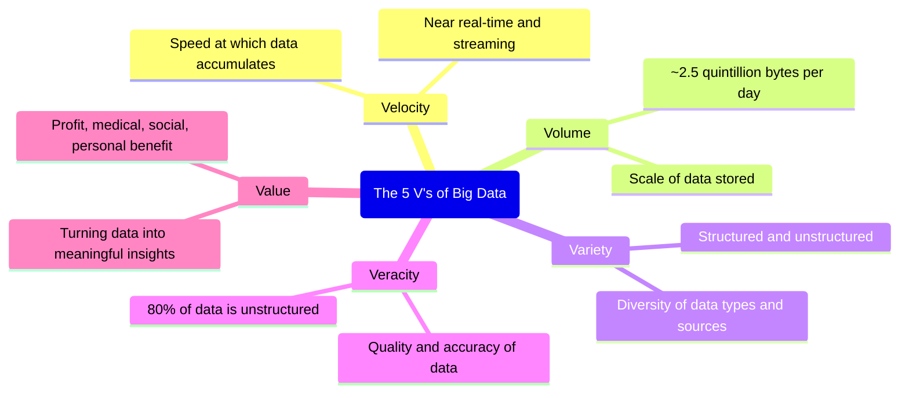
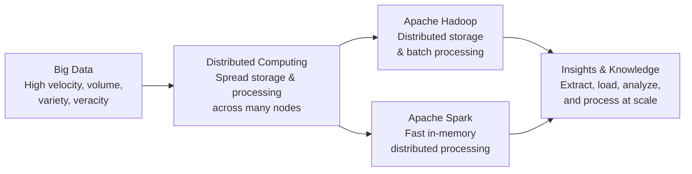

# Foundations of Big Data

## Introduction

In the digital world, every interaction leaves a trace. Travel habits, workouts, entertainment choices, and the countless internet-connected devices we interact with daily all generate vast amounts of data about us. This phenomenon has a name: **Big Data**.

> **Ernst & Young Definition:** *"Big Data refers to the dynamic, large and disparate volumes of data being created by people, tools, and machines. It requires new, innovative, and scalable technology to collect, host, and analytically process the vast amount of data gathered in order to derive real-time business insights that relate to consumers, risk, profit, performance, productivity management, and enhanced shareholder value."*

There is no single universal definition of Big Data, but all definitions share a common set of characteristics — known as **the V's of Big Data**.

---

## The Five V's of Big Data

---

### 1. Velocity

**Velocity** is the speed at which data accumulates — a process that never stops.

- Data is generated **extremely fast** and continuously
- Near or real-time streaming, local, and cloud-based technologies can process information at the speed it is generated

> **Example:** Every 60 seconds, hours of video footage are uploaded to YouTube. Think about how quickly that data accumulates over hours, days, and years.

---

### 2. Volume

**Volume** is the scale of data — the sheer amount of data being stored and growing.

Key drivers of volume:
- Increase in the number of data sources
- Higher resolution sensors capturing more detail per event
- Scalable infrastructure enabling storage of data that previously would have been discarded

> **Example:** With approximately 7 billion people on earth, the vast majority now use digital devices — mobile phones, laptops, desktops, and wearables. Together, these devices generate, capture, and store approximately **2.5 quintillion bytes of data every day** — equivalent to **10 million Blu-ray DVDs**.

---

### 3. Variety

**Variety** is the diversity of data — in both type and source.

| Data Type | Examples |
|---|---|
| **Structured** | Rows and columns in relational databases; transactional records |
| **Unstructured** | Tweets, blog posts, images, video, audio — not organized in a predefined way |
| **Semi-structured** | JSON, XML, logs — partial structure but not fully tabular |

Variety also reflects that data comes from **many different origins**:

- **Internal sources:** operational systems, business applications
- **External sources:** social media, third-party APIs, public datasets

Key drivers of variety: mobile technologies, social media, wearable technologies, geo technologies, video, and IoT devices.

---

### 4. Veracity

**Veracity** is the quality, accuracy, and trustworthiness of data — its conformity to facts.

Veracity attributes include:

| Attribute | Description |
|---|---|
| **Consistency** | Data means the same thing across all systems and time periods |
| **Completeness** | No critical fields are missing |
| **Integrity** | Data has not been corrupted or altered incorrectly |
| **Ambiguity** | Data is interpretable in only one clear way |

Key drivers: cost pressures and the need for traceability of data origins.

> **The core challenge:** An estimated **80% of data is unstructured** — making it inherently harder to validate, categorize, and trust. With the sheer volume of digital data available, the question of whether information is real or false is one of the defining challenges of the big data era.

---

### 5. Value

**Value** is the ability — and necessity — to turn data into something meaningful and actionable.

Value is not limited to financial profit. It includes:

- **Business value** — better decisions, competitive advantage
- **Medical value** — improved patient outcomes, drug discovery
- **Social value** — public policy improvements, community benefit
- **Personal value** — customer, employee, or individual satisfaction

> **The main reason organizations invest time and resources in Big Data is to extract value from it.** All other V's — velocity, volume, variety, and veracity — are properties of the data itself. Value is the *purpose* behind working with it.

---

## The V's in Summary

| V | Definition | Real-World Example |
|---|---|---|
| **Velocity** | Speed of data generation | Hours of YouTube video uploaded every 60 seconds |
| **Volume** | Scale of data stored | 2.5 quintillion bytes generated daily worldwide |
| **Variety** | Diversity of data types and sources | Text, images, video, health data, IoT sensor readings |
| **Veracity** | Quality and accuracy of data | 80% of data is unstructured and must be validated |
| **Value** | Ability to derive insight and benefit | Business intelligence, medical research, personal recommendations |

---

## Why Conventional Tools Fall Short

The scale of Big Data makes it **infeasible to use conventional data analysis tools**. A standard relational database or desktop analytics tool cannot:

- Store data at petabyte or exabyte scale
- Process continuous high-velocity streams in real time
- Handle the diversity of unstructured and semi-structured data types

### The Solution: Distributed Computing

Tools such as **Apache Spark**, **Hadoop**, and the broader Hadoop ecosystem provide the ability to:

- **Extract, load, analyze, and process** data across distributed compute resources
- Overcome the storage and processing limitations of single-node systems
- Deliver new insights and knowledge at a scale and speed that conventional tools cannot match

> This gives organizations more ways to connect with their customers and enrich the services they offer.

---

## Summary and Key Takeaways

- **Big Data** refers to dynamic, large, and disparate volumes of data generated by people, tools, and machines — requiring new, scalable technology to process and derive value from.
- The **Five V's** define Big Data: Velocity (speed), Volume (scale), Variety (diversity), Veracity (quality), and Value (purpose).
- **80% of data is unstructured** — making veracity one of the most pressing challenges in big data analytics.
- **2.5 quintillion bytes** of data are generated every day by the world's digital devices.
- Conventional analysis tools cannot operate at big data scale. **Distributed computing tools** — primarily **Apache Hadoop** and **Apache Spark** — are the foundation of modern big data processing.
- The ultimate goal of all Big Data work is **Value** — transforming raw data into insights that benefit businesses, individuals, and society.
