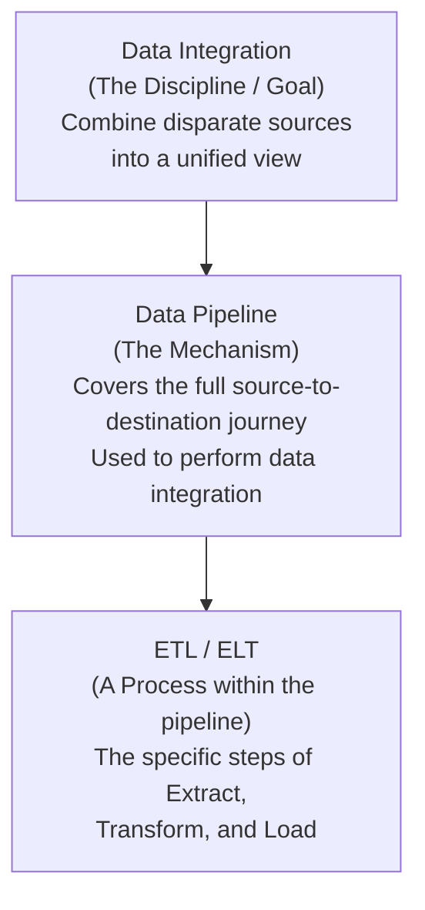

# Q&A: Data Integration vs. Data Pipeline vs. ETL — True or False?

## Question

> *"While data integration combines disparate data into a unified view of the data, a data pipeline covers the entire data movement journey from source to destination systems, and ETL is a process within data integration."*

| Option | Correct? |
|---|---|
| **True** | ✅ |
| False | ❌ |

---

## Why This Is True

The statement contains **three separate claims**. All three are accurate — and each comes directly from the lesson.

---

### Claim 1: Data integration combines disparate data into a unified view

✅ **True.**

Data integration is the discipline of pulling together data from multiple, different (disparate) sources — whether physically or logically — so that users can access and query it all from a single, unified interface.

> The goal of data integration is not to move data — it is to make data from many sources *look and behave like one source* for analytics purposes.

---

### Claim 2: A data pipeline covers the entire data movement journey from source to destination

✅ **True.**

A data pipeline is the broader architectural concept — it encompasses everything that happens as data travels from a source system to its destination (a data lake, warehouse, application, or visualization tool). It is not limited to any single process or step.

---

### Claim 3: ETL is a process within data integration

✅ **True.**

ETL (Extract, Transform, Load) is one specific process used *inside* data integration. It is the mechanism — data integration is the goal.

---

## The Relationship Between All Three — Visualized

| Concept | What It Is | Scope |
|---|---|---|
| **Data Integration** | The discipline / goal | Broadest — defines *what* we are trying to achieve |
| **Data Pipeline** | The implementation mechanism | Mid-level — defines *how* data travels end-to-end |
| **ETL / ELT** | A process within the pipeline | Narrowest — defines *the steps* taken during that journey |

---

## Why This Question Causes Confusion

The three terms — data integration, data pipeline, and ETL — are frequently used interchangeably in the industry. The lesson specifically flags this:

> *"It's common to see the terms ETL or ELT and data pipelines used interchangeably — and although both move data from source to destination, data pipeline is a broader term."*

The confusion usually comes from one of two directions:

| Misconception | Reality |
|---|---|
| "ETL and data pipeline are the same thing" | ETL is a *subset* of a pipeline — the pipeline is the full journey, ETL is one process within it |
| "Data integration and data pipeline mean the same thing" | Data integration is the *goal* (unified view); the data pipeline is the *mechanism* used to achieve it |

---

## Memory Aid

Think of it as a **construction analogy**:

- **Data Integration** = the architect's goal: *"We want one unified building from many separate structures."*
- **Data Pipeline** = the construction process: *"Here is the full plan for how materials move from suppliers to the finished building."*
- **ETL** = one specific trade within that construction: *"Here is how the plumbing gets installed."*

The plumber (ETL) works inside the construction process (pipeline) to achieve the architect's goal (data integration). None of these is a substitute for the other — they operate at different levels.
