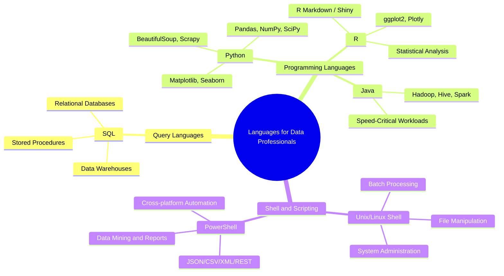

# Languages for Data Professionals

## Overview

Data professionals work across a broad set of tasks — querying databases, building pipelines, automating operations, performing statistical analysis, and visualizing results. No single language covers all of these needs. Instead, the field has converged on **three categories of languages**, each optimized for a different class of work:

| Category | Purpose | Examples |
|---|---|---|
| **Query Languages** | Accessing and manipulating data in databases | SQL |
| **Programming Languages** | Developing applications, data processing logic | Python, R, Java |
| **Shell & Scripting Languages** | Automating repetitive and operational tasks | Unix/Linux Shell, PowerShell |

> **Core Principle:** Proficiency in at least one language from each category is considered essential for any practicing data professional.

---

## 1. Query Languages

### 1.1 SQL — Structured Query Language

SQL is the foundational query language for **accessing and manipulating data in relational databases** — and, increasingly, in a wide variety of other data repositories as well (data warehouses, data lakes with SQL engines, etc.).

#### What SQL Can Do

SQL enables a data professional to:

- **Insert, update, and delete** records in a database
- **Create** new databases, tables, and views
- **Write stored procedures** — reusable sets of instructions that can be defined once and called repeatedly
- **Query and retrieve** data with precise filtering, aggregation, joining, and sorting logic

#### Advantages of SQL

| Advantage | Detail |
|---|---|
| **Portability** | Platform-independent; runs across virtually all database systems |
| **Broad compatibility** | Works with a wide variety of databases and data repositories (with minor vendor-specific extensions) |
| **Simple syntax** | English-like syntax with keywords such as `SELECT`, `INSERT INTO`, `UPDATE`, `DELETE` |
| **Conciseness** | Achieves complex data operations in fewer lines than most general-purpose languages |
| **Performance** | Designed to retrieve large volumes of data quickly and efficiently |
| **Interpreted execution** | Code runs as soon as it is written — enabling rapid prototyping |
| **Ubiquity** | One of the most widely adopted languages in the world, with an enormous community and decades of documentation |

#### Basic SQL Example

```sql
-- Retrieve total sales by region from a retail transactions table
SELECT
    region,
    SUM(sale_amount) AS total_sales,
    COUNT(transaction_id) AS transaction_count
FROM retail_transactions
WHERE transaction_date >= '2024-01-01'
GROUP BY region
ORDER BY total_sales DESC;
```

> **Note:** While SQL is standardized (ANSI SQL), most vendors implement extensions — e.g., T-SQL (SQL Server), PL/pgSQL (PostgreSQL), PL/SQL (Oracle). Core syntax is portable; advanced features may not be.

---

## 2. Programming Languages

### 2.1 Python

Python is a **widely-used, open-source, general-purpose, high-level programming language** and the dominant language in data engineering, data science, and machine learning today.

#### Why Python for Data Work

- **Readability and simplicity:** Syntax closely mirrors natural language; concepts are expressed in fewer lines of code compared to older languages.
- **Low learning curve:** Considered one of the easiest languages for beginners to pick up.
- **High-computational capability:** Well-suited for processing vast amounts of data using parallel processing libraries.
- **Multi-paradigm:** Supports object-oriented, imperative, functional, and procedural programming — adaptable to a wide range of use cases.
- **Cross-platform:** Runs on Windows, Linux, and macOS; can be ported to multiple environments.
- **Open-source and community-driven:** Free to use, with an enormous global developer community.

#### Key Python Libraries for Data Professionals

| Library | Category | Use Case |
|---|---|---|
| **Pandas** | Data manipulation | Data cleaning, transformation, and analysis |
| **NumPy** | Numerical computing | Array operations, mathematical functions |
| **SciPy** | Scientific computing | Statistical analysis and scientific algorithms |
| **Matplotlib** | Data visualization | Bar charts, histograms, line plots |
| **Seaborn** | Data visualization | Statistical graphics built on Matplotlib |
| **BeautifulSoup** | Web scraping | Parsing HTML/XML for data extraction |
| **Scrapy** | Web scraping | Full-featured crawling and scraping framework |
| **OpenCV** | Image processing | Computer vision and image analysis |

#### Python Example: Data Cleaning with Pandas

```python
import pandas as pd

# Load a CSV dataset
df = pd.read_csv("sales_data.csv")

# Inspect the first few rows
print(df.head())

# Drop rows with missing values
df_clean = df.dropna()

# Filter to a specific region
df_west = df_clean[df_clean["region"] == "West"]

# Compute total sales by product
sales_summary = df_west.groupby("product")["sale_amount"].sum().reset_index()
print(sales_summary)
```

---

### 2.2 R

R is an **open-source programming language and environment** purpose-built for **data analysis, data visualization, machine learning, and statistics**. It is the language of choice in academic research, biostatistics, and any domain where statistical rigor and rich visualization are paramount.

#### Key Strengths of R

| Strength | Detail |
|---|---|
| **Statistical dominance** | Dominant language for developing statistical tools and performing quantitative analysis |
| **Superior visualization** | Libraries like `ggplot2` and `Plotly` produce publication-quality, aesthetically refined graphics |
| **Extensibility** | Developers can define new functions to continuously extend the language's capabilities |
| **Structured + unstructured data** | Handles both structured (tabular) and unstructured data |
| **Interoperability** | Can be paired with Python and other languages in multi-language pipelines |
| **Reporting** | Supports embedding data and scripts directly in reports (R Markdown); enables interactive web apps via Shiny |
| **Platform-independent** | Open-source; runs across operating systems |

#### Key R Libraries

| Library | Use Case |
|---|---|
| **ggplot2** | Grammar-of-graphics data visualization |
| **Plotly** | Interactive charts and dashboards |
| **dplyr** | Data manipulation (filter, select, mutate, summarize) |
| **tidyr** | Data tidying and reshaping |
| **caret / tidymodels** | Machine learning workflows |

#### R Example: Visualization with ggplot2

```r
library(ggplot2)

# Load sample dataset
data(mpg)

# Create a scatter plot of engine displacement vs highway MPG
ggplot(mpg, aes(x = displ, y = hwy, color = class)) +
  geom_point(size = 3, alpha = 0.7) +
  labs(
    title = "Engine Displacement vs. Highway MPG",
    x = "Engine Displacement (L)",
    y = "Highway MPG",
    color = "Vehicle Class"
  ) +
  theme_minimal()
```

---

### 2.3 Java

Java is an **object-oriented, class-based, platform-independent programming language** originally developed by Sun Microsystems (now Oracle). It remains one of the most widely used programming languages in the world.

#### Java's Role in Data Engineering

Java occupies a unique position in the data ecosystem: while data scientists rarely write Java day-to-day, **most of the major big data frameworks are written in Java** — making Java knowledge valuable for anyone working deeply with the data infrastructure layer.

**Big data tools written in Java:**

- **Apache Hadoop** — distributed storage and batch processing (MapReduce)
- **Apache Hive** — SQL-like query layer on top of Hadoop
- **Apache Spark** — unified analytics engine for large-scale data processing (also has Scala/Python APIs)

#### Java in the Data Analytics Lifecycle

Java is used across multiple phases:

| Phase | Java Use Case |
|---|---|
| Data ingestion | Importing and exporting large data volumes |
| Data cleaning | Processing and transforming raw data at scale |
| Statistical analysis | Running computation-heavy analytical workloads |
| Data visualization | Building enterprise dashboards and reporting tools |
| Performance-critical workloads | Speed-critical projects where JVM performance is an advantage |

> **Best Practice:** For most data engineering work, Python or Scala is preferred for productivity. Java is most relevant when extending or customizing big data frameworks at the core level.

---

## 3. Shell and Scripting Languages

Shell scripting languages are designed for **automating repetitive, time-consuming operational tasks** directly at the operating system level. They are indispensable for infrastructure automation, pipeline scheduling, and system administration in data environments.

### 3.1 Unix/Linux Shell

A **Unix/Linux Shell script** is a plain text file containing a series of UNIX commands, executed sequentially to accomplish a specific task. Shell scripting is fast to write and immediately executable.

#### Typical Shell Script Operations

| Operation Type | Examples |
|---|---|
| **File manipulation** | Moving, renaming, archiving, and compressing data files |
| **Program execution** | Triggering ETL jobs, running Python scripts, calling APIs |
| **System administration** | Disk backups, evaluating and rotating system logs |
| **Installation automation** | Installing and configuring complex software environments |
| **Batch processing** | Running scheduled batches of data processing jobs |
| **Routine backups** | Automated database dumps and file system snapshots |

#### Shell Script Example: Automated CSV Archival

```bash
#!/bin/bash
# Archive processed CSV files older than 7 days to a backup directory

SOURCE_DIR="/data/incoming"
BACKUP_DIR="/data/archive"
LOG_FILE="/var/log/csv_archive.log"

echo "$(date): Starting archival job" >> "$LOG_FILE"

find "$SOURCE_DIR" -name "*.csv" -mtime +7 | while read file; do
    mv "$file" "$BACKUP_DIR/"
    echo "$(date): Archived $file" >> "$LOG_FILE"
done

echo "$(date): Archival job complete" >> "$LOG_FILE"
```

---

### 3.2 PowerShell

**PowerShell** is a **cross-platform automation tool and configuration framework** developed by Microsoft. Unlike traditional Unix shells that operate on plain text, PowerShell is **object-based** — it passes structured .NET objects through its pipeline rather than raw text strings.

#### Key Characteristics

| Feature | Detail |
|---|---|
| **Object-based pipeline** | Commands pass .NET objects — enabling filtering, sorting, measuring, grouping, and comparing without text parsing |
| **Structured data support** | Natively optimized for JSON, CSV, XML, and REST API responses |
| **Cross-platform** | Available on Windows, Linux, and macOS (PowerShell Core) |
| **Application integration** | Works with websites, Office applications, and cloud services |
| **Data engineering use cases** | Data mining, building GUIs, creating charts, dashboards, and interactive reports |

#### PowerShell Example: Parse a JSON API Response

```powershell
# Fetch data from a REST API and filter results
$response = Invoke-RestMethod -Uri "https://api.example.com/sales" -Method GET

# Filter to records where amount exceeds 1000
$highValueSales = $response | Where-Object { $_.amount -gt 1000 }

# Export filtered results to CSV
$highValueSales | Select-Object id, region, amount, date |
    Export-Csv -Path "C:\data\high_value_sales.csv" -NoTypeInformation

Write-Host "Exported $($highValueSales.Count) records."
```

---

## Summary and Key Takeaways



| Language | Category | Primary Strength | Typical Data Engineering Use |
|---|---|---|---|
| **SQL** | Query | Data retrieval and manipulation | Querying databases, building views, stored procedures |
| **Python** | Programming | Versatility and ecosystem | ETL pipelines, data wrangling, ML, API integration |
| **R** | Programming | Statistics and visualization | Statistical analysis, research, rich visual reporting |
| **Java** | Programming | Performance and big data tooling | Hadoop/Spark ecosystem, speed-critical processing |
| **Unix/Linux Shell** | Scripting | OS-level automation | Scheduling jobs, file ops, system admin tasks |
| **PowerShell** | Scripting | Object-based structured automation | Windows/cloud automation, REST API processing |

**Practical guidance for aspiring data engineers:**

- **Start with SQL** — it is non-negotiable. Nearly every data role requires it regardless of specialization.
- **Learn Python next** — its ecosystem covers the full data engineering lifecycle from ingestion to visualization.
- **Add Shell scripting** — even basic bash scripting dramatically increases productivity for pipeline automation and scheduled jobs.
- **R is a strong complement** if your work involves heavy statistical analysis or academic/research contexts.
- **Java knowledge becomes relevant** when working deeply with big data infrastructure (Hadoop, Kafka internals, Spark extensions).
- **PowerShell** is particularly valuable in Windows-centric or Microsoft Azure environments.
