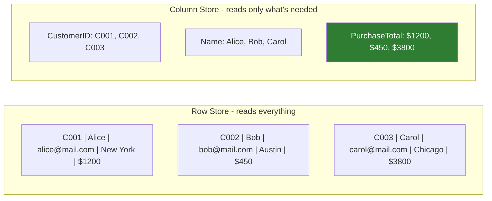
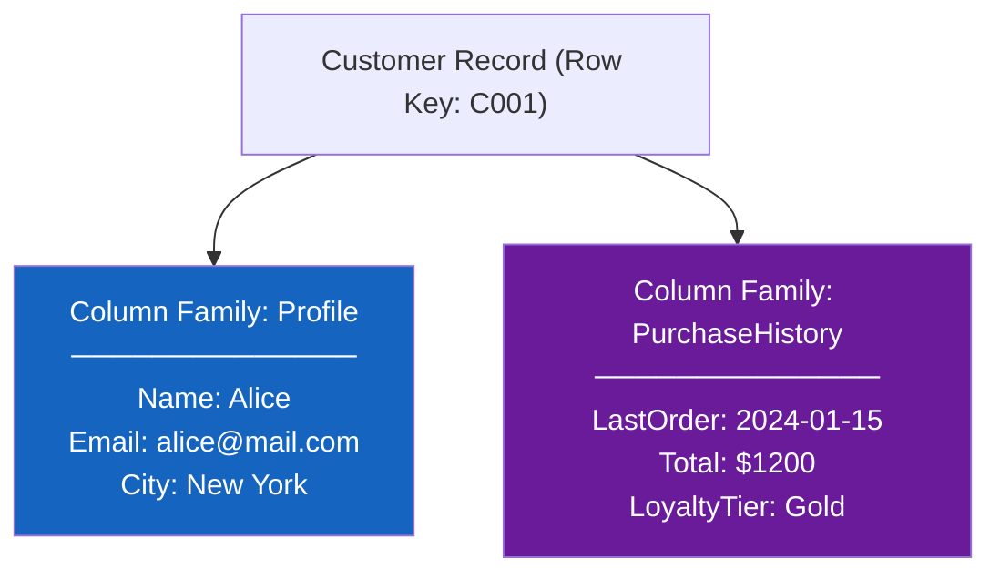

# Q&A: Understanding Column-Based NoSQL Databases

## Question

> *"The column-based system is ambiguous to me — I can't understand the concept."*

---

## The Core Confusion

The name "column-based" is misleading because **relational databases also have columns**. So what makes a column-based NoSQL database actually different?

The answer is: **how data is physically stored on disk.**

---

## Row Storage vs. Column Storage

### In a Row-Oriented Database (RDBMS)

Data is stored **row by row**. All the fields of a single record are written together as one continuous block on disk.

**Table: Customers**

| CustomerID | Name | Email | City | PurchaseTotal |
|---|---|---|---|---|
| C001 | Alice | alice@mail.com | New York | $1,200 |
| C002 | Bob | bob@mail.com | Austin | $450 |
| C003 | Carol | carol@mail.com | Chicago | $3,800 |

**How it's stored on disk (row-oriented):**

```
[C001, Alice, alice@mail.com, New York, $1200]
[C002, Bob,   bob@mail.com,  Austin,   $450 ]
[C003, Carol, carol@mail.com, Chicago, $3800]
```

Every row is one chunk. To read just the `PurchaseTotal` column for all customers, the database must **scan all three full rows** and pick out the value it needs.

---

### In a Column-Oriented Database (NoSQL)

Data is stored **column by column**. All values for a single column are written together as one continuous block on disk.

**How the same data is stored on disk (column-oriented):**

```
CustomerID:     [C001, C002, C003]
Name:           [Alice, Bob, Carol]
Email:          [alice@mail.com, bob@mail.com, carol@mail.com]
City:           [New York, Austin, Chicago]
PurchaseTotal:  [$1200, $450, $3800]
```

Now, to read just `PurchaseTotal`, the database goes **directly to that column's block** on disk — it doesn't touch Name, Email, or City at all.



> **The payoff:** When you only need a few columns out of hundreds, column storage is dramatically faster — you skip all the data you don't need.

---

## What is a Column Family?

A **column family** is a named group of related columns that are typically accessed together. Think of it as a logical folder for columns that belong together.

**Example:** A customer record might have two natural groupings:



- **Profile** columns are accessed when displaying a user's account page
- **PurchaseHistory** columns are accessed when showing order summaries

By keeping these families separate on disk, the database can fetch **only the column family it needs** for a given operation — without touching the other.

---

## A Concrete Real-World Analogy

Imagine a **library of filing cabinets**:

- **Row store** = each drawer holds *one person's entire file* (name, address, medical history, bills — everything together)
- **Column store** = each drawer holds *one type of information for everyone* (one drawer = all names, another = all addresses, another = all bills)

If a doctor needs to check **only the billing totals** for 10,000 patients, the column store lets them open **one drawer** and read straight through. The row store would require opening **10,000 individual files** and fishing out the billing page from each one.

---

## Why Column Stores Excel at Writes and Time-Series Data

Column databases like **Cassandra** are also optimized for **heavy write throughput**. Here's why:

New data (e.g., an IoT sensor reading every second) just **appends to the relevant column blocks** — no need to locate and update an existing row. This makes writes extremely fast.

```
-- Sensor writes arriving every second:
Timestamp column:    [..., 14:00:01, 14:00:02, 14:00:03]
Temperature column:  [..., 72.1,     72.3,     72.0    ]
Humidity column:     [..., 45%,      45%,      46%     ]
```

Each new reading is just an append — fast, sequential disk writes.

---

## When to Use (and Avoid) Column-Based NoSQL

| Situation | Column-Based a Good Fit? |
|---|---|
| Aggregating one or two columns across millions of rows (e.g., sum of sales) | ✅ Yes — reads only the needed column |
| Storing time-series data (IoT, metrics, logs) | ✅ Yes — append-optimized writes |
| Heavy, continuous write throughput | ✅ Yes |
| Retrieving a complete single record with all its fields | ⚠️ Less ideal — must reassemble from multiple column blocks |
| Complex or ad hoc queries with frequently changing patterns | ❌ No — query patterns should be known and stable |
| Multi-operation transactions | ❌ No |

---

## Summary

| Concept | Plain-English Meaning |
|---|---|
| **Column-oriented storage** | Values for each column are stored together on disk, not row by row |
| **Column family** | A named group of related columns that are usually read/written together |
| **Why it's fast for reads** | Queries touch only the column blocks they need — unrelated columns are skipped entirely |
| **Why it's fast for writes** | New data is appended to column blocks sequentially — no row lookup needed |
| **Key platforms** | Cassandra (distributed, IoT/time-series), HBase (Hadoop-native, massive datasets) |
| **Primary use cases** | Time-series data, IoT telemetry, weather data, heavy-write systems |
