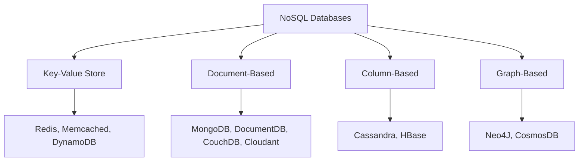
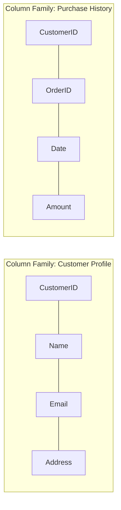
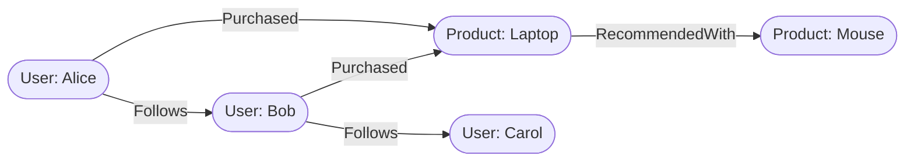
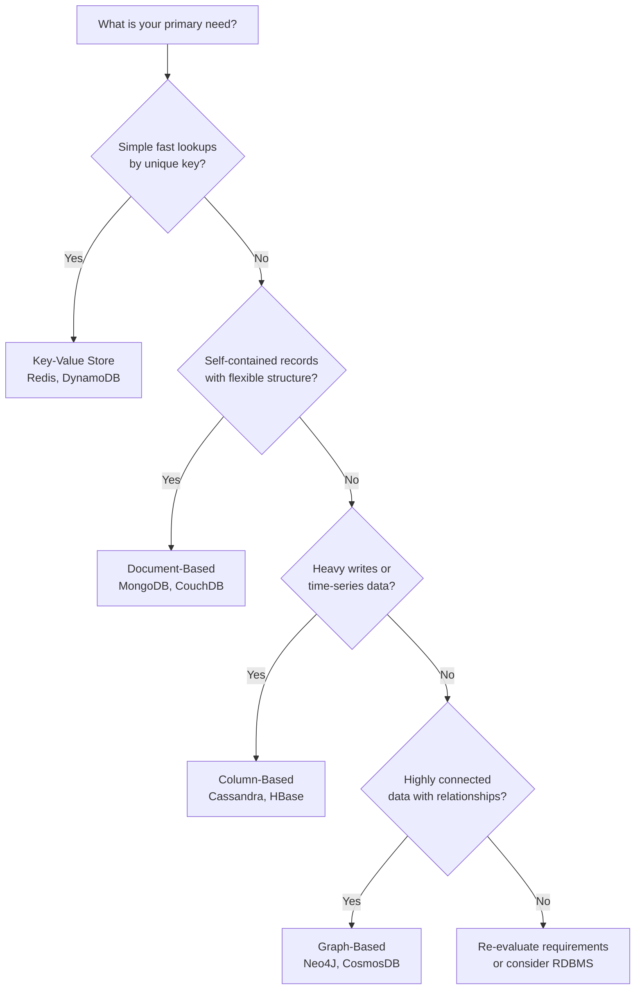

# NoSQL Databases

## Introduction

**NoSQL** — short for **"Not Only SQL"** — refers to a broad class of database systems built for specific data models with flexible schemas. While NoSQL databases have existed for many years, they have surged in popularity in the era of **cloud computing, big data, and high-volume web and mobile applications**, where they are valued for their **scale, performance, and ease of use**.

Key distinctions from relational databases:

- Do **not** use the traditional row/column/table design with fixed schemas
- Typically do **not** use SQL to query data (though some support SQL-like interfaces)
- Allow data to be stored in a **schema-less or free-form** fashion
- Can store **structured, semi-structured, and unstructured** data within the same record

> **Common Misconception:** "NoSQL" does **not** mean "No SQL forever" — it means the database is *not limited to* SQL. Some NoSQL systems do support SQL or SQL-like query interfaces.

---

## The Four Types of NoSQL Databases



---

### 1. Key-Value Store

Data is stored as a collection of **key-value pairs**, where:

- The **key** is a unique identifier representing an attribute of the data
- The **value** can be anything from a simple integer or string to a complex JSON document

```json
// Example key-value pair
{
  "user:1001": {
    "name": "Jane Smith",
    "preferences": { "theme": "dark", "language": "en" },
    "last_login": "2024-02-10T14:32:00Z"
  }
}
```

**Best suited for:**
- Storing user session data and preferences
- Real-time recommendations and targeted advertising
- In-memory data caching

**Not ideal when:**
- You need to query on specific data *values* (only key-based lookup is efficient)
- Relationships between data values are required
- Multiple unique keys are needed per record

| Platform | Notes |
|---|---|
| **Redis** | In-memory, extremely fast; widely used for caching |
| **Memcached** | Lightweight in-memory caching |
| **DynamoDB** | AWS-managed, highly scalable key-value and document store |

---

### 2. Document-Based

Each record and all its associated data are stored together within a **single document** (typically JSON or BSON). These databases enable flexible indexing, powerful ad hoc queries, and analytics over document collections.

```json
// Example document record
{
  "_id": "order_78901",
  "customer": {
    "id": "C001",
    "name": "Acme Corp"
  },
  "items": [
    { "sku": "A100", "qty": 2, "price": 49.99 },
    { "sku": "B200", "qty": 1, "price": 129.99 }
  ],
  "total": 229.97,
  "status": "shipped"
}
```

**Best suited for:**
- eCommerce platforms
- Medical records storage
- CRM platforms
- Analytics platforms

**Not ideal when:**
- Complex multi-table/multi-operation transactions are required
- Advanced search queries spanning many document types are needed

| Platform | Notes |
|---|---|
| **MongoDB** | Most widely used document database |
| **DocumentDB** | AWS-managed, MongoDB-compatible |
| **CouchDB** | Open-source, HTTP-based API |
| **Cloudant** | IBM-managed, CouchDB-based |

---

### 3. Column-Based

Column-based databases store data in **cells grouped by columns** rather than rows. A logical grouping of columns that are typically accessed together is called a **column family**.



> **Example:** A customer's name and profile information are frequently accessed together, so they are grouped into one column family. Purchase history — accessed separately — forms its own column family.

Since all cells corresponding to a column are stored as a **continuous disk entry**, searching and accessing column data is extremely fast.

**Best suited for:**
- Systems requiring heavy write throughput
- Time-series data
- Weather data
- IoT data

**Not ideal when:**
- Complex or frequently changing query patterns are needed
- Ad hoc queries across many columns are required

| Platform | Notes |
|---|---|
| **Cassandra** | Highly scalable, distributed; popular for IoT and time-series |
| **HBase** | Hadoop-native column store; built for massive datasets |

---

### 4. Graph-Based

Graph databases use a **graphical model** to represent and store data:

- **Nodes** (circles) — contain the data entities
- **Edges / Arrows** — represent the relationships between entities



Graph databases excel at **traversing relationships** — something that is computationally expensive in relational databases (multiple joins) but native and fast in a graph model.

**Best suited for:**
- Social networks
- Real-time product recommendations
- Network diagrams and topology mapping
- Fraud detection
- Access management and identity graphs

**Not ideal when:**
- Processing very high volumes of transactions is required
- Large-volume analytics queries are the primary workload

| Platform | Notes |
|---|---|
| **Neo4J** | The most widely adopted graph database |
| **CosmosDB** | Microsoft Azure-managed; supports multiple NoSQL models including graph |

---

## Advantages of NoSQL

| Advantage | Description |
|---|---|
| **Handles diverse data types** | Stores structured, semi-structured, and unstructured data natively |
| **Distributed by design** | Can run as distributed systems scaled across multiple data centers, leveraging cloud infrastructure |
| **Cost-effective scaling** | Scale-out architecture adds capacity and performance by adding new nodes — no expensive hardware upgrades |
| **Flexibility and agility** | Simpler design, better availability control, and improved scalability enable faster iteration |
| **Low-cost hardware** | Designed specifically for low-cost commodity hardware, unlike high-end commercial RDBMS systems |

---

## NoSQL vs. RDBMS: Key Differences

| Dimension | RDBMS | NoSQL |
|---|---|---|
| **Schema** | Rigid, predefined schema — all data must conform | Schema-agnostic — unstructured and semi-structured data supported |
| **Data types supported** | Structured only | Structured, semi-structured, and unstructured |
| **Scalability** | Vertical scaling (bigger hardware) | Horizontal scale-out (more nodes) |
| **Hardware cost** | Expensive high-end commercial systems | Designed for low-cost commodity hardware |
| **ACID compliance** | Full ACID support | Most NoSQL databases do not support full ACID (some exceptions apply) |
| **Query language** | SQL (standardized) | Varies by platform; no universal standard |
| **Maturity** | Mature, well-documented, lower risk | Relatively newer; risks less predictable |
| **Best for** | Structured data, complex transactions | Big data, real-time apps, flexible schemas |

---

## Choosing the Right NoSQL Type



---

## Summary and Key Takeaways

- **NoSQL = "Not Only SQL"** — not the absence of SQL, but freedom from SQL-only constraints.
- NoSQL databases are purpose-built for **scale, flexibility, and performance** in cloud, big data, and high-velocity application environments.
- There are **four main types**: Key-Value, Document-Based, Column-Based, and Graph-Based — each optimized for a different data model and access pattern.
- NoSQL's primary strengths are handling **diverse data types**, **distributed scale-out**, and **low infrastructure cost**.
- Its primary trade-off vs. RDBMS is the **lack of full ACID compliance** and the **absence of a universal query standard**.
- NoSQL databases are not a replacement for RDBMS — they are a complement, and the right choice depends on the **data model, access patterns, and scalability requirements** of the workload.
- NoSQL is increasingly being adopted for **mission-critical applications** and is a permanent fixture in the modern data engineering ecosystem.
