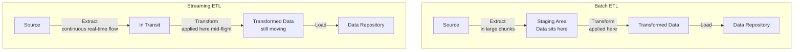
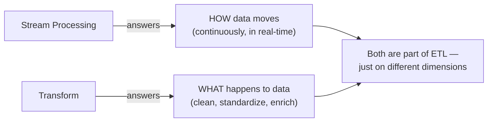

# Q&A: What is the Difference Between Stream Processing and Transform?

## Question

> *"What is the difference between stream processing and transform?"*

---

## Short Answer

They answer two completely different questions:

| | Stream Processing | Transform |
|---|---|---|
| **What it answers** | *How* does data move from source to destination? | *What* do you do to the data once you have it? |
| **What it is** | A **delivery mechanism** | An **operation applied to data** |
| **Part of ETL** | Part of the **Extract** step | Its own dedicated **Transform** step |

They are not alternatives to each other — they operate on different dimensions. You can have transformation happen *inside* stream processing, or *after* batch processing. The two concepts sit at different levels.

---

## Breaking It Down

### Stream Processing — *How data travels*

Stream processing is about the **mode of extraction** — it describes the way data is pulled from the source and moved toward its destination.

- Data flows **continuously** and in **real-time**, event by event, as it is generated
- The data is always in motion — it does not wait to be collected in a large batch first
- Think of it like water flowing through a pipe — it moves constantly, not in buckets

> Stream processing answers: **"When and how does the data leave the source?"**

---

### Transform — *What you do to the data*

Transform is a **processing operation** — it describes the rules and functions applied to data to make it usable for analysis. It is completely independent of whether the data arrived via batch or stream.

Transform operations include things like:
- Standardizing date formats
- Removing duplicates
- Splitting fields (e.g., `full_name` → `first_name` + `last_name`)
- Applying business rules and validations

> Transform answers: **"What changes are made to the data?"**

---

## Why the Confusion Exists

The lesson says stream processing involves data being *"transformed while it is in transit"* — which makes it sound like stream processing and transform are the same thing. They are not.

What that phrase means is: **when you use stream processing, the Transform step happens earlier in the journey** — mid-flight, before the data reaches the repository — rather than after it arrives.

In both cases, the **Transform step still exists** and still does the same job — clean, standardize, enrich the data. The only difference is **where in the journey** it happens:

- **Batch:** Extract everything first → then Transform in a staging area → then Load
- **Stream:** Extract, Transform, and Load happen as a near-simultaneous continuous flow

---

## A Simple Analogy

Imagine you work at a fruit-sorting facility:

- **Batch processing** = trucks deliver fruit once a day in large crates. You unload all the crates, then sort and clean the fruit, then stock the shelves.
- **Stream processing** = fruit arrives on a conveyor belt continuously. You sort and clean each piece *as it comes off the belt*, and it goes straight to the shelf.

In both cases, **sorting and cleaning = Transform**. The conveyor belt vs. truck delivery = **stream vs. batch**. The sorting job doesn't change — only when and where you do it changes.

---

## Key Takeaway

- **Stream processing** is a property of the **Extract step** — it describes delivery mode
- **Transform** is its own **dedicated step** — it describes data manipulation
- When stream processing is used, the Transform step moves earlier in the flow (mid-flight), but it still exists and still does the same job
- The two are **not alternatives** — every ETL pipeline has a Transform step, regardless of whether extraction is batch or stream
